# Loom Skill Enhancement Self-Bootstrap Slice Plan

## Scope

This file is the checked-in plan for the current self-bootstrap slice, where `/loom-skill-enhancement` is itself the target skill being rewritten.

It does not narrow the general mission of `/loom-skill-enhancement`. The skill still exists to rewrite or create any target skill so that the target becomes governed through the Loom Skill Orchestrator flow.

## Goal

Upgrade `/loom-skill-enhancement` as the current target skill so it governs itself with checked-in SO workflow assets, a locked runtime bundle, a shared runtime-entry gate, and a mandatory official runtime continuation path that reaches final `Done`.

## Mermaid

```mermaid
flowchart TD
  A[⚙️ Classify governance state]:::runtime --> B{"📜 Already Loom-governanced?"}:::gate
  B -- yes --> C[🔎 Inspect current SKILL.md governance wording]:::ai
  C --> D[🔎 Inspect current checked-in package lock]:::ai
  D --> E[🔎 Inspect current checked-in workflow assets]:::ai
  B -- no --> F[📜 Use skill-bound runtime version]:::gate
  E --> G[⚙️ Reacquire skill-bound SO runtime bundle]:::runtime
  F --> G
  G --> H[⚙️ Capture fresh dotnet so.dll --guide]:::runtime
  H --> I[📜 Shared entry gate passed]:::gate

  I --> J{"📜 Compile-review route"}:::gate
  J --> K{"❓ Need re-enhancement gap review?"}:::gate
  K -- yes --> L[🔎 Run skill-markdown gap-review subagent]:::ai
  L --> M[🔎 Run package-lock gap-review subagent]:::ai
  M --> N[🔎 Run workflow-governance gap-review subagent]:::ai
  K -- no --> O[🔎 Run scope input-output analysis subagent]:::ai
  N --> O
  O --> P[🔎 Run route-gate analysis subagent]:::ai
  P --> Q[🔎 Run evidence-node-map analysis subagent]:::ai
  Q --> R[🔎 Run workflow-designer subagent and refresh workflow template]:::ai
  R --> S[⚙️ Compile template and collect Mermaid, HTML, and analysis]:::tool
  S --> T[🔎 Review weave-out subagent fit]:::ai
  T --> U[💬 Present compile-review artifacts to user]:::user
  U --> V{"📜 Approval decision"}:::gate
  V -- revise --> W[💬 Apply feedback to template]:::user
  W --> O
  V -- approve official runnable --> X[🔎 Run explicit review-skill to fix-skill loop]:::ai
  X --> AA[⚙️ Materialize external runtime workflow copy]:::runtime
  AA --> AB[⚙️ Run public dotnet so.dll run]:::runtime
  AB --> AC{"❓ Blocked?"}:::gate
  AC -- yes --> AD[⚙️ Resume with matching public result envelope]:::runtime
  AC -- no --> AE[⚙️ Collect completion evidence]:::runtime
  AD --> AB
  AE --> AF[⚙️ Write runtime-owned completion manifest]:::runtime
  AF --> AG[📜 Record official governed run evidence at final Done]:::gate

  subgraph Legend[Legend]
    LA[🔎 AI or subagent work]:::ai
    LB[⚙️ Runtime or tool execution]:::runtime
    LC[💬 User review or requested input]:::user
    LD[❓ Branch or route decision]:::gate
    LE[📜 Governance gate or completion proof]:::gate
  end

  classDef ai fill:#e4f6e8,stroke:#2f8f4e,color:#14532d;
  classDef tool fill:#e7f0ff,stroke:#4a6cf7,color:#1e3a8a;
  classDef user fill:#fff6d6,stroke:#e0ad00,color:#7c5c00;
  classDef gate fill:#f6f7f9,stroke:#c7cdd4,color:#4b5563;
  classDef runtime fill:#eef2ff,stroke:#818cf8,color:#3730a3;
```

## Inputs

- Current `SKILL.md`
- Current skill reference docs
- Current SO guide surface
- Current package index surface
- Current checked-in `assets/so-workflow/so-package-lock.json`
- Current checked-in `assets/so-workflow/so-template.json`
- Current checked-in `assets/so-workflow/governance-notes.md`
- Current checked-in `assets/so-workflow/node-to-file-map.md`

## Required Outcomes

- Shared runtime-entry proof that the selected published SO runtime was reacquired, validated, and used to capture a fresh `dotnet so.dll --guide` result before any downstream planning, authoring, compile, run, or resume work
- A checked-in workflow template at `assets/so-workflow/so-template.json` that treats compile review as a prerequisite stage and the official runnable route as the only full-delivery completion path
- Locked runtime metadata at `assets/so-workflow/so-package-lock.json`
- Updated `SKILL.md` and governance wording that distinguish compile validation evidence from governed completion and require the full-delivery path to reach final `Done`
- Compile-review artifacts for Mermaid, HTML, workflow JSON backup, workflow analysis, and explicit review-fix evidence as prerequisite review evidence rather than runtime execution proof
- A runtime-owned completion evidence chain that starts with public `run`, requires public `resume` only when the route actually blocks, and keeps checked-in source deliverables separate from runtime-owned artifacts
- A clear separation between the generic skill mission and this self-bootstrap target-skill slice

## Plan Output Support Matrix

This matrix classifies the current self-bootstrap output requirements against the shared runtime-entry gate, the compile-review prerequisite stage, and the official runnable route.

| Output requirement | Evidence layer | Current status | Why |
| --- | --- | --- | --- |
| Runtime reacquisition, startup proof, and fresh guide capture | `shared entry gate` | `已通过 template 建模` | The self-bootstrap template now treats runtime-ready proof plus fresh-guide capture as a hard shared entry gate before either downstream route can proceed. |
| Checked-in workflow template at `assets/so-workflow/so-template.json` | `compile-review prerequisite stage` | `仅被 compile 支持` | The workflow template is the authority input for compile/load validation, but runtime does not automatically rewrite or finalize the checked-in source template. |
| Locked runtime metadata at `assets/so-workflow/so-package-lock.json` | `checked-in source deliverable` | `目前完全没下沉` | The plan requires a checked-in lock deliverable, but current runtime does not independently prove that a runtime-owned completion step recreated or validated that checked-in source file. |
| Updated `SKILL.md` that references the lock and exclusive Loom Skill Orchestrator governance model | `checked-in source deliverable` | `目前完全没下沉` | The plan requires a checked-in skill-markdown outcome, but current runtime does not independently prove that a runtime-owned completion step recreated or validated that checked-in source file content. |
| A compile-valid governed workflow with explicit user-confirmed steps and audit-friendly evidence | `compile-review prerequisite stage` | `仅被 compile 支持` | Governed contract structure, seams, route splits, and done reachability are compile-enforced, but runtime execution facts are still separate evidence. |
| External compile audit artifact: Mermaid Markdown | `compile-review prerequisite stage` | `已被 runtime 支持` | `compile` currently emits `workflow.mermaid.md` as a first-class audit artifact. |
| External compile audit artifact: HTML | `compile-review prerequisite stage` | `已被 runtime 支持` | `compile` currently emits `workflow.html` as a first-class audit artifact. |
| External compile audit artifact: workflow JSON backup | `compile-review prerequisite stage` | `已被 runtime 支持` | `compile` currently emits `workflow.json` backup as a first-class audit artifact. |
| External compile audit artifact: workflow analysis | `compile-review prerequisite stage` | `已被 runtime 支持` | `compile` currently emits `workflow.analysis.json` as a first-class audit artifact. |
| Final workflow template as review authority | `compile-review prerequisite stage` | `仅被 compile 支持` | Current SO can prove the final template is structurally valid and governed, but not that it already captured runtime-earned execution evidence. |
| Runtime workflow copy, workflow state, event log, and completion evidence | `official runnable route` | `需要最小 public run 链单独取证` | These facts come only from a public runtime chain and should not be inferred from compile artifacts or checked-in assets. |
| Matching public resume after a blocked seam | `official runnable route` | `条件式要求` | A matching public `resume` is mandatory only when the route actually blocks after `run`; it is not a universal requirement for every official chain. |
| Node-to-file map as governed evidence | `checked-in source deliverable` | `目前完全没下沉` | The map is a checked-in documentation artifact today; current runtime/validator do not enforce completeness or correctness of node-to-file mapping. |
| A clear separation between the generic skill mission and this self-bootstrap target-skill slice | `official runnable route` | `已通过 template 建模` | The self-bootstrap assets now distinguish shared entry proof, compile-review prerequisite evidence, explicit review-fix evidence, and final runtime-owned completion evidence instead of collapsing them into one route. |

## Analysis Focus

- Inputs, outputs, branches, loops, seams, gates, and evidence
- Shared runtime-entry gate versus downstream route evidence
- Route-aware terminal business-output gates
- User-confirmed review loops
- Node-to-file and node-to-artifact mapping
- Boundary between checked-in source deliverables and runtime-owned completion evidence

## Shared Entry Gate

1. Classify whether `/loom-skill-enhancement` is already Loom-governanced for the current pass.
2. If it is already Loom-governanced, explicitly inspect the current checked-in `SKILL.md` governance wording before bound-runtime reacquisition.
3. Explicitly inspect the current checked-in package lock before bound-runtime reacquisition.
4. Explicitly inspect the current checked-in workflow template and governance assets before bound-runtime reacquisition.
5. Reuse the exact SO package version already bound in the checked-in package lock and derive released versus beta from that version only when operationally needed.
6. Reacquire that exact published SO runtime bundle and keep the checked-in package lock aligned to the bound version.
7. Prove that the bound published runtime is runnable and capture a fresh `dotnet so.dll --guide` result from that runtime before any downstream planning, authoring, validation, compile, run, resume, or downstream input collection begins.
8. Treat runtime reacquisition proof plus fresh guide capture as a shared hard gate for every downstream route, not as compile-review-only evidence.

## Compile-Review Prerequisite Stage

1. For an already-governed target, run the reusable subagent at `assets/agents/loom-skill-enhancement-skill-markdown-gap-review.agent.md` to compare the current `SKILL.md` governance wording against the freshly captured guide.
2. Run the reusable subagent at `assets/agents/loom-skill-enhancement-package-lock-gap-review.agent.md` to compare the current checked-in package lock against the freshly captured guide.
3. Run the reusable subagent at `assets/agents/loom-skill-enhancement-workflow-governance-gap-review.agent.md` to compare the current checked-in workflow governance assets against the freshly captured guide.
4. Run the reusable subagent at `assets/agents/loom-skill-enhancement-scope-input-output-analysis.agent.md` to analyze target-skill inputs, outputs, and required business deliverables.
5. Run the reusable subagent at `assets/agents/loom-skill-enhancement-route-gate-analysis.agent.md` to analyze branches, loops, seams, routes, and gate structure.
6. Run the reusable subagent at `assets/agents/loom-skill-enhancement-evidence-node-map-analysis.agent.md` to analyze output evidence and node-to-file mapping coverage.
7. Treat `/loom-skill-enhancement` as the current target skill for this slice and run the required local workflow-designer subagent to author or refresh the governed workflow template, carrying relative-link context and a dispatch record for that target.
8. Compile the template to produce Mermaid, HTML, workflow JSON backup, and workflow analysis artifacts.
9. Before user approval, review every current weave-out and decide whether it should be implemented as a dedicated target-skill local subagent under `assets/{skillname}-{taskname}.agent.md`; when yes, record the required subagent-definition file plus the relative-link updates needed in the target `SKILL.md` and target reference docs.
10. Present the compiled audit artifacts and confirmation loop to the user for review.
11. Apply feedback to the template if needed and recompile.
12. After a non-revise approval, run the explicit review-skill to fix-skill loop and capture both `review_fix_loop_evidence` and `commit_report_ready` before the official runtime route starts.
13. Compile-review and review-fix evidence are prerequisite checkpoints only. They do not end the slice and must not be reported as compile-ready governance integration, official run evidence, or completion.

## Official Runnable Route

1. Start from the same shared runtime-entry gate rather than re-implementing runtime-preflight or guide-capture logic inside the route.
2. Enter this route only after compile-review artifacts exist, the user explicitly approves the official runnable continuation, and the explicit review-skill to fix-skill loop has already produced `review_fix_loop_evidence` plus `commit_report_ready`.
3. Materialize a fresh external runtime workflow copy from the checked-in template.
4. Execute a public `dotnet so.dll run` chain against that runtime copy.
5. If the route blocks, capture the blocked payload and continue only with a matching public `dotnet so.dll resume` result envelope for the same runtime copy, weaving back through every blocked business-intake or `AskUser` seam until the route reaches final `Done`.
6. Collect runtime-owned workflow state, event log, and audit artifacts from the official chain.
7. Finalize an external completion manifest that references the checked-in source deliverables without claiming that the runtime-owned step recreated those checked-in files.
8. End this route only when the public runtime chain has reached final `Done`. A real public `run` chain is mandatory, and matching public `resume` steps are mandatory for every seam where the route actually blocks.

## Evidence

- Shared runtime-entry proof: resolved runtime bundle evidence plus fresh guide capture
- Compile-review evidence: final workflow template, compiled Mermaid, workflow analysis report, package lock metadata review, node-to-file map, updated checked-in governance wording, and explicit review-fix plus commit-report-ready evidence
- Official runnable evidence: runtime workflow copy, workflow state, event log, audit artifacts, blocked payload when present, matching public resume payload when required, and runtime-owned completion manifest reference
