# Loom Skill Enhancement Self-Bootstrap Slice Plan

## Scope

This file is the checked-in plan for the current self-bootstrap slice, where `/loom-skill-enhancement` is itself the target skill being rewritten.

It does not narrow the general mission of `/loom-skill-enhancement`. The skill still exists to rewrite or create any target skill so that the target becomes governed through the Loom Skill Orchestrator flow.

## Goal

Upgrade `/loom-skill-enhancement` as the current target skill so it governs itself with checked-in SO workflow assets, a locked runtime bundle, and explicit SO-exclusive governance wording.

## Mermaid

```mermaid
flowchart TD
  A[Classify governance state]:::runtime --> B{Already SO-enhanced?}:::gate
  B -- yes --> C[Inspect current SKILL.md governance wording]:::ai
  C --> D[Inspect current checked-in package lock]:::ai
  D --> E[Inspect current checked-in workflow assets]:::ai
  B -- no --> F[Use confirmed package channel]:::gate
  E --> G[Ask latest released or latest beta]:::user
  G --> H[Reacquire SO runtime bundle]:::runtime
  F --> H
  H --> I[Capture fresh dotnet so.dll --guide]:::runtime
  I --> J{Need re-enhancement gap review?}:::gate
  J -- yes --> K[Run skill-markdown gap-review subagent]:::ai
  K --> L[Run package-lock gap-review subagent]:::ai
  L --> M[Run workflow-governance gap-review subagent]:::ai
  J -- no --> N[Run scope input-output analysis subagent]:::ai
  M --> N
  N --> O[Run route-gate analysis subagent]:::ai
  O --> P[Run evidence-node-map analysis subagent]:::ai
  P --> Q[Run workflow-designer subagent and refresh workflow template]:::ai
  Q --> R[Compile template and collect Mermaid, HTML, and analysis]:::tool
  R --> R2[Review whether each weave-out needs a dedicated target-skill subagent]:::ai
  R2 --> S[Present compiled audit artifacts to user]:::user
  S --> T{Approve?}:::gate
  T -- revise --> U[Apply feedback to template]:::user
  U --> N
  T -- approve --> V[Run review-skill -> fix-skill loop]:::ai
  V --> W[Publish blocked runtime outputs]:::runtime
  W --> X[Finalize external completion manifest]:::runtime
  X --> Y[Update SKILL.md and close slice]:::tool

  classDef ai fill:#e4f6e8,stroke:#2f8f4e,color:#14532d;
  classDef tool fill:#e7f0ff,stroke:#4a6cf7,color:#1e3a8a;
  classDef user fill:#fff6d6,stroke:#e0ad00,color:#7c5c00;
  classDef gate fill:#f6f7f9,stroke:#c7cdd4,color:#4b5563;
  classDef runtime fill:#eef2ff,stroke:#818cf8,color:#3730a3;
```

## Inputs

- Current `SKILL.md`
- Current skill reference docs
- Current SO guide surface
- Current package index surface

## Required Outcomes

- Checked-in workflow template at `assets/so-workflow/so-template.json`
- Locked runtime metadata at `assets/so-workflow/so-package-lock.json`
- Updated `SKILL.md` that references the lock and SO-exclusive governance model
- A compile-valid governed workflow with explicit user-confirmed steps and audit-friendly evidence
- External compile audit artifacts for Mermaid, HTML, workflow JSON backup, and workflow analysis
- A clear separation between the generic skill mission and this self-bootstrap target-skill slice

## Plan Output Support Matrix

This matrix classifies the current self-bootstrap output requirements against the current `src`-built `dotnet so.dll --guide`, the governed-template validator, and the runtime execution surface.

| Output requirement | Current status | Why |
| --- | --- | --- |
| Checked-in workflow template at `assets/so-workflow/so-template.json` | `仅被 compile 支持` | The workflow template is the authority input for compile/load validation, but runtime does not automatically rewrite or finalize the checked-in source template. |
| Locked runtime metadata at `assets/so-workflow/so-package-lock.json` | `目前完全没下沉` | The plan requires a checked-in lock deliverable, but current runtime does not independently prove that the runtime-owned completion step recreated or validated that checked-in source file. |
| Updated `SKILL.md` that references the lock and SO-exclusive governance model | `目前完全没下沉` | The plan requires a checked-in skill-markdown outcome, but current runtime does not independently prove that the runtime-owned completion step recreated or validated that checked-in source file content. |
| A compile-valid governed workflow with explicit user-confirmed steps and audit-friendly evidence | `仅被 compile 支持` | Governed contract structure, seams, blocked outputs, and done reachability are compile-enforced, but business-evidence truthfulness still depends on authored workflow semantics. |
| External compile audit artifact: Mermaid Markdown | `已被 runtime 支持` | `compile` currently emits `workflow.mermaid.md` as a first-class audit artifact. |
| External compile audit artifact: HTML | `已被 runtime 支持` | `compile` currently emits `workflow.html` as a first-class audit artifact. |
| External compile audit artifact: workflow JSON backup | `已被 runtime 支持` | `compile` currently emits `workflow.json` backup as a first-class audit artifact. |
| External compile audit artifact: workflow analysis | `已被 runtime 支持` | `compile` currently emits `workflow.analysis.json` as a first-class audit artifact. |
| Final workflow template as review authority | `仅被 compile 支持` | Current SO can prove the final template is structurally valid and governed, but not that it already captured every promised business deliverable. |
| Compiled Mermaid as review evidence | `已被 runtime 支持` | Current SO compile directly produces Mermaid review evidence. |
| Workflow analysis report as review evidence | `已被 runtime 支持` | Current SO compile directly produces workflow analysis review evidence. |
| Package lock metadata as governed evidence | `目前完全没下沉` | The plan expects governed package-lock evidence, but the current workflow still does not guarantee a real checked-in lock artifact with validated content. |
| Node-to-file map as governed evidence | `目前完全没下沉` | The map is a checked-in documentation artifact today; current runtime/validator do not enforce completeness or correctness of node-to-file mapping. |
| A clear separation between the generic skill mission and this self-bootstrap target-skill slice | `目前完全没下沉` | This distinction exists in plan/governance prose, but not as a runtime or compile-enforced contract field. |

## Analysis Focus

- Inputs, outputs, branches, loops, seams, gates, and evidence
- Route-aware terminal business-output gates
- User-confirmed review loops
- Node-to-file and node-to-artifact mapping

## Bootstrap Route

1. Classify whether `/loom-skill-enhancement` is already SO-enhanced for the current pass.
2. If it is already SO-enhanced, explicitly inspect the current checked-in `SKILL.md` governance wording before the upgrade question.
3. Explicitly inspect the current checked-in package lock before the upgrade question.
4. Explicitly inspect the current checked-in workflow template and governance assets before the upgrade question.
5. Ask exactly one two-choice latest-channel question for that already-governed target: latest released or latest beta.
6. Reacquire the selected SO runtime bundle and record the resolved version in the checked-in package lock.
7. Prove that selected published runtime is runnable and run a fresh `dotnet so.dll --guide` capture from that runtime before analysis, planning, authoring, validation, compile, run, resume, or downstream input collection.
8. For an already-governed target, run the reusable subagent at `assets/agents/loom-skill-enhancement-skill-markdown-gap-review.agent.md` to compare the current `SKILL.md` governance wording against the freshly captured guide.
9. Run the reusable subagent at `assets/agents/loom-skill-enhancement-package-lock-gap-review.agent.md` to compare the current checked-in package lock against the freshly captured guide.
10. Run the reusable subagent at `assets/agents/loom-skill-enhancement-workflow-governance-gap-review.agent.md` to compare the current checked-in workflow governance assets against the freshly captured guide.
11. Run the reusable subagent at `assets/agents/loom-skill-enhancement-scope-input-output-analysis.agent.md` to analyze target-skill inputs, outputs, and required business deliverables.
12. Run the reusable subagent at `assets/agents/loom-skill-enhancement-route-gate-analysis.agent.md` to analyze branches, loops, seams, routes, and gate structure.
13. Run the reusable subagent at `assets/agents/loom-skill-enhancement-evidence-node-map-analysis.agent.md` to analyze output evidence and node-to-file mapping coverage.
14. Treat `/loom-skill-enhancement` as the current target skill for this slice and run the required local workflow-designer subagent to author or refresh the governed workflow template, carrying relative-link context and a dispatch record for that target.
15. Compile the template to produce Mermaid, HTML, workflow JSON backup, and workflow analysis artifacts.
16. Before user approval, review every current weave-out and decide whether it should be implemented as a dedicated target-skill local subagent under `assets/{skillname}-{taskname}.agent.md`; when yes, record the required subagent-definition file plus the relative-link updates needed in the target `SKILL.md` and target reference docs.
17. Present the compiled audit artifacts and confirmation loop to the user for review.
18. Apply feedback to the template if needed and recompile.
19. After approval, run an explicit review-skill -> fix-skill loop on the target skill, then prepare commit-and-report-ready evidence for the final handoff.
20. Publish blocked runtime outputs through a dedicated blocked-governance gate, finalize an external completion manifest that references the checked-in source deliverables, and then use the checked-in source assets as the authoritative self-bootstrap deliverables without claiming that the runtime-owned manifest step recreated those checked-in files.

## Evidence

- Final workflow template
- Compiled Mermaid
- Workflow analysis report
- Package lock metadata
- Node-to-file map
- Updated `SKILL.md`
