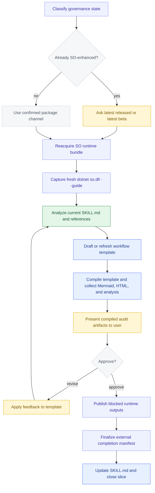

# Loom Skill Enhancement Self-Bootstrap Slice Plan

## Scope

This file is the checked-in plan for the current self-bootstrap slice, where `/loom-skill-enhancement` is itself the target skill being rewritten.

It does not narrow the general mission of `/loom-skill-enhancement`. The skill still exists to rewrite or create any target skill so that the target becomes governed through the Loom Skill Orchestrator flow.

## Goal

Upgrade `/loom-skill-enhancement` as the current target skill so it governs itself with checked-in SO workflow assets, a locked runtime bundle, and explicit SO-exclusive governance wording.

## Mermaid

## Inputs

- Current `SKILL.md`
- Current skill reference docs
- Current SO guide surface
- Current package index surface

## Required Outcomes

- Checked-in workflow template at `assets/so-workflow/so-template.json`
- Locked runtime metadata at `assets/so-workflow/so-package-lock.json`
- Updated `SKILL.md` that references the lock and SO-exclusive governance model
- A compile-valid governed workflow with explicit user-confirmed steps and audit-friendly evidence
- External compile audit artifacts for Mermaid, HTML, workflow JSON backup, and workflow analysis
- A clear separation between the generic skill mission and this self-bootstrap target-skill slice

## Analysis Focus

- Inputs, outputs, branches, loops, seams, gates, and evidence
- Route-aware terminal business-output gates
- User-confirmed review loops
- Node-to-file and node-to-artifact mapping

## Bootstrap Route

1. Classify whether `/loom-skill-enhancement` is already SO-enhanced for the current pass.
2. If it is already SO-enhanced, ask exactly one two-choice latest-channel question: latest released or latest beta.
3. Reacquire the selected SO runtime bundle and record the resolved version in the checked-in package lock.
4. Run a fresh `dotnet so.dll --guide` capture from that runtime before analysis or validation.
5. Treat `/loom-skill-enhancement` as the current target skill for this slice and author the governed workflow template plus the package lock for that target.
6. Compile the template to produce Mermaid, HTML, workflow JSON backup, and workflow analysis artifacts.
7. Present the compiled audit artifacts and confirmation loop to the user for review.
8. Apply feedback to the template if needed and recompile.
9. Publish blocked runtime outputs through a dedicated blocked-governance gate, finalize an external completion manifest that references the checked-in source deliverables, and then use the checked-in source assets as the authoritative self-bootstrap deliverables.

## Evidence

- Final workflow template
- Compiled Mermaid
- Workflow analysis report
- Package lock metadata
- Node-to-file map
- Updated `SKILL.md`
