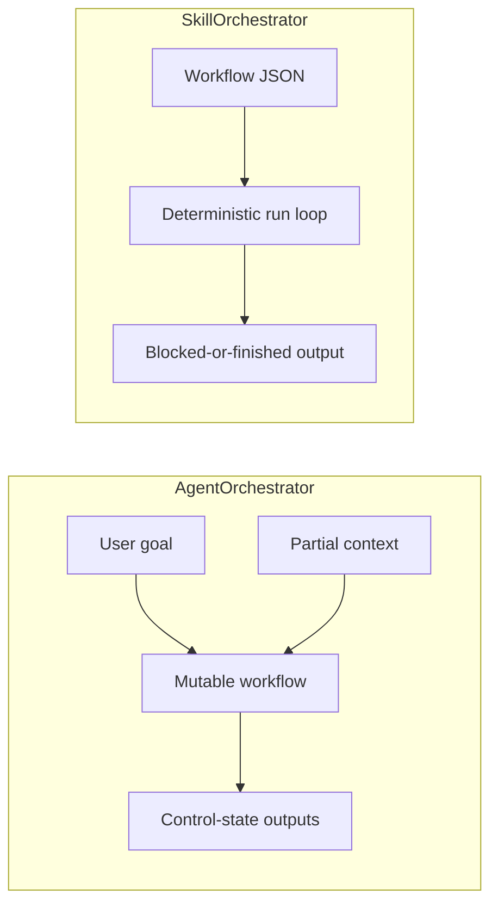

# Techne Loom

[中文](README.zh-CN.md)

<!-- release-notes:start -->
---

## 🚀 Release Notes · `v0.2.45-beta` · June 2026

> [!NOTE]
> **Development pre-release — synced by publish actions.**
> Install the latest beta: `dotnet add package Techne.Loom.SkillOrchestrator --prerelease`
> Full package list → [`packages.beta.md`](packages.beta.md)

### ✨ Channel Highlights

| Area | Change |
| --- | --- |
| 🔄 **Version sync** | This block is refreshed by the publish workflow so the version shown here matches the latest published beta package set |
| 📦 **Fallback assets** | GitHub release aliases keep stable `*.latest.nupkg` URLs available when direct NuGet feed access is unavailable |
| 🔎 **Package discovery** | NuGet.org and [`packages.beta.md`](packages.beta.md) remain the source of truth for install commands and exact prerelease lookups |

### 📦 Packages In This Release

```
Techne.Loom.Abstractions          0.2.45-beta
Techne.Loom.Common                0.2.45-beta
Techne.Loom.AgentOrchestrator     0.2.45-beta
Techne.Loom.SkillOrchestrator     0.2.45-beta
```

> This section is updated automatically after each development publish.
> Check [NuGet.org](https://www.nuget.org/packages/Techne.Loom.SkillOrchestrator) or the [beta fallback release](https://github.com/waynebaby/Techne-Loom/releases/tag/nuget-beta-latest) for the latest version.

### 🔭 Coming Next

- Stable `so.dll --guide` and `ao.dll --guide` offline guide surfaces with version metadata
- Explicit public contracts for workflow, control-state, and hint payloads
- Node.js and Python package scaffolding alongside the .NET family
- Cleaner AO / SO CLI resume flows with `transition_id` and `correlation_key` examples

---
<!-- release-notes:end -->


## Workflow-native orchestration for two problems agent systems keep mixing together


> [!IMPORTANT]
> Techne Loom is being opened up as a method-first, package-first orchestration stack.
> The design splits **exploratory top-agent orchestration** from **deterministic skill execution** on purpose.

Techne Loom is built around one blunt observation: most agent systems blur together two very different jobs.

1. Figuring out what the route should be while the map is still incomplete.
2. Executing the next step in a skill without losing the rail.

Techne Loom names those jobs separately, gives them different products, and designs the repository, docs, packages, and operator experience around that split.

## Workflow Terminology Baseline

The repo now uses one loom-flavored workflow vocabulary across both AO and SO.

- **weave out**: the runtime hands control or work outward and waits for structured continuation.
- **weave back**: an outside participant returns structured data so the same execution line can resume.
- **strand**: one current execution line; repo docs use this instead of `thread` to avoid collision with `.NET` threading terminology.
- **seam**: the conceptual join where control crosses owners; protocol surfaces later report that join through fields such as `boundary_reason` or `current_step_kind`.
- **boundary**: the formal protocol term for a machine-readable blocked or returned control state, such as `boundary_reason` or `type: "boundary"`.

The full glossary lives at:

- [`docs/en/architecture/workflow-terminology.md`](docs/en/architecture/workflow-terminology.md)
- [`docs/zh-cn/architecture/workflow-terminology.md`](docs/zh-cn/architecture/workflow-terminology.md)

Future AO / SO docs are expected to explain workflow behavior with this vocabulary. When explanatory terminology differs from current field names, docs should name both.

## Why This Exists

Prompt-only orchestration tends to feel magical right up to the moment it drifts.

- Top-level agents overfit to whatever partial context they currently remember.
- Skills silently smuggle state through prompts, memory, and tool output.
- Tool calls, model-thinking, human input, and subagent work all collapse into one blurry control surface.
- The moment you need replay, resumability, auditability, or package-level reuse, the whole stack becomes harder to trust.

Techne Loom is designed as a direct answer to that failure mode.

## Two Products, Not One

| Product | What it is | What it is not | Primary interface |
| --- | --- | --- | --- |
| `AgentOrchestrator` (`ao`) | An exploratory orchestration product for a top-level agent operating under uncertainty | Not a deterministic skill runner | CLI/package contract |
| `SkillOrchestrator` (`so`) | A deterministic workflow tracker and next-step enforcer for skills | Not an open-ended planner | Local CLI and package contract |



The split is deliberate.

- **AO** keeps refining route, frontier, and control state.
- **SO** keeps a skill from wandering once the next-step contract exists.

They may align on low-level conventions. They are not the same product, and they are not a parent/child runtime pair.

## What Makes The Approach Different

| Problem | Typical outcome | Techne Loom answer |
| --- | --- | --- |
| Top-level agent planning under uncertainty | The system improvises without durable structure | AO keeps a live workflow plus append-only event history |
| Skill execution across tools, prompts, MCP calls, and subagents | The skill keeps re-deriving state from fragile context | SO runs a persisted workflow and returns strict next-step guidance |
| Reuse across ecosystems | Logic gets trapped inside one runtime or repo | Each project unit maps to a publishable package |
| Documentation for humans vs models | Docs explain, but cannot directly drive generation | AO/SO are designed for built-in long-form guides with templates and contracts |

## The Core Promise

Techne Loom is trying to make agent operations feel less like improvisational theater and more like controlled workflow progression.

- **Exploration should be explicit.**
- **Execution should be resumable.**
- **Hints should be strict enough to keep the next step on-rail.**
- **Memory should be written into workflow context instead of smuggled through vibes.**
- **Every project unit should be releasable as a package, not buried as repo-only glue.**

## Package-First From Day One

The repository is being shaped around parallel package families across ecosystems.

| Role | NuGet | npm | PyPI |
| --- | --- | --- | --- |
| Abstractions | `Techne.Loom.Abstractions` | `@techne-loom/abstractions` | `techne-loom-abstractions` |
| Common | `Techne.Loom.Common` | `@techne-loom/common` | `techne-loom-common` |
| Agent orchestration | `Techne.Loom.AgentOrchestrator` | `@techne-loom/agent-orchestrator` | `techne-loom-agent-orchestrator` |
| Skill orchestration | `Techne.Loom.SkillOrchestrator` | `@techne-loom/skill-orchestrator` | `techne-loom-skill-orchestrator` |

This is not “one runtime with some wrappers”.
It is a package matrix with clear product separation.

For future Node.js and Python packages, the naming above is **plan-only for now**. The intended invocation shape is also plan-only:

- Node.js: package-managed entrypoints such as `npx @techne-loom/agent-orchestrator` and `npx @techne-loom/skill-orchestrator`
- Python: module entrypoints such as `python -m techne_loom_agent_orchestrator` and `python -m techne_loom_skill_orchestrator`

Those non-.NET invocation surfaces are not implemented in this repository yet.

> [!NOTE]
> Choose the package channel before setup or execution:
>
> - Stable: [`packages.released.md`](packages.released.md)
> - Beta / development: [`packages.beta.md`](packages.beta.md)
> - Chinese stable: [`packages.released.zh-CN.md`](packages.released.zh-CN.md)
> - Chinese beta: [`packages.beta.zh-CN.md`](packages.beta.zh-CN.md)

## Quick Usage

If you are evaluating Techne Loom as an operator instead of reading the full contracts first, start here.

| You need to... | Use this | Read first | Official run surface |
| --- | --- | --- | --- |
| explore an uncertain route with a top-level agent | `/loom-plan-execution` | [Using Techne Loom Skills](docs/en/guides/skill-usage.md), then [AO Guide](docs/en/reference/products/ao-guide.md) | `dotnet ao.dll run` / `dotnet ao.dll resume` |
| create or upgrade a deterministic skill | `/loom-skill-enhancement` | [Using Techne Loom Skills](docs/en/guides/skill-usage.md), then [SO Guide](docs/en/reference/products/so-guide.md) | enhancement flow uses `dotnet so.dll compile` / `run` / `resume` |
| run an already SO-enhanced target skill | the target skill plus its lock file | [Using Techne Loom Skills](docs/en/guides/skill-usage.md), then [SO-Enhanced Skill Run Example](docs/en/examples/so-enhanced-skill-run.md) | `dotnet so.dll run` / `dotnet so.dll resume` against a runtime workflow copy |

Three rules matter up front:

1. Choose the package channel before execution.
2. Restore the full AO or SO runtime bundle instead of only the main runtime package.
3. Keep runtime workflow copies, session state, and audit artifacts outside checked-in skill folders.

## AO In One Sentence

AO is for the moment when a top agent still needs to explore, probe, refine, clarify, delegate, and only gradually discover the route.

Its output is control-state, not theatrical prose.

- success or failure
- session_id
- current workflow file
- current node id
- event log path
- next frontier or pending requirement

In this vocabulary, AO **weaves out** when it needs the outside world to continue the route, surfacing that seam through blocked AO control payload fields such as `boundary_reason` and `weave_out_request`; callers **weave back** through `dotnet ao.dll resume` envelopes carrying `transition_id`, `correlation_key`, and `payload`.

## SO In One Sentence

SO is for the moment when a skill should stop improvising and start following a tracked workflow.

It is designed to run until blocked or finished, then return an unambiguous payload such as:

- current workflow file
- current node id
- current step kind
- strict next-step hint
- `memory_for_next_step`
- required inputs to continue

That last part matters.
SO is explicitly being designed so the relevant memory/context is written into workflow state and surfaced back out on each blocking return, reducing the chance that the outer skill agent drifts off the rail.

In this vocabulary, SO only **weaves out** when it reaches an externally owned step, surfacing that seam on blocked `<so_property>` payloads via fields such as `current_step_kind`; it resumes when the caller **weaves back** through `dotnet so.dll resume` with `transition_id`, `correlation_key`, and `payload`.

## Built-In Guide Surfaces

The long-term operator experience is not just “read the repo and guess”.

AO and SO are both being designed around built-in guide surfaces:

- `dotnet ao.dll --guide`
- `dotnet so.dll --guide`

Those guide surfaces are meant to be version-matched, offline, and detailed enough that a user or model can say:

> Based on `dotnet so.dll --guide`, write me a skill that does X.

In other words: the guide is not just help text. It is intended to function like a consumable product contract.

## Repository Rules That Already Matter

- Root documentation is bilingual.
- The root `README.md` and `README.zh-CN.md` are treated as flagship landing pages.
- Root `AGENTS.md` and `AGENTS.zh-CN.md` carry the repository execution rules.
- Every major implementation slice is expected to go through a review-and-commit cadence before the next slice begins.

See [AGENTS.md](AGENTS.md) and [AGENTS.zh-CN.md](AGENTS.zh-CN.md) for the current repo execution rules.

## Current Direction

The repository is currently moving through an opening-up sequence:

1. Lock root rules and documentation cadence.
2. Build flagship bilingual landing pages.
3. Build the docs and guide sources.
4. Scaffold parallel package lines.
5. Extract and implement the public contracts and runtimes.

That means this README is intentionally ambitious in positioning, while the implementation is still being staged carefully and slice by slice.

## What To Expect Next

- bilingual docs under `/docs`
- dedicated AO/SO guide source documents
- explicit package scaffolding for `.NET`, Node.js, and Python
- stable workflow, control, and guide contracts
- a clearer public split between exploratory orchestration and deterministic skill execution

## Philosophy

Techne Loom does not try to win by pretending uncertainty does not exist.
It tries to win by giving uncertainty and determinism different tools.

That is the whole point.
