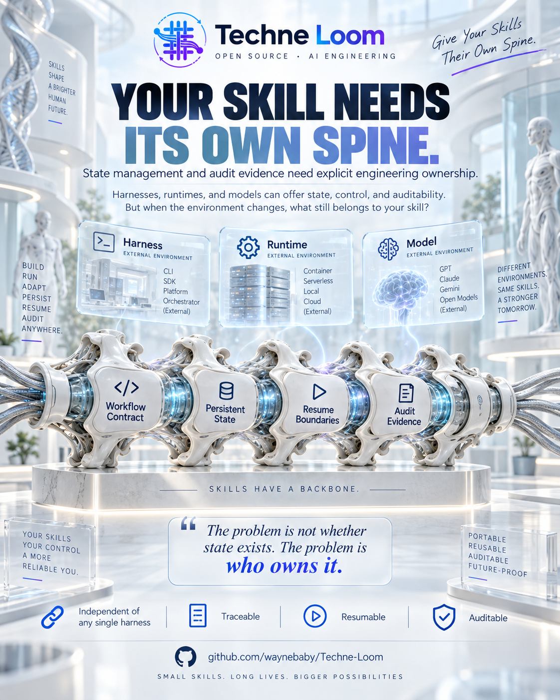
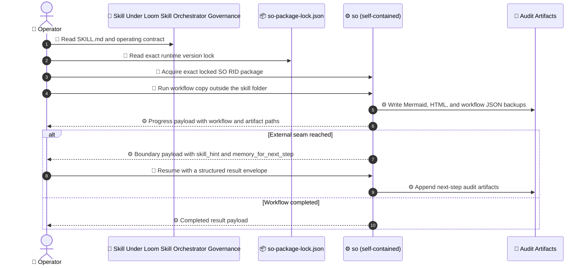
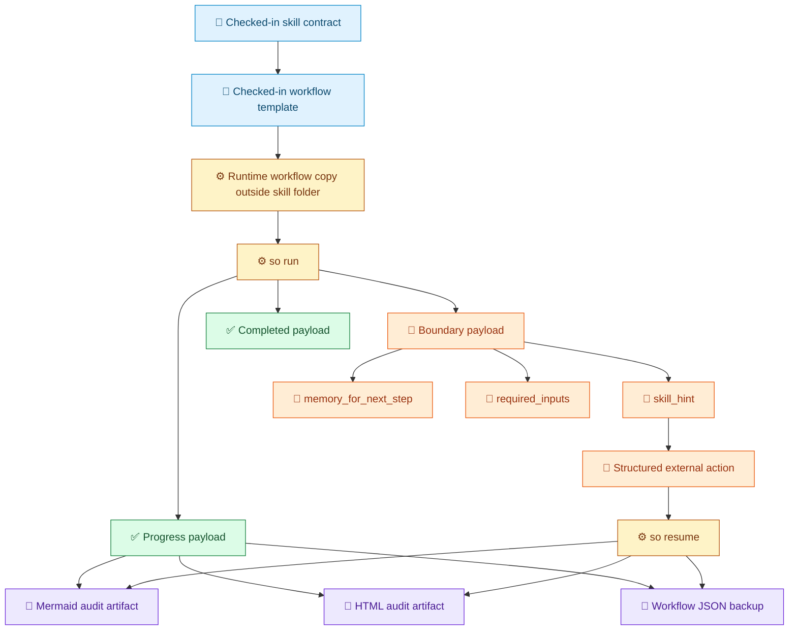

# Techne Loom

[中文](README.zh-CN.md)

<!-- release-notes:start -->
---

## 🚀 Release Notes · `v0.3.323-beta` · September 2026

> [!NOTE]
> **Development pre-release — synced by publish actions.**
> Use the exact published Skill Orchestrator runtime package for the host RID; verify its matching `.sha512` sidecar before extraction.
> Full package list → [`packages.beta.md`](packages.beta.md)

### ✨ Channel Highlights

| Area | Change |
| --- | --- |
| 🔄 **Version sync** | This block is refreshed by the publish workflow so the version shown here matches the latest published beta package set |
| 📦 **Fallback assets** | GitHub releases contain only exact-version runtime packages and matching SHA-512 sidecars; no floating package aliases are published |
| 🔎 **Package discovery** | NuGet.org and [`packages.beta.md`](packages.beta.md) remain the source of truth for install commands and exact prerelease guidance; when an exact package id/version is already known, probe the direct `.nupkg` URL instead of waiting for indexing |

### 📦 Packages In This Release

```text
Techne.Loom.AgentOrchestrator.Runtime.win-x64 0.3.323-beta
Techne.Loom.AgentOrchestrator.Runtime.win-arm64 0.3.323-beta
Techne.Loom.AgentOrchestrator.Runtime.linux-x64 0.3.323-beta
Techne.Loom.AgentOrchestrator.Runtime.linux-arm64 0.3.323-beta
Techne.Loom.AgentOrchestrator.Runtime.linux-musl-x64 0.3.323-beta
Techne.Loom.AgentOrchestrator.Runtime.linux-musl-arm64 0.3.323-beta
Techne.Loom.AgentOrchestrator.Runtime.osx-x64 0.3.323-beta
Techne.Loom.AgentOrchestrator.Runtime.osx-arm64 0.3.323-beta
Techne.Loom.SkillOrchestrator.Runtime.win-x64 0.3.323-beta
Techne.Loom.SkillOrchestrator.Runtime.win-arm64 0.3.323-beta
Techne.Loom.SkillOrchestrator.Runtime.linux-x64 0.3.323-beta
Techne.Loom.SkillOrchestrator.Runtime.linux-arm64 0.3.323-beta
Techne.Loom.SkillOrchestrator.Runtime.linux-musl-x64 0.3.323-beta
Techne.Loom.SkillOrchestrator.Runtime.linux-musl-arm64 0.3.323-beta
Techne.Loom.SkillOrchestrator.Runtime.osx-x64 0.3.323-beta
Techne.Loom.SkillOrchestrator.Runtime.osx-arm64 0.3.323-beta
```

> This list is updated automatically after each development publish. Select the package matching OS, architecture, and Linux libc.
> The beta fallback release contains exact-version `.nupkg` files and matching `.sha512` sidecars. Verify the sidecar before extraction.

### 🔭 Coming Next

- `loom-target-profile` and host capability profiles for paths, tools, hooks, permissions, and context mode
- Read-only host adapters with machine-readable semantic loss reports: `preserved`, `approximated`, `dropped`, and `unsafe`
- Activation, script, MCP, permission, runtime, and resume probes with a fixed cross-host conformance corpus
- Dependency/environment contracts plus signed package, SBOM, publisher-trust, and revocation evidence

> Node.js and Python remain reserved source roots only; no runnable implementation is committed yet, so their package scaffolding is not part of this roadmap.

---
<!-- release-notes:end -->


## Make Agent Skills Defensible In Production


> [!IMPORTANT]
> Techne Loom is a verifiable semantic and execution interoperability layer above Agent Skills.
> It reuses `SKILL.md`, `AGENTS.md`, and MCP, then adds explicit workflow contracts, runtime binding, governed run/resume, and evidence.

Skills are easy to share. Reliable execution across real hosts is not.

## Your Skill Needs Its Own Spine

<p align="center">
  
</p>

A skill should not rely entirely on the harness, runtime, or model that happens to execute it. Its workflow structure, persistent state, resume boundaries, and audit evidence should remain explicit, reviewable, and owned by the skill's workflow assets.

Today, the .NET-first Skill Orchestrator provides these mechanisms through checked-in workflow contracts, tracked runtime workflow copies, structured boundary payloads, and Mermaid, HTML, and workflow JSON evidence. Cross-host portability remains an ongoing direction, not a claim that every environment already behaves the same.

## Why Teams Get Stuck

Public issue reports across agent hosts show that a skill can fail before the model ever has a fair chance to use it:

- [Codex #15756](https://github.com/openai/codex/issues/15756) reports that a symlinked `SKILL.md` is silently omitted from discovery, while a symlinked directory is followed.
- [Claude Code #21428](https://github.com/anthropics/claude-code/issues/21428) reports user skills not being discovered and execution content remaining stale while autocomplete metadata changes.
- [Gemini CLI #29150](https://github.com/google-gemini/gemini-cli/issues/29150) reports case-sensitive precedence and active-state mismatches for otherwise identical skill names.
- [Agent Skills #514](https://github.com/agentskills/agentskills/issues/514) documents a mismatch between metadata prose, the reference validator, and a shipping runtime.
- [Agent Skills #485](https://github.com/agentskills/agentskills/issues/485) proposes machine-evaluable tool dependencies because a host may surface a skill even when its required tools are unavailable.
- [OpenCode #48400](https://github.com/anomalyco/opencode/issues/48400) asks for permissions that distinguish trusted global skills from project-local replacements.

These are different symptoms of one operational gap: the skill package, the host that discovers it, and the runtime that executes it do not always share one explicit meaning.

<p align="center">
  
</p>

Agents, models, harnesses, and runtimes will change. The durable question is whether the skill's contract, state, and evidence change with them.

## What Loom Adds

Loom does not promise to make every host behave the same. It makes the execution contract we control explicit, testable, and reviewable.

| Operational problem | Loom provides today | Product boundary |
| --- | --- | --- |
| Discovery, cache, and copy drift | Checked-in workflow contracts, exact runtime locks, external runtime workflow copies, and package/hash provenance evidence | Host materialization and cross-host adapters remain roadmap work |
| Implied steps and false completion | Explicit states, transitions, routes, seams, gates, ownership, output bindings, compile feedback, and semantic validation | Loom cannot force a model to activate or follow a skill |
| Missing tools or runtime mismatch | Exact package validation, direct apphost startup and guide capture, optional local stdio MCP bound to the current apphost identity, and bounded fragment inspection when needed | It is not a universal cross-host permission or sandbox standard |
| Interruption and handoff | Disk-backed state, wait/resume, operation identity, structured boundary payloads, event logs, and audit artifacts | A vendor chat transcript is not the source of truth |
| Review and provenance | Mermaid, HTML, workflow JSON, package/document hashes, and completion evidence | Signed packages, SBOM, and publisher trust are future supply-chain work |

## The Product To Adopt First

Start with `/loom-skill-enhancement`.

It turns a prompt-shaped skill into a governed production asset while keeping the original Agent Skill envelope intact.

It gives a team a skill that can:

- carry a checked-in workflow contract
- lock the exact product+RID runtime package it depends on
- run from a tracked workflow copy outside the skill folder
- stop with a strict boundary payload instead of vague prose
- resume with structured inputs instead of conversational guesswork
- emit Mermaid, HTML, and workflow JSON artifacts for review and audit

Adoption gives teams control.

> Design direction, not a portability guarantee: Loom aims to preserve a skill's contract, state, and evidence as environments change. It does not yet promise host-independent execution.

<p align="center">
  
</p>

That is the design direction: build a skill's durable spine while treating host portability and runtime independence as explicit engineering boundaries.

## Unenhanced Skill Vs Skill Under Loom Skill Orchestrator Governance

| Dimension | Unenhanced skill | skill under Loom Skill Orchestrator governance |
| --- | --- | --- |
| workflow control | implied in prompt behavior | checked-in workflow contract |
| runtime dependency | assumed or loosely documented | exact bundle lock in `so-package-lock.json` |
| mutable execution state | scattered across chat and operator memory | tracked runtime workflow copy |
| interruption handling | ad hoc retry or re-prompt | explicit boundary and structured resume |
| auditability | reconstructed after the fact | emitted step artifacts during execution |
| operator trust | personality-driven | contract-driven |

## What Failure Looks Like Without Skill Enhancement

Without skill enhancement, the worst outcome is a skill that keeps moving after the team has lost the ability to defend what it is doing.

Real production-grade examples:

- An approval skill forgets which review branch it was on, asks the wrong approver again, and creates duplicated human sign-off loops with no durable seam showing where confusion started.
- A release skill resumes from chat memory, skips artifact verification, and publishes the wrong package because the operator assumed the previous checkpoint had already passed.
- A migration skill keeps mutating files after an interrupted run, but there is no external runtime copy, no event trail, and no point-in-time workflow backup to prove which edits belonged to which attempt.
- A compliance skill pauses mid-evidence collection and leaves only vague prose, so the next operator resumes with the wrong assumption and quietly contaminates the audit trail.
- A support or incident skill drifts through multiple handoffs until no one can produce an exact boundary payload, stable memory handoff, or defensible replay story.

That creates production liability.

## What Changes After Adoption

After adopting `/loom-skill-enhancement`, the same scenarios become governable.

- approval loops become visible workflow errors with explicit blocked seams
- skipped release checks become reviewable workflow violations instead of silent production surprises
- interrupted migrations produce durable runtime copies, workflow backups, and event trails
- compliance pauses state exactly what input is missing and what evidence state existed before the stop
- support handoffs resume from workflow state and boundary memory, not from folklore

These incidents become diagnosable, resumable, reviewable, and defensible.

## In One Line

**`/loom-skill-enhancement` is the fastest path from prompt-shaped skill behavior to released, auditable, tracked production execution.**

## Why The Skill Matters More Than The Raw Runtime

The runtime is infrastructure. The skill is what the operator has to trust.

A production-facing skill must do more than run. It must:

- follow a reviewed workflow
- expose the next step clearly
- stop at the correct external seam
- preserve context for the next turn
- leave artifacts that survive review

The skill enhancer leads the story. Loom Skill Orchestrator governance makes the skill governable.

## The Release Story

Today, the major released path is:

1. **SO as the deterministic runtime**
2. **skills under Loom Skill Orchestrator governance as the operator-facing product**
3. **Tracked, audit-first execution as the default model**

Loom Agent Plan-Execution Orchestrator and `/loom-plan-execution` still matter. They currently belong in the beta exploratory layer.

## What A Skill Under Loom Skill Orchestrator Governance Ships With

A skill under Loom Skill Orchestrator governance ships with:

- a checked-in `SKILL.md`
- a checked-in workflow template under `assets/so-workflow/`
- an authoritative runtime lock file at `assets/so-workflow/so-package-lock.json`
- deterministic `so run` and `so resume` execution (self-contained direct entry)
- Mermaid, HTML, and workflow JSON audit artifacts for each step
- strict boundary payloads with `skill_hint`, `memory_for_next_step`, and required continuation inputs

## Start Fast

### Run A Released Skill Under Loom Skill Orchestrator Governance

1. Start from [packages.released.md](packages.released.md).
2. Acquire the released SO self-contained package that matches the host RID from the exact package index; do not restore the retired core-project bundle.
3. Open the target skill's `SKILL.md`.
4. Read `assets/so-workflow/so-package-lock.json`.
5. Read `so-package-lock.json`, acquire the one exact SO product+RID package, and validate its hash and archive before extraction.
6. Clone the checked-in workflow template to a runtime workflow copy outside the skill folder.
7. Run `so run --workflow-file <runtime-copy-path>`.
8. If blocked, follow `skill_hint` and continue with `so resume --workflow-file <runtime-copy-path> --result-file <path>`.

```text
Read SKILL.md -> read so-package-lock.json -> acquire exact SO RID package -> clone workflow template -> so run -> inspect audit artifacts -> so resume
```

### Create Or Upgrade A Released Skill Under Loom Skill Orchestrator Governance

1. Start from [packages.released.md](packages.released.md) for stable work.
2. Use `/loom-skill-enhancement`.
3. Read [Using Techne Loom Skills](docs/en/guides/skill-usage.md).
4. Read [SkillOrchestrator Guide](docs/en/guides/so-guide.md).
5. Let the enhancement flow produce the checked-in workflow assets and runtime lock.

```text
/loom-skill-enhancement -> review skill-plan -> review workflow template -> review runtime lock -> run the enhanced skill with `so`
```

## How Governed Execution Stays On Track

Legend: `👤` operator action, `🧩` skill surface, `📦` runtime lock, `⚙️` runtime execution, `🧾` audit evidence.



Execution stays on track because the next step is explicit, the mutable workflow copy is persisted, and the resume boundary is structured instead of improvised.

## How The Skill Holds Up Under Audit

A skill under Loom Skill Orchestrator governance is not only executable. It is inspectable under pressure.

Every serious step can leave:

- a Mermaid rendering of the point-in-time workflow
- an HTML rendering for human inspection
- a workflow JSON backup for exact replay context
- boundary payloads that show why the skill stopped and what it needed next

Legend: `📜` checked-in contract, `⚙️` runtime execution, `✅` progress or completion output, `🚧` boundary state, `🔁` continuation action, `🧾` audit evidence.



That means operator questions are answered with artifacts instead of memory:

- What exact step did the skill stop at?
- Why did it stop?
- What input resumed it?
- What workflow shape existed at that point?

## Pick The Path That Matches Your Situation

| If you want to... | Start from... | What it means | Example |
| --- | --- | --- | --- |
| run a skill that has already been enhanced and released | a released skill under Loom Skill Orchestrator governance | the skill already has its checked-in workflow assets and runtime lock | Example: "Run this released skill. If it blocks and needs my input, ask me first. If you can resolve it, continue the resume flow." |
| turn your own skill into something releasable and governed | your target skill with `/loom-skill-enhancement` | this is the path that generates the future version under Loom Skill Orchestrator governance of your skill | Example: "Enhance this skill with /loom-skill-enhancement, create the workflow template, and let me review it with friendly output." |
| explore a route before the workflow is stable | `/loom-plan-execution` | this is still the beta Loom Agent Plan-Execution Orchestrator exploratory layer | Example: "Use /loom-plan-execution to translate the full plan we already made into a workflow, then use that workflow to track the run until the final successful outcome is generated." |

Read first:

- released skill run: [Using Techne Loom Skills](docs/en/guides/skill-usage.md)
- skill enhancement path: [Using Techne Loom Skills](docs/en/guides/skill-usage.md), then [SO Guide](docs/en/guides/so-guide.md)
- beta exploration path: [Loom Agent Plan-Execution Orchestrator Guide](docs/en/guides/ao-guide.md)

## Stable Operating Rules

1. Direct CLI or manual package acquisition chooses package channel first; governed AO/SO skill execution should instead follow the runtime version already bound by the current CI/CD-managed skill package version block or checked-in runtime lock.
2. Direct stable/manual skill runs default to [packages.released.md](packages.released.md); direct prerelease/manual runs default to [packages.beta.md](packages.beta.md).
3. Acquire and validate the one exact product+RID runtime package; do not assemble a multi-package DLL runtime closure.
4. Keep runtime workflow copies, session state, event sidecars, and audit artifacts outside checked-in skill folders.
5. Treat the checked-in skill workflow template as immutable source.
6. Treat checked-in `SKILL.md`, `contract.json`, and `assets/so-workflow/` surfaces as the normative governance contract. Treat demo timelines and recorded-slice narratives as historical records: they explain what happened in a slice, but they do not redefine the current governed completion contract unless the normative target-skill assets say so.

## Official Guides

Use these guide surfaces as the operator contract:

- `so --guide` (self-contained direct entry)
- [Using Techne Loom Skills](docs/en/guides/skill-usage.md)
- [SkillOrchestrator Guide](docs/en/guides/so-guide.md)
- [Skill Under Loom Skill Orchestrator Governance Run Example](docs/en/examples/so-enhanced-skill-run.md)
- [Skills Input/Output Reference](docs/en/reference/skills.md)

## Loom Agent Plan-Execution Orchestrator Remains Beta

Loom Agent Plan-Execution Orchestrator and `/loom-plan-execution` remain important, but they belong to the beta exploratory layer.

Use Loom Agent Plan-Execution Orchestrator when:

- the route is still unclear
- the top-level agent needs to compare frontiers
- the workflow is not yet stable enough to become a deterministic skill

Read Loom Agent Plan-Execution Orchestrator through these beta surfaces:

- [Loom Agent Plan-Execution Orchestrator Guide](docs/en/guides/ao-guide.md)
- [CLI Reference](docs/en/reference/cli.md)
- [Agent Integration](docs/en/guides/agent-integration.md)

## C# / .NET First · Self-Contained Cross-Platform

| Runtime | Active runtime package family |
| --- | --- |
| Loom Agent Plan-Execution Orchestrator (AO) | `Techne.Loom.AgentOrchestrator.Runtime.<rid>` (8 RIDs) |
| SkillOrchestrator (SO) | `Techne.Loom.SkillOrchestrator.Runtime.<rid>` (8 RIDs) |

The active release closure is the 16 self-contained AO/SO product+RID packages. Abstractions, Common, and product projects remain buildable source dependencies but are not active runtime packages. Node.js (`src/nodejs`) and Python (`src/python`) are reserved source roots only: no runnable Node.js or Python runtime is committed yet, so their npm/PyPI package names remain placeholders until a formal adapter contract lands.

There is one runtime channel: the exact self-contained package for the current product and supported RID. Verify package identity, version, SHA-512, manifest, archive safety, apphost, and guide files; then run the extracted apphost directly. No shared-host DLL mode, resolver, or cross-mode fallback exists. See [Platform Detection Steps](docs/en/reference/runtime/platform-detection.md) and the [released package index](packages.released.md) for the complete 8-RID runtime matrix.

## Runtime Package Family

The 16-package runtime family serves the independent AO and SO products. Each host selects its matching product+RID apphost (`ao.exe`/`so.exe` on Windows, `ao`/`so` on Unix); the package carries the English docs beside that apphost.

| RID | AO runtime package | SO runtime package | Fixed entrypoints |
| --- | --- | --- | --- |
| `win-x64` | `Techne.Loom.AgentOrchestrator.Runtime.win-x64` | `Techne.Loom.SkillOrchestrator.Runtime.win-x64` | `tools/win-x64/ao.exe` / `tools/win-x64/so.exe` |
| `win-arm64` | `Techne.Loom.AgentOrchestrator.Runtime.win-arm64` | `Techne.Loom.SkillOrchestrator.Runtime.win-arm64` | `tools/win-arm64/ao.exe` / `tools/win-arm64/so.exe` |
| `linux-x64` | `Techne.Loom.AgentOrchestrator.Runtime.linux-x64` | `Techne.Loom.SkillOrchestrator.Runtime.linux-x64` | `tools/linux-x64/ao` / `tools/linux-x64/so` |
| `linux-arm64` | `Techne.Loom.AgentOrchestrator.Runtime.linux-arm64` | `Techne.Loom.SkillOrchestrator.Runtime.linux-arm64` | `tools/linux-arm64/ao` / `tools/linux-arm64/so` |
| `linux-musl-x64` | `Techne.Loom.AgentOrchestrator.Runtime.linux-musl-x64` | `Techne.Loom.SkillOrchestrator.Runtime.linux-musl-x64` | `tools/linux-musl-x64/ao` / `tools/linux-musl-x64/so` |
| `linux-musl-arm64` | `Techne.Loom.AgentOrchestrator.Runtime.linux-musl-arm64` | `Techne.Loom.SkillOrchestrator.Runtime.linux-musl-arm64` | `tools/linux-musl-arm64/ao` / `tools/linux-musl-arm64/so` |
| `osx-x64` | `Techne.Loom.AgentOrchestrator.Runtime.osx-x64` | `Techne.Loom.SkillOrchestrator.Runtime.osx-x64` | `tools/osx-x64/ao` / `tools/osx-x64/so` |
| `osx-arm64` | `Techne.Loom.AgentOrchestrator.Runtime.osx-arm64` | `Techne.Loom.SkillOrchestrator.Runtime.osx-arm64` | `tools/osx-arm64/ao` / `tools/osx-arm64/so` |

The complete matrix is AO × 8 plus SO × 8, for 16 runtime PackageIds. Stable GitHub fallback aliases follow the `nuget-stable-latest` release; beta uses `nuget-beta-latest`. Use NuGet.org V3 flat-container URLs or exact-version GitHub assets as documented in [packages.released.md](packages.released.md).

GitHub exact-version package and checksum shape (use `nuget-beta-latest` for beta):

```text
https://github.com/waynebaby/Techne-Loom/releases/download/nuget-stable-latest/<PackageId>.<exact-version>.nupkg
https://github.com/waynebaby/Techne-Loom/releases/download/nuget-stable-latest/<PackageId>.<exact-version>.nupkg.sha512
```

```text
https://api.nuget.org/v3-flatcontainer/<lowercased-package-id>/<normalized-exact-version>/<lowercased-package-id>.<normalized-exact-version>.nupkg
```

## Direct Apphost Invocation

AO and SO run only from exact self-contained product+RID packages. Select one supported RID, verify the exact package, and use its apphost directly.

```text
Windows: .\so.exe run --workflow-file <runtime-copy-path>
Windows: .\so.exe resume --workflow-file <runtime-copy-path> --result-file <path>
Windows: .\ao.exe --guide
Unix: ./so run --workflow-file <runtime-copy-path>
Unix: ./so resume --workflow-file <runtime-copy-path> --result-file <path>
Unix: ./ao --guide
```

There is no shared-host DLL launch mode. Follow the package index and platform-detection guide for exact package selection and validation.
## Read Next

- [Using Techne Loom Skills](docs/en/guides/skill-usage.md)
- [SO Guide](docs/en/guides/so-guide.md)
- [Skill Under Loom Skill Orchestrator Governance Run Example](docs/en/examples/so-enhanced-skill-run.md)
- [Demo Index](demos/README.md)
- [loom-enhanced-research Demo Timeline](demos/loom-enhanced-research/README.md)
- [Skills Input/Output Reference](docs/en/reference/skills.md)
- [Loom Agent Plan-Execution Orchestrator Guide](docs/en/guides/ao-guide.md)
- [AGENTS.md](AGENTS.md)

Techne Loom is not trying to make agent systems sound magical.
It is trying to make skills under Loom Skill Orchestrator governance hard to dismiss.
