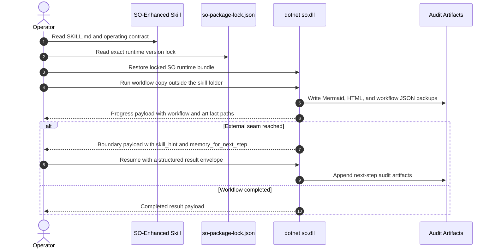
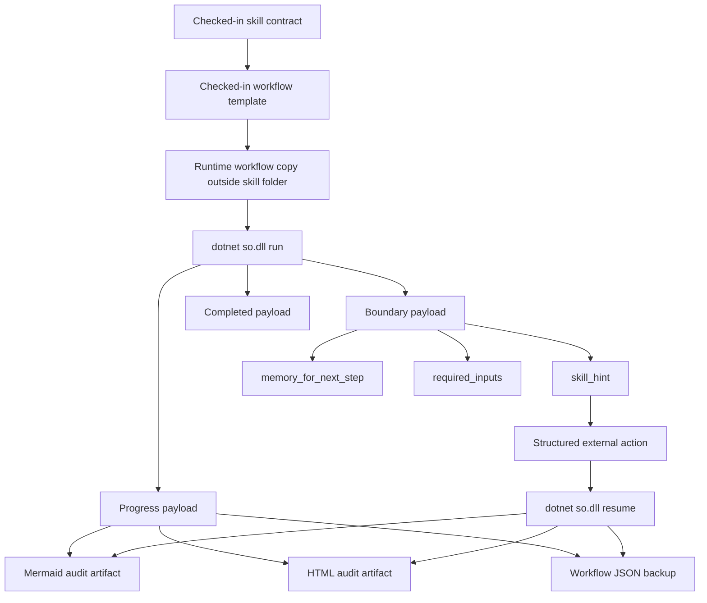

# Techne Loom

[中文](README.zh-CN.md)

<!-- release-notes:start -->
---

## 🚀 Release Notes · `v0.2.82` · June 2026

> [!NOTE]
> **Stable release — synced by publish actions.**
> Install the latest stable: `dotnet add package Techne.Loom.SkillOrchestrator`
> Full package list → [`packages.released.md`](packages.released.md)

### ✨ Channel Highlights

| Area | Change |
| --- | --- |
| 🔄 **Version sync** | This block is refreshed by the publish workflow so the version shown here matches the latest published stable package set |
| 📦 **Fallback assets** | GitHub release aliases keep stable `*.latest.nupkg` URLs available when direct NuGet feed access is unavailable |
| 🔎 **Package discovery** | NuGet.org and [`packages.released.md`](packages.released.md) remain the source of truth for install commands and exact stable version lookups |

### 📦 Packages In This Release

```
Techne.Loom.Abstractions          0.2.82
Techne.Loom.Common                0.2.82
Techne.Loom.AgentOrchestrator     0.2.82
Techne.Loom.SkillOrchestrator     0.2.82
```

> This section is updated automatically after each main-branch publish.
> Check [NuGet.org](https://www.nuget.org/packages/Techne.Loom.SkillOrchestrator) or the [stable fallback release](https://github.com/waynebaby/Techne-Loom/releases/tag/nuget-stable-latest) for the latest version.

### 🔭 Coming Next

- Stable `so.dll --guide` and `ao.dll --guide` offline guide surfaces with version metadata
- Explicit public contracts for workflow, control-state, and hint payloads
- Node.js and Python package scaffolding alongside the .NET family
- Cleaner AO / SO CLI resume flows with `transition_id` and `correlation_key` examples

---
<!-- release-notes:end -->


## Govern Skills That Must Survive Production


> [!IMPORTANT]
> Techne Loom's primary released product is the **SO-enhanced skill**.
> It ships with a checked-in workflow contract, a locked runtime bundle, resumable execution, and audit-ready artifacts.

Most teams need skills that can survive interruption, handoff, review, and production scrutiny.

Techne Loom is built to give teams operational control.

## Why Teams Switch

Teams change their skill operating model when trust collapses.

This is what collapse looks like:

- the skill keeps producing output after it has already drifted off the intended path
- human handoff destroys the real execution state
- resume depends on chat memory instead of durable workflow state
- nobody can prove which step was skipped, repeated, or mutated
- audit begins only after evidence has already been blurred

At that point, the team no longer trusts the run.

## The Product To Adopt First

Start with `/loom-skill-enhancement`.

It turns a prompt-shaped skill into a governed production asset.

It gives a team a skill that can:

- carry a checked-in workflow contract
- lock the exact runtime bundle it depends on
- run from a tracked workflow copy outside the skill folder
- stop with a strict boundary payload instead of vague prose
- resume with structured inputs instead of conversational guesswork
- emit Mermaid, HTML, and workflow JSON artifacts for review and audit

Adoption gives teams control.

## Unenhanced Skill Vs SO-Enhanced Skill

| Dimension | Unenhanced skill | SO-enhanced skill |
| --- | --- | --- |
| workflow control | implied in prompt behavior | checked-in workflow contract |
| runtime dependency | assumed or loosely documented | exact bundle lock in `so-package-lock.json` |
| mutable execution state | scattered across chat and operator memory | tracked runtime workflow copy |
| interruption handling | ad hoc retry or re-prompt | explicit boundary and structured resume |
| auditability | reconstructed after the fact | emitted step artifacts during execution |
| operator trust | personality-driven | contract-driven |

## What Failure Looks Like Without SO Enhancement

Without SO enhancement, the worst outcome is a skill that keeps moving after the team has lost the ability to defend what it is doing.

Real production-grade examples:

- An approval skill forgets which review branch it was on, asks the wrong approver again, and creates duplicated human sign-off loops with no durable seam showing where confusion started.
- A release skill resumes from chat memory, skips artifact verification, and publishes the wrong package because the operator assumed the previous checkpoint had already passed.
- A migration skill keeps mutating files after an interrupted run, but there is no external runtime copy, no event trail, and no point-in-time workflow backup to prove which edits belonged to which attempt.
- A compliance skill pauses mid-evidence collection and leaves only vague prose, so the next operator resumes with the wrong assumption and quietly contaminates the audit trail.
- A support or incident skill drifts through multiple handoffs until no one can produce an exact boundary payload, stable memory handoff, or defensible replay story.

That creates production liability.

## What Changes After Adoption

After adopting `/loom-skill-enhancement`, the same scenarios become governable.

- approval loops become visible workflow errors with explicit blocked seams
- skipped release checks become reviewable workflow violations instead of silent production surprises
- interrupted migrations produce durable runtime copies, workflow backups, and event trails
- compliance pauses state exactly what input is missing and what evidence state existed before the stop
- support handoffs resume from workflow state and boundary memory, not from folklore

These incidents become diagnosable, resumable, reviewable, and defensible.

## In One Line

**`/loom-skill-enhancement` is the fastest path from prompt-shaped skill behavior to released, auditable, tracked production execution.**

## Why The Skill Matters More Than The Raw Runtime

The runtime is infrastructure. The skill is what the operator has to trust.

A production-facing skill must do more than run. It must:

- follow a reviewed workflow
- expose the next step clearly
- stop at the correct external seam
- preserve context for the next turn
- leave artifacts that survive review

The skill enhancer leads the story. SO makes the skill governable.

## The Release Story

Today, the major released path is:

1. **SO as the deterministic runtime**
2. **SO-enhanced skills as the operator-facing product**
3. **Tracked, audit-first execution as the default model**

AO and `/loom-plan-execution` still matter. They currently belong in the beta exploratory layer.

## What An SO-Enhanced Skill Ships With

An SO-enhanced skill ships with:

- a checked-in `SKILL.md`
- a checked-in workflow template under `assets/so-workflow/`
- an authoritative runtime lock file at `assets/so-workflow/so-package-lock.json`
- deterministic `dotnet so.dll run` and `dotnet so.dll resume` execution
- Mermaid, HTML, and workflow JSON audit artifacts for each step
- strict boundary payloads with `skill_hint`, `memory_for_next_step`, and required continuation inputs

## Start Fast

### Run A Released Governed Skill

1. Start from [packages.released.md](packages.released.md).
2. Restore the released SO runtime bundle: `Techne.Loom.SkillOrchestrator`, `Techne.Loom.Common`, and `Techne.Loom.Abstractions`.
3. Open the target skill's `SKILL.md`.
4. Read `assets/so-workflow/so-package-lock.json`.
5. Restore the exact locked SO runtime bundle from NuGet.
6. Clone the checked-in workflow template to a runtime workflow copy outside the skill folder.
7. Run `dotnet so.dll run --workflow-file <runtime-copy-path>`.
8. If blocked, follow `skill_hint` and continue with `dotnet so.dll resume --workflow-file <runtime-copy-path> --result-file <path>`.

```text
Read SKILL.md -> read so-package-lock.json -> restore exact SO runtime bundle -> clone workflow template -> dotnet so.dll run -> inspect audit artifacts -> dotnet so.dll resume
```

### Create Or Upgrade A Released Governed Skill

1. Start from [packages.released.md](packages.released.md) for stable work.
2. Use `/loom-skill-enhancement`.
3. Read [Using Techne Loom Skills](docs/en/guides/skill-usage.md).
4. Read [SkillOrchestrator Guide](docs/en/reference/products/so-guide.md).
5. Let the enhancement flow produce the checked-in workflow assets and runtime lock.

```text
/loom-skill-enhancement -> review skill-plan -> review workflow template -> review runtime lock -> run the enhanced skill with dotnet so.dll
```

## How Governed Execution Stays On Track



Execution stays on track because the next step is explicit, the mutable workflow copy is persisted, and the resume boundary is structured instead of improvised.

## How The Skill Holds Up Under Audit

An SO-enhanced skill is not only executable. It is inspectable under pressure.

Every serious step can leave:

- a Mermaid rendering of the point-in-time workflow
- an HTML rendering for human inspection
- a workflow JSON backup for exact replay context
- boundary payloads that show why the skill stopped and what it needed next



That means operator questions are answered with artifacts instead of memory:

- What exact step did the skill stop at?
- Why did it stop?
- What input resumed it?
- What workflow shape existed at that point?

## Pick The Path That Matches Your Situation

| If you want to... | Start from... | What it means | Example |
| --- | --- | --- | --- |
| run a skill that has already been enhanced and released | a released SO-enhanced skill | the skill already has its checked-in workflow assets and runtime lock | Example: "Run this released skill. If it blocks and needs my input, ask me first. If you can resolve it, continue the resume flow." |
| turn your own skill into something releasable and governed | your target skill with `/loom-skill-enhancement` | this is the path that generates the future SO-enhanced version of your skill | Example: "Enhance this skill with /loom-skill-enhancement, create the workflow template, and let me review it with friendly output." |
| explore a route before the workflow is stable | `/loom-plan-execution` | this is still the beta exploratory layer | Example: "Use /loom-plan-execution to translate the full plan we already made into a workflow, then use that workflow to track the run until the final successful outcome is generated." |

Read first:

- released skill run: [Using Techne Loom Skills](docs/en/guides/skill-usage.md)
- skill enhancement path: [Using Techne Loom Skills](docs/en/guides/skill-usage.md), then [SO Guide](docs/en/reference/products/so-guide.md)
- beta exploration path: [AO Guide](docs/en/reference/products/ao-guide.md)

## Stable Operating Rules

1. Choose the package channel first.
2. For released skill execution, default to [packages.released.md](packages.released.md).
3. Restore the full runtime bundle, never only the main runtime package.
4. Keep runtime workflow copies, session state, event sidecars, and audit artifacts outside checked-in skill folders.
5. Treat the checked-in skill workflow template as immutable source.

## Official Guides

Use these guide surfaces as the operator contract:

- `dotnet so.dll --guide`
- [Using Techne Loom Skills](docs/en/guides/skill-usage.md)
- [SkillOrchestrator Guide](docs/en/reference/products/so-guide.md)
- [SO-Enhanced Skill Run Example](docs/en/examples/so-enhanced-skill-run.md)
- [Skills Input/Output Reference](docs/en/reference/skills.md)

## AO Remains Beta

AO and `/loom-plan-execution` remain important, but they belong to the beta exploratory layer.

Use AO when:

- the route is still unclear
- the top-level agent needs to compare frontiers
- the workflow is not yet stable enough to become a deterministic skill

Read AO through these beta surfaces:

- [AO Guide](docs/en/reference/products/ao-guide.md)
- [CLI Reference](docs/en/reference/cli.md)
- [Agent Integration](docs/en/guides/agent-integration.md)

## Package-First, Multi-Ecosystem Direction

| Role | NuGet | npm | PyPI |
| --- | --- | --- | --- |
| Abstractions | `Techne.Loom.Abstractions` | `@techne-loom/abstractions` | `techne-loom-abstractions` |
| Common | `Techne.Loom.Common` | `@techne-loom/common` | `techne-loom-common` |
| AO runtime | `Techne.Loom.AgentOrchestrator` | `@techne-loom/agent-orchestrator` | `techne-loom-agent-orchestrator` |
| SO runtime | `Techne.Loom.SkillOrchestrator` | `@techne-loom/skill-orchestrator` | `techne-loom-skill-orchestrator` |

Node.js and Python package names are still planned, not yet fully implemented runtime surfaces.

## Read Next

- [Using Techne Loom Skills](docs/en/guides/skill-usage.md)
- [SO Guide](docs/en/reference/products/so-guide.md)
- [SO-Enhanced Skill Run Example](docs/en/examples/so-enhanced-skill-run.md)
- [Skills Input/Output Reference](docs/en/reference/skills.md)
- [AO Guide](docs/en/reference/products/ao-guide.md)
- [AGENTS.md](AGENTS.md)

Techne Loom is not trying to make agent systems sound magical.
It is trying to make governed skills hard to dismiss.
