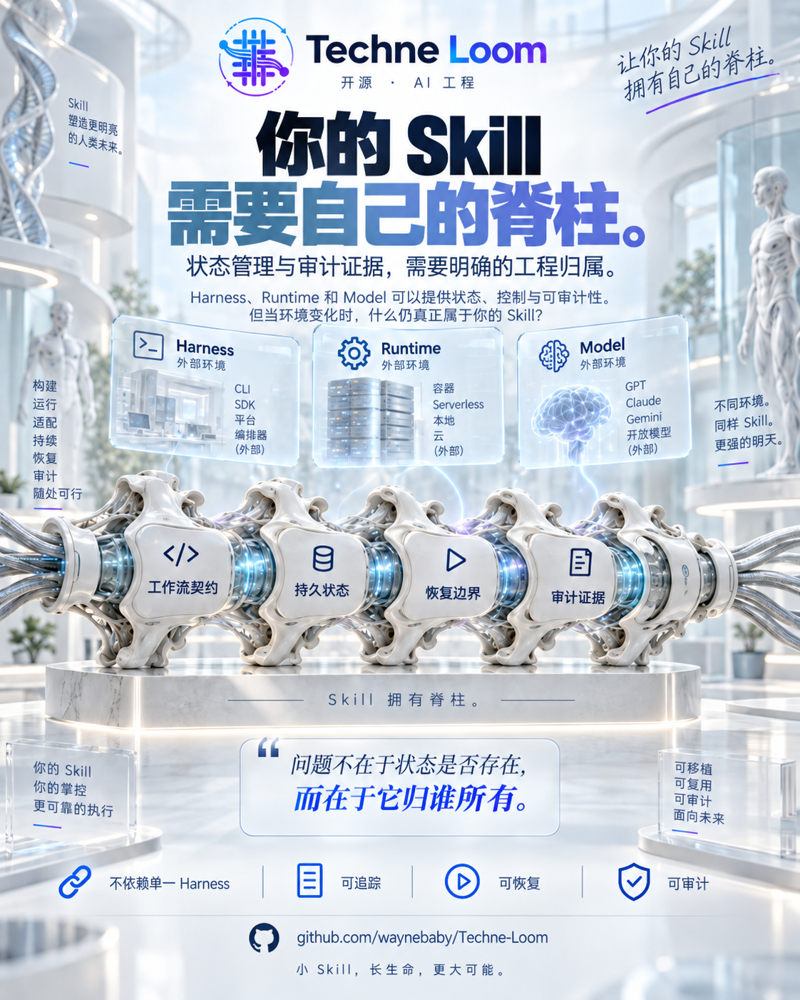
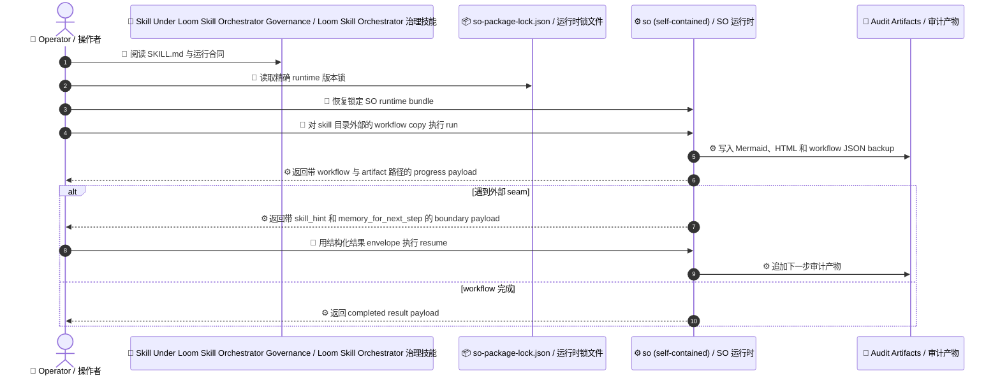
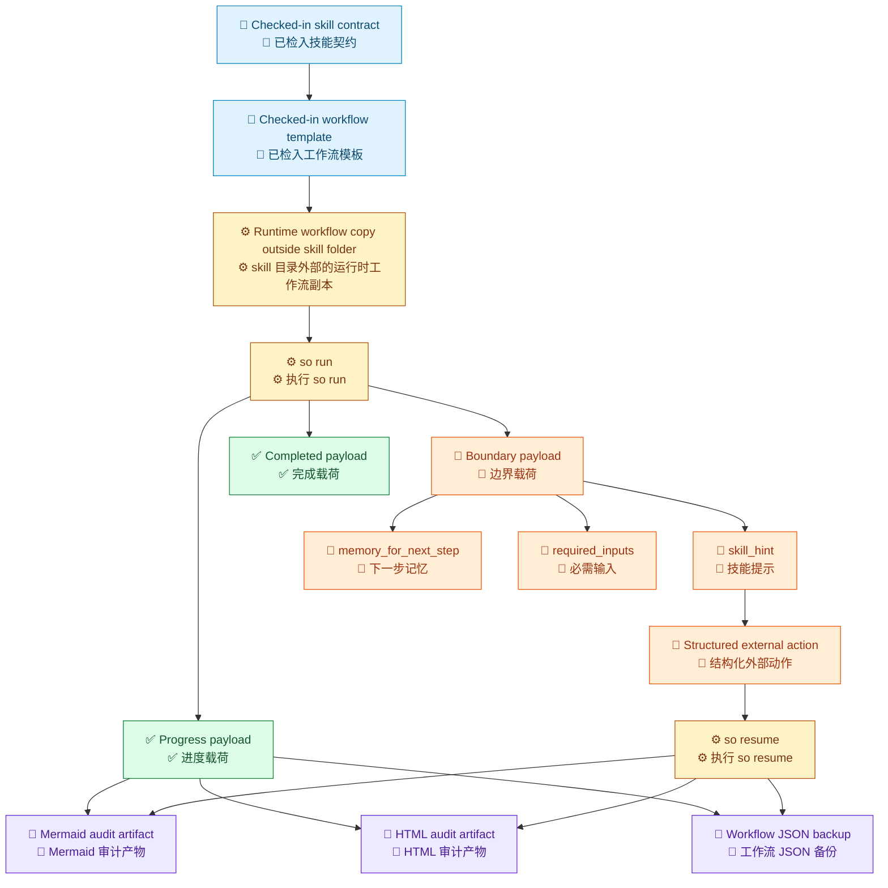

# Techne Loom

[English](README.md)

<!-- release-notes:start -->
---

## 🚀 发布说明 · `v0.3.319-beta` · 2026 年 9 月

> [!NOTE]
> **开发预发布版本 — 由发布工作流自动同步。**
> 安装本次 beta 包：`dotnet add package Techne.Loom.SkillOrchestrator --version 0.3.319-beta`
> 完整包列表 → [`packages.beta.zh-CN.md`](packages.beta.zh-CN.md)

### ✨ 通道亮点

| 领域 | 变更内容 |
| --- | --- |
| 🔄 **版本同步** | 这个区块会由发布工作流重写，确保这里展示的版本号始终对应最新发布的 beta 包集合 |
| 📦 **回退资产** | GitHub release 别名会持续提供稳定的 `*.latest.nupkg` 下载地址，便于 NuGet feed 不可用时回退 |
| 🔎 **包发现** | NuGet.org 与 [`packages.beta.zh-CN.md`](packages.beta.zh-CN.md) 仍然是安装命令和精确预发布版本指引的事实来源；当精确 package id/version 已知时，应直接探测 `.nupkg` URL，而不是等待索引刷新 |

### 📦 本次发布的包

```text
Techne.Loom.Abstractions          0.3.319-beta
Techne.Loom.Common                0.3.319-beta
Techne.Loom.AgentOrchestrator     0.3.319-beta
Techne.Loom.SkillOrchestrator     0.3.319-beta
```

> 这个区块会在每次 development 通道发布后自动更新。
> 请查阅 [NuGet.org](https://www.nuget.org/packages/Techne.Loom.SkillOrchestrator)、[`packages.beta.zh-CN.md`](packages.beta.zh-CN.md) 或 [beta 回退发布页](https://github.com/waynebaby/Techne-Loom/releases/tag/nuget-beta-latest) 获取最新版本指引。当精确 package id/version 已知时，应直接探测包地址，例如 `https://www.nuget.org/api/v2/package/Techne.Loom.SkillOrchestrator/0.3.319-beta`，而不是等待索引刷新。
> 合并到 `main` 后的预期 stable 地址： [stable fallback release](https://github.com/waynebaby/Techne-Loom/releases/tag/nuget-stable-latest)、精确 asset `https://github.com/waynebaby/Techne-Loom/releases/download/nuget-stable-latest/<PackageId>.<exact-version>.nupkg`，以及稳定别名 `https://github.com/waynebaby/Techne-Loom/releases/download/nuget-stable-latest/<PackageId>.latest.nupkg`。

### 🔭 即将推出

- `loom-target-profile` 与覆盖 paths、tools、hooks、permissions、context mode 的 host capability profile
- 带机器可读 semantic loss report 的只读 host adapter：`preserved`、`approximated`、`dropped`、`unsafe`
- activation、script、MCP、permission、runtime 与 resume probes，以及固定的跨宿主 conformance corpus
- dependency/environment contract，以及 signed package、SBOM、publisher-trust 与 revocation 证据

> Node.js 与 Python 目前仅作为预留 source root；尚未提交可运行的实现，因此它们的包脚手架不在本路线图中。

---
<!-- release-notes:end -->


## 让 Agent Skills 在生产中站得住


> [!IMPORTANT]
> Techne Loom 是构建在 Agent Skills 之上的可验证语义与执行互操作层。
> 它复用 `SKILL.md`、`AGENTS.md` 和 MCP，再增加显式 workflow 合同、runtime binding、受治理的 run/resume 与可复核证据。

Skill 很容易分享；让它在真实宿主中可靠运行，却并不容易。

## 你的 Skill 需要自己的工程脊柱

<p align="center">
  
</p>

Skill 不应该完全依赖恰好执行它的 harness、runtime 或 model。它的工作流结构、持久状态、恢复边界和审计证据，都应该由 Skill 的 workflow 资产显式承载、可复核并保持可追踪。

当前 .NET-first Skill Orchestrator 通过 checked-in workflow 合同、tracked runtime workflow copy、结构化 boundary payload，以及 Mermaid、HTML 和 workflow JSON 证据提供这些机制。跨宿主互操作仍在持续建设中，并不意味着所有环境现在已经表现一致。

## 团队为什么会卡住

不同 Agent 宿主的公开 issue 反复显示：Skill 可能在模型获得使用机会之前，就已经在加载、解析或运行环境这一层失败了：

- [Codex #15756](https://github.com/openai/codex/issues/15756) 报告文件级 `SKILL.md` symlink 会被静默跳过，而目录 symlink 会被跟随。
- [Claude Code #21428](https://github.com/anthropics/claude-code/issues/21428) 报告用户 Skill 无法发现，以及 autocomplete 元数据更新后实际执行内容仍然是旧缓存。
- [Gemini CLI #29150](https://github.com/google-gemini/gemini-cli/issues/29150) 报告同名 Skill 仅因大小写不同，就出现优先级和 active 状态不一致。
- [Agent Skills #514](https://github.com/agentskills/agentskills/issues/514) 记录了 metadata 规范文字、参考 validator 与已发布 runtime 之间的语义不一致。
- [Agent Skills #485](https://github.com/agentskills/agentskills/issues/485) 提议机器可判定的工具依赖，因为宿主可能展示一个当前缺少必需工具的 Skill。
- [OpenCode #48400](https://github.com/anomalyco/opencode/issues/48400) 要求权限策略能够区分可信的全局 Skill 与项目目录提供的替代版本。

这些不是同一个 bug，而是同一个运行鸿沟的不同症状：Skill package、发现它的宿主，以及真正执行它的 runtime，并不总是共享一份显式语义。

<p align="center">
  
</p>

代理、模型、harness 和 runtime 都会变化。真正需要持续的是 Skill 的合同、状态和证据，而不是某一次执行环境的外壳。

## Loom 增加什么

Loom 不承诺让所有宿主表现得一模一样。它把我们能够控制的执行合同变成显式、可测试、可复核的东西。

| 运行问题 | Loom 当前提供 | 产品边界 |
| --- | --- | --- |
| 发现、缓存和副本漂移 | checked-in workflow 合同、精确 runtime lock、skill 目录外的 runtime workflow copy，以及 descriptor/provenance 证据 | 宿主 materialization 与跨宿主 adapter 仍是路线图工作 |
| 隐含步骤和假完成 | 显式 states、transitions、routes、seams、gates、ownership、output bindings、compile feedback 与语义校验 | Loom 不能强迫模型激活或遵循某个 Skill |
| 工具缺失或 runtime 不匹配 | runtime preflight、精确 package closure、descriptor-owned 本地 stdio MCP，以及有界 fragment inspection | 它不是统一所有宿主权限或 sandbox 的标准 |
| 中断与交接 | 磁盘上的状态、wait/resume、operation identity、结构化 boundary payload、event log 与审计产物 | 厂商聊天 transcript 不是事实源 |
| 复核与 provenance | Mermaid、HTML、workflow JSON、package/document hash 与 completion evidence | signed package、SBOM 和 publisher trust 属于后续供应链工作 |

## 第一件该采用的产品

先采用 `/loom-skill-enhancement`。

它会在保留原有 Agent Skill envelope 的同时，把 prompt 形态的 skill 改造成可治理的生产资产。

它会让团队拿到这样一种 skill：

- 带 checked-in workflow 合同
- 带精确 runtime bundle 锁
- 从 skill 目录外部的 tracked workflow copy 运行
- 在外部 seam 处返回严格 boundary payload
- 用结构化输入 resume
- 自动产出 Mermaid、HTML 和 workflow JSON 审计产物

采用它，团队拿到的是控制力。

> 这是设计方向，不是现成的跨宿主保证：Loom 希望在环境变化时保留 Skill 的合同、状态和证据，但目前并不承诺脱离宿主独立执行。

<p align="center">
  
</p>

这是一条工程方向：让 Skill 拥有可持续的脊柱，同时把宿主互操作性和 runtime 独立性明确当作需要持续建设的边界。

## 未增强 Skill 与 Skill Under Loom Skill Orchestrator Governance 的差别

| 维度 | 未增强 skill | skill under Loom Skill Orchestrator governance |
| --- | --- | --- |
| workflow 控制 | 藏在 prompt 行为里 | checked-in workflow 合同 |
| runtime 依赖 | 靠约定或零散文档 | `so-package-lock.json` 精确锁定 |
| 可变执行状态 | 散落在聊天和操作者记忆里 | tracked runtime workflow copy |
| 中断处理 | 临时 retry 或重提示 | 显式 boundary 与结构化 resume |
| 审计能力 | 事后拼凑 | 执行过程中持续产出 artifacts |
| 操作者信任 | 靠人格化表现 | 靠合同化行为 |

## 不做 Skill Enhancement，失败会有多贵

没有 skill enhancement 时，最糟的情况是 skill 还在继续动，但团队已经失去为它辩护的能力。

几个会在生产里出事的例子：

- 一个审批 skill 忘了自己停在哪条审核分支上，又去找错的人重复审批，制造出重复签核回路，却没有 durable seam 能说明混乱从哪开始。
- 一个发布 skill 从聊天记忆恢复，跳过 artifact 校验，最后发错包，因为操作者误以为上一个检查点早就通过了。
- 一个迁移 skill 在中断后继续改文件，但没有外部 runtime copy、没有 event trail、没有 point-in-time workflow backup，导致没人说得清哪些改动属于哪次尝试。
- 一个合规 skill 在证据收集中途停下，只留下一段模糊 prose，于是下一个操作者带着错误假设继续恢复，把审计链条悄悄污染掉。
- 一个支持或事故处理 skill 经历多次交接后持续漂移，最后谁都拿不出精确 boundary payload、稳定 memory handoff，或者可辩护 replay 证据。

这是生产责任会失控的问题。

## 采用之后，问题会被改写成什么样

采用 `/loom-skill-enhancement` 之后，同样的场景会变成可治理的问题。

- 审批回路会变成显式 blocked seam 和可审查 workflow 错误
- 跳过的发布校验会留下可复核的 workflow 违规记录
- 中断迁移会留下 durable runtime copy、workflow backup 和 event trail
- 合规暂停会明确说明缺什么输入，以及停下前证据状态是什么
- 支持交接会从 workflow state 和 boundary memory 恢复

这些事故会变得可诊断、可续跑、可审查、可辩护。

## 一句话

**`/loom-skill-enhancement` 是把 prompt 形态 skill，最快转成已发布、可审计、可跟踪的生产执行模型的入口。**

## 为什么 Skill 比裸 Runtime 更值得被卖

runtime 是基础设施，skill 才是操作者要信任的产品。

一个面向生产的 skill 不能只是会跑，它还必须：

- 跟着被 review 过的 workflow 前进
- 清楚暴露下一步
- 在正确外部 seam 上停下
- 为下一轮保留上下文
- 留下经得起复核的 artifacts

首页先讲 skill enhancer。Loom Skill Orchestrator governance 的价值，就是把 skill 变得可治理。

## 当前的发布故事

今天最重要的发布路径是：

1. **SO 作为确定型 runtime**
2. **skill under Loom Skill Orchestrator governance 作为操作者面对的产品**
3. **以跟踪和审计优先为默认值的执行模型**

Loom Agent Plan-Execution Orchestrator 和 `/loom-plan-execution` 仍然重要。它们现在属于 beta 探索层。

## 一个 Skill Under Loom Skill Orchestrator Governance 交付什么

一个 skill under Loom Skill Orchestrator governance 会连同这些资产一起交付：

- checked-in 的 `SKILL.md`
- `assets/so-workflow/` 下的 checked-in workflow template
- 权威运行时锁文件 `assets/so-workflow/so-package-lock.json`
- 确定型的 `so run` 与 `so resume`（self-contained 直接入口）
- 每一步的 Mermaid、HTML、workflow JSON 审计产物
- 带 `skill_hint`、`memory_for_next_step` 和 required continuation inputs 的严格 boundary payload

## 快速开始

### 运行一个已发布的 Skill Under Loom Skill Orchestrator Governance

1. 从 [packages.released.zh-CN.md](packages.released.zh-CN.md) 开始。
2. 恢复已发布的 SO runtime bundle：`Techne.Loom.SkillOrchestrator`、`Techne.Loom.Common`、`Techne.Loom.Abstractions`。
3. 打开目标 skill 的 `SKILL.md`。
4. 读取 `assets/so-workflow/so-package-lock.json`。
5. 按锁文件从 NuGet 恢复精确的 SO runtime bundle。
6. 把 checked-in workflow template 复制成 skill 目录外部的 runtime workflow copy。
7. 执行 `so run --workflow-file <runtime-copy-path>`。
8. 如果 blocked，就按 `skill_hint` 处理，再用 `so resume --workflow-file <runtime-copy-path> --result-file <path>` 继续。

```text
先读 SKILL.md -> 读取 so-package-lock.json -> 恢复精确 SO runtime bundle -> 复制 workflow template -> so run -> 查看 audit artifacts -> so resume
```

### 创建或升级一个已发布的 Skill Under Loom Skill Orchestrator Governance

1. 稳定发布场景从 [packages.released.zh-CN.md](packages.released.zh-CN.md) 开始。
2. 使用 `/loom-skill-enhancement`。
3. 先读 [使用 Techne Loom Skills](docs/zh-cn/guides/skill-usage.md)。
4. 再读 [SkillOrchestrator Guide](docs/zh-cn/guides/so-guide.md)。
5. 让增强流程产出 checked-in workflow assets 和 runtime lock。

```text
/loom-skill-enhancement -> 审核 skill-plan -> 审核 workflow template -> 审核 runtime lock -> 用 `so` 跑增强后的 skill
```

## Governed Execution 如何保持在轨道上

图例：`👤` 操作者动作，`🧩` 技能入口，`📦` 运行时锁，`⚙️` 运行时执行，`🧾` 审计证据。



执行能保持在轨道上，因为下一步显式可见、可变 workflow copy 被持久化、resume 边界也是结构化的。

## Skill 如何在审计压力下站得住

skill under Loom Skill Orchestrator governance 能跑，也经得起检查。

每个关键步骤都可以留下：

- 当时 workflow 的 Mermaid 图
- 便于人工检查的 HTML 图
- 精确回放上下文的 workflow JSON backup
- 能说明“为什么停下、下一步需要什么”的 boundary payload

图例：`📜` 已检入契约，`⚙️` 运行时执行，`✅` 进度或完成输出，`🚧` 边界状态，`🔁` 续跑动作，`🧾` 审计证据。



这意味着操作者可以直接用 artifacts 回答这些问题：

- skill 精确停在了哪一步？
- 它为什么停下？
- 它是被什么输入恢复的？
- 当时 workflow 的形状到底是什么？

## 按你现在要做的事选路径

| 如果你现在要... | 从这里开始... | 这代表什么 | 示例场景 |
| --- | --- | --- | --- |
| 跑一个已经增强完并且可以发布的 skill | 一个已发布的 skill under Loom Skill Orchestrator governance | 这个 skill 已经带着 checked-in workflow assets 和 runtime lock | 例如：`帮我运行这个已发布 skill。如果它 blocked 且需要我的输入，先问我；如果你能处理，就继续帮我 resume。` |
| 把你自己的 skill 做成将来可发布、可治理的 skill | 你的 target skill 加上 `/loom-skill-enhancement` | 这条路会产出你未来的 skill under Loom Skill Orchestrator governance 版本 | 例如：`用 /loom-skill-enhancement 增强这个 skill，创建 workflow template，并用友好输出让我 review。` |
| 在 workflow 还不稳定时先探索路线 | `/loom-plan-execution` | 这还是 Loom Agent Plan-Execution Orchestrator 的 beta 探索层 | 例如：`先用 /loom-plan-execution 帮我把我们已经做好的完整 plan 翻成 workflow，再用这个 workflow 按 track 跑，直到最终结果成功产出。` |

先读这些：

- 已发布 skill 的运行路径：[使用 Techne Loom Skills](docs/zh-cn/guides/skill-usage.md)
- skill enhancement 路径：[使用 Techne Loom Skills](docs/zh-cn/guides/skill-usage.md)，再读 [SO Guide](docs/zh-cn/guides/so-guide.md)
- beta 探索路径：[Loom Agent Plan-Execution Orchestrator Guide](docs/zh-cn/guides/ao-guide.md)

## 稳定运行规则

1. direct CLI 或手动 package 获取路径应先选择 package 通道；受治理的 AO / SO skill 执行则应优先跟随当前由 CI/CD 管理的 skill package version block 或 checked-in runtime lock 已绑定的 runtime 版本。
2. direct stable / 手动稳定运行默认走 [packages.released.zh-CN.md](packages.released.zh-CN.md)；direct prerelease / 手动预发布运行默认走 [packages.beta.zh-CN.md](packages.beta.zh-CN.md)。
3. 必须恢复完整 runtime bundle，不能只恢复主 runtime 包。
4. runtime workflow copy、session state、event sidecar 和 audit artifacts 都必须放在 checked-in skill 文件夹之外。
5. checked-in workflow template 必须当作不可变 source。
6. checked-in 的 `SKILL.md`、`contract.json` 与 `assets/so-workflow/` 表面属于规范性治理合同；demo 时间线与 recorded-slice 叙事属于历史记录，只解释某一切片当时发生了什么，不会自行重写当前的治理完成判据，除非规范性 target-skill 资产本身也同步这样写。

## 官方 Guide 入口

把这些 guide 当作操作者合同来读：

- `so --guide`（self-contained 直接入口）
- [使用 Techne Loom Skills](docs/zh-cn/guides/skill-usage.md)
- [SkillOrchestrator Guide](docs/zh-cn/guides/so-guide.md)
- [受 Loom Skill Orchestrator 治理的 Skill 运行示例](docs/zh-cn/examples/so-enhanced-skill-run.md)
- [Skills 输入输出参考](docs/zh-cn/reference/skills.md)

## Loom Agent Plan-Execution Orchestrator 仍然是 Beta

Loom Agent Plan-Execution Orchestrator 和 `/loom-plan-execution` 仍然重要，但它们当前属于 beta 探索层。

这些情况再用 AO：

- 路线本身还不清晰
- 顶层 agent 需要比较 frontiers
- workflow 还没稳定到足以沉淀成确定型 skill

Loom Agent Plan-Execution Orchestrator 的 beta 阅读入口：

- [Loom Agent Plan-Execution Orchestrator Guide](docs/zh-cn/guides/ao-guide.md)
- [CLI 参考](docs/zh-cn/reference/cli.md)
- [Agent 集成](docs/zh-cn/guides/agent-integration.md)

## C# / .NET First · Self-Contained 跨平台

| 角色 | NuGet |
| --- | --- |
| Abstractions | `Techne.Loom.Abstractions` |
| Common | `Techne.Loom.Common` |
| Loom Agent Plan-Execution Orchestrator framework runtime | `Techne.Loom.AgentOrchestrator` |
| AO self-contained runtime 包族（8 个 RID） | `Techne.Loom.AgentOrchestrator.Runtime.<rid>` |
| SO framework runtime | `Techne.Loom.SkillOrchestrator` |
| SO self-contained runtime 包族（8 个 RID） | `Techne.Loom.SkillOrchestrator.Runtime.<rid>` |

C# / .NET 是主推且唯一完整实现的运行时家族。Node.js (`src/nodejs`) 与 Python (`src/python`) 目前只是预留 source root：尚未提交可运行的 Node.js/Python 实现，因此它们的 npm/PyPI 包名仍停留在占位状态，直到正式 adapter contract 落地。

运行时选择采用双官方通道：`.NET CLI 模式` runtime bundle 与 exact RID self-contained runtime 包都是官方通道。**self-contained 跨平台执行是默认且推荐的通道。** 在当前 development/beta 线上，16 个 self-contained Runtime Package Family 包已经按绑定的 beta 版本发布；stable 获取方式以当前 released 包索引和 stable fallback release 为准。调用方可通过 `runtimeBinding` 或显式 bundle directory 选择 `.NET CLI 模式`，启动后不再隐式 fallback。详见[平台检测步骤](docs/zh-cn/reference/runtime/platform-detection.md)和[released 包索引](packages.released.zh-CN.md)中的完整 8-RID Runtime Package Family 矩阵。

## Runtime Package Family（运行时包族）

self-contained runtime 包族不是第四个治理产品，而是同一 AO 或 SO CLI 的另一种宿主载体——也是 Techne Loom 推荐的无共享 .NET host、跨平台直接运行的方式。双通道均为官方：self-contained 是默认且推荐的通道；`.NET CLI 模式`通过 `runtimeBinding` 或显式 bundle directory 选择。

| RID | AO runtime package | SO runtime package | 固定入口 |
| --- | --- | --- | --- |
| `win-x64` | `Techne.Loom.AgentOrchestrator.Runtime.win-x64` | `Techne.Loom.SkillOrchestrator.Runtime.win-x64` | `tools/win-x64/ao.exe` / `tools/win-x64/so.exe` |
| `win-arm64` | `Techne.Loom.AgentOrchestrator.Runtime.win-arm64` | `Techne.Loom.SkillOrchestrator.Runtime.win-arm64` | `tools/win-arm64/ao.exe` / `tools/win-arm64/so.exe` |
| `linux-x64` | `Techne.Loom.AgentOrchestrator.Runtime.linux-x64` | `Techne.Loom.SkillOrchestrator.Runtime.linux-x64` | `tools/linux-x64/ao` / `tools/linux-x64/so` |
| `linux-arm64` | `Techne.Loom.AgentOrchestrator.Runtime.linux-arm64` | `Techne.Loom.SkillOrchestrator.Runtime.linux-arm64` | `tools/linux-arm64/ao` / `tools/linux-arm64/so` |
| `linux-musl-x64` | `Techne.Loom.AgentOrchestrator.Runtime.linux-musl-x64` | `Techne.Loom.SkillOrchestrator.Runtime.linux-musl-x64` | `tools/linux-musl-x64/ao` / `tools/linux-musl-x64/so` |
| `linux-musl-arm64` | `Techne.Loom.AgentOrchestrator.Runtime.linux-musl-arm64` | `Techne.Loom.SkillOrchestrator.Runtime.linux-musl-arm64` | `tools/linux-musl-arm64/ao` / `tools/linux-musl-arm64/so` |
| `osx-x64` | `Techne.Loom.AgentOrchestrator.Runtime.osx-x64` | `Techne.Loom.SkillOrchestrator.Runtime.osx-x64` | `tools/osx-x64/ao` / `tools/osx-x64/so` |
| `osx-arm64` | `Techne.Loom.AgentOrchestrator.Runtime.osx-arm64` | `Techne.Loom.SkillOrchestrator.Runtime.osx-arm64` | `tools/osx-arm64/ao` / `tools/osx-arm64/so` |

完整矩阵为 AO × 8 + SO × 8，共 16 个 runtime PackageId。stable GitHub fallback aliases 使用 `nuget-stable-latest` release；beta 使用 `nuget-beta-latest`。

Stable alias shape：

```text
https://github.com/waynebaby/Techne-Loom/releases/download/nuget-stable-latest/<PackageId>.latest.nupkg
```

Beta alias shape 将同一 URL 中的 release tag 换成 `nuget-beta-latest`。flat-container exact-version shape：

```text
https://api.nuget.org/v3-flatcontainer/<lowercased-package-id>/<normalized-exact-version>/<lowercased-package-id>.<normalized-exact-version>.nupkg
```

更多 exact-version asset 规则见 [packages.released.zh-CN.md](packages.released.zh-CN.md)。

## 调用变体：self-contained 直接入口 vs .NET CLI 模式

Techne Loom 的 CLI 以两种入口形态提供。两者运行相同的子命令，区别只在宿主。

**Self-contained 直接入口（推荐、跨平台）。**
直接运行 exact-RID single-file 可执行文件——无需安装共享 .NET host：

```text
so run --workflow-file <runtime-copy-path>
so resume --workflow-file <runtime-copy-path> --result-file <path>
ao --guide
```

在 Windows 上入口带 `.exe` 后缀（`so.exe`、`ao.exe`）；在 Linux 与 macOS 上是裸命令（`so`、`ao`）。从上方的 Runtime Package Family 中选择匹配你平台的 RID。

**.NET CLI 模式（显式可选，面向 .NET 开发者）。**
当显式选择 `.NET CLI 模式`时，同一套 CLI 仍可通过共享 .NET host 使用：

```text
dotnet so.dll run --workflow-file <runtime-copy-path>
dotnet so.dll resume --workflow-file <runtime-copy-path> --result-file <path>
dotnet ao.dll --guide
```

self-contained 是默认且推荐的通道。本文档中使用的 `so ...` / `ao ...` 写法即指这种直接入口；契约层仍保留精确的 `so.dll` / `ao.dll` 命令字面量，供 `.NET CLI 模式`场景使用。

## 接着读什么

- [使用 Techne Loom Skills](docs/zh-cn/guides/skill-usage.md)
- [SO Guide](docs/zh-cn/guides/so-guide.md)
- [受 Loom Skill Orchestrator 治理的 Skill 运行示例](docs/zh-cn/examples/so-enhanced-skill-run.md)
- [Demo 索引](demos/README.zh-CN.md)
- [loom-enhanced-research Demo 时间线](demos/loom-enhanced-research/README.zh-CN.md)
- [Skills 输入输出参考](docs/zh-cn/reference/skills.md)
- [Loom Agent Plan-Execution Orchestrator Guide](docs/zh-cn/guides/ao-guide.md)
- [AGENTS.md](AGENTS.md)

Techne Loom 不想把 agent system 说得很神奇。
它想把 skill under Loom Skill Orchestrator governance 做得很难被质疑。
