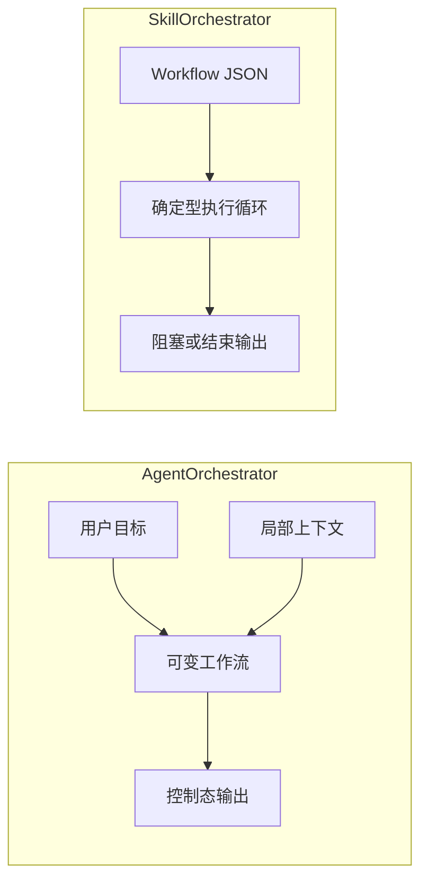

# Techne Loom

[English](README.md)

## 把两件常被混在一起的 agent 工作，拆成两个明确产品

> [!IMPORTANT]
> Techne Loom 不是在继续堆一个“全都能干一点”的 agent 框架。
> 它的核心设计是：把 **面向未知的顶层编排** 和 **面向确定执行的 skill 跟踪** 明确拆开。

Techne Loom 背后的核心判断很直接：大多数 agent 系统把两种完全不同的工作混在了一起。

1. 在地图还不完整的时候，边探索边决定路线。
2. 当一个 skill 已经进入执行阶段时，严格地知道下一步该干什么，并且别走偏。

Techne Loom 给这两件事分别命名、分别建产品、分别设计包、文档和调用方式。

## 为什么要做这个

很多基于 prompt 的编排，看起来很灵活，但一旦进入复杂场景就开始漂移。

- 顶层 agent 会过度依赖眼前还记得的局部上下文。
- skill 会把状态偷偷塞进 prompt、memory 和工具输出里。
- 工具调用、模型思考、人类输入、subagent 协作最后全挤在一个模糊表面上。
- 一旦你需要可恢复、可审计、可回放、可发布复用，这种体系就会越来越难信任。

Techne Loom 就是针对这个失败模式而设计的。

## 两个产品，不是一个产品的两种模式

| 产品 | 它是什么 | 它不是什么 | 主要接口 |
| --- | --- | --- | --- |
| `AgentOrchestrator` (`ao`) | 面向总 agent 的探索式编排产品 | 不是确定型 skill 执行器 | `MCP/stdio`，外加一个很薄的 CLI wrapper |
| `SkillOrchestrator` (`so`) | 面向 skill 的确定型 workflow 跟踪与下一步约束产品 | 不是开放式规划器 | 本地 CLI 与包契约 |

这个拆分不是包装词，而是方法论本体。

- **AO** 负责继续探索、试探、澄清、修正路线。
- **SO** 负责让一个 skill 一旦进入执行，就不再迷路。

两者可以共享低层约定，但它们不是一个父子运行时体系。

## 这套方式和常见做法有什么不同

| 问题 | 常见结果 | Techne Loom 的回答 |
| --- | --- | --- |
| 顶层 agent 在未知环境里规划 | 一边 improvisation，一边把状态搞丢 | AO 维护活的 workflow 和 append-only 事件历史 |
| skill 同时穿插工具、模型、MCP、subagent | skill 只能靠脆弱上下文硬撑 | SO 跑持久化 workflow，并在阻塞点返回严格下一步契约 |
| 跨生态复用 | 逻辑被锁死在单一 runtime 或仓库内部 | 每个项目单元都设计成可发布 package |
| 文档给人看但不能直接驱动生成 | 规范和实际调用脱节 | AO/SO 从一开始就为内建 guide surface 设计 |

## 核心承诺

Techne Loom 想做的，不是让 agent 看起来更聪明。
而是让 agent 系统在面对不确定性时，仍然具备可控的结构。

- **探索必须显式。**
- **执行必须可恢复。**
- **下一步提示必须足够严格。**
- **memory 必须进入 workflow context，而不是靠“氛围记忆”。**
- **每个项目单元都应该能作为包发布，而不是埋在仓库里做内部胶水。**

## 从第一天起就是 package-first

仓库会按生态维护平行包系。

| 角色 | NuGet | npm | PyPI |
| --- | --- | --- | --- |
| 抽象层 | `Techne.Loom.Abstractions` | `@techne-loom/abstractions` | `techne-loom-abstractions` |
| 公共层 | `Techne.Loom.Common` | `@techne-loom/common` | `techne-loom-common` |
| Agent 编排 | `Techne.Loom.AgentOrchestrator` | `@techne-loom/agent-orchestrator` | `techne-loom-agent-orchestrator` |
| Skill 编排 | `Techne.Loom.SkillOrchestrator` | `@techne-loom/skill-orchestrator` | `techne-loom-skill-orchestrator` |

这不是“一个核心运行时外面套三层壳”。
这是按角色平行展开的 package matrix。

## AO 一句话解释

AO 是给总 agent 用的：当路线还不清晰时，它负责边探索边细化 workflow，并在每个控制边界返回控制态信息。

它输出的重点不是长篇自然语言，而是：

- 成功/失败
- 当前 workflow 文件
- 当前节点编号
- 事件日志路径
- 结果文件路径
- 下一步候选或待满足条件

## SO 一句话解释

SO 是给 skill 用的：当 skill 不该继续 improvisation 时，它把执行重新拉回一个显式 workflow 上。

SO 设计成 `run-until-blocked-or-finished`。
也就是说，每次调用它，它都会尽量推进，直到：

- 整个流程完成
- 或者遇到必须由外界参与的边界

在阻塞点，它应该稳定返回：

- 当前 workflow 文件
- 当前节点编号
- 当前 step 类型
- 严格下一步提示
- `memory_for_next_step`
- 继续执行所需输入

这里最关键的是 `memory_for_next_step`。
SO 的设计目标之一，就是把相关 memory/context 写回 workflow state，并在每次阻塞返回时显式带出来，降低 skill 在外界继续执行时走偏的概率。

## 内建 Guide Surface

Techne Loom 的目标不是让使用者“自己翻仓库猜该怎么接”。

AO 和 SO 都会围绕内建 guide surface 来设计：

- `ao --guide`
- `so --guide`

这些 guide 不是普通 help，而是版本绑定、可离线、可直接给用户或模型消费的规范输出。

也就是说，未来应该能直接支持这样的使用方式：

> 根据 `so --guide` 里面描述，为我写一个 xxx 功能的 skill。

## 当前已经确定的仓库规则

- 根文档默认双语。
- 根 `README.md` 与 `README.zh-CN.md` 是旗舰 landing page。
- 根 `AGENTS.md` 与 `AGENTS.zh-CN.md` 负责仓库执行规则。
- 每个大切片做完后，都要先走 review-and-commit，再进入下一个切片。

当前仓库执行规则见：

- [AGENTS.md](AGENTS.md)
- [AGENTS.zh-CN.md](AGENTS.zh-CN.md)

## 当前阶段

这个仓库目前正处于“开源化落地”的分阶段推进里：

1. 先锁死根规则与文档节奏。
2. 先把双语 landing page 做出来。
3. 再补 docs 和 AO/SO guide 源文档。
4. 再搭平行 package 骨架。
5. 最后逐步抽出公开契约与运行时实现。

所以这份 README 的语气是刻意强定位的，而实现会按切片稳步跟上。

## 接下来会看到什么

- `/docs` 下的双语文档树
- AO / SO 的专门 guide 源文档
- `.NET`、Node.js、Python 三个生态的 package 骨架
- 更明确的 workflow、control、guide 契约
- 探索式编排和确定型 skill 执行的公开分层

## 方法论底色

Techne Loom 并不是靠假装“不确定性不存在”来赢。
它试图通过给“不确定性”和“确定执行”两件事分别配工具来赢。

这就是整个项目最核心的出发点。
