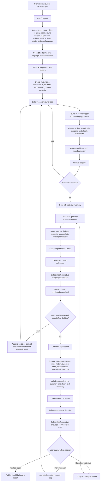

## Plan: loom-enhanced-research expanded workflow package

This plan expands the current workflow into a documentable package rather than a short checklist. It includes: a full Mermaid workflow, explicit node IDs, node-by-node descriptions, loop semantics, user-input rules, and mapping guidance for three document surfaces: the session plan itself, the future `SKILL.md` outline, and the demo planning document under `demos/loom-enhanced-research/1.Planning/`.

**Goals**
1. Preserve the current workflow shape exactly enough that the written plan matches the Mermaid.
2. Make every workflow node addressable through stable node IDs.
3. Treat every user-facing approval or form step as a structured-plus-freeform input checkpoint.
4. Keep the workflow understandable across three document surfaces: planning, future skill documentation, and demo planning.

**Workflow overview**
The workflow has five major bands:
1. Intake and setup
2. Bounded research execution
3. Material review and cherry-pick
4. Draft generation and draft review
5. Approval-driven branching to finalize, re-research, or re-select

**Full Mermaid**

**Node map: plan-level canonical meanings**
- `A` — Entry point where the user submits the research goal.
- `B` — Intake checkpoint for clarifying required workflow inputs.
- `B1` — Concrete confirmation of goal, seed inputs, budget, output root, evidence policy, demo mode, and user language.
- `B2` — Freeform native-language intake comments captured as first-class input.
- `C` — Output-root initialization step.
- `C1` — Artifact and ledger creation step.
- `D` — Start of the bounded research loop.
- `D1` — Per-round hypothesis and trigger capture.
- `D2` — Per-round action selection.
- `D3` — Evidence capture and round summary creation.
- `D4` — Ledger update step for structured persistence.
- `E` — Round-continuation decision point.
- `F` — Consolidation step that assembles the full material inventory.
- `G` — Material presentation stage for user inspection.
- `G1` — Detailed material-display contents.
- `H` — UI review entry point.
- `H1` — Structured user selections such as keep, reject, prioritize, or regroup.
- `H2` — Freeform native-language comments captured as first-class input.
- `H3` — Continuation payload emission step that merges structured selections and freeform comments.
- `I` — Decision point for whether another research pass is needed before draft generation.
- `J` — Seed-enrichment step that prepares another research pass from current selections and comments.
- `K` — Report-draft generation step.
- `K1` — Draft body assembly for conclusion, scope, evidence chain, and unresolved questions.
- `K2` — Draft section assembly for material-review summary and cherry-pick summary.
- `L` — Draft-review checkpoint focused on the written report draft.
- `L1` — Structured user review decision on the report draft.
- `L2` — Freeform native-language comments on the draft captured as first-class input.
- `M` — Post-review branch that decides the next workflow destination.
- `N` — Finalization and final Markdown publication.
- `O` — Explicit branch back to the bounded research loop.
- `P` — Explicit branch back to the cherry-pick loop.

**Node rules and responsibilities**
1. `B`, `H`, and `L` are the three user-critical checkpoint families.
2. `B2`, `H2`, and `L2` are mandatory, not optional; every user-facing review surface must accept native-language freeform comments.
3. Freeform text from `B2`, `H2`, and `L2` is first-class workflow input and must influence continuation, reselection, reframing, and final drafting when relevant.
4. `D` is the only loop that creates new evidence.
5. `P -> G` re-enters the material review/cherry-pick path without claiming new evidence was created.
6. `O -> D` re-enters bounded research and therefore must preserve explicit round rationale and budget semantics.
7. `L` reviews the report draft, not the raw material set.
8. `G` reviews the material set, not the report draft.

**Expanded step plan**
1. Define the skill mission as an end-to-end enhanced research workflow that supports iterative evidence building, user review, and iterative draft shaping.
2. Lock the intake contract around goal, seeds, depth, round budget, output root, evidence-retention policy, demo mode, user language, and freeform intake comments.
3. Define the artifact model at initialization: `data/`, `notes/`, `materials/`, `ui/`, `qa-pairs.txt`, `error-handling.txt`, and draft/report outputs.
4. Formalize the round loop as `D -> D1 -> D2 -> D3 -> D4 -> E`.
5. Define explicit stop/continue criteria at `E`.
6. Define the material inventory build at `F` and the presentation contract at `G/G1`.
7. Define the UI review contract at `H/H1/H2/H3`, including mandatory freeform native-language input.
8. Define the pre-draft re-research gate at `I/J`.
9. Define report-draft generation at `K/K1/K2`.
10. Define draft review at `L/L1/L2`.
11. Define the three-way approval branch at `M`: finalize, more research, or re-select materials.
12. Define loop-back semantics for `O -> D` and `P -> G` so the workflow cannot blur research and reselection responsibilities.
13. Use the node map directly in future documents to keep the prose and diagram synchronized.

**Document mapping: session plan**
The session plan should carry the workflow in four linked parts:
1. Full Mermaid using the canonical node IDs above.
2. Node map section with one description per node ID.
3. Node rules section that captures loop semantics and user-input rules.
4. Expanded step plan section that explains how to turn the diagram into implementation planning work.

**Document mapping: future SKILL.md outline**
The future `SKILL.md` should map the same node IDs into prose sections instead of embedding them only as an isolated diagram.
- `Mission` — explains the overall workflow outcome covered by `A` through `N`.
- `Inputs` — maps primarily to `B`, `B1`, and `B2`.
- `Setup` or early `Workflow` subsection — maps to `C` and `C1`.
- `Research Loop` subsection — maps to `D`, `D1`, `D2`, `D3`, `D4`, and `E`.
- `Material Review` subsection — maps to `F`, `G`, and `G1`.
- `UI Review Loop` subsection — maps to `H`, `H1`, `H2`, `H3`, `I`, and `J`.
- `Drafting` subsection — maps to `K`, `K1`, and `K2`.
- `Draft Review` subsection — maps to `L`, `L1`, `L2`, and `M`.
- `Outputs` — maps primarily to `N`, while also describing draft and intermediate artifacts created earlier.
- `Rules` — should explicitly reference node families when describing freeform-input requirements, loop boundaries, and the difference between research and reselection.

**Document mapping: demo planning document**
The demo planning document under `demos/loom-enhanced-research/1.Planning/` should use the same node IDs as a scenario walkthrough aid.
- Scenario entry should start at `A/B/B1` with a concrete research question.
- Scenario entry should include `B2` so freeform intake comments are exercised in the demo path.
- Demo setup notes should map to `C/C1`.
- Round walkthrough should enumerate at least one pass through `D -> E`.
- Material display notes should map to `F/G/G1`.
- Demo UI expectations should map to `H/H1/H2/H3`.
- Optional second-pass behavior should map to `I/J` and back to `D`.
- Draft walkthrough should map to `K/K1/K2`.
- Review and branching walkthrough should map to `L/L1/L2/M`.
- Final demo exit should map to `N`.

**Verification**
1. Verify that every Mermaid node has exactly one plan-level meaning.
2. Verify that every user-facing checkpoint includes mandatory freeform native-language input.
3. Verify that the prose step plan can be traced directly onto Mermaid node IDs.
4. Verify that the future `SKILL.md` outline can inherit the same node IDs without renaming them.
5. Verify that the demo planning doc can walk a scenario through the same node map without adding hidden steps.
6. Verify that the draft-review stage clearly reviews the report draft rather than the material inventory.
7. Verify that the re-research branch and re-select branch remain behaviorally distinct.

**Open design points worth confirming later**
1. Whether the UI review should show all materials by default on every re-entry to `P -> G`, or restore the last filtered selection state first.
2. Whether the research-loop jump from `M -> O` should require the user to state a concrete research gap explicitly, or allow the workflow to infer it from freeform comments.
3. Whether the final report should include raw native-language feedback excerpts, normalized summaries, or both.
