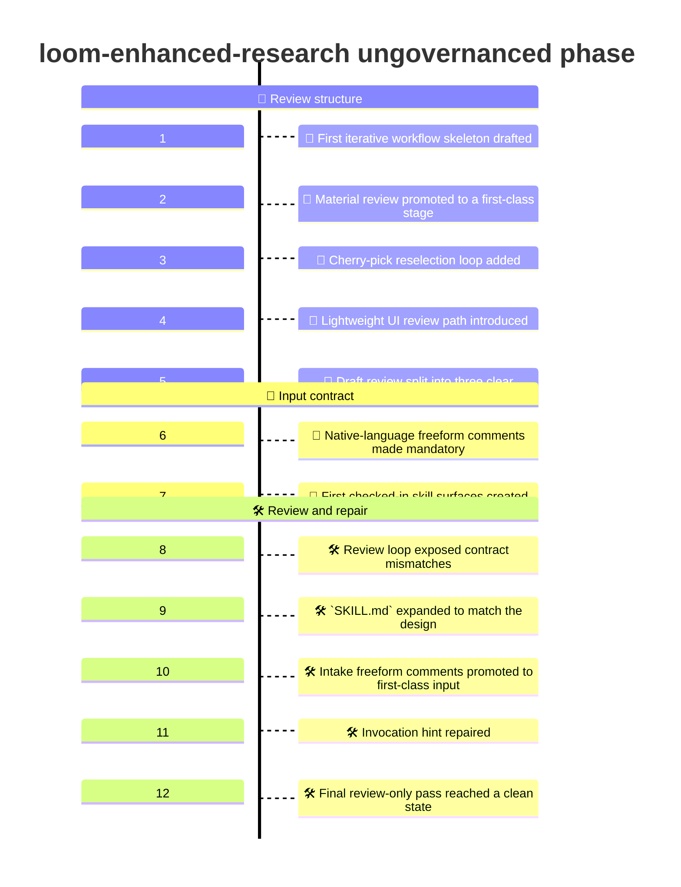
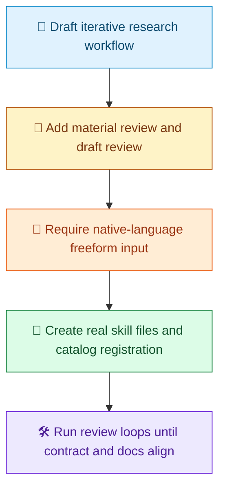

# Ungovernanced Demo Timeline

[中文](Readme.zh-CN.md) | [Demo Index](../README.md) | [中文索引](../README.zh-CN.md)

> [!NOTE]
> This document records how the first ungovernanced version of `loom-enhanced-research` was shaped in this repository.
> The point of this phase was not runtime governance. The point was to lock the workflow, user checkpoints, and public skill surfaces before introducing execution authority.

## At A Glance

| Area | Summary |
| --- | --- |
| Goal | Design the first real `loom-enhanced-research` skill surface |
| Phase | Execution slice only, intentionally non-governed |
| Entry point | `/loom-skill-enhancement  #file:loom-enhanced-research` |
| Main outcome | A stable workflow shape, stable node IDs, and checked-in skill registration |
| Deliberate non-goals | No SO runtime governance, no workflow JSON execution artifact, no locked runtime bundle |

## What We Ran

```text
/loom-skill-enhancement  #file:loom-enhanced-research
```

## Visual Timeline

> [!TIP]
> Mermaid itself supports `timeline` diagrams. Whether a given renderer shows this block correctly depends on the Mermaid version it bundles. On GitHub, you can check support with a small `info` diagram if needed.



## Phase Summary

Legend: `🧭` workflow shape, `💬` review stage, `📝` input rule, `📜` checked-in surface, `🛠️` review and repair.



## Detailed Timeline

### 1. First workflow skeleton drafted

The first version of the workflow was drafted as an iterative research flow:

1. clarify inputs
2. initialize ledgers and artifacts
3. run research rounds
4. build a material inventory
5. present materials to the user
6. let the user cherry-pick and comment
7. optionally run more rounds
8. generate a report draft
9. review the draft
10. finalize or loop again

This was the point where the skill stopped being just a concept and became a concrete process model.

### 2. Material review was promoted to a first-class stage

An early improvement was recognizing that the workflow needed two distinct review moments:

- review the gathered materials
- review the written draft

Without that split, user feedback would be too vague. The workflow would not know whether the user wanted new evidence, better selection, or better writing.

This produced the explicit `material review` stage before draft generation and the explicit `draft review` stage after draft generation.

### 3. Cherry-pick loop added

The next major refinement was adding a dedicated cherry-pick loop.

The user needed a way to do more than approve or reject. They needed a way to:

- re-select useful items
- deprioritize weak items
- add interpretation comments
- drive the next continuation step without restarting the whole process

That led to the explicit branch for returning to material reselection.

### 4. Simple UI review path added

The workflow then introduced a lightweight review UI concept.

This was not meant to be a polished product yet. It was meant to enforce a stronger workflow shape:

- show the gathered materials clearly
- collect structured selections
- collect freeform comments
- emit a continuation payload

This made the user interaction model more concrete than plain conversational prompts alone.

### 5. Draft-review branch improved

Another important correction was made at the draft-review stage.

Originally, the draft-review branch was too narrow. It did not cleanly separate the user's possible next actions. The branch was then refined so that draft review could lead to three distinct outcomes:

- finalize the report
- jump back to bounded research
- jump back to material reselection

That change made the workflow easier to reason about and easier to map into future execution paths.

### 6. Native-language freeform input became mandatory

One of the strongest workflow requirements emerged during iteration: every user checkpoint and every UI form must allow native-language freeform comments.

This rule was added because structured options alone were too brittle. The workflow needed to preserve the user's own language and intent as first-class input.

That requirement was then applied consistently to:

- material review
- draft review
- later, intake itself

### 7. First checked-in skill surfaces created

The next step was to turn the existing plan into actual repository artifacts.

The following files were created or updated:

- `.github/skills/loom-enhanced-research/SKILL.md`
- `.github/skills/loom-enhanced-research/contract.json`
- `.github/skills/.well-known/loom-enhanced-research/manifest.json`
- `.github/skills/.well-known/manifest.json`

At this point, the skill became a real repository surface instead of only a design draft.

### 8. Review loop found contract gaps

After the first implementation slice, a review-only loop was run against the changed files.

That review found several important inconsistencies:

- `user_language` existed in the contract but was not fully exposed in the skill-facing documentation
- the skill markdown was lighter than the intended workflow design promised
- the intake path did not yet fully model freeform input even though the workflow rules required it
- the top-level argument hint still lagged behind the final input contract

These were not cosmetic issues. They were real public-contract mismatches.

### 9. Skill markdown was expanded

To close those gaps, `SKILL.md` was strengthened with prose sections that matched the design more faithfully:

- `Setup`
- `Research Loop`
- `Material Review`
- `UI Review Loop`
- `Drafting`
- `Draft Review`

This brought the checked-in skill closer to the intended workflow shape instead of relying on the Mermaid alone.

### 10. Intake freeform comments added as first-class input

The next fix was deeper: intake itself was updated to support freeform native-language comments as first-class input.

This introduced the explicit `B2` step into the workflow.

That change was propagated through all relevant surfaces:

- the Mermaid flow
- the node map
- the skill `Inputs`
- the skill rules
- the contract inputs
- the checked-in workflow description

This was the point where the freeform-input rule became consistent from intake through final review.

### 11. Invocation hint repaired

One more review pass found a smaller but still real mismatch: the frontmatter argument hint did not yet mention intake comments.

That was fixed so the public invocation hint now matches the actual input contract.

### 12. Final review-only pass reached clean state

After the contract and documentation fixes, the review loop was rerun.

The final outcome of that review slice was:

- no material findings remaining
- catalog registration consistent
- manifest wiring consistent
- skill markdown consistent with the contract
- checked-in workflow description aligned with the final workflow shape

That made the slice review-ready as an ungovernanced design-and-registration implementation.

## What This Ungovernanced Phase Produced

| Produced in this phase | Why it mattered |
| --- | --- |
| A real skill entry point | The skill could be invoked as a concrete repository surface |
| A real contract file | Inputs and behavior expectations stopped being implicit |
| A real catalog registration | The skill became discoverable as part of the checked-in catalog |
| A stable Mermaid workflow | The process became readable and reviewable |
| Stable node IDs | Future evolution could preserve step identity |
| Separate material and draft reviews | User feedback became structurally clearer |
| A cherry-pick reselection loop | The user could redirect the run without a restart |
| Native-language freeform input end to end | The workflow preserved intent instead of forcing rigid choices |

## What This Phase Deliberately Did Not Do

> [!IMPORTANT]
> This slice intentionally stopped short of runtime-governed execution.
> The aim was to get the process shape right before binding it to execution authority.

| Not introduced yet | Why it was deferred |
| --- | --- |
| A governed workflow runtime | Governance was intentionally out of scope for this first slice |
| Runtime execution packages | Packaging authority was not the design focus yet |
| Workflow JSON execution artifacts | The workflow was still being stabilized conceptually |
| Locked execution channels | Package-locked execution belonged to the later governed phase |
| Runtime-owned audit directories | Audit ownership was deferred until runtime governance existed |

## Why This Timeline Matters

This demo is not just a file log. It shows the order in which the skill became coherent:

1. draft the iterative workflow
2. add user review loops
3. add first-class freeform input
4. turn the design into checked-in skill files
5. run review loops until the public contract is consistent

That is the key story of the ungovernanced phase.
