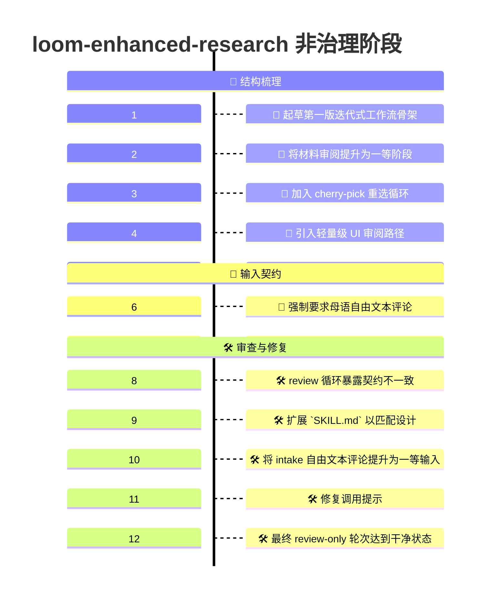
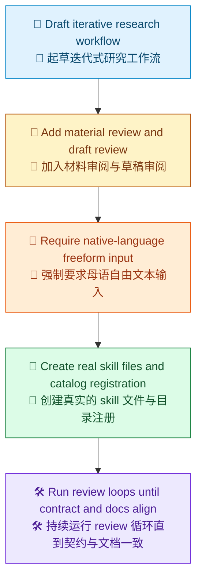

# 非治理阶段 Demo 时间线

[English](Readme.md) | [Demo 索引](../README.zh-CN.md) | [English Index](../README.md)

> [!NOTE]
> 本文记录了仓库中 `loom-enhanced-research` 第一版非治理形态是如何成形的。
> 这个阶段的重点不是 runtime 治理，而是在引入执行权之前，先锁定工作流、用户检查点和公开 skill 表面。

## 一览

| 区域 | 摘要 |
| --- | --- |
| 目标 | 设计第一个真正可落地的 `loom-enhanced-research` skill 表面 |
| 阶段 | 仅执行切片，刻意保持非治理 |
| 入口点 | `/loom-skill-enhancement  #file:loom-enhanced-research` |
| 主要结果 | 稳定的工作流形状、稳定的节点 ID，以及已检入的 skill 注册 |
| 明确非目标 | 不引入 SO runtime 治理，不产生 workflow JSON 执行产物，不锁定 runtime bundle |

## 本次运行内容

```text
/loom-skill-enhancement  #file:loom-enhanced-research
```

## 可视化时间线

> [!TIP]
> Mermaid 本身支持 `timeline` 图，但具体渲染器是否正确显示，取决于它所携带的 Mermaid 版本。如果需要，在 GitHub 上可以先用一个很小的 `info` 图检查支持情况。



## 阶段总结

图例：`🧭` 工作流形状，`💬` 审阅阶段，`📝` 输入规则，`📜` 已检入表面，`🛠️` 审查与修复。



## 详细时间线

### 1. 起草第一版工作流骨架

第一版工作流被起草为一个迭代式研究流：

1. 澄清输入
2. 初始化 ledger 与产物
3. 运行研究轮次
4. 构建材料清单
5. 将材料展示给用户
6. 让用户做 cherry-pick 并评论
7. 按需追加更多轮次
8. 生成报告草稿
9. 审阅草稿
10. 完成或再次循环

这一步让 skill 不再只是概念，而成为一个具体的流程模型。

### 2. 材料审阅被提升为一等阶段

一个早期改进是识别到工作流需要两个明确分开的审阅时刻：

- 审阅收集到的材料
- 审阅已经写出的草稿

如果没有这个拆分，用户反馈会过于模糊。工作流无法判断用户要的是新增证据、更好的材料筛选，还是更好的写作表达。

因此，在草稿生成之前加入了显式的 `material review` 阶段，在草稿生成之后加入了显式的 `draft review` 阶段。

### 3. 加入 cherry-pick 循环

下一个重要细化，是加入专门的 cherry-pick 循环。

用户需要的不只是批准或拒绝，还需要能够：

- 重新选择有价值的材料
- 降低弱材料优先级
- 增加解释性评论
- 在不重启整个流程的情况下驱动下一步续跑

这直接催生了返回材料重选的显式分支。

### 4. 加入简洁的 UI 审阅路径

随后，工作流引入了一个轻量级的审阅 UI 概念。

它的目的不是立刻做成一个打磨完成的产品，而是为了强制工作流拥有更扎实的交互形状：

- 清晰展示已收集的材料
- 收集结构化选择
- 收集自由文本评论
- 输出 continuation payload

这让用户交互模型比单纯的会话式提示更具体。

### 5. 草稿审阅分支得到改进

草稿审阅阶段还做过一次重要修正。

最初的分支过于狭窄，没有把用户可能的后续动作清楚分开。后来被细化为三个明确结果：

- 直接定稿
- 跳回有边界的研究轮次
- 跳回材料重选

这让工作流更容易推理，也更容易映射到后续执行路径。

### 6. 母语自由文本输入成为强制要求

在迭代过程中，逐渐形成了一条强约束：每个用户检查点和每个 UI 表单，都必须允许母语自由文本评论。

加入这个规则，是因为纯结构化选项过于脆弱。工作流必须把用户自己的语言和意图保留为一等输入。

这个要求后来被一致应用到：

- 材料审阅
- 草稿审阅
- 以及后来的 intake 本身

### 7. 第一批已检入的内置 skill 表面被创建

下一步，是把已有的计划真正落成仓库内置 skill 产物。

创建或更新的文件包括：

- `.agents/skills/loom-enhanced-research/SKILL.md`
- `.agents/skills/loom-enhanced-research/contract.json`
- `.agents/skills/.well-known/loom-enhanced-research/manifest.json`
- `.agents/skills/.well-known/manifest.json`

从这一点开始，这个 skill 不再只是设计草稿，而成为了真实的仓库内置表面。

### 8. review 循环发现契约缺口

第一轮实现完成后，针对改动文件运行了一次 review-only 循环。

这次 review 暴露出若干重要不一致：

- `user_language` 已存在于 contract 中，但没有在面向 skill 的文档里完整公开
- skill markdown 的信息密度低于原始工作流设计承诺
- intake 路径还没有完整建模自由文本输入，尽管工作流规则已经要求它必须存在
- 顶层 argument hint 仍然落后于最终输入契约

这些都不是表面问题，而是真实的公共契约不匹配。

### 9. 扩展 skill markdown

为了补上这些缺口，`SKILL.md` 被补强为更贴近设计的 prose 结构：

- `Setup`
- `Research Loop`
- `Material Review`
- `UI Review Loop`
- `Drafting`
- `Draft Review`

这样，已检入的 skill 文档不再只依赖 Mermaid 承载设计含义。

### 10. Intake 自由文本评论被提升为一等输入

下一次修复更深入：intake 本身被更新为支持母语自由文本评论，并把它视为一等输入。

这引入了显式的 `B2` 步骤。

对应变更被同步传播到所有相关表面：

- Mermaid 流程图
- 节点映射
- skill 的 `Inputs`
- skill 规则
- contract 输入
- 已检入的工作流描述

从这一点开始，自由文本输入规则从 intake 到最终审阅都保持一致。

### 11. 调用提示被修复

又一轮 review 发现一个较小但仍然真实的不匹配：frontmatter 里的 argument hint 还没有提到 intake comments。

这个问题随后被修复，使公开调用提示与真实输入契约保持一致。

### 12. 最终 review-only 轮次达到干净状态

在契约与文档修复完成后，review 循环再次运行。

这一轮的最终结果是：

- 不再有实质性发现
- 目录注册一致
- manifest 连接一致
- skill markdown 与 contract 一致
- 已检入的工作流描述与最终工作流形状对齐

这使得该切片可以作为一个非治理的设计与注册实现进入 review-ready 状态。

## 这个非治理阶段产出了什么

| 本阶段产物 | 重要性 |
| --- | --- |
| 一个真实的 skill 入口点 | skill 可以作为具体的仓库表面被调用 |
| 一个真实的 contract 文件 | 输入和行为预期不再隐含 |
| 一个真实的 catalog 注册 | skill 成为已检入目录中的可发现对象 |
| 一个稳定的 Mermaid 工作流 | 过程变得可阅读、可审阅 |
| 稳定的节点 ID | 后续演化可以保留步骤身份 |
| 拆分后的材料审阅与草稿审阅 | 用户反馈结构更清楚 |
| 一个 cherry-pick 重选循环 | 用户可以在不重启的情况下重定向运行 |
| 端到端的母语自由文本输入 | 工作流保留意图，而不是强迫刚性选择 |

## 这个阶段刻意没有做什么

> [!IMPORTANT]
> 这个切片有意停在 runtime 治理之前。
> 目标是在绑定执行权之前，先把流程形状做对。

| 尚未引入的内容 | 为什么延后 |
| --- | --- |
| 治理化工作流 runtime | 第一个切片刻意不把治理纳入范围 |
| runtime 执行包 | package 权威当时还不是设计重点 |
| workflow JSON 执行产物 | 工作流仍处于概念稳定化阶段 |
| 锁定的执行 channel | package-lock 执行属于后续治理阶段 |
| runtime-owned 审计目录 | 审计归属要等 runtime 治理存在后再确定 |

## 为什么这条时间线重要

这个 demo 不只是一个文件日志，它展示了 skill 如何按顺序变得自洽：

1. 起草迭代式工作流
2. 加入用户审阅循环
3. 加入一等自由文本输入
4. 将设计落成已检入的 skill 文件
5. 运行 review 循环直到公共契约一致

这就是非治理阶段的关键故事。
