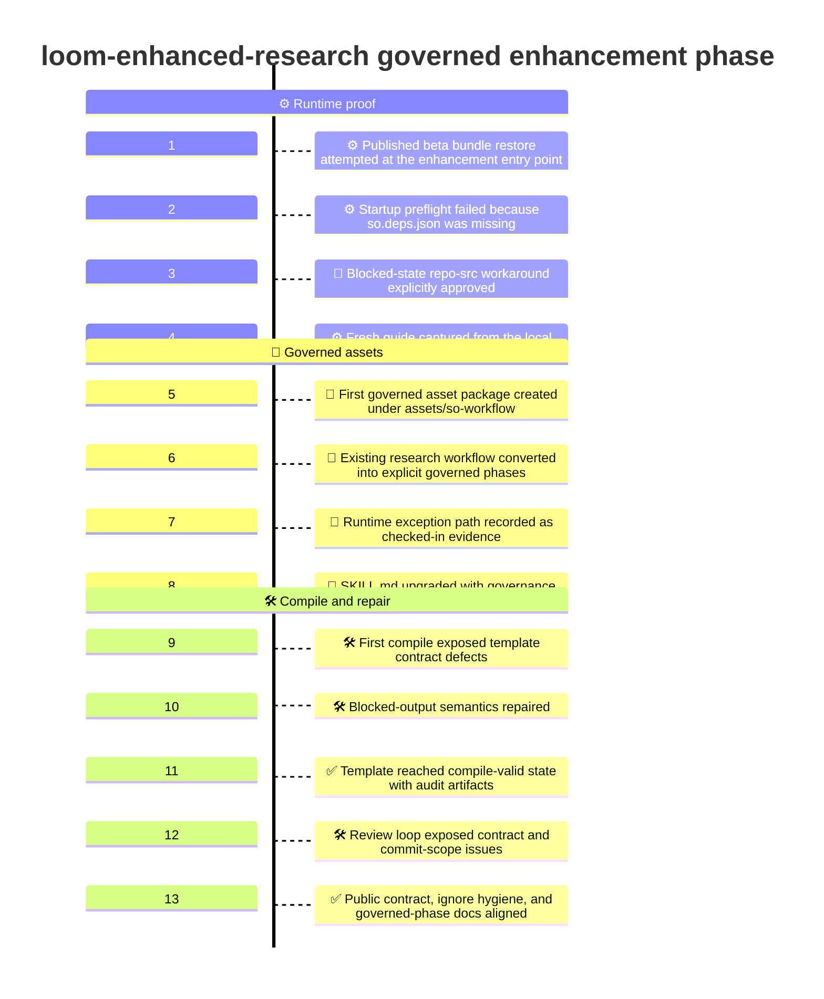
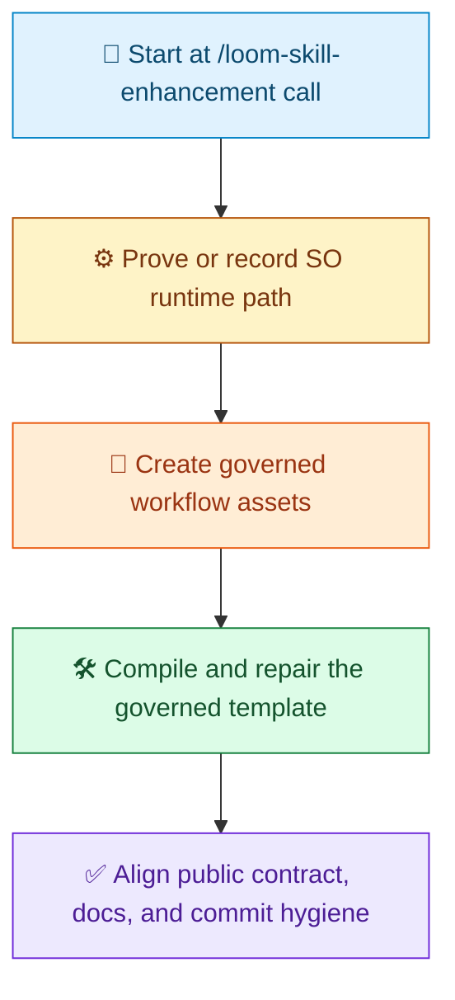

# Governed Enhancement Timeline

[中文](Readme.zh-CN.md) | [Demo Index](../README.md) | [中文索引](../README.zh-CN.md)

> [!NOTE]
> This document records how the first governed enhancement of `loom-enhanced-research` was shaped in this repository.
> The point of this phase was to start at the `/loom-skill-enhancement` call, introduce governed workflow assets, prove the runtime path, and keep the already-designed research behavior intact while moving the skill onto an SO-governed execution scaffold.

## At A Glance

| Area | Summary |
| --- | --- |
| Goal | Convert the checked-in `loom-enhanced-research` design slice into a first SO-governed target-skill slice |
| Phase | First governed enhancement pass |
| Entry point | `/loom-skill-enhancement  #file:loom-enhanced-research` |
| Main outcome | Governed asset package, runtime-proof lineage, and compile-valid SO template |
| Deliberate non-goals | No redesign of the business workflow, no normalization of repo-src runtime as the future default path |

## What We Ran

```text
/loom-skill-enhancement  #file:loom-enhanced-research
```

## Visual Timeline

> [!TIP]
> Mermaid itself supports `timeline` diagrams. Whether a given renderer shows this block correctly depends on the Mermaid version it bundles. On GitHub, you can check support with a small `info` diagram if needed.



## Phase Summary

Legend: `🧭` entry point, `⚙️` runtime proof, `📜` governed assets, `🛠️` compile and repair, `✅` public alignment.



## Detailed Timeline

### 1. Published beta bundle restore was attempted at the enhancement entry point

This phase begins at the actual enhancement call, not at the earlier design work.

The intended normal runtime path for the governed enhancement was the published beta SO package bundle bound to version `0.2.118-beta`.

At this stage, the enhancement flow did not yet edit the target skill. It first had to satisfy the runtime-proof gate required by `/loom-skill-enhancement`.

### 2. Startup preflight failed because `so.deps.json` was missing

The full published bundle was restored for:

- `Techne.Loom.SkillOrchestrator`
- `Techne.Loom.Common`
- `Techne.Loom.Abstractions`

The restore itself succeeded, but package-channel startup preflight failed because the extracted published bundle did not contain `so.deps.json`.

That immediately blocked the normal package-channel proof path.

### 3. A blocked-state repo-src workaround was explicitly approved

Because the published path was blocked, an explicit user-approved last-resort workaround was used for this enhancement pass:

- build the local repo source for `Techne.Loom.SkillOrchestrator`
- use that local runtime only as a blocked-state enhancement-pass workaround
- do not normalize that workaround into the future default path

This distinction became part of the governed slice itself rather than being left as an untracked execution note.

### 4. A fresh guide was captured from the local workaround runtime

After the local build succeeded, a fresh `dotnet so.dll --guide` result was exported from the repo-source runtime.

That guide became the authority surface for the rest of this enhancement pass.

This was the point where the enhancement flow could legally proceed into governed asset authoring.

### 5. The first governed asset package was created under `assets/so-workflow/`

The target skill then received its first SO asset package:

- `skill-plan.md`
- `so-package-lock.json`
- `so-template.json`
- `node-to-file-map.md`

These files were introduced together because the governed slice needed more than an updated markdown description. It needed a checked-in workflow package.

### 6. The existing research workflow was converted into explicit governed phases

The governed plan retained the already-defined business semantics and expressed them as explicit phases:

1. runtime proof
2. intake
3. setup
4. bounded research loop
5. material review
6. draft generation
7. draft review
8. final publication

This was the point where the earlier process model became a governed workflow package instead of only a skill description.

### 7. The runtime exception path was recorded as checked-in evidence

A key part of this phase was not hiding the runtime failure.

The governed lock and workflow assets explicitly recorded:

- the published-package preflight failure
- the missing `so.deps.json`
- the explicit approval of the repo-src workaround
- the workaround runtime directory
- the fresh guide exported from that workaround runtime

That made the blocked-state lineage part of the governed artifact set.

### 8. `SKILL.md` was upgraded with governance wording and asset references

The target `SKILL.md` was then updated so it no longer described only the business workflow.

It now also states:

- the governed asset paths
- the authoritative workflow template path
- the authoritative runtime lock path
- the normal SO CLI governance path
- the external runtime workflow copy rule
- the blocked-state-only workflow JSON edit rule
- the enhancement-pass workaround note for the missing `so.deps.json` case

### 9. The first compile exposed governed-template contract defects

The first compile attempt did not pass cleanly.

The early failures included:

- undeclared user-owned fields for review payloads
- blocked-gate placement on the wrong transition kinds
- route and gate mismatches for blocked boundaries

These were repaired directly in the governed template instead of being left as known defects.

### 10. Blocked-output semantics were repaired

After the first repair set, compile still found a narrower issue:

- the runtime-exception wait boundary was satisfying a blocked gate
- but it was publishing those required gate outputs as normal outputs instead of blocked outputs

That mismatch was fixed so the blocked exception route matched the governed semantics precisely.

### 11. The template reached compile-valid state with audit artifacts

After the template repairs, `dotnet so.dll compile` succeeded and emitted audit artifacts for the governed target skill.

The compile artifacts produced for this slice included:

- `workflow.mermaid.md`
- `workflow.html`
- `workflow.json`
- `workflow.analysis.json`

This was the first compile-valid SO-governed workflow template for `loom-enhanced-research`.

### 12. The review loop exposed contract and commit-scope issues

The follow-up review loop then found two remaining quality gaps:

- the public contract under-declared the completion-manifest outputs compared with the governed template
- the commit scope still carried `.temp/` runtime noise and this governed-phase demo file was still only a placeholder

These were not workflow-shape failures. They were slice-quality and commit-readiness issues.

### 13. Public contract, ignore hygiene, and governed-phase docs were aligned

To close those gaps:

- `contract.json` was updated to declare both completion-manifest outputs
- the workflow template reserved both completion-manifest runtime-owned fields explicitly
- `.gitignore` was updated to ignore `.temp/`
- this document was rewritten as a real governed-phase timeline

That brought the governed source-only slice into a commit-ready state.

## What This Governed Phase Produced

| Produced in this phase | Why it mattered |
| --- | --- |
| `assets/so-workflow/skill-plan.md` | Turned the governed intent into a checked-in execution plan |
| `assets/so-workflow/so-package-lock.json` | Bound the runtime version and recorded the enhancement-pass exception evidence |
| `assets/so-workflow/so-template.json` | Created a compile-valid governed workflow template |
| `assets/so-workflow/node-to-file-map.md` | Linked workflow nodes to governed files and runtime outputs |
| Updated `SKILL.md` governance wording | Exposed the governed path publicly instead of hiding it in internal artifacts |
| Compile audit lineage | Proved the first governed template actually compiled |
| `.gitignore` support for `.temp/` | Prevented runtime-generated audit noise from polluting commit scope |

## What This Phase Deliberately Did Not Do

> [!IMPORTANT]
> This slice introduced governance, but it did not redesign the target skill’s business behavior and it did not normalize the repo-src workaround into the long-term execution path.

| Not changed in this phase | Why it stayed stable |
| --- | --- |
| The underlying research behavior | The goal was governance wrapping, not process redesign |
| The first-class intake comment rule | It was already part of the accepted skill behavior |
| The separation between material review and draft review | It remained a core business invariant |
| The rule that only the research loop creates new evidence | Governance had to preserve that boundary |
| The blocked-state nature of the repo-src workaround | It was recorded as an exception, not normalized as the future default |

## Why This Timeline Matters

This demo is not just a note that SO files were added. It shows the order in which the governed slice became credible:

1. start at the actual `/loom-skill-enhancement` call
2. prove or explicitly record the runtime path
3. create governed assets instead of only prose
4. compile and repair the governed template until it validates
5. align public contract, docs, and commit hygiene

That is the key story of the first enhancement from the ungovernanced design slice into an SO-governed execution scaffold.
