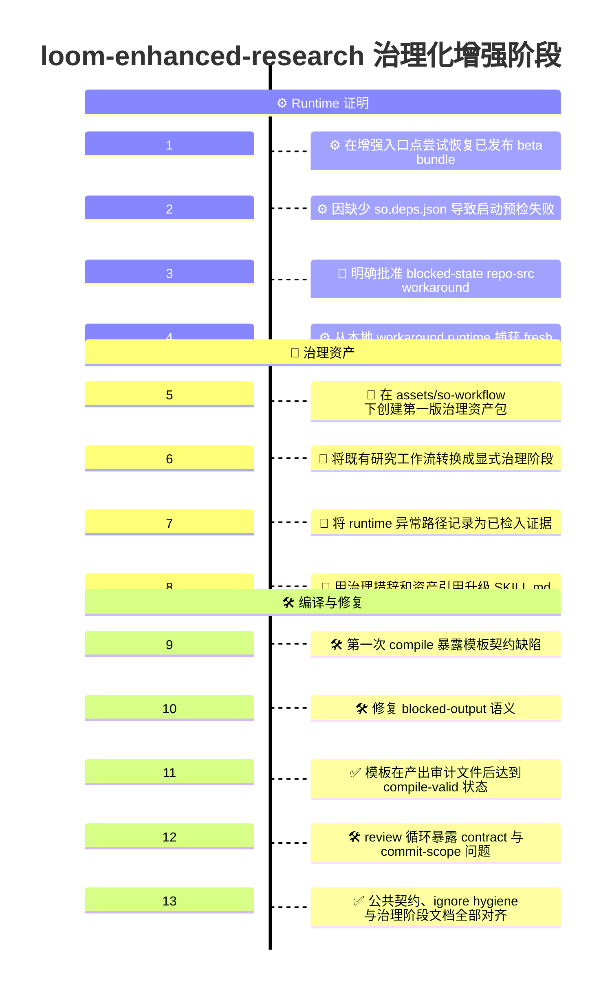
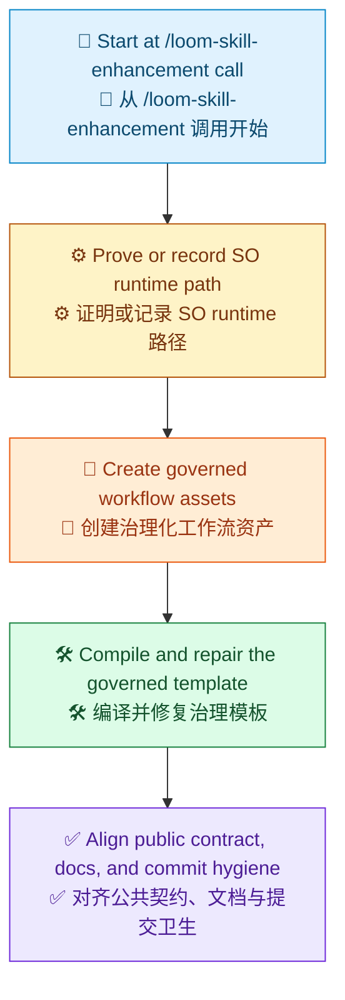

# 治理化增强阶段时间线

[English](Readme.md) | [Demo 索引](../README.zh-CN.md) | [English Index](../README.md)

> [!NOTE]
> 本文记录了仓库中 `loom-enhanced-research` 第一次治理化增强是如何成形的。
> 这个阶段的重点，是从 `/loom-skill-enhancement` 调用开始，引入治理化工作流资产、证明 runtime 路径，并在保持既有研究行为不变的前提下，把 skill 推上 Loom-governanced 执行脚手架。

## 一览

| 区域 | 摘要 |
| --- | --- |
| 目标 | 将已检入的 `loom-enhanced-research` 设计切片转换成第一个 Loom-governanced target-skill 切片 |
| 阶段 | 第一次治理化增强 |
| 入口点 | `/loom-skill-enhancement  #file:loom-enhanced-research` |
| 主要结果 | 治理资产包、runtime 证明链路，以及可通过 compile 的 SO 模板 |
| 明确非目标 | 不重构业务工作流，不把 repo-src runtime 固化成未来默认路径 |

## 本次运行内容

```text
/loom-skill-enhancement  #file:loom-enhanced-research
```

## 可视化时间线

> [!TIP]
> Mermaid 本身支持 `timeline` 图，但具体渲染器是否正确显示，取决于它所携带的 Mermaid 版本。如果需要，在 GitHub 上可以先用一个很小的 `info` 图检查支持情况。



## 阶段总结

图例：`🧭` 入口点，`⚙️` runtime 证明，`📜` 治理资产，`🛠️` 编译与修复，`✅` 公共对齐。



## 详细时间线

### 1. 在增强入口点尝试恢复已发布 beta bundle

这个阶段从真实的增强调用开始，而不是从更早的设计工作开始。

治理化增强的正常 runtime 路径，原本是绑定到 `0.2.118-beta` 的已发布 beta SO package bundle。

在这一阶段，增强流程还没有立刻编辑 target skill，而是必须先满足 `/loom-skill-enhancement` 所要求的 runtime-proof gate。

### 2. 因缺少 `so.deps.json` 导致启动预检失败

完整的已发布 bundle 被恢复用于：

- `Techne.Loom.SkillOrchestrator`
- `Techne.Loom.Common`
- `Techne.Loom.Abstractions`

恢复本身成功了，但 package-channel 启动预检失败，因为提取出来的已发布 bundle 里缺少 `so.deps.json`。

这立即阻断了正常的 package-channel 证明路径。

### 3. 明确批准 blocked-state repo-src workaround

由于已发布路径被阻塞，这次增强采用了明确获得用户批准的兜底 workaround：

- 构建本地 repo 源码中的 `Techne.Loom.SkillOrchestrator`
- 仅将该本地 runtime 用作本次增强的 blocked-state workaround
- 不把这个 workaround 正常化为未来默认路径

这个区分被写进治理切片本身，而不是变成未跟踪的执行笔记。

### 4. 从本地 workaround runtime 捕获 fresh guide

在本地构建成功后，从 repo-source runtime 成功运行不带参数的 `dotnet so.dll --guide`，解析 JSON 结果并记录返回的 guide 路径。

这份 guide 成为本次增强剩余阶段的权威表面。

也正是在这里，增强流程才获得合法进入治理资产编写的资格。

### 5. 在 `assets/so-workflow/` 下创建第一版治理资产包

随后，target skill 获得了第一版 SO 资产包：

- `skill-plan.md`
- `so-package-lock.json`
- `so-template.json`
- `node-to-file-map.md`

这些文件必须一起引入，因为治理切片不能只停留在更新 markdown 描述，还必须拥有已检入的工作流包。

### 6. 将既有研究工作流转换成显式治理阶段

治理计划保留了原有的业务语义，并将其表达为显式阶段：

1. runtime proof
2. intake
3. setup
4. bounded research loop
5. material review
6. draft generation
7. draft review
8. final publication

从这一点开始，早先的流程模型变成了治理化工作流包，而不再只是 skill 描述。

### 7. 将 runtime 异常路径记录为已检入证据

这个阶段的关键之一，是没有掩盖 runtime 失败。

治理 lock 与 workflow 资产明确记录了：

- 已发布 package 预检失败
- 缺失 `so.deps.json`
- 对 repo-src workaround 的显式批准
- workaround runtime 目录
- 从 workaround runtime 捕获的 fresh guide 路径

这让 blocked-state 的来源链路成为治理产物集合的一部分。

### 8. 用治理措辞和资产引用升级 `SKILL.md`

接着，target `SKILL.md` 被更新，不再只描述业务工作流。

它现在还会明确声明：

- 治理资产路径
- 权威 workflow template 路径
- 权威 runtime lock 路径
- 正常 SO CLI 治理路径
- 外部 runtime workflow copy 规则
- blocked-state-only 的 workflow JSON 编辑规则
- 面向缺少 `so.deps.json` 场景的增强轮 workaround 说明

### 9. 第一次 compile 暴露治理模板契约缺陷

第一次 compile 并没有顺利通过。

早期失败项包括：

- review payload 中缺失声明的 user-owned 字段
- blocked gate 被放在了错误的 transition 类型上
- blocked boundary 的 route 与 gate 存在不匹配

这些问题都被直接修进治理模板，而不是以“已知缺陷”形式遗留。

### 10. 修复 blocked-output 语义

在第一轮修复后，compile 仍然发现一个更窄的问题：

- runtime-exception wait boundary 满足了一个 blocked gate
- 但它却把所需 gate 输出发布成 normal outputs，而不是 blocked outputs

这个不匹配被修正，确保 blocked exception route 与治理语义精确一致。

### 11. 模板达到 compile-valid 状态并产出审计文件

在模板修复完成后，`dotnet so.dll compile` 成功运行，并为治理 target skill 产出审计文件。

这一轮 compile 生成的产物包括：

- `workflow.mermaid.md`
- `workflow.html`
- `workflow.json`
- `workflow.analysis.json`

这成为 `loom-enhanced-research` 第一版 compile-valid 的 Loom-governanced 工作流模板。

### 12. review 循环暴露 contract 与 commit-scope 问题

后续 review 循环又发现了两个剩余质量缺口：

- 与治理模板相比，公共 contract 对 completion-manifest outputs 的声明不足
- commit scope 里仍然混入了 `.temp/` runtime 噪音，而这份治理阶段 demo 文档本身也仍是占位稿

这些并不是工作流形状问题，而是切片质量与提交就绪性问题。

### 13. 公共契约、ignore hygiene 与治理阶段文档全部对齐

为了收拢这些缺口：

- `contract.json` 被更新，以声明两个 completion-manifest outputs
- workflow template 显式预留了这两个 completion-manifest runtime-owned 字段
- `.gitignore` 被更新为忽略 `.temp/`
- 这份文档被重写成真正的治理阶段时间线

至此，这个仅包含治理源码的切片进入 commit-ready 状态。

## 这个治理阶段产出了什么

| 本阶段产物 | 重要性 |
| --- | --- |
| `assets/so-workflow/skill-plan.md` | 将治理意图落成已检入执行计划 |
| `assets/so-workflow/so-package-lock.json` | 绑定 runtime 版本并记录增强轮例外证据 |
| `assets/so-workflow/so-template.json` | 创建了可 compile 的治理工作流模板 |
| `assets/so-workflow/node-to-file-map.md` | 将工作流节点与治理文件、runtime 输出关联起来 |
| 升级后的 `SKILL.md` 治理措辞 | 让治理路径在公共表面上明确可见，而不是藏在内部产物里 |
| compile 审计链路 | 证明第一版治理模板确实可以编译 |
| `.gitignore` 对 `.temp/` 的支持 | 防止 runtime 生成的审计噪音污染 commit scope |

## 这个阶段刻意没有做什么

> [!IMPORTANT]
> 这个切片引入了治理，但并没有重构 target skill 的业务行为，也没有把 repo-src workaround 正常化为长期执行路径。

| 本阶段未改变的内容 | 为什么保持不变 |
| --- | --- |
| 底层研究行为 | 目标是治理封装，而不是流程重设计 |
| intake 一等评论规则 | 它已经是既定 skill 行为的一部分 |
| 材料审阅与草稿审阅的分离 | 这是核心业务不变量 |
| 只有研究循环能产生新证据的规则 | 治理必须保留这条边界 |
| repo-src workaround 的 blocked-state 性质 | 它被记录为例外，而不是未来默认路径 |

## 为什么这条时间线重要

这个 demo 不只是说明 SO 文件被加进来了。它展示了治理切片如何按顺序变得可信：

1. 从真实的 `/loom-skill-enhancement` 调用开始
2. 证明或明确记录 runtime 路径
3. 创建治理资产，而不是只写 prose
4. 持续编译和修复治理模板直到通过校验
5. 对齐公共契约、文档和提交卫生

这就是从非治理设计切片进入 Loom-governanced 执行脚手架的第一段关键故事。
