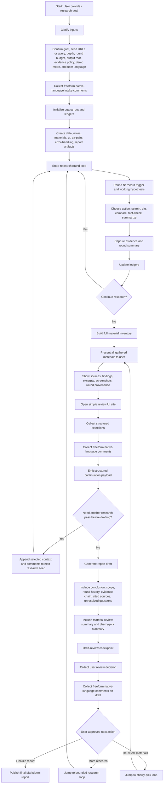

# /loom-enhanced-research

End-to-end enhanced research skill for iterative evidence gathering, user review, and draft shaping.

## Governed Assets

- `assets/so-workflow/skill-plan.md`
- `assets/so-workflow/so-template.json`
- `assets/so-workflow/so-package-lock.json`
- `assets/so-workflow/node-to-file-map.md`

## Mission

This skill turns a research goal into a bounded, reviewable workflow. It clarifies the request, runs explicit research rounds, preserves evidence and user input, presents gathered materials for review, collects structured and freeform comments through a simple UI path, generates a draft report, and lets the user either finalize, request more research, or re-select existing materials before the final report is published.

This skill is now governed through Loom Skill Orchestrator workflow assets. Ordinary workflow operations stay on the `dotnet so.dll --guide`, `dotnet so.dll compile`, `dotnet so.dll run`, and `dotnet so.dll resume` path.

## Inputs

- final research goal
- optional seed query or seed URLs
- maximum depth for this run
- maximum round count for this run
- optional output root
- evidence-retention policy
- optional demo mode flag
- optional user language for review surfaces and report output
- optional native-language intake comments as first-class input

## Workflow

## Setup

The workflow starts by clarifying the research goal and the run contract. At this stage the skill confirms the goal, optional seeds, depth, round budget, output root, evidence policy, demo mode, and optional user language. Intake also includes freeform native-language comments as first-class input rather than treating them as side notes. It then creates the working artifacts needed for the rest of the run, including ledgers, materials, UI artifacts, and report outputs.

## Research Loop

The research loop is the only part of the workflow that may create new evidence. Each round records a trigger, a working hypothesis, the chosen action, the evidence gathered, and the next-step decision. The loop continues only while the remaining budget and evidence state justify another pass.

## Material Review

When bounded research stops, the workflow builds a full material inventory and presents it to the user. This stage is for inspecting gathered evidence rather than reviewing the written report draft. The material presentation should preserve provenance so the user can see where items came from and why they were retained.

## UI Review Loop

After materials are presented, the workflow opens a simple review UI path. The user can make structured selections and also provide freeform comments in their native language. Both the structured selections and the freeform comments are preserved as first-class input and merged into the continuation payload. If the user wants another research pass before drafting, the workflow uses that payload to seed the next bounded research loop.

## Drafting

When the workflow is ready to leave evidence gathering, it generates a report draft. That draft includes the conclusion, scope, round history, evidence chain, cited sources, unresolved questions, and the summary of material review and cherry-pick decisions.

## Draft Review

The draft-review stage is distinct from material review. Here the user reviews the written report draft, not the raw evidence set. The user can provide a structured decision plus freeform native-language comments, after which the workflow branches to one of three destinations: finalize the report, return to bounded research, or return to material reselection.

## Node Map

- `A` entry point for the user research goal
- `B` input clarification checkpoint
- `B1` confirmation of goal, seeds, budget, output root, evidence policy, demo mode, and user language
- `B2` freeform native-language intake comments as first-class input
- `C` output-root initialization
- `C1` ledger and artifact creation
- `D` bounded research loop start
- `D1` round trigger and hypothesis capture
- `D2` round action selection
- `D3` evidence capture and round summary creation
- `D4` ledger update step
- `E` continue-or-stop research decision
- `F` full material inventory build
- `G` material presentation stage
- `G1` detailed material display contents
- `H` review UI entry point
- `H1` structured user selections
- `H2` freeform native-language comments as first-class input
- `H3` continuation payload emission
- `I` pre-draft re-research decision
- `J` next-round seed enrichment
- `K` report draft generation
- `K1` core draft assembly
- `K2` review-summary assembly
- `L` draft-review checkpoint
- `L1` structured draft review decision
- `L2` freeform native-language draft comments as first-class input
- `M` post-review branch decision
- `N` final report publication
- `O` branch back to bounded research
- `P` branch back to material reselection

## Rules

- Every ask-user checkpoint must support both structured choices and freeform native-language comments.
- Every user-facing review step must support both structured choices and freeform native-language comments.
- Freeform native-language comments are first-class workflow input and must be preserved in the run ledger.
- Only the research loop may create new evidence.
- Returning to `P` reopens material review and reselection without claiming new evidence.
- Returning to `O` re-enters bounded research and must preserve explicit round rationale and budget limits.
- The draft-review stage reviews the written report draft, not the raw material inventory.

## SO Governance

- The authoritative workflow template for governed execution is `assets/so-workflow/so-template.json`.
- The authoritative Loom Skill Orchestrator runtime version lock is `assets/so-workflow/so-package-lock.json`.
- Routine governed execution restores the exact locked runtime bundle first and should prefer published SO package artifacts as the normal path.
- Every official run starts from a fresh external runtime workflow copy derived from the checked-in template, and `resume` continues against that same persisted runtime copy.
- The checked-in workflow template is not mutated in place during official runs.
- Direct workflow JSON edits are blocked-state-only emergency workarounds and must immediately return to the SO CLI path.
- Windows PowerShell 5.1 package-channel restores must treat `.nupkg` as ZIP content and must not use `Expand-Archive` directly on the `.nupkg`.
- When Windows PowerShell 5.1 uses `Invoke-WebRequest` or `Invoke-RestMethod` for package-channel HTTP probes, add `-UseBasicParsing`.
- Failed runtime startup-contract checks or failed guide execution must never be recorded as successful runtime proof.
- For this first enhancement pass, the published `0.2.118-beta` bundle restored successfully but package-channel startup preflight failed because `so.deps.json` was missing from the extracted published bundle.
- A repo-source debug runtime was used only as an explicitly approved blocked-state workaround for this enhancement pass and is not the normal governed execution path for future runs.

## Outputs

- material inventory
- round trail and ledger updates
- structured continuation payloads from user review
- report draft with material review summary and cherry-pick summary
- final Markdown report
- runtime-owned completion manifest that references governed source assets and final report outputs

## Planning Source

- Current workflow planning draft: `demos/loom-enhanced-research/1.Planning/plan-loomEnhancedResearch.prompt.md`