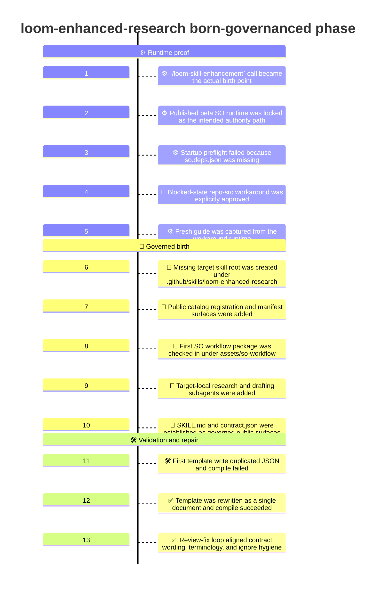
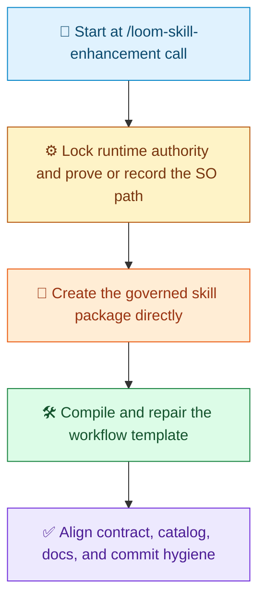

# Born-governanced Demo Timeline

[中文](Readme.zh-CN.md) | [Demo Index](../README.md) | [中文索引](../README.zh-CN.md)

> [!NOTE]
> This document records how the first born-governanced version of `loom-enhanced-research` was shaped in this repository.
> The point of this phase was to create the checked-in skill directly as an SO-governed target skill instead of first landing a separate checked-in ungovernanced skill slice.

## At A Glance

| Area | Summary |
| --- | --- |
| Goal | Create the first checked-in `loom-enhanced-research` skill surface directly as an SO-governed target skill |
| Phase | First born-governanced creation pass |
| Entry point | `/loom-skill-enhancement     Start implementation    #file:plan-loomEnhancedResearch.prompt.md` |
| Main outcome | Governed skill package, catalog registration, runtime-proof lineage, and a compile-valid SO template |
| Deliberate non-goals | No separate checked-in ungovernanced precursor, no normalization of the repo-src workaround as the ordinary path |

## What We Ran

```text
/loom-skill-enhancement     Start implementation    #file:plan-loomEnhancedResearch.prompt.md
```

## Visual Timeline

> [!TIP]
> Mermaid itself supports `timeline` diagrams. Whether a given renderer shows this block correctly depends on the Mermaid version it bundles. On GitHub, you can check support with a small `info` diagram if needed.



## Phase Summary

Legend: `🧭` entry point, `⚙️` runtime authority, `📜` governed package, `🛠️` compile and repair, `✅` public alignment.



## Detailed Timeline

### 1. The `/loom-skill-enhancement` call was the actual birth point

This phase did not begin from an already checked-in target skill.

It began at the actual enhancement call:

```text
/loom-skill-enhancement     Start implementation    #file:plan-loomEnhancedResearch.prompt.md
```

That matters because the governed slice was not wrapping an existing checked-in skill root. It was creating that governed root directly.

### 2. The published beta SO runtime was locked as the intended authority path

The first runtime authority for the born-governanced slice was the published beta Loom Skill Orchestrator bundle bound to `0.2.118-beta`.

That meant the intended normal path was:

- `Techne.Loom.SkillOrchestrator`
- `Techne.Loom.Common`
- `Techne.Loom.Abstractions`

all restored at the same exact version before any downstream target-skill work.

### 3. Startup preflight failed because `so.deps.json` was missing

The published package-channel runtime proof did not pass.

The unified runtime directory contained:

- `so.dll`
- `so.runtimeconfig.json`
- dependency assemblies

but it did not contain `so.deps.json`.

That meant the published startup-contract preflight failed immediately and the governed path could not honestly claim fresh published-runtime guide proof.

### 4. A blocked-state repo-src workaround was explicitly approved

Because the published bundle was blocked, an explicit user-approved workaround was used for this creation pass:

- build the local repo source for `Techne.Loom.SkillOrchestrator`
- use that runtime only as a blocked-state workaround
- do not normalize it into the ordinary governed path

This preserved the governance rule that a blocked workaround must be recorded as an exception rather than silently becoming the default.

### 5. A fresh guide was captured from the workaround runtime

After the local runtime build succeeded, a fresh `dotnet so.dll --guide` result was exported from that workaround runtime.

That guide became the authority surface for the remainder of this birth slice.

This was the point where target-skill authoring could proceed legally under the enhancement contract.

### 6. The missing target skill root was created under `.github/skills/loom-enhanced-research`

The next major step was creating the actual checked-in governed skill root that the catalog had been expected to point to.

The root created for this slice included:

- `.github/skills/loom-enhanced-research/SKILL.md`
- `.github/skills/loom-enhanced-research/contract.json`
- `.github/skills/loom-enhanced-research/assets/`

This was the point where `loom-enhanced-research` became a real checked-in governed skill surface instead of a manifest reference to a missing target.

### 7. Public catalog registration and manifest surfaces were added

The governed birth slice also established the catalog surfaces needed for discoverability.

Those public surfaces included:

- `.github/skills/.well-known/manifest.json`
- `.github/skills/.well-known/loom-enhanced-research/manifest.json`

At this point, the born-governanced skill was not only present on disk. It was also wired into the checked-in skill catalog.

### 8. The first SO workflow package was checked in under `assets/so-workflow`

The governed skill was born with its workflow package rather than receiving it later as a second phase.

That package included:

- `skill-plan.md`
- `so-package-lock.json`
- `so-template.json`
- `node-to-file-map.md`

This is the core difference from an ungovernanced birth. The workflow authority package existed from the moment the skill root was created.

### 9. Target-local research and drafting subagents were added

Two local weave-out subagent surfaces were added as part of the born-governanced package:

- `assets/loom-enhanced-research-research-round.agent.md`
- `assets/loom-enhanced-research-report-draft.agent.md`

These mattered because the governed template needed explicit reusable surfaces for:

- one bounded evidence-building round
- one draft-generation pass from existing evidence only

That kept the born-governanced slice aligned with the explicit workflow-node model instead of hiding those actions behind generic placeholders.

### 10. `SKILL.md` and `contract.json` were established as governed public surfaces

The governed skill was then given its public contract surfaces from the start.

`SKILL.md` established:

- the SO-governed runtime path
- the runtime lock reference
- the workflow template authority path
- the external runtime workflow copy rule
- the blocked-state-only workflow JSON edit rule

`contract.json` established the public input and output contract expected by the governed workflow.

This was the point where the skill was publicly born as governed, not retrofitted into governance later.

### 11. The first template write duplicated JSON and compile failed

The first compile failure in this slice was not a workflow-shape issue. It was a file-integrity issue.

The initial checked-in template write ended up duplicating the same JSON document in the file, which caused `dotnet so.dll compile` to fail with an invalid multi-document JSON error.

That failure mattered because it exposed that the newly written governed source assets still needed mechanical repair before they could count as valid execution authority.

### 12. The template was rewritten as a single document and compile succeeded

After the duplicate-template defect was corrected, `dotnet so.dll compile` succeeded against the checked-in born-governanced template.

The resulting audit artifacts included:

- `workflow.mermaid.md`
- `workflow.html`
- `workflow.json`
- `workflow.analysis.json`

That made the born-governanced skill package structurally real instead of only conceptually governed.

### 13. The review-fix loop aligned contract wording, terminology, and ignore hygiene

The follow-up review-fix loop then tightened the remaining public-surface issues.

That cleanup aligned:

- contract wording with the governed template outputs
- terminology around `material review` and `material reselection`
- `.gitignore` handling for `.temp/` runtime noise

That brought the born-governanced slice to a cleaner handoff state instead of stopping immediately after the first successful compile.

## What This Born-governanced Phase Produced

| Produced in this phase | Why it mattered |
| --- | --- |
| A real governed skill root | The skill was born as a checked-in governed target instead of being wrapped later |
| A real public contract file | Inputs and outputs were explicit from the first checked-in governed slice |
| A real catalog registration | The skill became discoverable through the checked-in manifest catalog |
| A locked SO runtime record | Runtime authority and blocked-state workaround lineage were recorded concretely |
| A first governed workflow package | The skill shipped with `skill-plan.md`, `so-package-lock.json`, `so-template.json`, and `node-to-file-map.md` |
| Target-local research and drafting subagents | The governed weave-out surfaces were explicit and reusable |
| A compile-valid SO template | The governed template proved it could pass `dotnet so.dll compile` |
| Runtime-proof lineage | The slice preserved both the published preflight failure and the approved workaround guide evidence |
| `.gitignore` support for `.temp/` | Runtime audit noise was prevented from polluting later commit scope |

## What This Phase Deliberately Did Not Do

> [!IMPORTANT]
> This slice created the skill directly as governed, but it still kept clear limits around runtime authority and business-scope change.

| Not introduced in this phase | Why it was deferred or excluded |
| --- | --- |
| A separate checked-in ungovernanced precursor | The point of this slice was direct governed birth |
| A successful published-package startup proof | The published bundle remained blocked by the missing `so.deps.json` file |
| Normalization of the repo-src workaround | The local runtime remained exception-only evidence |
| A redesign of the business workflow | The workflow semantics stayed aligned with the accepted plan |
| Official governed run/resume business evidence | This slice established governed source assets and compile validation, not a completed business run |

## Why This Timeline Matters

This demo is not just a note that a governed skill folder appeared. It shows the order in which the born-governanced slice became credible:

1. start at the actual `/loom-skill-enhancement` call
2. lock runtime authority and honestly record the blocked published path
3. create the governed skill package directly instead of first landing a separate checked-in non-governed skill
4. compile and repair the governed template until it validates
5. align catalog wiring, contract wording, terminology, and ignore hygiene

That is the key story of the born-governanced phase.
