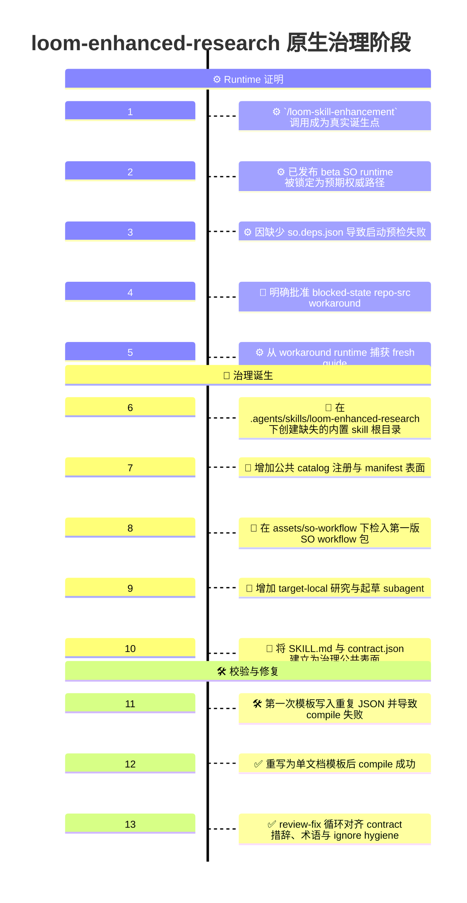
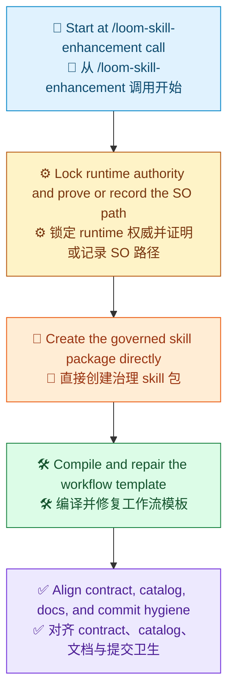

# 原生治理阶段 Demo 时间线

[English](Readme.md) | [Demo 索引](../README.zh-CN.md) | [English Index](../README.md)

> [!NOTE]
> 本文记录了仓库中 `loom-enhanced-research` 第一版原生治理形态是如何成形的。
> 这个阶段的重点，是直接把已检入 skill 创建为 Loom-governanced target skill，而不是先落一个单独的已检入非治理 skill 切片。
> 这是一份历史切片记录。它说明原生治理诞生切片当时发生了什么，但不重新定义该 skill 当前的治理完成判据。

## 一览

| 区域 | 摘要 |
| --- | --- |
| 目标 | 直接以 Loom-governanced target skill 形态创建第一版已检入 `loom-enhanced-research` skill 表面 |
| 阶段 | 第一次原生治理创建 |
| 入口点 | `/loom-skill-enhancement     Start implementation    #file:plan-loomEnhancedResearch.prompt.md` |
| 主要结果 | 治理 skill 包、目录注册、runtime 证明链路，以及一个可 compile 的 SO 模板 |
| 明确非目标 | 不额外保留单独的已检入非治理前置版本，不把 repo-src workaround 正常化为普通路径 |

## 本次运行内容

```text
/loom-skill-enhancement     Start implementation    #file:plan-loomEnhancedResearch.prompt.md
```

## 可视化时间线

> [!TIP]
> Mermaid 本身支持 `timeline` 图，但具体渲染器是否正确显示，取决于它所携带的 Mermaid 版本。如果需要，在 GitHub 上可以先用一个很小的 `info` 图检查支持情况。



## 阶段总结

图例：`🧭` 入口点，`⚙️` runtime 权威，`📜` 治理包，`🛠️` 编译与修复，`✅` 公共对齐。



## 详细时间线

### 1. `/loom-skill-enhancement` 调用就是实际诞生点

这个阶段不是从一个已经检入的 target skill 开始。

它真正起点就是这次增强调用：

```text
/loom-skill-enhancement     Start implementation    #file:plan-loomEnhancedResearch.prompt.md
```

这很重要，因为这个治理切片并不是包装一个现有 skill 根目录，而是直接创建那个治理根目录本身。

### 2. 已发布 beta SO runtime 被锁定为预期权威路径

这个原生治理切片的第一条 runtime 权威路径，是绑定到 `0.2.118-beta` 的已发布 beta Loom Skill Orchestrator bundle。

也就是说，在任何后续 target-skill 工作开始之前，预期的普通路径应该先恢复：

- `Techne.Loom.SkillOrchestrator`
- `Techne.Loom.Common`
- `Techne.Loom.Abstractions`

并保持三者都落在同一个精确版本上。

### 3. 因缺少 `so.deps.json` 导致启动预检失败

已发布 package-channel runtime 证明没有通过。

统一的 runtime 目录里包含：

- `so.dll`
- `so.runtimeconfig.json`
- 依赖程序集

但没有 `so.deps.json`。

这意味着已发布启动契约预检立刻失败，治理路径不能诚实地声称已经拥有 fresh 的 published-runtime guide 证明。

### 4. 明确批准 blocked-state repo-src workaround

由于已发布 bundle 被阻塞，这一轮创建采用了明确获得用户批准的 workaround：

- 构建本地 repo 源码中的 `Techne.Loom.SkillOrchestrator`
- 仅将该 runtime 用作 blocked-state workaround
- 不把它正常化为普通治理路径

这保住了治理规则：被阻塞后的 workaround 必须作为例外被记录，而不能静默变成默认路径。

### 5. 从 workaround runtime 捕获 fresh guide

本地 runtime 构建成功后，从该 workaround runtime 导出了 fresh `dotnet so.dll --guide` 结果。

这份 guide 成为这次诞生切片剩余阶段的权威表面。

到这一步，target-skill 编写才获得了在增强契约下的合法前提。

### 6. 在 `.agents/skills/loom-enhanced-research` 下创建缺失的内置 skill 根目录

下一个重要步骤，是创建仓库 catalog 原本就应指向的真实已检入治理内置 skill 根目录。

这一轮创建出的根目录包括：

- `.agents/skills/loom-enhanced-research/SKILL.md`
- `.agents/skills/loom-enhanced-research/contract.json`
- `.agents/skills/loom-enhanced-research/assets/`

从这一点开始，`loom-enhanced-research` 不再只是 manifest 指向一个缺失目标，而是变成了真实存在的已检入治理 skill 表面。

### 7. 增加公共 catalog 注册与 manifest 表面

这次治理诞生切片，也建立了可发现性所需的 catalog 表面。

这些内置 catalog 公共表面包括：

- `.agents/skills/.well-known/manifest.json`
- `.agents/skills/.well-known/loom-enhanced-research/manifest.json`

此时，这个原生治理 skill 不仅已经存在于磁盘上，也已经被接入已检入的内置 skill catalog。

### 8. 在 `assets/so-workflow` 下检入第一版 SO workflow 包

这个治理 skill 是带着 workflow 包一起诞生的，而不是后续第二阶段再补进去。

该包包括：

- `skill-plan.md`
- `so-package-lock.json`
- `so-template.json`
- `node-to-file-map.md`

这正是它与非治理诞生路径的核心差异：从 skill 根目录被创建的那一刻起，workflow 权威包就已经存在。

### 9. 增加 target-local 研究与起草 subagent

作为原生治理包的一部分，还加入了两个本地 weave-out subagent 表面：

- `assets/loom-enhanced-research-research-round.agent.md`
- `assets/loom-enhanced-research-report-draft.agent.md`

之所以重要，是因为治理模板需要显式、可复用的表面来承载：

- 一次有边界的证据构建轮次
- 一次仅基于既有证据的草稿生成轮次

这让原生治理切片继续保持与显式 workflow-node 模型一致，而不是把这些行为藏在泛化占位逻辑之后。

### 10. 将 `SKILL.md` 与 `contract.json` 建立为治理公共表面

接着，这个治理 skill 从一开始就拥有了公共契约表面。

`SKILL.md` 建立了：

- Loom-governanced runtime 路径
- runtime lock 引用
- workflow template 权威路径
- 外部 runtime workflow copy 规则
- blocked-state-only 的 workflow JSON 编辑规则

`contract.json` 则建立了治理 workflow 所需的公开输入输出契约。

从这里开始，这个 skill 是以治理态公开诞生的，而不是后续再被 retrofit 成治理态。

### 11. 第一次模板写入重复 JSON 并导致 compile 失败

本切片的第一次 compile 失败，不是工作流形状问题，而是文件完整性问题。

最初写入的已检入模板文件里，重复拼接了同一份 JSON 文档，导致 `dotnet so.dll compile` 因无效的多文档 JSON 报错失败。

这个失败很重要，因为它暴露出：新写入的治理源码资产在成为有效执行权威之前，仍然需要机械性修复。

### 12. 重写为单文档模板后 compile 成功

在重复模板缺陷被修复后，`dotnet so.dll compile` 成功通过已检入的原生治理模板。

生成的审计产物包括：

- `workflow.mermaid.md`
- `workflow.html`
- `workflow.json`
- `workflow.analysis.json`

这使得原生治理 skill 包从“概念上受治理”变成“结构上真实存在”。

### 13. review-fix 循环对齐 contract 措辞、术语与 ignore hygiene

随后，review-fix 循环继续收紧剩余的公共表面问题。

这次清理对齐了：

- contract 措辞与治理模板输出
- `material review` 与 `material reselection` 的术语
- `.gitignore` 对 `.temp/` runtime 噪音的处理

这让原生治理切片在第一次 compile 成功之后，没有立刻停止，而是被整理到更适合交接的状态。

## 这个原生治理阶段产出了什么

| 本阶段产物 | 重要性 |
| --- | --- |
| 一个真实的治理 skill 根目录 | skill 以已检入治理目标的形态诞生，而不是后面再包装 |
| 一个真实的公共 contract 文件 | 从第一版已检入治理切片开始，输入输出就是显式的 |
| 一个真实的内置 catalog 注册 | skill 通过已检入的内置 manifest catalog 变得可发现 |
| 一份锁定的 SO runtime 记录 | runtime 权威与 blocked-state workaround 链路被具体记录 |
| 第一版治理 workflow 包 | skill 从一开始就携带 `skill-plan.md`、`so-package-lock.json`、`so-template.json` 与 `node-to-file-map.md` |
| target-local 研究与起草 subagent | 治理 weave-out 表面显式且可复用 |
| 一个可 compile 的 SO 模板 | 证明治理模板确实能通过 `dotnet so.dll compile` |
| runtime 证明链路 | 保留了已发布预检失败与 workaround guide 证据 |
| `.gitignore` 对 `.temp/` 的支持 | 防止 runtime 审计噪音污染后续提交范围 |

## 这个阶段刻意没有做什么

> [!IMPORTANT]
> 这个切片直接以治理态创建 skill，但仍然对 runtime 权威与业务范围变化保持了明确边界。

| 本阶段未引入的内容 | 为什么延后或排除 |
| --- | --- |
| 单独的已检入非治理前置版本 | 这个切片的目的就是直接治理诞生 |
| 成功的已发布 package 启动证明 | 已发布 bundle 仍被缺失的 `so.deps.json` 阻塞 |
| repo-src workaround 的正常化 | 本地 runtime 仍然只是例外证据 |
| 业务工作流的重设计 | 工作流语义仍然对齐既定计划 |
| 正式的治理 run/resume 业务证据 | 本切片只建立治理源码资产与 compile 校验，不是完整业务运行 |

## 为什么这条时间线重要

这个 demo 不只是说明出现了一个治理 skill 文件夹。它展示了原生治理切片如何按顺序变得可信：

1. 从真实的 `/loom-skill-enhancement` 调用开始
2. 锁定 runtime 权威，并诚实记录已发布路径的阻塞状态
3. 直接创建治理 skill 包，而不是先落一个单独的非治理 skill
4. 持续编译和修复治理模板直到通过校验
5. 对齐 catalog 连接、contract 措辞、术语和 ignore hygiene

这就是原生治理阶段的关键故事。
