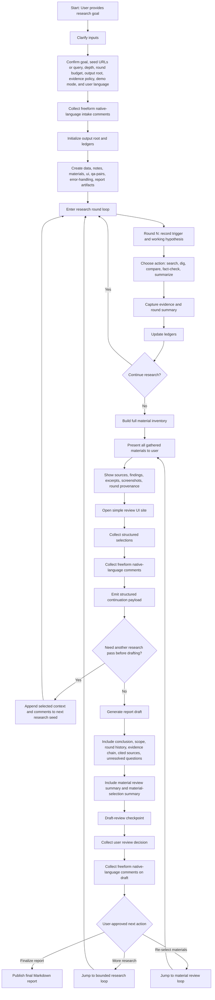

# Plan: loom-enhanced-research expanded workflow package

This plan expands the workflow into a documentable governed package rather than a short checklist. It preserves the accepted workflow shape, stable node IDs, loop semantics, mandatory freeform native-language inputs, and document mapping across skill markdown, workflow assets, and demo planning.

## Goals

1. Preserve the accepted workflow shape exactly enough that the written plan matches the Mermaid and the governed template.
2. Make every workflow node addressable through stable node IDs.
3. Treat every user-facing approval or form step as a structured-plus-freeform input checkpoint.
4. Keep the workflow understandable across planning, skill documentation, and demo planning surfaces.

## Canonical Mermaid

## Node Map

- `A` entry point for the user research goal.
- `B` intake checkpoint.
- `B1` structured input confirmation.
- `B2` mandatory freeform intake comments.
- `C` output-root initialization.
- `C1` artifact and ledger creation.
- `D` bounded research loop entry.
- `D1` round trigger and hypothesis capture.
- `D2` round action selection.
- `D3` evidence capture and round summary.
- `D4` ledger update.
- `E` continue/stop decision.
- `F` material inventory build.
- `G` material presentation.
- `G1` detailed material-display contents.
- `H` review UI entry.
- `H1` structured material selections.
- `H2` mandatory freeform material-review comments.
- `H3` continuation payload emission.
- `I` pre-draft re-research decision.
- `J` research-seed enrichment for another pass.
- `K` report-draft generation.
- `K1` draft body assembly.
- `K2` draft summary assembly.
- `L` draft-review checkpoint.
- `L1` structured draft-review decision.
- `L2` mandatory freeform draft-review comments.
- `M` post-review branch.
- `N` final report publication.
- `O` branch back to bounded research.
- `P` branch back to material review.

## Rules

1. `B`, `H`, and `L` are the user-critical checkpoint families.
2. `B2`, `H2`, and `L2` are mandatory.
3. Freeform text from those checkpoints is first-class workflow input.
4. `D` is the only loop that creates net-new evidence.
5. `P -> G` re-enters material review without claiming new evidence.
6. `O -> D` re-enters bounded research with preserved rationale and budget semantics.
7. `L` reviews the report draft, not the raw material set.
8. `G` reviews the material set, not the report draft.

## Implementation Mapping

1. Runtime proof gates precede the business workflow and are encoded in the SO-governed template.
2. The business workflow itself starts at intake and preserves the canonical node map above.
3. The checked-in workflow template remains the authority; Mermaid and prose mirror it.
