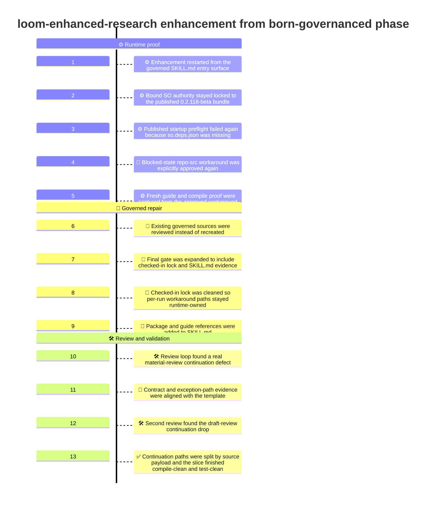
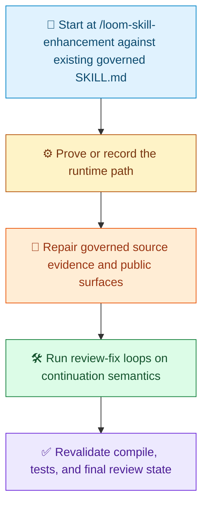

# Enhance from Born-governanced Demo Timeline

[中文](Readme.zh-CN.md) | [Demo Index](../README.md) | [中文索引](../README.zh-CN.md)

> [!NOTE]
> This document records how the first enhancement pass from the already born-governanced `loom-enhanced-research` skill was shaped in this repository.
> The point of this phase was not to invent a new governed skill from scratch. The point was to start from the checked-in governed skill surface, tighten its runtime-governance evidence, repair its continuation semantics, and bring the slice to a review-clean validated state.

## At A Glance

| Area | Summary |
| --- | --- |
| Goal | Enhance the already born-governanced `loom-enhanced-research` skill without changing its accepted business workflow |
| Phase | First enhancement pass from the born-governanced baseline |
| Entry point | `/loom-skill-enhancement    skills\loom-enhanced-research\SKILL.md` |
| Main outcome | Review-clean governed source assets, explicit checked-in deliverable evidence, repaired continuation branches, and validated compile plus test evidence |
| Deliberate non-goals | No redesign of the research behavior, no normalization of the repo-src workaround as the ordinary path, no commit in this recorded slice |

## What We Ran

```text
/loom-skill-enhancement    skills\loom-enhanced-research\SKILL.md
```

## Visual Timeline

> [!TIP]
> Mermaid itself supports `timeline` diagrams. Whether a given renderer shows this block correctly depends on the Mermaid version it bundles. On GitHub, you can check support with a small `info` diagram if needed.



## Phase Summary

Legend: `🧭` entry point, `⚙️` runtime proof, `📜` source repair, `🛠️` review loop, `✅` revalidation.



## Detailed Timeline

### 1. The enhancement restarted from the governed `SKILL.md` entry surface

This phase did not start from a missing target skill root.

It started from the already governed target skill entry surface:

```text
/loom-skill-enhancement    skills\loom-enhanced-research\SKILL.md
```

That matters because this slice was enhancing an existing governed package rather than creating a brand-new governed root.

### 2. The bound SO authority stayed locked to the published `0.2.118-beta` bundle

The intended ordinary authority path remained the published SO runtime bundle already bound by the target skill:

- `Techne.Loom.SkillOrchestrator`
- `Techne.Loom.Common`
- `Techne.Loom.Abstractions`

all resolved at the same exact version `0.2.118-beta`.

This slice preserved the rule that the enhancement must begin from the bound runtime authority rather than drifting directly to repository source builds.

### 3. Published startup preflight failed again because `so.deps.json` was missing

The published bundle was inspected and restored again as part of the enhancement gate.

The extracted runtime contents included:

- `so.dll`
- `so.runtimeconfig.json`
- dependency assemblies

but not `so.deps.json`.

That meant the published package-channel startup preflight still failed and the slice could not honestly claim a clean published-runtime guide or compile path.

### 4. A blocked-state repo-src workaround was explicitly approved again

Because the published runtime stayed blocked, the enhancement pass used an explicitly approved emergency workaround:

- use the local repo build for `Techne.Loom.SkillOrchestrator`
- use it only as blocked-state evidence for this enhancement pass
- do not normalize it into the ordinary governed path

This preserved the governance rule that exception handling must stay explicit and traceable.

### 5. Fresh guide and compile proof were captured from the approved workaround runtime

After the workaround runtime was available, two key validation steps were run from it:

- a fresh `dotnet so.dll --guide` export
- a real `dotnet so.dll compile` against the checked-in target template

That mattered because the slice was not allowed to keep editing the target skill on vague assumptions about runtime validity.

### 6. Existing built-in governed sources were reviewed instead of recreated

Unlike the earlier born-governanced birth slice, this enhancement phase did not need to invent the target package structure.

It worked against the existing built-in governed source surfaces already present for the skill:

- `.agents/skills/loom-enhanced-research/SKILL.md`
- `.agents/skills/loom-enhanced-research/contract.json`
- `.agents/skills/loom-enhanced-research/assets/so-workflow/skill-plan.md`
- `.agents/skills/loom-enhanced-research/assets/so-workflow/so-package-lock.json`
- `.agents/skills/loom-enhanced-research/assets/so-workflow/so-template.json`
- `.agents/skills/loom-enhanced-research/assets/so-workflow/node-to-file-map.md`

This changed the work from “create governed assets” to “repair and harden governed assets.”

### 7. The final gate was expanded to include checked-in lock and `SKILL.md` evidence

One of the first governance repairs was tightening what the governed route counts as done.

The final business-output gate was expanded so it no longer stopped at:

- `final_report`
- `round_ledger`
- `completion_manifest_reference`
- `completion_manifest_md`

It now also requires explicit checked-in source evidence for:

- the checked-in runtime lock target
- the checked-in `SKILL.md` target
- governed proof that `SKILL.md` remains the source deliverable for this slice

That made the enhancement story honest about the checked-in sources it was governing.

### 8. The checked-in lock was cleaned so per-run workaround paths stayed runtime-owned

The existing checked-in lock still carried stale per-run details from an earlier execution chain, including workaround runtime paths and guide-export locations.

Those path-bearing details were removed from the checked-in lock so the lock returned to stable source-owned facts:

- package id
- channel
- resolved version
- bundle members
- restore policy

Per-run failure and workaround evidence stayed where it belongs: runtime-owned audit artifacts.

### 9. Package and guide references were added to `SKILL.md`

The enhancement pass also tightened the target `SKILL.md` so it points readers to the same authority surfaces the governed workflow depends on.

That included explicit references to:

- released and beta package indexes
- released and beta guide surfaces
- the checked-in runtime lock
- the checked-in workflow authority files

This made the public skill surface more self-explanatory and less dependent on external tribal knowledge.

### 10. The review loop found a real material-review continuation defect

The first strict review pass found a real governed workflow bug.

The `material review -> more research` branch returned to the continuation step, but that continuation step required both:

- `material_review_payload`
- `draft_review_payload`

At that point in the workflow, the draft-review payload cannot exist yet.

That meant a legitimate branch could compile but still fail at runtime.

### 11. Contract and exception-path evidence were aligned with the template

The next repair set closed two governance gaps exposed by review:

- the public contract was aligned with the actual continuation and review payload surfaces
- the blocked runtime-exception path was expanded to capture compile-validation audit evidence as part of the approved workaround lineage

This mattered because the slice needed not just a compile-clean template, but a truthful public and governed evidence surface.

### 12. The second review found the draft-review continuation drop

After the first repair set, a second review found a narrower but still real bug.

The `draft review -> more research` branch still re-entered the shared continuation step in a way that dropped the latest draft-review rationale.

That exposed that one generic continuation transition was still doing too much and hiding a real branch-specific contract mismatch.

### 13. Continuation paths were split by source payload and the slice finished compile-clean and test-clean

The final repair was to split continuation handling into two explicit governed paths:

- one continuation transition fed by `material_review_payload`
- one continuation transition fed by `draft_review_payload`

After that split, the slice was revalidated with:

- a fresh `dotnet so.dll compile` against the checked-in template through the approved workaround runtime
- a clean diagnostics pass for the edited files
- 71 passing `SkillOrchestrator` tests and 0 failures
- a final strict review pass with no remaining blocking findings

This brought the enhancement slice to a review-clean validated state. The slice intentionally stopped there without creating a commit as part of this recorded history.

## What This Enhancement Phase Produced

| Produced in this phase | Why it mattered |
| --- | --- |
| Stronger final gate evidence | The governed route now names the checked-in source deliverables it truly depends on |
| Cleaner `so-package-lock.json` ownership | Stable lock facts stayed checked in while per-run workaround paths stayed runtime-owned |
| Better `SKILL.md` authority references | Package and guide discovery became explicit on the public skill surface |
| Correct continuation routing | Material-review and draft-review feedback no longer collide on one mismatched transition |
| Explicit workaround compile evidence | The blocked exception path now records compile-validation lineage, not only guide lineage |
| Compile-valid governed template | The updated target template still passes `dotnet so.dll compile` |
| Test-clean enhancement slice | The relevant `SkillOrchestrator` test suite passed after the continuation fixes |
| Final review-clean state | The slice ended with no remaining blocking findings in scoped review |

## What This Phase Deliberately Did Not Do

> [!IMPORTANT]
> This slice enhanced an already governed skill, but it still kept clear limits around what kind of change it was allowed to become.

| Not changed in this phase | Why it stayed stable |
| --- | --- |
| The underlying research behavior | The goal was governed repair and hardening, not a business-workflow redesign |
| The separation between material review and draft review | That remained a core invariant and was reinforced rather than changed |
| The rule that only the research loop creates new evidence | The continuation fixes preserved this boundary |
| The blocked-state nature of the repo-src workaround | The workaround stayed exception-only evidence |
| Commit creation | This recorded slice stopped at review-clean validated state instead of forcing a commit |

## Why This Timeline Matters

This demo is not just a note that an already governed skill was edited again. It shows the order in which a born-governanced skill was responsibly enhanced:

1. restart at the actual `/loom-skill-enhancement` call against the governed skill entry surface
2. prove or explicitly record the blocked runtime path again
3. repair the governed source evidence and public contract surfaces
4. run strict review-fix loops until continuation semantics are sound
5. finish with compile, tests, and a clean scoped review

That is the key story of the first enhancement pass from the born-governanced baseline.
