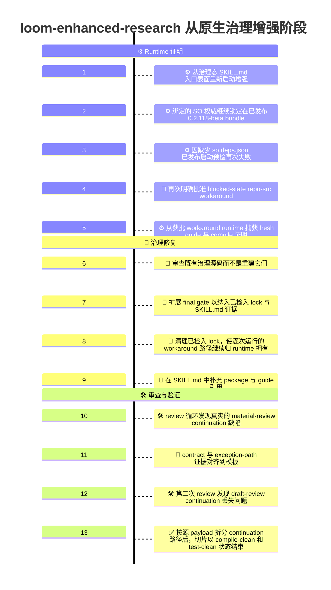
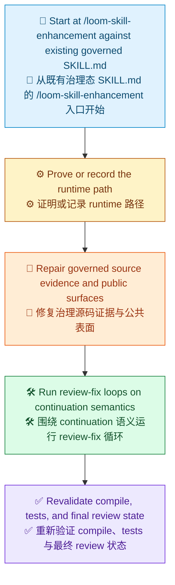

# 从原生治理基线增强的 Demo 时间线

[English](Readme.md) | [Demo 索引](../README.zh-CN.md) | [English Index](../README.md)

> [!NOTE]
> 本文记录了仓库中 `loom-enhanced-research` 在已经原生治理之后的第一次增强切片是如何成形的。
> 这个阶段的重点，不是从零发明一个新的治理 skill，而是从已检入的治理 skill 表面出发，收紧 runtime 治理证据、修复 continuation 语义，并把这个切片带到 review-clean、validated 的状态。
> 这是一份历史切片记录。它说明当时那一轮发生了什么，但不重新定义该 skill 当前的治理完成判据。

## 一览

| 区域 | 摘要 |
| --- | --- |
| 目标 | 在不改变既定业务工作流的前提下，增强已经原生治理的 `loom-enhanced-research` skill |
| 阶段 | 从原生治理基线出发的第一次增强 |
| 入口点 | `/loom-skill-enhancement    skills\loom-enhanced-research\SKILL.md` |
| 主要结果 | review-clean 的治理源码资产、显式的已检入交付证据、修复后的 continuation 分支，以及通过 compile 和 test 的验证证据 |
| 明确非目标 | 不重构研究行为，不把 repo-src workaround 正常化为普通路径，不在这段记录切片里创建 commit |

## 本次运行内容

```text
/loom-skill-enhancement    skills\loom-enhanced-research\SKILL.md
```

## 可视化时间线

> [!TIP]
> Mermaid 本身支持 `timeline` 图，但具体渲染器是否正确显示，取决于它所携带的 Mermaid 版本。如果需要，在 GitHub 上可以先用一个很小的 `info` 图检查支持情况。



## 阶段总结

图例：`🧭` 入口点，`⚙️` runtime 证明，`📜` 源码修复，`🛠️` review 循环，`✅` 重新验证。



## 详细时间线

### 1. 从治理态 `SKILL.md` 入口表面重新启动增强

这个阶段不是从一个缺失的 target skill 根目录开始。

它的起点，就是已经治理化的 target skill 入口表面：

```text
/loom-skill-enhancement    skills\loom-enhanced-research\SKILL.md
```

这很重要，因为这个切片是在增强一个既有治理包，而不是创建一个全新的治理根目录。

### 2. 绑定的 SO 权威继续锁定在已发布 `0.2.118-beta` bundle

预期的普通权威路径，仍然是 target skill 已经绑定的已发布 SO runtime bundle：

- `Techne.Loom.SkillOrchestrator`
- `Techne.Loom.Common`
- `Techne.Loom.Abstractions`

三者都解析到同一个精确版本 `0.2.118-beta`。

这个切片保住了治理规则：增强必须从已绑定的 runtime 权威开始，而不能直接漂移到仓库源码构建。

### 3. 因缺少 `so.deps.json` 已发布启动预检再次失败

已发布 bundle 在增强门槛里再次被检查并恢复。

提取出的 runtime 内容包括：

- `so.dll`
- `so.runtimeconfig.json`
- 依赖程序集

但仍然没有 `so.deps.json`。

这意味着已发布 package-channel 启动预检依旧失败，本切片不能诚实地声称拥有一条干净的已发布 runtime guide 或 compile 路径。

### 4. 再次明确批准 blocked-state repo-src workaround

由于已发布 runtime 仍被阻塞，这次增强采用了再次明确批准的应急 workaround：

- 使用本地 repo 构建出来的 `Techne.Loom.SkillOrchestrator`
- 仅把它作为本次增强的 blocked-state 证据
- 不把它正常化为普通治理路径

这延续了治理规则：异常处理必须显式、可追溯。

### 5. 从获批 workaround runtime 捕获 fresh guide 与 compile 证明

在 workaround runtime 可用之后，从它上面运行了两个关键验证动作：

- fresh `dotnet so.dll --guide` 导出
- 针对已检入 target template 的真实 `dotnet so.dll compile`

这很重要，因为这个切片不能在 runtime 有效性还模糊时继续编辑 target skill。

### 6. 审查既有内置治理源码而不是重建它们

与更早的原生治理诞生切片不同，这次增强不需要发明 target package 结构。

它是直接针对已经存在的内置治理源码表面工作：

- `.agents/skills/loom-enhanced-research/SKILL.md`
- `.agents/skills/loom-enhanced-research/contract.json`
- `.agents/skills/loom-enhanced-research/assets/so-workflow/skill-plan.md`
- `.agents/skills/loom-enhanced-research/assets/so-workflow/so-package-lock.json`
- `.agents/skills/loom-enhanced-research/assets/so-workflow/so-template.json`
- `.agents/skills/loom-enhanced-research/assets/so-workflow/node-to-file-map.md`

这让工作从“创建治理资产”变成了“修复并加固治理资产”。

### 7. 扩展 final gate 以纳入已检入 lock 与 `SKILL.md` 证据

最先做的一项治理修复，是收紧治理路径何时才算真正完成。

最终 business-output gate 不再只停留在：

- `final_report`
- `round_ledger`
- `completion_manifest_reference`
- `completion_manifest_md`

它现在还要求显式的已检入源码证据，用来证明：

- 已检入 runtime lock 目标存在
- 已检入 `SKILL.md` 目标存在
- `SKILL.md` 仍然是本切片的源码交付表面

这让增强故事对它实际依赖的已检入源码表面保持诚实。

### 8. 清理已检入 lock，使逐次运行的 workaround 路径继续归 runtime 拥有

既有的已检入 lock 中，还残留着更早执行链上的逐次运行细节，包括 workaround runtime 路径和 guide 导出位置。

这些带路径的细节被从已检入 lock 中移除，让 lock 回到稳定的源码归属事实：

- package id
- channel
- resolved version
- bundle members
- restore policy

逐次运行的失败与 workaround 证据继续留在它应当归属的地方：runtime-owned 审计产物。

### 9. 在 `SKILL.md` 中补充 package 与 guide 引用

这次增强还补强了 target `SKILL.md`，使它指向与治理工作流所依赖的同一组权威表面。

新增的显式引用包括：

- released 与 beta package 索引
- released 与 beta guide 表面
- 已检入 runtime lock
- 已检入 workflow 权威文件

这让公共 skill 表面更容易自解释，也不再依赖外部口口相传的背景知识。

### 10. review 循环发现真实的 material-review continuation 缺陷

第一轮严格 review 发现了一个真实的治理工作流 bug。

`material review -> more research` 分支会返回 continuation 步骤，但那个 continuation 步骤同时要求：

- `material_review_payload`
- `draft_review_payload`

在那个时点，draft-review payload 根本不可能已经存在。

这意味着一个合法分支虽然可以 compile，却仍可能在 runtime 失败。

### 11. contract 与 exception-path 证据对齐到模板

下一轮修复收拢了 review 暴露的两个治理缺口：

- 公共 contract 被对齐到实际的 continuation 与 review payload 表面
- blocked runtime-exception 路径被扩展，以把 compile-validation 审计证据也纳入已批准 workaround 的链路

这之所以重要，是因为这个切片不仅需要一个 compile-clean 模板，还需要一个真实的公共与治理证据表面。

### 12. 第二次 review 发现 draft-review continuation 丢失问题

在第一轮修复完成后，第二次 review 又发现了一个更窄但仍然真实的 bug。

`draft review -> more research` 分支重新进入共享 continuation 步骤时，丢失了最新的 draft-review rationale。

这暴露出：一个通用 continuation transition 仍然承担了过多职责，并隐藏着真实的分支契约不匹配。

### 13. 按源 payload 拆分 continuation 路径后，切片以 compile-clean 和 test-clean 状态结束

最终修复，是把 continuation 处理拆成两条显式治理路径：

- 一条由 `material_review_payload` 驱动
- 一条由 `draft_review_payload` 驱动

完成拆分后，这个切片通过以下动作重新验证：

- 在获批 workaround runtime 上，对已检入模板再次运行 fresh `dotnet so.dll compile`
- 对编辑文件执行 clean diagnostics 检查
- `SkillOrchestrator` 相关测试 71 项通过、0 失败
- 最后一轮严格 review 没有剩余阻塞性发现

这使得增强切片进入 review-clean、validated 的状态。该切片刻意停在这里，没有把创建 commit 也写进这段记录历史。

## 这个增强阶段产出了什么

| 本阶段产物 | 重要性 |
| --- | --- |
| 更强的 final gate 证据 | 治理路径现在明确列出了它真正依赖的已检入源码交付物 |
| 更干净的 `so-package-lock.json` 归属边界 | 稳定 lock 事实继续检入，逐次 workaround 路径继续归 runtime 拥有 |
| 更完整的 `SKILL.md` 权威引用 | package 与 guide 发现路径在公共 skill 表面上变得显式 |
| 正确的 continuation 路由 | material-review 与 draft-review 反馈不再挤在同一条不匹配的 transition 上 |
| 显式的 workaround compile 证据 | blocked exception 路径现在记录 compile-validation 链路，而不仅是 guide 链路 |
| 一个可 compile 的治理模板 | 更新后的 target template 仍然能通过 `dotnet so.dll compile` |
| 一个 test-clean 的增强切片 | continuation 修复后，相关 `SkillOrchestrator` 测试全部通过 |
| 一个最终 review-clean 状态 | 这个切片在 scoped review 下没有剩余阻塞性发现 |

## 这个阶段刻意没有做什么

> [!IMPORTANT]
> 这个切片增强了一个已经治理化的 skill，但仍然对可允许的变化类型保持了清晰边界。

| 本阶段未改变的内容 | 为什么保持不变 |
| --- | --- |
| 底层研究行为 | 目标是治理修复与加固，而不是业务工作流重设计 |
| 材料审阅与草稿审阅的分离 | 它仍然是核心不变量，而且被进一步加固 |
| 只有研究循环能产生新证据的规则 | continuation 修复保住了这条边界 |
| repo-src workaround 的 blocked-state 性质 | workaround 继续只是例外证据 |
| commit 创建 | 这段记录切片停在 review-clean、validated 状态，而不是强行进入 commit |

## 为什么这条时间线重要

这个 demo 不只是说明一个已治理 skill 又被改了一次。它展示了一个原生治理 skill 如何被负责任地继续增强：

1. 从针对治理 skill 入口表面的真实 `/loom-skill-enhancement` 调用重新开始
2. 再次证明或明确记录被阻塞的 runtime 路径
3. 修复治理源码证据与公共契约表面
4. 持续运行严格的 review-fix 循环，直到 continuation 语义可靠
5. 以 compile、tests 和 clean scoped review 收尾

这就是从原生治理基线出发的第一轮增强切片的关键故事。
