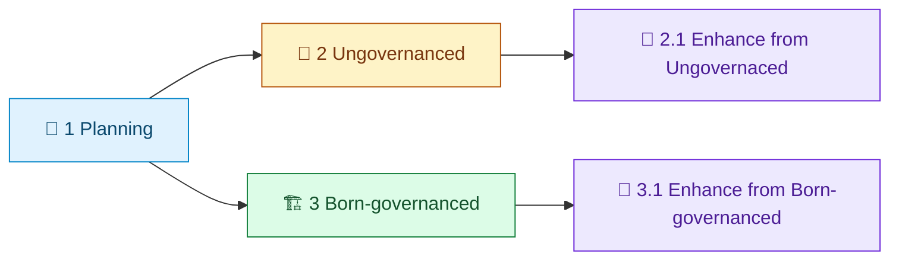

# loom-enhanced-research Demo Index

[中文](README.zh-CN.md) | [Demos Root](../README.md) | [Repository Root](../../README.md)

This demo family shows how `/loom-enhanced-research` moved from planning to governance-ready slices.

> [!IMPORTANT]
> This index is the navigation contract for demo consumers.
> Stage-level sample payload files prioritize traceability of execution evidence and are allowed to stay close to runtime artifact shape.

## Visual Timeline

Legend: `🧭` planning, `🧪` ungovernanced baseline, `🏗️` born-governanced baseline, `🔁` enhancement slice.

## Timeline Map

| Stage | Path | Purpose | Typical artifacts to inspect |
| --- | --- | --- | --- |
| 1. Planning | [1.Planning](1.Planning/) | initial planning prompt input for downstream execution | prompt plan input |
| 2. Ungovernanced | [2. Ungovernanced/Readme.md](2.%20Ungovernanced/Readme.md) | baseline sample before governance structure is enforced | `SKILL.md`, `contract.json` |
| 2.1 Enhance from Ungovernaced | [2.1 Enhance from Ungovernaced/Readme.md](2.1%20Enhance%20from%20Ungovernaced/Readme.md) | enhancement slice from ungovernanced baseline toward governed assets | workflow template and lock draft |
| 3. Born-governanced | [3. Born-governanced/Readme.md](3.%20Born-governanced/Readme.md) | baseline sample born with governed layout and runtime contract | `assets/so-workflow/*`, lock file |
| 3.1 Enhance from Born-governanced | [3.1 Enhance from Born-governanced/Readme.md](3.1%20Enhance%20from%20Born-governanced/Readme.md) | iterative enhancement on top of a governed baseline | re-enhanced workflow and evidence map |

## Quick Entry Cards

| If you want to... | Start here |
| --- | --- |
| understand the full evolution path first | [3.1 Enhance from Born-governanced/Readme.md](3.1%20Enhance%20from%20Born-governanced/Readme.md) |
| compare ungovernanced vs governed baseline | [2. Ungovernanced/Readme.md](2.%20Ungovernanced/Readme.md) and [3. Born-governanced/Readme.md](3.%20Born-governanced/Readme.md) |
| inspect how enhancement work is staged | [2.1 Enhance from Ungovernaced/Readme.md](2.1%20Enhance%20from%20Ungovernaced/Readme.md) |

## What To Inspect In Each Stage

- timeline narrative in local `Readme.md`
- sample skill payload in nested `loom-enhanced-research/`
- contract and workflow artifacts such as `contract.json`, `assets/so-workflow/so-template.json`, `assets/so-workflow/so-package-lock.json`

## Suggested Reading Path

1. Open [3.1 Enhance from Born-governanced/Readme.md](3.1%20Enhance%20from%20Born-governanced/Readme.md) for the most complete governed slice.
2. Backtrack to [3. Born-governanced/Readme.md](3.%20Born-governanced/Readme.md) to see the baseline before re-enhancement.
3. Compare with [2. Ungovernanced/Readme.md](2.%20Ungovernanced/Readme.md) to understand what governance adds.
4. Use [1.Planning](1.Planning/) as initial context for plan intent.

## Governance Note

Timeline sample content is intentionally close to execution artifacts, so stage-level sample files may prioritize traceability over polished docs prose.

For operator-facing contracts and stable guidance, use:

- [docs/en/guides/so-guide.md](../../docs/en/guides/so-guide.md)
- [docs/en/guides/ao-guide.md](../../docs/en/guides/ao-guide.md)
- [docs/en/reference/cli.md](../../docs/en/reference/cli.md)

## Related Navigation

- [Demos Root Index](../README.md)
- [Demos Root Chinese Index](../README.zh-CN.md)
- [Repository Root README](../../README.md)
- [Repository Root Chinese README](../../README.zh-CN.md)
