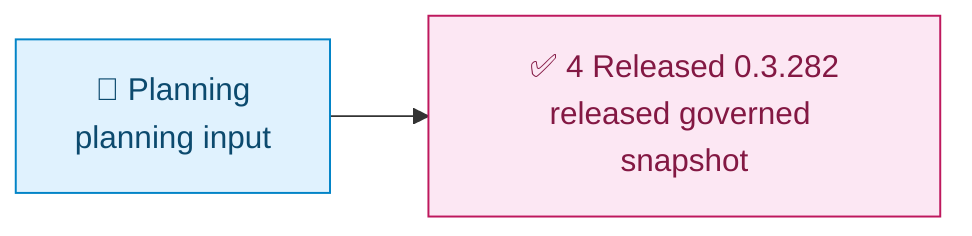

# loom-enhanced-research Demo Index

[中文](README.zh-CN.md) | [Demos Root](../README.md) | [Repository Root](../../README.md)

This demo family keeps the current released snapshot of `/loom-enhanced-research`. Historical planning and baseline stages were removed; the released 0.3.282 copy is the only retained target-skill sample.

> [!IMPORTANT]
> This index is the navigation contract for demo consumers.
> Stage-level sample payload files prioritize traceability of execution evidence and are allowed to stay close to runtime artifact shape.

## Visual Timeline

Legend: `🧭` intake and planning, `🔎` research and evidence, `💬` user review, `✅` released completion.

## Stage Map

| Stage | Path | Purpose | Typical artifacts to inspect |
| --- | --- | --- | --- |
| 4. Released 0.3.282 | [4. Released-0.3.282/Readme.md](4.%20Released-0.3.282/Readme.md) | current released migration snapshot | exact-version workflow, semantic references, and migration tools |

## Quick Entry Cards

| If you want to... | Start here |
| --- | --- |
| inspect the current released governed workflow | [4. Released-0.3.282/Readme.md](4.%20Released-0.3.282/Readme.md) |
| read the emitter-aware migration rules | [4. Released-0.3.282/loom-enhanced-research/assets/so-workflow/reference/runtime-semantic-migration.md](4.%20Released-0.3.282/loom-enhanced-research/assets/so-workflow/reference/runtime-semantic-migration.md) |
| run the migration dry-scan tools | [4. Released-0.3.282/loom-enhanced-research/assets/so-workflow/scripts](4.%20Released-0.3.282/loom-enhanced-research/assets/so-workflow/scripts/) |

## What To Inspect In Each Stage

- stage narrative in local `Readme.md`
- sample skill payload in nested `loom-enhanced-research/`
- contract and workflow artifacts such as `contract.json`, `assets/so-workflow/so-template.json`, `assets/so-workflow/so-package-lock.json`

## Suggested Reading Path

1. Open [4. Released-0.3.282/Readme.md](4.%20Released-0.3.282/Readme.md) for the current released snapshot and its completion rule.
2. Inspect the workflow authority at `assets/so-workflow/so-template.json` and the node-to-file map beside it.
3. Read the runtime semantic migration reference for the 0.3.282 emitter and resume rules.

## Governance Note

Stage sample content is intentionally close to execution artifacts, so stage-level sample files may prioritize traceability over polished docs prose.

For operator-facing contracts and stable guidance, use:

- [docs/en/guides/so-guide.md](../../docs/en/guides/so-guide.md)
- [docs/en/guides/ao-guide.md](../../docs/en/guides/ao-guide.md)
- [docs/en/reference/cli.md](../../docs/en/reference/cli.md)

## Related Navigation

- [Demos Root Index](../README.md)
- [Demos Root Chinese Index](../README.zh-CN.md)
- [Repository Root README](../../README.md)
- [Repository Root Chinese README](../../README.zh-CN.md)
