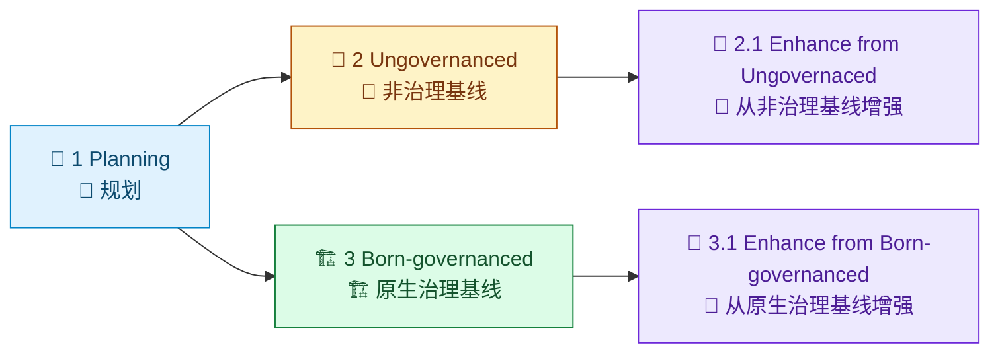

# loom-enhanced-research Demo 索引

[English](README.md) | [Demos 根目录](../README.zh-CN.md) | [仓库根目录](../../README.zh-CN.md)

这个 demo 系列用于展示 `/loom-enhanced-research` 从 planning 到可治理切片的演进过程。

> [!IMPORTANT]
> 这个索引页是 demo 消费路径的导航合同。
> 阶段目录里的样本文件以执行轨迹可追溯为优先，允许更贴近运行时产物形状。

## 可视化时间线

图例：`🧭` planning / 规划，`🧪` ungovernanced baseline / 非治理基线，`🏗️` born-governanced baseline / 原生治理基线，`🔁` enhancement slice / 增强切片。

## 时间线总览

| 阶段 | 路径 | 目的 | 建议检查产物 |
| --- | --- | --- | --- |
| 1. Planning | [1.Planning](1.Planning/) | 下游执行前的初始 planning 输入 | prompt 计划输入 |
| 2. Ungovernanced | [2. Ungovernanced/Readme.zh-CN.md](2.%20Ungovernanced/Readme.zh-CN.md) | 尚未强制治理结构时的基线样本 | `SKILL.md`、`contract.json` |
| 2.1 Enhance from Ungovernaced | [2.1 Enhance from Ungovernaced/Readme.zh-CN.md](2.1%20Enhance%20from%20Ungovernaced/Readme.zh-CN.md) | 从 ungovernanced 基线向 governed 资产演进的增强切片 | workflow 模板与 lock 草案 |
| 3. Born-governanced | [3. Born-governanced/Readme.zh-CN.md](3.%20Born-governanced/Readme.zh-CN.md) | 从一开始就带治理布局与 runtime 合同的基线样本 | `assets/so-workflow/*`、lock 文件 |
| 3.1 Enhance from Born-governanced | [3.1 Enhance from Born-governanced/Readme.zh-CN.md](3.1%20Enhance%20from%20Born-governanced/Readme.zh-CN.md) | 在 governed 基线上继续迭代增强 | 增强后 workflow 与证据映射 |

## 快速入口卡片

| 如果你现在要... | 从这里开始 |
| --- | --- |
| 先看最完整的治理态切片 | [3.1 Enhance from Born-governanced/Readme.zh-CN.md](3.1%20Enhance%20from%20Born-governanced/Readme.zh-CN.md) |
| 对比 ungovernanced 与 governed 基线 | [2. Ungovernanced/Readme.zh-CN.md](2.%20Ungovernanced/Readme.zh-CN.md) 与 [3. Born-governanced/Readme.zh-CN.md](3.%20Born-governanced/Readme.zh-CN.md) |
| 重点看增强过程如何推进 | [2.1 Enhance from Ungovernaced/Readme.zh-CN.md](2.1%20Enhance%20from%20Ungovernaced/Readme.zh-CN.md) |

## 每个阶段建议重点

- 阶段目录内 `Readme.md` 的时间线叙述
- 嵌套 `loom-enhanced-research/` 下的样本 skill 资产
- `contract.json` 与 `assets/so-workflow/so-template.json`、`so-package-lock.json` 等合同/工作流产物

## 建议阅读路径

1. 先看 [3.1 Enhance from Born-governanced/Readme.zh-CN.md](3.1%20Enhance%20from%20Born-governanced/Readme.zh-CN.md) 获取完整治理切片。
2. 回看 [3. Born-governanced/Readme.zh-CN.md](3.%20Born-governanced/Readme.zh-CN.md) 理解增强前基线。
3. 对照 [2. Ungovernanced/Readme.zh-CN.md](2.%20Ungovernanced/Readme.zh-CN.md) 看治理能力差异。
4. 最后结合 [1.Planning](1.Planning/) 理解最初规划输入。

## 治理说明

时间线样本内容以执行轨迹可追溯为优先，因此阶段样本文件不强制追求文档 prose 规范化。

操作者合同与稳定指导请以这些文档为准：

- [docs/zh-cn/guides/so-guide.md](../../docs/zh-cn/guides/so-guide.md)
- [docs/zh-cn/guides/ao-guide.md](../../docs/zh-cn/guides/ao-guide.md)
- [docs/zh-cn/reference/cli.md](../../docs/zh-cn/reference/cli.md)

## 相关导航

- [Demos 根目录索引](../README.zh-CN.md)
- [Demos 英文索引](../README.md)
- [仓库根 README](../../README.zh-CN.md)
- [仓库根英文 README](../../README.md)
