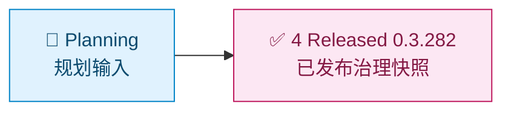

# loom-enhanced-research Demo 索引

[English](README.md) | [Demos 根目录](../README.zh-CN.md) | [仓库根目录](../../README.zh-CN.md)

这个 demo 系列只保留 `/loom-enhanced-research` 的当前 released 快照。历史的 planning 与基线阶段已删除，released 0.3.282 副本是唯一的 target-skill 样本。

> [!IMPORTANT]
> 这个索引页是 demo 消费路径的导航合同。
> 阶段目录里的样本文件以执行轨迹可追溯为优先，允许更贴近运行时产物形状。

## 可视化时间线

图例：`🧭` intake and planning / 规划与输入，`🔎` research and evidence / 研究与证据，`💬` user review / 用户评审，`✅` released completion / 已发布完成。

## 阶段总览

| 阶段 | 路径 | 目的 | 建议检查产物 |
| --- | --- | --- | --- |
| 4. Released 0.3.282 | [4. Released-0.3.282/Readme.zh-CN.md](4.%20Released-0.3.282/Readme.zh-CN.md) | 当前 released 迁移快照 | 精确版本 workflow、语义参考与迁移工具 |

## 快速入口卡片

| 如果你现在要... | 从这里开始 |
| --- | --- |
| 查看当前 released 治理 workflow | [4. Released-0.3.282/Readme.zh-CN.md](4.%20Released-0.3.282/Readme.zh-CN.md) |
| 阅读 emitter-aware 迁移规则 | [4. Released-0.3.282/loom-enhanced-research/assets/so-workflow/reference/runtime-semantic-migration.md](4.%20Released-0.3.282/loom-enhanced-research/assets/so-workflow/reference/runtime-semantic-migration.md) |
| 运行迁移 dry-scan 工具 | [4. Released-0.3.282/loom-enhanced-research/assets/so-workflow/scripts](4.%20Released-0.3.282/loom-enhanced-research/assets/so-workflow/scripts/) |

## 每个阶段建议重点

- 阶段目录内 `Readme.md` 的时间线叙述
- 嵌套 `loom-enhanced-research/` 下的样本 skill 资产
- `contract.json` 与 `assets/so-workflow/so-template.json`、`so-package-lock.json` 等合同/工作流产物

## 建议阅读路径

1. 先看 [4. Released-0.3.282/Readme.zh-CN.md](4.%20Released-0.3.282/Readme.zh-CN.md) 了解当前 released 快照与完成规则。
2. 检查 `assets/so-workflow/so-template.json` workflow authority 及其旁边的 node-to-file map。
3. 阅读 runtime semantic migration reference，了解 0.3.282 emitter 与 resume 规则。

## 治理说明

阶段样本内容以执行轨迹可追溯为优先，因此阶段样本文件不强制追求文档 prose 规范化。

操作者合同与稳定指导请以这些文档为准：

- [docs/zh-cn/guides/so-guide.md](../../docs/zh-cn/guides/so-guide.md)
- [docs/zh-cn/guides/ao-guide.md](../../docs/zh-cn/guides/ao-guide.md)
- [docs/zh-cn/reference/cli.md](../../docs/zh-cn/reference/cli.md)

## 相关导航

- [Demos 根目录索引](../README.zh-CN.md)
- [Demos 英文索引](../README.md)
- [仓库根 README](../../README.zh-CN.md)
- [仓库根英文 README](../../README.md)
