```mermaid

flowchart TD
    subgraph phase_01_entry["01 Entry"]
    state.classify_request["🔎 Classify Request"]
    state.route_request["❓ Route Request"]
    state.start["🔎 Start"]
    end
    subgraph phase_02_ck1["02 CK1"]
    state.prepare_ck1["🔎 Prepare CK1"]
    state.wait_ck1["📜 Wait CK1 Confirmation"]
    end
    subgraph phase_03_ck2["03 CK2"]
    state.prepare_ck2["🔎 Prepare CK2"]
    state.wait_ck2["📜 Wait CK2 Confirmation"]
    end
    subgraph phase_04_ck3["04 CK3"]
    state.generate_audio["🔎 Generate Audio"]
    state.generate_images["🔎 Generate Images"]
    state.render_ck3["🔎 Render CK3"]
    state.validate_ck3["🔎 Validate CK3"]
    state.validation_result["❓ Validation Result"]
    end
    subgraph phase_04_ck3_recovery["04 CK3 Recovery"]
    state.apply_validation_fix["🔎 Apply Authorized Data Fixes"]
    state.prepare_ck2_after_validation_failure["🔎 Choose Validation Recovery"]
    state.record_unchanged_validation_return["📜 Record Unchanged CK2 Return"]
    state.render_ck2_after_validation_failure["🔎 Render CK2 Recovery Review"]
    state.route_validation_recovery["❓ Route Validation Recovery"]
    state.wait_validation_recovery_choice["📜 Wait for Recovery Choice"]
    end
    subgraph phase_05_revision["05 Revision"]
    state.apply_revision["🔎 Apply Revision"]
    state.render_revision["🔎 Render Revision"]
    state.revision_context["❓ Revision Context"]
    state.wait_revision_context["📜 Wait Revision Context"]
    end
    subgraph phase_06_completion["06 Completion"]
    state.done["✅ Done"]
    end
    state.apply_revision -->|Apply revision delta| state.render_revision
    state.apply_validation_fix -->|Apply Minimal Authorized Data Fixes| state.render_ck2_after_validation_failure
    state.classify_request -->|Classify request state| state.route_request
    state.generate_audio -->|Generate audio references| state.render_ck3
    state.generate_images -->|Generate direction images| state.generate_audio
    state.prepare_ck1 -->|Compose CK1 checkpoint package| state.wait_ck1
    state.prepare_ck2 -->|Render CK2 checkpoint| state.wait_ck2
    state.prepare_ck2_after_validation_failure -->|Present Validation Recovery Choices| state.wait_validation_recovery_choice
    state.record_unchanged_validation_return -->|Record Unchanged Data Disposition| state.render_ck2_after_validation_failure
    state.render_ck2_after_validation_failure -->|Render CK2 Recovery Review| state.wait_ck2
    state.render_ck3 -->|Render final views| state.done
    state.render_revision -->|Render affected revision views| state.done
    state.revision_context -->|Revision has context| state.apply_revision
    state.revision_context -->|Revision missing context| state.wait_revision_context
    state.route_request -->|Route raw_input| state.prepare_ck1
    state.route_request -->|Route ck1_confirmed| state.prepare_ck2
    state.route_request -->|Route ck2_confirmed| state.validate_ck3
    state.route_request -->|Route revision| state.revision_context
    state.route_validation_recovery -->|Apply authorized validation fixes| state.apply_validation_fix
    state.route_validation_recovery -->|Return unchanged to CK2| state.record_unchanged_validation_return
    state.start -->|Resolve classifier authority| state.classify_request
    state.validate_ck3 -->|Validate data.json| state.validation_result
    state.validation_result -->|Strict validation passed| state.generate_images
    state.validation_result -->|Return failed validation to CK2| state.prepare_ck2_after_validation_failure
    state.wait_ck1 -->|Wait for CK1 confirmation| state.prepare_ck2
    state.wait_ck2 -->|Wait for CK2 confirmation| state.validate_ck3
    state.wait_revision_context -->|Wait for revision context| state.apply_revision
    state.wait_validation_recovery_choice -->|Wait for Validation Recovery Choice| state.route_validation_recovery
    style state.apply_revision fill:#dcfce7,stroke:#16a34a,color:#14532d,stroke-width:1px
    style state.apply_validation_fix fill:#dcfce7,stroke:#16a34a,color:#14532d,stroke-width:1px
    style state.classify_request fill:#dcfce7,stroke:#16a34a,color:#14532d,stroke-width:1px
    style state.done fill:#dcfce7,stroke:#15803d,color:#14532d,stroke-width:1px
    style state.generate_audio fill:#dcfce7,stroke:#16a34a,color:#14532d,stroke-width:1px
    style state.generate_images fill:#dcfce7,stroke:#16a34a,color:#14532d,stroke-width:1px
    style state.prepare_ck1 fill:#dcfce7,stroke:#16a34a,color:#14532d,stroke-width:1px
    style state.prepare_ck2 fill:#dcfce7,stroke:#16a34a,color:#14532d,stroke-width:1px
    style state.prepare_ck2_after_validation_failure fill:#dcfce7,stroke:#16a34a,color:#14532d,stroke-width:1px
    style state.record_unchanged_validation_return fill:#f8fafc,stroke:#94a3b8,color:#334155,stroke-width:1px
    style state.render_ck2_after_validation_failure fill:#dcfce7,stroke:#16a34a,color:#14532d,stroke-width:1px
    style state.render_ck3 fill:#dcfce7,stroke:#16a34a,color:#14532d,stroke-width:1px
    style state.render_revision fill:#dcfce7,stroke:#16a34a,color:#14532d,stroke-width:1px
    style state.revision_context fill:#fef3c7,stroke:#a16207,color:#713f12,stroke-width:1px
    style state.route_request fill:#fef3c7,stroke:#a16207,color:#713f12,stroke-width:1px
    style state.route_validation_recovery fill:#fef3c7,stroke:#a16207,color:#713f12,stroke-width:1px
    style state.start fill:#dcfce7,stroke:#16a34a,color:#14532d,stroke-width:1px
    style state.validate_ck3 fill:#dcfce7,stroke:#16a34a,color:#14532d,stroke-width:1px
    style state.validation_result fill:#fef3c7,stroke:#a16207,color:#713f12,stroke-width:1px
    style state.wait_ck1 fill:#f8fafc,stroke:#94a3b8,color:#334155,stroke-width:1px
    style state.wait_ck2 fill:#f8fafc,stroke:#94a3b8,color:#334155,stroke-width:1px
    style state.wait_revision_context fill:#f8fafc,stroke:#94a3b8,color:#334155,stroke-width:1px
    style state.wait_validation_recovery_choice fill:#f8fafc,stroke:#94a3b8,color:#334155,stroke-width:1px
    style state.done stroke:#ea580c,stroke-width:3px
    subgraph legend[Legend]
        legend_ai["🔎 AI"]
    style legend_ai fill:#dcfce7,stroke:#16a34a,color:#14532d,stroke-width:1px
        legend_tool["⚙️ Code/Tool"]
    style legend_tool fill:#dbeafe,stroke:#2563eb,color:#1e3a8a,stroke-width:1px
        legend_branch["❓ Conditional branch"]
    style legend_branch fill:#fef3c7,stroke:#a16207,color:#713f12,stroke-width:1px
        legend_optional["💬 Optional user choice"]
    style legend_optional fill:#fef3c7,stroke:#d97706,color:#78350f,stroke-width:1px
        legend_required["🚧 Required user input"]
    style legend_required fill:#fee2e2,stroke:#dc2626,color:#7f1d1d,stroke-width:1px
        legend_gate["📜 Gate"]
    style legend_gate fill:#f8fafc,stroke:#94a3b8,color:#334155,stroke-width:1px
        legend_completion["✅ Completion"]
    style legend_completion fill:#dcfce7,stroke:#15803d,color:#14532d,stroke-width:1px
    end

```

## Workflow Business Summary / 工作流业务说明

| Phase / 阶段 | State / 节点 | Node ID | Business purpose / 业务目的 |
| --- | --- | --- | --- |
| 01 Entry | Classify Request | state.classify\_request | Dispatch the exact CK state classifier subagent after authority resolution evidence has been recorded. |
| 01 Entry | Route Request | state.route\_request | Route the request into raw\_input, ck1\_confirmed, ck2\_confirmed, or revision. |
| 01 Entry | Start | state.start | Prepare the root skill CK workflow. |
| 02 CK1 | Prepare CK1 | state.prepare\_ck1 | Compose the CK1 response template without writing files. |
| 02 CK1 | Wait CK1 Confirmation | state.wait\_ck1 | Block after CK1 until the user explicitly confirms direction for CK2. |
| 03 CK2 | Prepare CK2 | state.prepare\_ck2 | Create data.json draft and render CK2 confirmation views only. |
| 03 CK2 | Wait CK2 Confirmation | state.wait\_ck2 | Block after CK2 until the user explicitly authorizes CK3. |
| 04 CK3 | Generate Audio | state.generate\_audio | Generate audio references when enabled by project type or meta.sound\_enabled. |
| 04 CK3 | Generate Images | state.generate\_images | Generate direction images and allow placeholders on failure. |
| 04 CK3 | Render CK3 | state.render\_ck3 | Render client, director, and execution HTML views. |
| 04 CK3 | Validate CK3 | state.validate\_ck3 | Validate data.json before generation and final render. |
| 04 CK3 | Validation Result | state.validation\_result | Route a completed strict-validation report to CK3 only when it passes; otherwise return to CK2 correction. |
| 04 CK3 Recovery | Apply Authorized Data Fixes | state.apply\_validation\_fix | Apply only the minimal data.json changes authorized by the user and identified by strict validation. |
| 04 CK3 Recovery | Choose Validation Recovery | state.prepare\_ck2\_after\_validation\_failure | Present the strict-validation report and ask whether to apply its fixes or return to CK2 without changing data. |
| 04 CK3 Recovery | Record Unchanged CK2 Return | state.record\_unchanged\_validation\_return | Record that the user chose to return to CK2 without changing data.json. |
| 04 CK3 Recovery | Render CK2 Recovery Review | state.render\_ck2\_after\_validation\_failure | Show the corrected or unchanged data and strict-validation diagnostics in CK2, then require another CK2 approval. |
| 04 CK3 Recovery | Route Validation Recovery | state.route\_validation\_recovery | Route only the two declared validation-recovery choices. |
| 04 CK3 Recovery | Wait for Recovery Choice | state.wait\_validation\_recovery\_choice | Wait for the user&#39;s structured choice to fix data or return to CK2 unchanged. |
| 05 Revision | Apply Revision | state.apply\_revision | Patch only the named node or field and preserve all other content. |
| 05 Revision | Render Revision | state.render\_revision | Re-render only the affected views after revision validation. |
| 05 Revision | Revision Context | state.revision\_context | Decide whether revision has enough context to patch only the named fields. |
| 05 Revision | Wait Revision Context | state.wait\_revision\_context | Block until project path, data.json, or original node content is provided. |
| 06 Completion | Done | state.done | CK workflow finished. |

