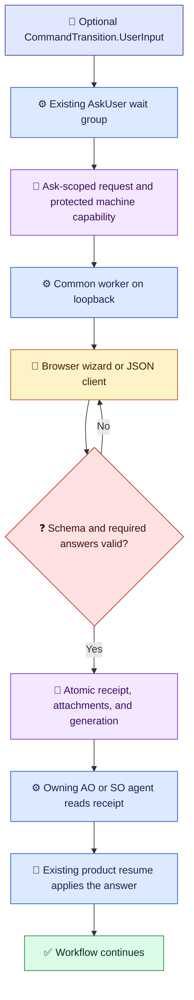

# Structured AskUser Design

[简体中文](../../zh-cn/architecture/ask-user-design.md) | [Architecture index](README.md)

## Decision

Add structured forms to the existing `AskUser` workflow step in the Loom Agent Plan-Execution Orchestrator (AO) and SkillOrchestrator (SO). Keep `AskUser` and `WaitResume` as the only workflow step kinds for this path. `CommandTransition.UserInput` is an optional, versioned form contract; `requiredInputs` remains a list of workflow context paths. Untyped existing asks continue to use the current behavior.

The implementation shares framework-neutral behavior in `Techne.Loom.Common`. AgentOrchestrator and SkillOrchestrator remain independent hosts with separate CLIs, execution state, package identities, and resume paths. No new product or package family is introduced.

## Workflow Ownership

The worker accepts an ask request, serves the user interface, validates answers, and persists drafts and a submission receipt. It never acquires a workflow lock, changes `WorkflowInstance`, appends workflow history, or resumes a workflow. The owning agent reads the receipt and uses its existing AO or SO resume path. Typed submissions are validated before workflow context/history mutation; retries keep one fixed `operation_id` and use the existing operation-ledger conflict/replay semantics.

The diagram below is explanatory process documentation, not an authored `WorkflowInstance`.

Legend: 📜 contract (indigo); ⚙️ runtime (blue); 💬 user interaction (amber); 🧾 persisted evidence (violet); ❓ validation decision (red); ✅ continuation (green). Emoji and labels carry meaning independently of color.

## Form Contract

Use ordered `questionGroups` and ordered `questions`; the wizard displays one group at a time and has linear back/forward navigation without question branches. Each group and question has a stable unique ID. A question carries user-facing `context`, `intent`, and `prompt`, a `contextPath` binding, an answer type, required state, options where applicable, `multiple`, `defaultValue`, help text, and type-specific constraints.

The versioned form schema supports `singleChoice`, `multipleChoice`, `text`, `number`, `boolean`, `file`, and `audio`. Choice options have stable values. `multiple` applies only to choice questions. Constraints use bounded, declarative values such as string length, numeric minimum/maximum, selection count, allowed media types, and maximum attachment bytes; user-authored regular expressions are not executable validators. A default prefills a control but never satisfies a required answer. Optional questions may be skipped; required questions may not. Submission occurs once at the end of the wizard.

`requiredInputs` remains a string path list and is not replaced by question objects. Typed questions bind answers to declared paths. Skill Orchestrator ownership validation must still require every user-owned path to appear in `validation.declaredUserOwnedFields`; runtime-owned paths and generated artifact paths remain on runtime-owned seams such as `WaitResume`.

## Shared Submission Core

The canonical schema and Common validator define the same accepted answer and attachment shapes for the static wizard and JSON/curl clients. Networked clients use one draft store and one submit core; the UI does not maintain a separate server-side interpretation. The offline `file://` export uses the same versioned answer shape and a parity-tested client validator, then downloads JSON for the owning agent to review and resume.

Answers are keyed by stable question ID and include explicit skips for optional questions. The server validates the complete answer set and all bindings before producing a receipt. Invalid input, stale generations, duplicate question IDs, and conflicting submissions fail without changing workflow context/history.

## Worker, Drafts, and Attachments

Each ask has an isolated directory, a random ask identifier, a generation number, an exclusive cross-process directory lock, and atomic draft/receipt writes. Drafts survive browser refresh, browser restart, and worker restart while remaining drafts. A single submission wins atomically. Repeating the same idempotency key returns the original receipt; reusing it with different content is a conflict. Competing controllers use compare-and-swap on the generation and receive a conflict instead of overwriting newer data.

The worker binds to loopback by default and uses BCL `HttpListener`; a same-RID experiment rejected Kestrel because its compressed self-contained package exceeded the approved size limit. The host launches a detached Common worker through its own AO or SO apphost. Bounded polls return `pending`; the selected default is one second. The worker never owns the workflow lock or resume operation.

File/image/audio bytes are streamed to the ask directory. The server recomputes SHA-256, byte length, and media type, enforces configured quotas, and never fetches a user-provided remote URL. Local-path import is a machine-side read followed by normal byte validation. `data:` URIs are accepted only under a small configured size bound. Browser recording uses a user-initiated `MediaRecorder` flow and the same attachment pipeline; file upload remains available when recording is unsupported.

## Access and Threat Model

- Loopback-only HTTP is the default. Bind to `127.0.0.1` or the corresponding IPv6 loopback only; validate Host and Origin even on loopback.
- Remote access is opt-in by the host owner, requires HTTPS termination at an explicitly trusted proxy, a strict public Host/Origin allowlist, and forwarded headers accepted only from configured proxy addresses.
- A single-use pairing code may be carried in a URL fragment. Client code exchanges it for an ask-scoped session credential and immediately removes the fragment from browser history. Session credentials are never placed in query strings.
- Machine access uses a distinct capability stored with restrictive per-user file permissions/ACLs. It is not placed in a URL, command-line argument, or log. It is not a substitute for protection from another process with the same OS permissions.
- Enforce CSRF protection, request-size limits, upload/storage/concurrency/active-worker quotas, and safe static-asset headers. `human_required` is workflow policy, not proof of human identity. Global agent-answer opt-in is owner-configured; workflow policy may only tighten it.

## Retention and Cleanup

Default unsubmitted expiry is configurable and starts at 24 hours after the ask first becomes ready. Submitted but unapplied answers and attachments are retained for at most 30 days; after application they are retained for 7 days. Detailed logs are retained for 24 hours; critical lifecycle events follow the answer lifetime. Expiry and quota cleanup removes ask data and worker processes without touching workflow state.

## Acceptance Evidence

Tests cover old untyped workflows, schema/version compatibility, ordering and required/default semantics, duplicate IDs, every answer type, JSON/browser parity, draft restart durability, generation/CAS conflicts, single-winner submission, operation-ledger replay/conflict, attachment bytes and metadata, audio recording/upload, remote auth/Host/Origin/CSRF, file export, expiry, quotas, and process cleanup. The same behavior suite runs on Windows and native WSL Linux. The cancelled cross-Agent answer-bundle transport is excluded.
