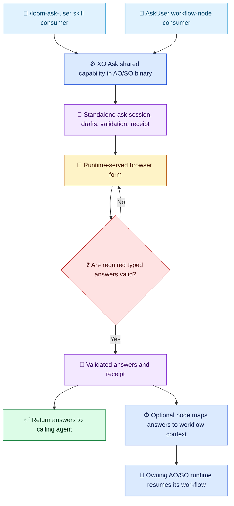

# XO Ask Architecture

[简体中文](../../zh-cn/architecture/ask-user-design.md) | [Architecture index](README.md)

## Decision

XO Ask is a workflow-independent question-and-answer capability shared by the existing AgentOrchestrator (AO) and SkillOrchestrator (SO) runtime binaries. `XO` is shorthand for either product's existing `O`; it is not a third product, package family, or executable. The common implementation belongs in `Techne.Loom.Common` and ships inside the same-version AO/SO self-contained runtime package closure.

There are two peer consumers:

1. `/loom-ask-user` is the agent-facing consumer. It converts a caller's question section into one ordered typed ask contract, starts a standalone ask session, and returns validated answers and a receipt. It has no workflow template, `WorkflowInstance`, `AskUser` node, `WaitResume`, or workflow-context prerequisite.
2. The existing `AskUser` workflow node is the workflow-facing consumer. It declares node-owned questions, supplies workflow mappings, consumes the same kind of ask result, validates projection, and asks the owning runtime to resume its canonical workflow copy.

Neither consumer depends on the other. The node path remains an optional adapter; it does not define or constrain the standalone skill path. No new product or package family is introduced.

## XO Ask and Consumer Ownership

The shared binary capability owns ask-session identity, the versioned question contract, answer validation, the browser session, local draft/receipt storage, and the standalone result handoff. It never creates, locks, mutates, or resumes a `WorkflowInstance`.

The standalone skill sends questions without workflow paths and receives answers keyed by stable question ID plus an ask receipt. The workflow node may attach `contextPath` mappings; for that consumer only, `requiredInputs` remains a path list and SO continues to require every user-owned path in `validation.declaredUserOwnedFields`. The node's owning product runtime alone applies the accepted receipt to workflow state and resumes.

Legend: 🧭 peer consumer (blue); ⚙️ shared binary or optional node adapter (blue); 💬 user interaction (amber); 🧾 ask state/result (violet); ❓ validation (red); 🔁 optional workflow continuation (teal); ✅ standalone result (green). Labels and symbols carry meaning independently of color.

## Current Published Gap

The verified SO `0.3.334-beta` apphost `--help` does not expose a standalone `ask` command; the AO apphost checked from the same runtime source line also lacks that entry. The workflow-owned AskUser UI exists, but that does not satisfy the workflow-independent skill contract. Do not describe the target standalone path as shipped until an exact published AO/SO binary exposes it. The required binary dependency is real; the workflow dependency is not part of the target architecture.

## Question Contract

The shared contract contains ordered `questionGroups` and ordered questions with stable IDs, user-facing context/intent/prompt, answer type, required state, options where applicable, defaults, help text, and type-specific constraints. It supports `singleChoice`, `multipleChoice`, `text`, `number`, `boolean`, `file`, and `audio`.

A standalone question does not require `contextPath`. The workflow-node adapter may add a `contextPath` mapping; this mapping is consumer metadata, not an infrastructure prerequisite. `requiredInputs` stays a path list on the node path and is not reused as the standalone question schema. Defaults prefill but do not satisfy required questions. Optional questions may be skipped; required questions may not.

Choice questions use stable option values. `Other` is one mutually exclusive free-text answer for `singleChoice`; in `multipleChoice`, it counts as one selection. All consumers use the same Common server validator and normalized answer semantics.

## Sessions, Results, and Persistence

Every ask has an ask-session ID independent of workflow identifiers. Local drafts and submission receipts are stored under a user-scoped ask store with configurable TTL and resource quotas. The standalone result returns both the typed answer set and receipt to the caller; callers may retain the receipt for audit/retrieval without creating a `WorkflowInstance`.

A workflow-node consumer may attach optional workflow correlation and mapping data. That adapter validates the complete receipt before writing workflow context/history, uses the existing operation ledger for replay/conflict semantics, and delegates resume to its owning AO or SO runtime. The shared worker never holds the workflow file lock and never changes workflow state.

The server validates the whole answer set and bindings before accepting a receipt. Invalid answers do not consume the ask session. A single valid submission wins atomically; exact idempotent retry returns the original receipt, while conflicting content fails closed.

## Runtime and Package Selection

`XO Ask` is delivered by the existing self-contained AO and SO runtime package closure; it does not introduce an XO package. Skills bind an exact published AO/SO release-set version and host RID. For `/loom-ask-user`, reuse either valid same-version package in the standard NuGet cache; when neither is cached, prefer acquiring the exact AO package. Never use floating `latest`, cross RID/OS/libc boundaries, or fall back to a local/test runtime.

Before use, verify exact package identity/version/RID, registration SHA-512, nuspec, runtime manifest, safe archive paths, and apphost. Invoke that apphost directly, capture a fresh `--guide`, and verify the standalone command is present. The version marker tracks the shared release-set version; it is not a feature-capability assertion.

## Browser Safety

The binary serves the browser form on loopback by default. Use only host-approved routes, strict Host/Origin validation, one-time pairing, and ask-scoped session credentials. Pairing URLs are secrets and must not appear in ordinary output, logs, or audit artifacts. Do not infer public addresses, create tunnels, or fetch arbitrary remote attachments. Remote access, if supported by the host, is explicitly configured and uses a trusted HTTPS proxy.

## Optional Workflow Node Adapter

The node path preserves the current workflow model: no new workflow step kind; `AskUser`/`WaitResume` remain the workflow-facing contract. `CommandTransition.UserInput` is an optional, versioned question adapter for that node. Untyped existing node behavior remains compatible. Workflow schema export includes the node contract, while standalone skill requests use the shared ask contract directly.
