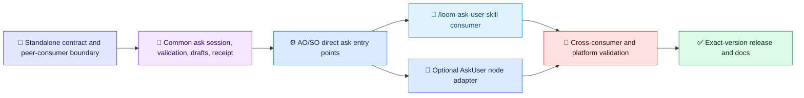

# XO Ask Implementation Plan

[简体中文](../../zh-cn/architecture/ask-user-implementation-plan.md) | [Architecture index](README.md) | [Design](ask-user-design.md)

## Scope and Current Status

Implement workflow-independent XO Ask in the shared `Techne.Loom.Common` layer and expose it through the existing AO and SO self-contained runtime binaries. `XO` is shorthand for AO or SO, not a third product or package family. The workflow-independent `/loom-ask-user` skill and the `AskUser` workflow node are peer consumers; neither depends on the other.

The current published `0.3.334-beta` package set has the workflow-owned AskUser browser path but no standalone `ask` command in the verified CLI help. This plan does not treat the current path as the target contract. The binary capability must ship before the skill can truthfully claim standalone operation.

Preserve the workflow node as an optional adapter. It may keep `CommandTransition.UserInput`, `requiredInputs`, SO `validation.declaredUserOwnedFields`, context projection, and the owning product's resume. None of those are required for standalone ask sessions. AO and SO remain independent products with separate CLI/package identities and one exact-version release-set closure.

## Delivery Order

Legend: 📜 contract (indigo); 🧾 persisted ask data (violet); ⚙️ runtime binary/node adapter (blue); 🧭 skill consumer (light blue); 🔎 validation (red); ✅ release (green). The skill and node are sibling branches from the shared binary capability.

### 1. Standalone Contract and Identity

- Define a versioned `questionGroups` contract that does not require `WorkflowInstance`, node ID, transition ID, `contextPath`, or `requiredInputs`.
- Keep stable question IDs, ordered groups, context/intent/prompt, required state, answer type, options/defaults, and type constraints. Preserve the existing seven answer types and `Other` free-text semantics.
- Define an ask-session ID, answer return shape, receipt, idempotency, expiry, local store ownership, and direct result handoff to the caller.
- Specify optional consumer correlation metadata without making workflow identity mandatory.

Gate: standalone contract fixtures compile and validate with zero workflow fields; legacy node `UserInput` fixtures remain compatible.

### 2. Common Session and Submission Core

- Refactor the shared ask session/store so an ask can exist without workflow instance or transition identifiers.
- Keep draft, attachment, final answer, receipt integrity, TTL, quota, single-submission, and exact retry/conflict semantics owned by the ask session.
- The shared worker validates and persists ask data only. It never mutates or locks workflow state or performs resume.
- Preserve pairing secrecy, loopback default, host-approved routes, CSRF/Host/Origin protections, and safe attachment handling.

Gate: standalone store tests cover restartable drafts, valid receipt, duplicate/conflict behavior, expiry, quotas, and the absence of workflow state mutation.

### 3. AO/SO Binary Entry Points

- Expose `ao ask start --contract-file <path>` and `so ask start --contract-file <path>`, plus matching `ao ask result --ask-id <id>` and `so ask result --ask-id <id>` operations, through the same Common implementation.
- Return a machine-readable endpoint/result descriptor with ask ID, approved URL, expiry, and receipt/result lookup metadata. Do not emit pairing URLs in ordinary logs.
- Resolve exact published AO/SO release-set version and RID. Reuse a verified same-version AO or SO package from the standard cache; if neither exists, prefer exact AO acquisition. Never use floating versions or a third XO package.
- Preserve direct self-contained apphost launch and fresh `--guide` validation.

Gate: AO and SO independently start the same standalone contract, serve one ask session, and return typed answers plus receipt; no workflow file is supplied.

### 4. Peer Consumers

- Skill consumer: turn caller questions into the shared contract, invoke the exact AO/SO binary, present the approved form route, and return typed answers plus receipt. Do not create, require, or resume a workflow.
- Workflow-node consumer: preserve `AskUser`/`WaitResume`; translate `CommandTransition.UserInput` to the shared contract, add node-owned context mappings, validate `requiredInputs` and SO user-owned-field declarations, and let the owning product runtime project/resume the same canonical workflow.
- Do not implement the skill by calling the node or implement the node by invoking the skill. Both depend only on the shared XO Ask infrastructure.

Gate: tests prove each consumer can run independently and that removing either consumer leaves the other functional.

### 5. Release, Documentation, and Validation

- Update bilingual architecture, guide, skill/reference, navigation, root instructions, release marker automation, and memory to distinguish infrastructure, skill, and node.
- The published version marker records the exact shared AO/SO release-set version; it must not imply capability. Fresh help/guide evidence decides whether an exact package exposes standalone ask.
- Keep the current `.334-beta` limitation explicit until a published binary contains the new command.
- Run focused tests, Windows and native WSL restore/build/test in parallel with isolated outputs, and AO/SO schema/demo evidence through exact published apphosts before release.

Gate: all documentation claims match published CLI behavior; release closure contains only the existing 16 AO/SO RID runtime packages; standalone and optional node-consumer tests pass.

## Non-Goals

- No third `XO` product, binary, package family, or release channel.
- No workflow requirement, workflow template, governance run, or implicit resume for standalone `/loom-ask-user`.
- No removal of the existing `AskUser` workflow node or its owner-controlled resume semantics.
- No silent fallback to agent-native question tools when the requested standalone binary capability is missing.
