# Structured AskUser Implementation Plan

[简体中文](../../zh-cn/architecture/ask-user-implementation-plan.md) | [Architecture index](README.md) | [Design](ask-user-design.md)

## Scope and Invariants

Deliver structured forms on the existing `AskUser`/`WaitResume` path for the Loom Agent Plan-Execution Orchestrator (AO) and SkillOrchestrator (SO). Preserve existing untyped workflows and product boundaries. Put shared contract, validation, storage, and worker behavior in framework-neutral Common code; integrate each product through its current execution and resume owner.

The worker owns only ask-scoped drafts, validation, attachment bytes, and submission receipts. It never locks, mutates, or resumes a workflow. The owning AO or SO path reads one accepted receipt and performs typed validation before the existing resume mutation. No new workflow step kind, product, package family, mutable workflow-state copy, or cross-Agent answer-bundle transport is in scope.

## Delivery Slices

The route below is an explanatory implementation sequence, not workflow JSON or a `WorkflowInstance`.

```mermaid
flowchart LR
    BASE["✅ Runtime baseline<br/>completed"] --> CONTRACT["📜 Contract and validator"]
    CONTRACT --> STORE["🧾 Ask store and submission core"]
    STORE --> CLIENT["💬 Worker, wizard, and clients"]
    CLIENT --> HOSTS["⚙️ AO and SO integration"]
    HOSTS --> CROSS["🔍 Cross-platform and security gates"]
    CROSS --> REVIEW["🚀 Review, commit, and fast-forward"]

    classDef complete fill:#dcfce7,stroke:#15803d,color:#052e16;
    classDef contract fill:#e0e7ff,stroke:#3730a3,color:#1e1b4b;
    classDef evidence fill:#f3e8ff,stroke:#7e22ce,color:#3b0764;
    classDef user fill:#fef3c7,stroke:#b45309,color:#451a03;
    classDef runtime fill:#dbeafe,stroke:#1d4ed8,color:#172554;
    classDef validation fill:#fee2e2,stroke:#b91c1c,color:#450a0a;
    classDef delivery fill:#ccfbf1,stroke:#0f766e,color:#042f2e;
    class BASE complete;
    class CONTRACT contract;
    class STORE evidence;
    class CLIENT user;
    class HOSTS runtime;
    class CROSS validation;
    class REVIEW delivery;
```

Legend: ✅ completed baseline (green); 📜 contract (indigo); 🧾 persistence (violet); 💬 user-facing surfaces (amber); ⚙️ product runtime integration (blue); 🔍 validation (red); 🚀 delivery (teal).

Each slice is reviewed and validated before the next begins. Keep each reviewable slice below 50 changed files where practical, and commit only reviewed work.

### 1. Contract and Validator

- Add an optional, versioned `CommandTransition.UserInput` contract with stable ordered question groups/questions and the supported choice, text, number, boolean, file, and audio types.
- Keep `requiredInputs` as context paths. Validate unique IDs, references, type-specific constraints, bindings, answer values, required answers, and explicit optional skips.
- Preserve absent-contract behavior and deserialize older workflow JSON unchanged. Do not silently interpret unknown contract versions.
- Add contract and Common validator tests, including invalid input proving rejection occurs before workflow context/history mutation.

Gate: focused contract/validator tests pass; old untyped workflow fixtures deserialize and retain current behavior.

### 2. Ask-Scoped Store and Submission Core

- Implement isolated ask state, restart-safe drafts, generation compare-and-swap, cross-process exclusion, atomic persistence, and single-winner submission.
- Store a receipt with the schema version, ask/workflow identity, generation, operation ID, normalized answers, attachment metadata, timestamps, and integrity hashes. Keep worker state separate from the canonical `WorkflowInstance`.
- Define retry behavior: the same operation ID and identical payload replays the original receipt; the same ID with different content conflicts; stale generations and all later competing submissions conflict without replacing the winner.
- Apply bounded expiry and quota cleanup without touching workflow state.

Gate: restart, atomicity, generation race, operation replay/conflict, and cleanup tests pass across concurrent controllers.

### 3. Worker and Client Surfaces

- Host a detached Common worker with the selected BCL `HttpListener`, loopback-only default, bounded one-second polls that return pending, safe process cleanup, and no Kestrel dependency.
- Serve a static linear browser wizard that uses the exact Common schema/answer contract and shared network submit core. Support refresh/restart-safe drafts, required/default/skip behavior, Back/Next, and one final submission.
- Provide a JSON/curl surface against the same draft and submit core. Provide offline `file://` export and JSON download with parity-tested validation for cases that cannot use a live worker.
- Provide upload and user-triggered browser recording through one attachment pipeline. Validate streamed bytes, SHA-256, length, media type, per-file and aggregate size, and quota; do not fetch arbitrary remote URLs.

Gate: browser, JSON, offline export, file upload, and recording/unsupported-browser tests agree on payload and validation results; worker survives host command return and cleans up at ask expiry.

### 4. AO and SO Integration

- Wire AO file execution/MCP and SO CLI execution into the shared ask worker using each product's current runtime/package/apphost ownership.
- Create the request only for an existing `AskUser` active wait group; keep workflow locks and canonical state under the existing owning execution service.
- Consume a receipt through the existing product-specific resume path. Validate the complete typed answer before resume mutates context or history; preserve event log, operation ledger, run identity, and wait-group invariants.
- Preserve SO's `requiredInputs` and `validation.declaredUserOwnedFields` ownership rule. Runtime-owned values and generated artifact paths remain on runtime-owned `WaitResume` seams.
- Add opt-in remote access only behind explicit owner configuration, HTTPS at a trusted proxy, strict Host/Origin allowlists, and trusted-proxy validation. Keep loopback as the default.

Gate: AO and SO each pass an end-to-end AskUser run/resume test, malformed/stale/duplicate receipt tests, and compatibility tests without sharing runtime ownership.

### 5. Cross-Platform and Security Validation

- Complete focused feature tests, then run Windows and native WSL Linux restore, build, and test jobs in parallel with isolated intermediate/output directories and separate result capture.
- If WSL lacks a .NET SDK, install/provision a supported SDK in that distro before running the required Linux gates; report any genuine environment blocker rather than treating missing tooling as a pass.
- Exercise permissions, URL/credential leakage, CSRF, Host/Origin rejection, upload bounds, quotas, races, restart recovery, retention, and process cleanup on both platforms.
- Generate final AO and SO schema/demo evidence using each matching self-contained RID apphost; compile each exported demo with that exact runtime version. Keep generated artifacts outside source unless explicitly requested.

Gate: all required Windows/WSL gates and AO/SO schema/demo compile evidence pass, or remaining environment blockers are recorded precisely.

### 6. Review and Delivery

- Review the full diff for compatibility, independent AO/SO ownership, security, atomicity, test gaps, and accidental generated artifacts. Fix and revalidate findings before delivery.
- Commit the reviewed result on the isolated implementation branch. Do not push or publish.
- Confirm the original `development` worktree is still at the starting commit and has no user changes, then fast-forward it to the reviewed commit. If it moved or became dirty, stop before integrating and preserve its state.
- Recheck both worktrees and report the commit, validation evidence, and any remaining caveat.

## Evidence and Reporting

Use the isolated execution output root for downloaded runtimes, generated workflow instances, compile/run audit material, build outputs, and per-platform test results. Keep provenance for the exact AO/SO runtime version and RID used to export and compile schema/demo evidence. Do not treat generated compile HTML as Analysis or Dataflow evidence unless those reports were actually emitted.

The process route is explanatory. Any workflow JSON or `WorkflowInstance` example added later must include a same-version direct-apphost `ao compile` or `so compile` Mermaid evidence artifact, as required by repository rules.
