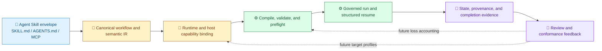

# Skill Interoperability

[中文](../../zh-cn/architecture/skill-interoperability.md) | [Architecture](README.md) | [Root](../README.md)

> Status note: this page records the product boundary and public evidence reviewed on 2026-09-21. External issue reports describe real host behavior, but they are not claims that every installation fails in the same way.

Techne Loom is a **verifiable semantic and execution interoperability layer above Agent Skills**.

It does not replace the Agent Skills envelope. It consumes `SKILL.md`, `AGENTS.md`, MCP, scripts, and host configuration where those surfaces already exist. Loom adds a place to make workflow meaning, runtime identity, state transitions, handoffs, and completion evidence explicit.

## The Product Question

A shared `SKILL.md` is only the starting point. The operational question is whether the same intended work can be discovered, prepared, executed, paused, resumed, reviewed, and explained when the host changes.

Community reports show that the fragile part is often outside the model prompt:

1. a loader may skip a file symlink, use a different precedence rule, or serve stale cached content;
2. a specification, validator, and shipping runtime may disagree about metadata or encoding;
3. local, cloud, IDE, CLI, and device copies may not share one canonical source;
4. tools, MCP servers, permissions, credentials, and runtime dependencies may differ by session;
5. a long-running handoff may have no durable state, completion proof, or observable resume point.

Loom treats these as contracts and evidence problems. It does not claim to solve model behavior that the host cannot observe or enforce.

## Five Failure Surfaces

| Failure surface | What users experience | Loom's engineering response | Current boundary |
| --- | --- | --- | --- |
| Discovery, precedence, and cache | A valid skill is missing, overridden, or loaded from an old copy | Canonical workflow identity, checked-in templates, exact runtime binding, external workflow copies, and preflight evidence | Host-specific materialization and adapters are still being formed |
| Schema and loader drift | The same frontmatter is accepted by one layer and rejected by another | Parse/compile diagnostics, structured compile feedback, explicit contract fields, and target-specific validation as a future adapter concern | Loom does not rewrite a vendor loader |
| Source and surface drift | Local, cloud, IDE, and CLI surfaces show different files or versions | Locked package/runtime evidence, hashes, provenance, and a workflow copy that is independent of chat history | Account-level sync is a host concern |
| Tools, MCP, and permissions | A skill is surfaced even though a required tool, credential, or permission is absent | Runtime preflight, exact package closure, descriptor-owned local stdio MCP, bounded inspection, and explicit gates | There is no universal cross-host permission or sandbox model today |
| State, handoff, and completion | A background task looks idle, a handoff loses context, or "done" cannot be proven | Disk-backed state, wait/resume, operation identity, structured boundary payloads, event logs, audit artifacts, and terminal output gates | Vendor transcripts remain views, not a portable state standard |

## Layered Model

The model keeps open ecosystem inputs and Loom governance separate:

The canonical source remains the skill package. Generated host materializations must not become a second source of truth.

## Current Loom Foundation

The current public runtime already supports the parts that make governed execution meaningful:

| Foundation | Evidence in the public contract |
| --- | --- |
| Workflow IR | `WorkflowInstance`, states, transitions, transition groups, routes, seams, ownership, output bindings, and workflow identity |
| Deterministic validation | Compile feedback, expression capability checks, route/gate validation, semantic probes, and explicit no-progress handling |
| Runtime identity | Exact package locks, runtime mode/RID binding, launch descriptors, dependency closure, and fresh guide metadata |
| Resumable execution | Disk-backed workflow copies, wait states, operation identity, structured result envelopes, and `run`/`resume` surfaces |
| Governed MCP entry | Local stdio MCP, `initialize`/`initialized`, descriptor identity, bounded fragment inspection, and a recorded CLI fallback reason |
| Evidence and provenance | Mermaid, HTML, workflow JSON, event sidecars, package/document hashes, audit summaries, and terminal output evidence |

This is why Loom is more than a Markdown workflow helper. It is also why the current product claim must remain narrower than a finished Claude-to-Codex-to-Gemini compiler.

## Community Evidence

The following reports are useful because they expose engineering boundaries rather than merely reporting that a model made a poor choice. Status labels refer to the linked issue as reviewed on 2026-09-21.

| Source | Reported behavior | Loom response | Status and honest scope |
| --- | --- | --- | --- |
| [OpenAI Codex #15756](https://github.com/openai/codex/issues/15756) | A file-level `SKILL.md` symlink was omitted while a symlinked directory was followed; later comments included a reproduction on `0.147.0`. | Materialize a target-safe package from one canonical source, then run a host-specific discovery probe before claiming readiness. | Closed as not planned in the linked issue. This supports a conformance fixture, not a claim that Loom fixes Codex. |
| [Anthropic Claude Code #21428](https://github.com/anthropics/claude-code/issues/21428) | User skills were reported as undiscovered, while cached execution content stayed old after metadata changed. | Bind content/version identity to the generated artifact and compare discovered metadata with the execution payload in a future host probe. | Closed/locked by the linked issue workflow. The report remains evidence for stale-copy and cache checks. |
| [Google Gemini CLI #29150](https://github.com/google-gemini/gemini-cli/issues/29150) | Case variants could defeat precedence and active-state lookup even though the host compared names case-insensitively elsewhere. | Normalize canonical identity, detect collisions, and generate precedence/activation fixtures for each target profile. | Open and marked for triage in the linked issue; a related fix PR is referenced there. |
| [Agent Skills #514](https://github.com/agentskills/agentskills/issues/514) | Metadata prose, the reference validator, and a shipping runtime were described as accepting different shapes. | Keep portable core fields separate from host extensions; flatten, preserve, warn, or reject with field-level loss diagnostics. | Open specification discussion. Loom should report loss rather than silently promise equivalence. |
| [Agent Skills #485](https://github.com/agentskills/agentskills/issues/485) | A skill may be surfaced even when required tools are absent or session-specific MCP entitlements differ. | Use capability manifests and MCP preflight gates before a governed workflow is activated. | Open proposal. Machine-evaluable dependency mapping is a planned interoperability surface. |
| [OpenCode #48400](https://github.com/anomalyco/opencode/issues/48400) | Permission by skill ID alone cannot distinguish a trusted global skill from a project-local replacement. | Carry source, scope, and provenance through a future policy IR; fail closed or ask for approval when the host cannot express it. | Open feature request. Loom does not claim to provide OpenCode permission integration today. |

These reports justify validation work. They do not justify saying that every host has the same defect, that a single adapter guarantees semantic equivalence, or that Loom can force a model to invoke a skill.

## What Is Productized Now

A team can adopt Loom today when the problem is deterministic execution and defensible evidence:

- turn prompt-shaped intent into a checked-in workflow contract;
- compile and validate transitions, expressions, routes, gates, ownership, and output families;
- bind execution to an exact runtime bundle and launch descriptor;
- run against a workflow copy outside the checked-in source template;
- stop at an explicit external seam with structured continuation data;
- resume from disk-backed state instead of relying on chat memory;
- emit artifacts that let reviewers reconstruct what happened.

Start with [Using Techne Loom Skills](../guides/skill-usage.md) and `/loom-skill-enhancement` for an existing skill being enhanced.

## What Loom Does Not Promise

- It does not replace `SKILL.md`, `AGENTS.md`, MCP, or vendor plugin packaging.
- It does not guarantee model activation, instruction following, or identical model output.
- It does not unify vendor sandbox, filesystem, network, credential, consent, or background-agent policies.
- It is not yet a finished bidirectional transpiler for Claude, Codex, Gemini CLI, Copilot, Cursor, OpenCode, or every future host.
- It does not make a compile-clean workflow proof of cross-host behavioral equivalence.
- It does not treat a chat transcript as a portable execution database.

## Roadmap From This Foundation

| Stage | Deliverable | Proof required |
| --- | --- | --- |
| Current | Workflow IR, compile/validation, exact runtime binding, governed run/resume, local MCP, provenance, and audit evidence | Repository contracts, tests, package locks, and generated artifacts |
| Next | `loom-target-profile`, read-only host adapters, activation/script/MCP/permission/resume probes, and machine-readable semantic loss reports | Fixed fixtures across real host versions with preserved/approximated/dropped/unsafe fields |
| Following | Dependency/environment contracts, policy IR, host matrix conformance, signed package/SBOM/trust metadata | Reproducible cross-host corpus and fail-closed security checks |

The investment test is concrete: run three to five real skills against a fixed task corpus on five hosts, compare manual materialization with Loom output, and publish both the wins and the losses.

## Related Contracts

- [Workflow Model](workflow-model.md)
- [Execution Model](execution-model.md)
- [CLI and Hosts](cli-and-hosts.md)
- [CLI Reference](../reference/cli.md)
- [MCP Reference](../reference/mcp.md)
- [Skills Input/Output Reference](../reference/skills.md)
- [Implementation Roadmap](implementation-roadmap.md)
