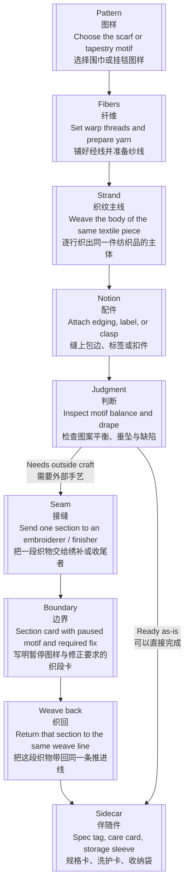
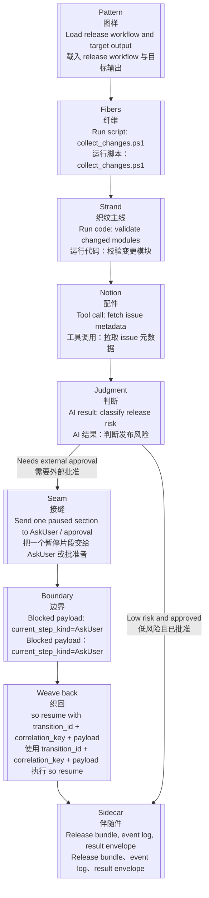

# Workflow Terminology / Workflow 术语

[Root](../README.md)

This page is the repo-level vocabulary root for explaining AO and SO workflow behavior.

本页是整个仓库解释 AO 与 SO workflow 行为时的术语根文档。

Techne Loom uses loom metaphors to explain ownership transfer, waiting, and structured continuation without hiding the current wire or code contracts.

Techne Loom 使用编织隐喻解释所有权转移、等待和结构化延续，但不会掩盖当前实际使用的 wire 或 code 契约。

## Interpretation Rule / 解读规则

- Use this glossary in explanatory prose across AO and SO docs.
- AO 与 SO 文档中的解释性 prose 统一使用这份术语表。
- Keep current wire fields, enum values, and step kinds explicit when they are the implemented contract.
- 如果 wire 字段、enum 值或 step kind 已经属于实现契约，必须保留其精确写法。
- When a metaphor term and a current wire name differ, name both the first time.
- 当隐喻术语与当前 wire 名称不同时，第一次出现时同时写出两者。
- AO and SO share this vocabulary at the workflow-explanation layer only; they do not become one runtime.
- AO 与 SO 只在 workflow 解释层共享这套词汇，并不会因此变成同一个 runtime。

## Related Docs / 相关文档

- [Execution Model / 执行模型](execution-model.md)
- [CLI And Hosts / CLI 与宿主](cli-and-hosts.md)
- [Skill-Driven Workflow Example / Skill 驱动 Workflow 示例](../examples/skill-driven-workflow.md)
- [Loom Agent Execution Orchestrator Guide](../reference/products/ao-guide.md)
- [SkillOrchestrator Guide](../reference/products/so-guide.md)

## Human-Friendly Status Mapping / 人类友好状态映射

This table is the single source of truth for human-facing wording across every skill surface, including AO skills, SO skills, `so-*` skills, and Loom-governanced target skills. Keep the exact internal token only in machine-readable contracts, source code, logs, audit evidence, and other implementation-facing surfaces; use the human-friendly wording in user-facing status, explanations, errors, and questions.

这张表是所有 skill 表面的用户可见表达唯一真理源，包括 AO skill、SO skill、`so-*` skill 以及 Loom-governanced target skill。精确的内部字面值只能保留在机器可读契约、源代码、日志、审计证据和其他实现侧表面；用户可见的状态、说明、错误和提问必须使用面向人的表达。

| Internal workflow token / 内部 workflow 字面值 | English human-facing wording / 英文面向人表达 | 中文面向人表达 | Usage rule / 使用规则 |
| --- | --- | --- | --- |
| `Done` | The requested work is complete. | 请求的工作已完成。 | Do not present `Done` as the default user-facing status. / 不要把 `Done` 作为默认的用户可见状态。 |
| `noop` | No action is needed. | 不需要采取任何操作。 | Explain why no action is needed when useful. / 必要时说明为什么不需要采取操作。 |
| `WaitResume` | Waiting for your information or confirmation before continuing. | 正在等待你的信息或确认后再继续。 | Ask for the concrete missing input or decision. / 询问具体缺少的信息或需要作出的决定。 |
| `SubagentCall` | A specialist analysis step is running. | 专项分析步骤正在运行。 | Describe the specialist task when it helps the user understand progress. / 在有助于理解进度时说明专项任务内容。 |
| `gate` | A required check or approval check. | 必需检查或批准检查。 | State what must be checked or approved. / 说明必须检查或批准的具体内容。 |
| `transition` | The next step, or move to the next stage. | 下一步，或进入下一阶段。 | Describe the action or destination rather than the internal transition. / 描述具体动作或目标阶段，不要只说内部 transition。 |

| `seam` / `handoff` | A point where the task is passed to another person or system. | 把任务交给另一个人或程序处理的交接点。 | Explain who must act next. / 说明下一步由谁处理。 |
| `boundary` | The task is waiting for information before it can continue. | 任务正在等待信息，暂时无法继续。 | Say what information is missing. / 说明缺什么信息。 |
| `frontier` | The possible next actions. | 可以选择的下一步。 | List the actions instead of the internal word. / 列出具体动作，不要只说内部词。 |
| `runtime` | The program currently doing the work. | 当前正在执行任务的程序。 | Name the action it is running when useful. / 必要时说明它正在执行的动作。 |
| `workflow copy` | The same saved run. | 同一次保存的执行。 | Keep the same saved run when continuing. / 继续时保持同一次保存的执行。 |
| `audit root` | The output folder that holds the records. | 存放记录的输出目录。 | Say that the folder stores records. / 说明这个目录用于存放记录。 |
| `render unchanged` | The earlier diagram is still valid; no new diagram was needed. | 之前的图仍然有效，不需要新图。 | Do not make the user infer this from a flag. / 不要让用户从标记自行推断。 |

User questions must request a concrete human action or decision. Use wording such as “Please choose whether to continue” or “Please provide the remote branch name”; in Chinese, use “请你选择是否继续” or “请提供远程分支”。 Do not ask users to provide internal statuses, node kinds, transition data, gate results, or runtime-owned artifact details.

用户问题必须要求具体的人类操作或决定。例如使用 “Please choose whether to continue” 或 “Please provide the remote branch name”；中文使用“请你选择是否继续”或“请提供远程分支”。不要要求用户提供内部状态、节点类型、transition 数据、检查结果或 runtime 所有的产物路径。

The table applies equally to AO, SO, `so-*`, and every Loom-governanced target skill. The same file is intentionally bilingual so English and Chinese wording cannot drift into separate authorities.

这张表同样适用于 AO、SO、`so-*` 以及所有 Loom-governanced target skill。文件特意采用中英合一的形式，避免英文和中文措辞漂移成两套独立规范。

## Plain-Language Feedback For Every Language / 所有语言的普通人反馈

This glossary is for people maintaining the product. It is not a script for talking to users. Every user-facing update from AO, SO, or a Loom-governanced target skill must use the user's requested language and ordinary words. English is not automatically plain language.

Write for a high-school reader with no workflow background. Use short sentences and direct verbs. Say, in order: what happened, whether the user's work or data is still safe, why it happened, and what happens next.

Do not make the first explanation depend on status values, step kinds, node IDs, gate names, handoff terms, runtime details, or audit jargon. Explain any necessary technical word in plain language before showing the exact term. Keep exact commands, paths, IDs, and evidence fields in a separate technical-details section when they are needed for action or verification.

这份术语表用于产品维护，不是让用户照着学习后才能得到反馈。AO、SO 和所有 Loom 治理 target skill 的用户可见更新，都必须使用用户指定的语言和日常词汇；英文也不天然等于简单语言。

反馈要让不了解 workflow 的高中生看懂，使用短句和直接的动词，并按顺序说明：发生了什么、用户的工作或数据是否仍然安全、为什么会这样、下一步做什么。

第一层说明不能依赖状态值、步骤类型、节点 ID、检查名称、交接术语、运行时细节或审计术语。必须使用技术词时，先用普通语言解释，再给出精确字面值。命令、路径、ID 和 evidence 字段只有在帮助用户操作或核对结果时，才放到单独的技术细节小节。

## Plain-Language Feedback Examples / 面向普通人的反馈示例

The examples below show the idea in English and Chinese. For any other language, translate the meaning and keep the same simple sentence order. Do not copy English into a different-language response.

下面的例子用英文和中文展示表达方式。遇到其他语言时，要翻译其中的意思并保持同样的简单句子顺序，不要把英文原样发给其他语言的用户。

### 1. The output folder already has a record / 输出目录已经有记录

Technical record: `step-0008-compiled` already exists; `render unchanged`.

Plain-language English: "The task itself is fine. The output folder already has the earlier record, so this run did not overwrite it. The earlier diagram and report are still valid. I will use a new output folder and continue the same saved run."

Plain-language Chinese: 任务本身没有问题。输出目录里已经有之前的记录，所以这次没有覆盖它。之前的图和报告仍然有效。我会换一个新的输出目录，继续同一次保存的执行。

### 2. The review found unresolved problems / 审查发现还有问题

Technical record: the review returned four findings, but the clean-review check was claimed before classification and repair.

Plain-language English: "The review found four problems. The process stopped too early because it treated the review as finished instead of checking whether the problems were fixed. I will sort and fix the four problems, then check again."

Plain-language Chinese: 审查发现了 4 个问题。流程过早停住了，因为它把收到审查结果当成问题已经修好，没有先确认问题是否解决。我会先把这 4 个问题分类并修复，然后再检查一次。

### 3. The task needs a decision / 任务需要一个决定

Technical record: the task is waiting at a user-input step.

Plain-language English: "I need one decision from you before I can continue: [state the decision in one short sentence]."

Plain-language Chinese: 我需要你先做一个决定才能继续：[用一句短话说清楚需要决定什么]。

Use the user's requested language for the final message. Keep exact commands, paths, IDs, and evidence fields in a separate technical-details section only when they help the user act or verify the result.

## Core Terms / 核心术语

| Term / 术语 | Meaning / 含义 | Current technical anchor / 当前技术锚点 |
| --- | --- | --- |
| Pattern / 图样 | The authored route or intended workflow design. 作者写下的路线或预期的 workflow 设计。 | Workflow definition, workflow file, workflow schema Workflow definition、workflow file、workflow schema |
| Strand / 推进线 | One current line of progression through a workflow instance. Use this instead of `thread` in repo docs. 一条 workflow instance 中当前正在推进的执行线。仓库文档中用它替代 `thread`。 | Current node, current focus, current execution line 当前 node、当前焦点、当前执行线 |
| Seam / 接缝 | The conceptual join where control crosses owners. 控制权跨越所有者时形成的概念接缝。 | Protocol fields such as `boundary_reason`, `weave_out_request`, or blocked step kinds such as `current_step_kind` 例如 `boundary_reason`、`weave_out_request` 或 `current_step_kind` 等协议字段 |
| Weave out / 织出 | The runtime hands work or control outward and waits for structured continuation. runtime 把工作或控制权交给外部，并等待结构化延续。 | AO control seams use blocked payload fields such as `boundary_reason` and `weave_out_request`; SO external-participation seams use blocked step kinds such as `current_step_kind` AO 控制接缝使用 `boundary_reason`、`weave_out_request` 等 blocked payload 字段；SO 外部参与接缝使用 `current_step_kind` 等 blocked step kind |
| Weave back / 织回 | An external participant returns structured data that re-enters the same strand and allows resume. 外部参与方返回结构化数据，重新进入同一条推进线并允许恢复。 | `dotnet ao.dll resume`, `dotnet so.dll resume`, result envelopes `dotnet ao.dll resume`、`dotnet so.dll resume`、result envelope |
| Boundary / 边界 | The formal protocol term for a machine-readable blocked or returned control state. 机器可读的阻塞或返回控制状态的正式协议术语。 | `boundary_reason`, `<so_property>` with `type: "boundary"` `boundary_reason`、`type: "boundary"` 的 `<so_property>` |
| Boundary check / 边界检查 | The compulsory pre-advance validation of the current node or transition on the exact external runtime workflow copy, before any next step may proceed. 在精确的外部 runtime workflow copy 上，对当前 node 或 transition 执行的强制前置校验；任何下一步都必须先通过它。 | SO governed routes; gate predicates (`passExpression` / `succeedExpression`) plus route coverage, seam ownership, and strongest-earned blocked or terminal business-output gates SO governed route；gate predicate（`passExpression` / `succeedExpression`）以及 route coverage、seam ownership、strongest-earned blocked 或 terminal business-output gate |
| Approval gate / 批准检查 | The required explicit approval or structured continuation instruction that must follow a passing boundary check before the next step advances. 边界检查通过后，下一步推进前必须获得的明确批准或结构化延续指令。 | `AskUser` seams for declared user-owned fields or decisions; structured non-human continuation payloads for machine-continuable seams such as `WaitResume` 针对已声明 user-owned 字段或决定的 `AskUser` seam；指向 `WaitResume` 等机器可延续 seam 的结构化非人类 continuation payload |
| Sidecar / 伴随件 | A companion artifact beside a workflow file. 附在 workflow file 旁边的伴生产物。 | Event logs, result envelopes, export files Event log、result envelope、导出文件 |

## AO And SO Interpretation / AO 与 SO 的解读方式

- **AO** is decision-first. It weaves out at control seams, then waits for a caller, outer agent, or host to decide what happens next.
- **AO** 以决策为先：在控制 seam 上 weave out，然后等待调用方、外部 agent 或 host 决定下一步。
- **SO** is execution-first. It weaves out only when it reaches an externally owned step kind such as `ModelThink`, `McpCall`, `SubagentCall`, `AskUser`, or `WaitResume`.
- **SO** 以执行为先：只有到达 `ModelThink`、`McpCall`、`SubagentCall`、`AskUser` 或 `WaitResume` 等外部拥有的 step kind 时才 weave out。
- A weave back is always structured. Prose alone is not a valid continuation surface for either product.
- weave back 始终必须是结构化的。单独的 prose 对任何一个产品都不是有效的延续面。

## Current Wire And Code Mapping / 当前 Wire 与 Code 映射

| Current term / 当前术语 | English reading / 英文解读 | 中文解读 |
| --- | --- | --- |
| `boundary_reason` | Why AO wove out at the current seam | AO 在当前 seam 上为什么 weave out |
| `weave_out_required` | AO wire value for the weave-out case that asks the outside world to perform comparison, planning, or similar analysis | AO wire 中表示“需要外界执行比较、规划或类似分析”的 weave-out 情况值 |
| `weave_out_request` | AO wire field carrying the structured data for that weave-out case | AO wire 中承载该 weave-out 情况结构化数据的字段 |
| `current_step_kind` on a blocked SO payload | Which SO seam caused the weave out | 这次 SO weave out 是由哪一种 seam 触发的 |
| `transition_id`, `correlation_key`, `payload` | The weave-back envelope fields used by both AO and SO resumes | AO 与 SO resume 共用的 weave-back envelope 字段 |
| `WaitResume` | An explicit model step kind that stays parked until a future weave back arrives | 一个会停在那里、直到未来某次 weave back 到来的显式模型 step kind |

## Textile Piece Metaphor / 纺织品隐喻

The loom metaphor is not decorative. A workflow can be read as weaving one finished textile piece. No single script, code path, tool call, or model judgment is the scarf, banner, or tapestry by itself. The textile appears only after threads are prepared, rows are woven into the same piece, special notions are attached, and one paused section can leave and re-enter that same weave line.

编织隐喻不是装饰。一个 workflow 可以理解为织成一件完整的纺织品。没有任何一个脚本、代码路径、工具调用或模型判断单独等于那条围巾、那幅挂毯或那件织物。成品只有在纱线备好、织纹织入同一件作品、特殊配件装上，并且暂停的一段可以离开后重新回到同一条推进线时才真正形成。

In that reading:

按这种理解：

- the **pattern** is the authored design for the final textile piece
- **pattern** 是最终纺织品的作者设计图样
- a **strand** is one current execution line weaving that same piece row by row
- **strand** 是当前逐行织出同一件成品的执行推进线
- a **seam** is the conceptual join where one section of the piece must leave the current owner and pass to another
- **seam** 是作品的一段必须离开当前所有者并交给另一位所有者时形成的概念接缝
- a **boundary** is the explicit handoff card or machine-readable stop record, such as `boundary_reason`, `weave_out_request`, or `type: "boundary"`
- **boundary** 是显式的交接卡或机器可读停点记录，例如 `boundary_reason`、`weave_out_request` 或 `type: "boundary"`
- a **sidecar** is the spec sheet, care label, or storage sleeve that travels beside the textile and preserves context
- **sidecar** 是伴随纺织品保存上下文的规格单、洗护标签或收纳袋

## Workflow Elements As Textile Parts / 将 Workflow 元素看作纤维、布片和配件

| Workflow element / Workflow 元素 | Textile metaphor / 纺织隐喻 | Why it fits / 为什么成立 |
| --- | --- | --- |
| Run script / 运行脚本 | The prepared warp and sorted yarn 备好的经线与整理好的纱线 | A script gathers and aligns input stock before the main weave continues. 脚本在主织法继续前收集并整理输入材料。 |
| Run code / 运行代码 | The repeatable weave rows that build the body of the piece 反复织入、构成主体的织纹 | Deterministic code paths add stable structure to the textile. 确定性代码路径为成品增加稳定结构。 |
| Tool call / 工具调用 | A clasp, edging, label, tassel, or other attached notion 扣具、包边、标签、流苏或其他附加配件 | An external capability contributes one focused piece the core weave does not produce alone. 外部能力补充主体织法单独无法产出的一个聚焦部件。 |
| AI result / AI 结果 | The weaver's judgment about motif balance, risk, or the next repair 织者对图案平衡、风险或下一步修补的判断 | Model output chooses the route forward, but must be written back into explicit fields or artifacts. 模型输出选择前进路线，但必须写回显式字段或产物。 |
| Resume envelope 恢复信封 | The returned section card for the paused piece 暂停织段返回时携带的织段卡 | Structured handoff data lets the same strand continue instead of restarting. 结构化交接数据让同一条 strand 继续，而不是重新开始。 |
| Event log / result sidecar 事件日志 / 结果伴随件 | The spec tag, care card, and storage sleeve 规格卡、洗护卡和收纳袋 | Context travels beside the textile without becoming the textile itself. 上下文伴随成品保存，但本身不等于成品主体。 |

## Textile Flow / 纺织流程

Both diagrams below use the same labeled stations so the metaphor stays comparable instead of decorative.

下面两张图使用同一组带标签的站点，让隐喻步骤保持可比较，而不只是装饰。

## Skill Flow Example / Skill Workflow 示例

Use a small but realistic SO example: a release-packet skill that gathers change evidence, validates the package, fetches issue metadata, asks for approval when needed, and emits a final release bundle.

下面使用一个小而真实的 SO 示例：一个 release-packet skill 收集变更证据、校验 package、获取 issue 元数据、在需要时请求批准，并最终产出 release bundle。

## Comparison Walkthrough / 对照说明

| Textile step / 纺织步骤 | Workflow step / Workflow 步骤 | Terms explained / 解释的术语 |
| --- | --- | --- |
| Choose the final motif 选择最终图样 | Load the workflow definition 载入 workflow definition | `pattern` |
| Set threads and weave the body 铺线并织出主体 | Run scripts and code through deterministic transitions 脚本与代码通过确定性 transition 产出核心结构 | `strand` |
| Attach one special piece to the textile 给纺织品缝上一个特殊部件 | Add focused tool output to the same finished piece 把聚焦的工具输出加入同一件成品 | composition / attached notions 输出组合 / 附加配件 |
| Send one paused section to another owner 把暂停片段交给另一位所有者 | Reach an ownership join before external participation 到达外部参与前的所有权交接点 | `seam` |
| Attach a section card with explicit stop data 附上写明停点数据的织段卡 | Emit a blocked payload with `boundary_reason`, `weave_out_request`, or `current_step_kind` 发出包含这些字段的 blocked payload | `weave out`, `boundary` |
| Return that section card with structured correction data 携带结构化修正数据返回织段卡 | Resume with `transition_id`, `correlation_key`, and `payload` 使用这些字段恢复执行 | `weave back` |
| Keep the care card and sleeve beside the finished textile 让洗护卡和收纳袋伴随成品保存 | Persist `.jsonl` event logs and result envelopes beside the workflow 在 workflow 旁保存 `.jsonl` event log 和 result envelope | `sidecar` |

The metaphor should help a reader imagine assembly, handoff, and continuation. It must not replace the real contract names.

隐喻应帮助读者想象组装、交接和继续推进，但不能替代真实的契约名称。

## Writing Rule For Future Docs / 后续文档写作规则

- Prefer **weave out** and **weave back** when explaining control transfer.
- 解释控制权转移时，优先使用 **weave out** 和 **weave back**。
- Prefer **strand** over **thread** in repo docs.
- 仓库文档中优先使用 **strand**，不要使用 **thread**。
- Use **seam** for conceptual ownership joins, and keep **boundary** for explicit wire or protocol surfaces.
- 使用 **seam** 表示概念层的所有权接缝，并保留 **boundary** 表示显式 wire 或协议表面。
- Do not imply that AO and SO share one runtime hierarchy.
- 不要暗示 AO 与 SO 共享同一个 runtime hierarchy。