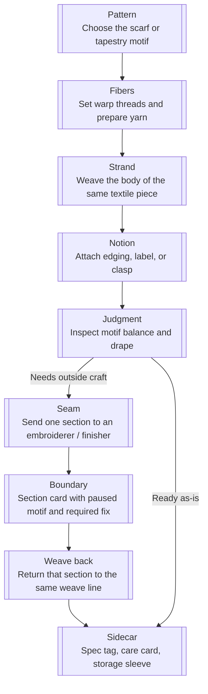
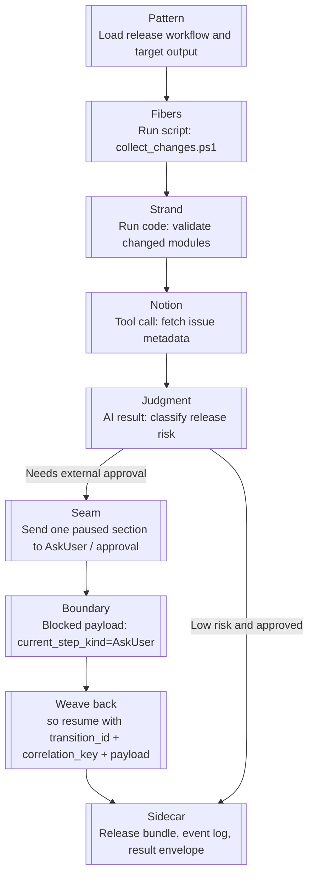

# Workflow Terminology

[中文](../../zh-cn/architecture/workflow-terminology.md)

This page is the repo-level vocabulary root for explaining AO and SO workflow behavior.

Techne Loom uses loom metaphors to explain ownership transfer, waiting, and structured continuation without hiding the current wire or code contracts.

## Interpretation Rule

- Use this glossary in explanatory prose across AO and SO docs.
- Keep current wire fields, enum values, and step kinds explicit when they are the implemented contract.
- When a metaphor term and a current wire name differ, name both the first time.
- AO and SO share this vocabulary at the workflow-explanation layer only; they do not become one runtime.

## Related Docs

- [Execution Model](execution-model.md)
- [CLI And Hosts](cli-and-hosts.md)
- [Skill-Driven Workflow Example](../examples/skill-driven-workflow.md)
- [AgentOrchestrator Guide](../reference/products/ao-guide.md)
- [SkillOrchestrator Guide](../reference/products/so-guide.md)

## Core Terms

| Term | Meaning | Current technical anchor |
| --- | --- | --- |
| Pattern | The authored route or intended workflow design. | Workflow definition, workflow file, workflow schema |
| Strand | One current line of progression through a workflow instance. Use this instead of `thread` in repo docs. | Current node, current focus, current execution line |
| Seam | The conceptual join where control crosses owners. | Later surfaced through protocol fields such as `boundary_reason`, `weave_out_request`, or blocked step kinds like `current_step_kind` |
| Weave out | The runtime hands work or control outward and waits for structured continuation. | AO control seams surfaced through blocked payload fields such as `boundary_reason` and `weave_out_request`; SO external-participation seams surfaced through blocked step kinds such as `current_step_kind` |
| Weave back | An external participant returns structured data that re-enters the same strand and allows resume. | `dotnet ao.dll resume`, `dotnet so.dll resume`, result envelopes |
| Boundary | The formal protocol term for a machine-readable blocked or returned control state. | `boundary_reason`, `<so_property>` with `type: "boundary"` |
| Sidecar | A companion artifact beside a workflow file. | Event logs, result envelopes, export files |

## AO And SO Interpretation

- **AO** is decision-first. It weaves out at control seams, then waits for a caller, outer agent, or host to decide what happens next.
- **SO** is execution-first. It weaves out only when it reaches an externally owned step kind such as `ModelThink`, `McpCall`, `SubagentCall`, `AskUser`, or `WaitResume`.
- A weave back is always structured. Prose alone is not a valid continuation surface for either product.

## Current Wire And Code Mapping

| Current term | How to read it through this glossary |
| --- | --- |
| `boundary_reason` | Why AO wove out at the current seam |
| `weave_out_required` | AO wire value for the weave-out case that asks the outside world to perform comparison, planning, or similar analysis |
| `weave_out_request` | AO wire field carrying the structured data for that weave-out case |
| `current_step_kind` on a blocked SO payload | Which SO seam caused the weave out |
| `transition_id`, `correlation_key`, `payload` | The weave-back envelope fields used by both AO and SO resumes |
| `WaitResume` | An explicit model step kind that stays parked until a future weave back arrives |

## Textile Piece Metaphor

The loom metaphor is not decorative. A workflow can be read as weaving one finished textile piece. No single script, code path, tool call, or model judgment is the scarf, banner, or tapestry by itself. The textile appears only after threads are prepared, rows are woven into the same piece, special notions are attached, and one paused section can leave and re-enter that same weave line.

In that reading:

- the **pattern** is the authored design for the final textile piece
- a **strand** is one current execution line weaving that same piece row by row
- a **seam** is the conceptual join where one section of the piece must leave the current owner and pass to another
- a **boundary** is the explicit handoff card or machine-readable stop record, such as `boundary_reason`, `weave_out_request`, or `type: "boundary"`
- a **sidecar** is the spec sheet, care label, or storage sleeve that travels beside the textile and preserves context

## Workflow Elements As Textile Parts

| Workflow element | Textile metaphor | Why it fits |
| --- | --- | --- |
| Run script | The prepared warp and sorted yarn | A script gathers and aligns input stock before the main weave continues |
| Run code | The repeatable weave rows that build the body of the piece | Deterministic code paths add stable structure to the textile |
| Tool call | A clasp, edging, label, tassel, or other attached notion | An external capability contributes one focused piece the core weave does not produce alone |
| AI result | The weaver's judgment about motif balance, risk, or the next cut | Model output chooses the route forward, but must be written back into explicit fields or artifacts |
| Resume envelope | The returned section card for the paused piece | Structured handoff data lets the same strand continue instead of restarting |
| Event log / result sidecar | The spec tag, care card, and storage sleeve | Context travels beside the textile without becoming the textile itself |

## Textile Flow

Both diagrams below use the same labeled stations so the metaphor stays comparable instead of decorative.

## Skill Flow Example

Use a small but realistic SO example: a release-packet skill that gathers change evidence, validates the package, fetches issue metadata, asks for approval when needed, and emits a final release bundle.

## Comparison Walkthrough

| Textile step | Workflow step | Terms explained |
| --- | --- | --- |
| Choose the final motif | Load the workflow definition | `pattern` |
| Set threads and weave the body | Run scripts and code through deterministic transitions | `strand` |
| Attach one special piece to the textile | Add focused tool output to the same finished piece | composition / attached notions |
| Send one paused section to another owner | Reach an ownership join before external participation | `seam` |
| Attach a section card with explicit stop data | Emit a blocked payload with `boundary_reason`, `weave_out_request`, or `current_step_kind` | `weave out`, `boundary` |
| Return that section card with structured correction data | Resume with `transition_id`, `correlation_key`, and `payload` | `weave back` |
| Keep the care card and sleeve beside the finished textile | Persist `.jsonl` event logs and result envelopes beside the workflow | `sidecar` |

The metaphor should help a reader imagine assembly, handoff, and continuation. It must not replace the real contract names.

## Writing Rule For Future Docs

- Prefer **weave out** and **weave back** when explaining control transfer.
- Prefer **strand** over **thread** in repo docs.
- Use **seam** for conceptual ownership joins, and keep **boundary** for explicit wire or protocol surfaces.
- Do not imply that AO and SO share one runtime hierarchy.
