[中文](../../zh-cn/articles/skill-execution-engineering.md) | [Articles & Blogs](README.md)

# Why Doesn't AI Listen Even When You Already Have a Skill?

> From cases and Skills to reliable execution: an engineering guide for Skill authors and a practical introduction to Loom

**The central idea: a Skill preserves domain methods; Loom provides a checkable, runnable, resumable workflow spine for work that uses that Skill.** The spine makes a method less dependent on one conversation or model call and gives compatible agents clear integration paths. It does not invent the author's method, guarantee identical model outputs, or imply that every host works without adaptation.

## Contents

- [Part 1: I Have a Skill. Why Doesn't AI Follow It?](#part-1-i-have-a-skill-why-doesnt-ai-follow-it)
- [Part 2: I Don't Think I Have a Workflow](#part-2-i-dont-think-i-have-a-workflow)
- [Part 3: Why Prompt V37 Still Fails](#part-3-why-prompt-v37-still-fails)
- [Part 4: Skill vs. Prompt](#part-4-skill-vs-prompt)
- [Part 5: Skill vs. Workflow vs. Runtime](#part-5-skill-vs-workflow-vs-runtime)
- [Part 6: Loom in Practice](#part-6-loom-in-practice)
- [Part 7: Loom Before / After](#part-7-loom-before--after)
- [Part 8: How Loom Differs from Other Approaches](#part-8-how-loom-differs-from-other-approaches)
- [Part 9: FAQ](#part-9-faq)
- [References](#references)

# Part 1: I Have a Skill. Why Doesn't AI Follow It?

## Who this article is for

This is for people who already have cases, prompts, working methods, or substantial Skill documentation. You may have revised a Skill many times and still see uneven results: one run catches a serious gap, another skips a required check, and a third sounds confident without showing its evidence.

The useful question is not only “How can I write a better Skill?” It is also “Did the method become a complete, observable execution?” A well-written method can still be applied incompletely.

## A method can be good while its execution is incomplete

Consider a research Skill that says:

> Challenge the claim, look for counterexamples, verify important evidence, and revise the conclusion if the evidence changes.

That is good domain guidance, but it leaves important operational questions open. Does every claim need verification, or only high-impact claims? What happens when a source is unavailable? Is the conclusion delivered with uncertainty, or does the work pause for a person?

For example, a market researcher may find one article that supports a forecast and stop. The Skill author expected a search for disconfirming evidence too. The method was present; the route that forces a second look was not.

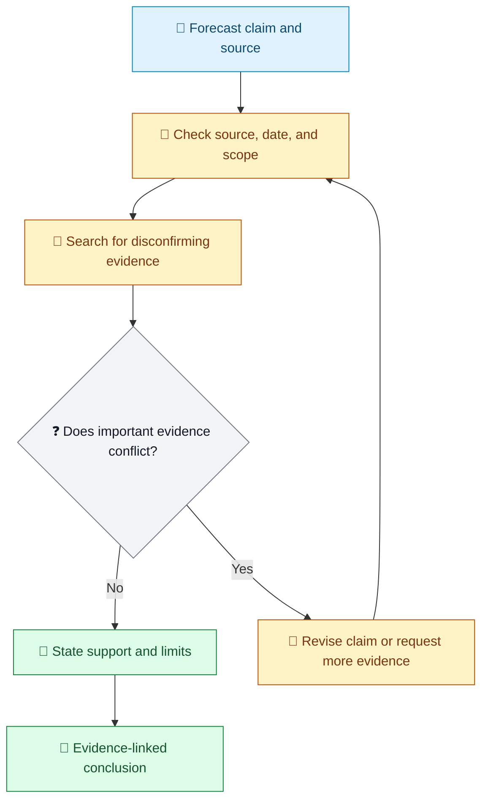

Legend: 📝 request or drafted conclusion; 🔎 research; ❓ decision; 🔁 rework; 🧾 retained evidence.

## Written down is not the same as carried out

An instruction such as “keep challenging the assumption until no critical gap remains” describes intent, not necessarily a repeatable control. The author may assume that “until” means several passes. An Agent may treat one search as enough because no measurable exit test or repeat route was stated.

A concrete editorial example makes the difference visible:

- Method: identify unsupported claims and explain why each matters.
- Missing execution detail: who revises the draft, who reviews the revision, and what finding allows delivery?
- Observable result: an issue list with quoted passages, a revision, a second review, and a recorded pass or unresolved-risk decision.

A workflow cannot make the reviewer infallible, but it can make the absent second review detectable.

## Add structure before adding more adjectives

A common revision cycle is to add “carefully,” “thoroughly,” and “do not miss anything.” That may improve the instruction's tone, but it does not itself add another review round.

| Skill wording | Execution question still open |
| --- | --- |
| “Review carefully” | Which evidence should be inspected? |
| “Review again” | What result sends the work back to review? |
| “Continue until complete” | What observable condition means complete? |
| “Ask for help if needed” | Which uncertainty requires a person, and what must they decide? |

For example, if a three-pass security review stops after the first pass, adding more detail to the first-pass checklist will not create passes two and three. First specify the loop and exit condition; then improve what each pass checks.

## Look at the work, not only the final answer

Suppose a release note is missing a breaking change. A useful diagnosis asks whether the change log was unavailable, whether the extraction step ran, whether the review compared changes against the API surface, and whether a failed check had a return path. These are different causes and call for different fixes.

Use this compact trace when a result disappoints:

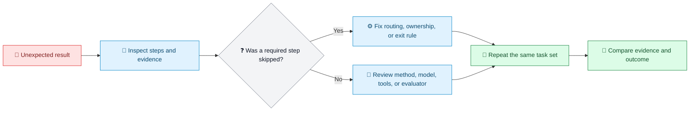

Legend: 🚧 observed problem; 🔎 inspection; ❓ diagnosis; ⚙️ owned workflow change; 🔁 repeat; 🧾 comparison evidence.

## What “reliable execution” means here

It means that workflow-owned steps, branches, state, loops, and exit conditions are handled as defined. It does **not** mean a stochastic model produces identical wording each time. Quality still depends on the model, inputs, tools, external evidence, evaluator, and host.

A baseline helps you compare runs: which steps occurred, which evidence changed, and how the outcome scored. It is a prerequisite for useful iteration, not proof of scientific reproducibility by itself.

# Part 2: I Don't Think I Have a Workflow

## Thinking often contains a repeatable structure

People describe expert work as “thinking it through” or “revising until it feels right.” Look at three similar tasks and the recurring actions may become visible. A researcher might notice a problem, propose an explanation, search for a counterexample, revise, and search again. That is already a loop, even if nobody has drawn it.

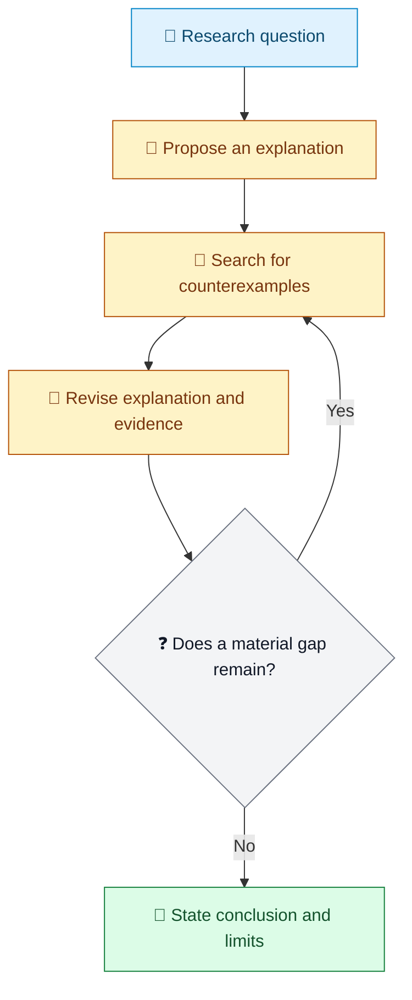

Legend: 📝 starting question; 🔎 analysis; 🔁 revision loop; ❓ exit decision; 🧾 conclusion with limits.

The point is not to make every task identical. It is to name the parts that recur, then allow branches for the parts that differ.

## Different cases can take different branches

Imagine a support team triaging refund requests. A complete procedure might check the order, determine whether the request is within policy, and route exceptions to a person. A missing receipt should not silently become “refund denied”; it is a distinct missing-information branch.

| Case | Next action | Completion evidence |
| --- | --- | --- |
| Order and eligibility are clear | Apply the policy decision | Order reference and decision reason |
| Required information is missing | Ask the customer for that information | Specific unanswered fields |
| Policy exception is requested | Pause for human review | Reviewer decision and rationale |

This is a workflow with branches, not a rigid assembly line. A human decision is part of the design when the available evidence cannot support an automatic choice.

## A small exercise for finding your implicit workflow

Choose three recent tasks of the same kind. For each, note the input, repeated actions, what happens after a failed check, who performs each action, and what evidence supports stopping. Then compare the traces and keep only the recurring structure.

Example: for three architecture reviews, you may find that all three start with a system boundary, identify high-impact failure modes, verify the riskiest assumptions, and end with a risk decision. One review may need a security specialist; another may not. Keep that variation as a branch rather than forcing both cases through an irrelevant step.

# Part 3: Why Prompt V37 Still Fails

## More wording cannot create a missing loop

A longer prompt can make a method clearer. It cannot, on its own, create persisted state, a repeat transition, a branch condition, or an audit record. If a review must happen three times, “be more thorough” is not an execution plan.

The practical difference is visible in a small example:

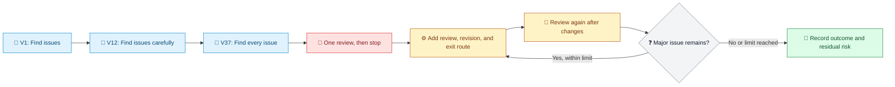

Legend: 📝 prompt revisions; 🚧 unchanged behavior; ⚙️ structural correction; 🔁 repeat path; ❓ exit decision; 🧾 recorded result.

## Diagnose the failure before editing

Take a translation task as an example. If key terms are inconsistent, the method may need a terminology check. If no terminology pass happened, the workflow needs a required step. If the pass happened but the terminology source was missing, the input contract is incomplete. Those fixes are not interchangeable.

| Observation | Likely place to investigate | Small discriminating check |
| --- | --- | --- |
| A required pass never appears | Workflow structure or host handoff | Inspect the run trace for the missing step |
| The pass ran but missed a known term | Skill method, context, or model | Re-run a fixed sample with the glossary attached |
| The check could not access its source | Input or tool contract | Verify the source path and permissions |
| The score changed but the text did not | Evaluator or acceptance rule | Compare the score evidence to the actual edit |

## Improve one thing at a time

A useful sequence is: preserve the current method, make the route observable, run a small representative task set, identify the failure class, change the corresponding layer, and repeat the same evaluation. If both the Skill and workflow change at once, it becomes harder to tell which change helped.

For instance, if an editorial workflow skips the second review, add and validate the repeat route before rewriting the editorial criteria. Once two reviews reliably occur, evaluate whether the criteria catch the intended issues.

# Part 4: Skill vs. Prompt

## A request and a reusable method solve different problems

A Prompt usually states what is wanted now. A Skill captures reusable procedures and judgment: when it applies, what to inspect, which tools may be used, and what quality looks like. Both can be text and both can be loaded into context. Neither format alone guarantees a process will be scheduled.

| Current request (Prompt) | Reusable Skill guidance |
| --- | --- |
| “Translate this release announcement into Japanese.” | Preserve product names; keep claims unchanged; check honorific register; compare numbers and dates; flag ambiguous source text. |
| “Review this API proposal.” | Inspect compatibility, security boundaries, failure modes, and evidence; distinguish facts from assumptions. |

## The same task, made concrete

A one-off translation request may include the source text and target audience. A translation Skill can add a repeatable checklist. For example, if the source says “available next quarter,” the Skill should preserve that uncertainty rather than inventing a calendar date. If the product name is a protected term, it should remain unchanged.

A small Skill outline might be:

```text
Applies when: translating public product or release text.
Preserve: product names, figures, dates, commitments, and uncertainty.
Check: meaning, terminology, register, and locale conventions.
Flag: ambiguous source wording; do not silently resolve it.
Deliver: translation plus a short list of unresolved questions.
```

That outline describes a method. The workflow still needs to decide whether terminology review is a separate step, what to do when the glossary is absent, and who accepts an unresolved ambiguity.

## Choose the right artifact for the change

If a single request lacks context, improve the Prompt. If the same judgment should recur across many tasks, improve the Skill. If a required action is skipped, branches incorrectly, or cannot resume, inspect the Workflow and Runtime contract. A task may need changes in more than one layer, but change them deliberately and evaluate them separately when possible.

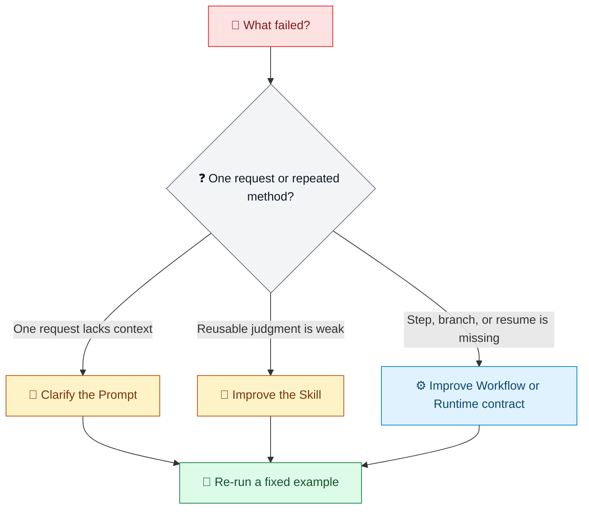

Legend: 🚧 observed failure; ❓ routing question; 📝 request; 📜 reusable method; ⚙️ execution control; 🧾 evaluation evidence.

# Part 5: Skill vs. Workflow vs. Runtime

## Four layers, four questions

| Layer | Question | Example responsibility |
| --- | --- | --- |
| Skill | How should the domain work be done? | Identify unsupported claims and cite the passage. |
| Workflow | In what order, with which branches and exit rules? | Review, revise when needed, review again, then pass or report unresolved risk. |
| Runtime | How does the owned process advance and persist? | Store state, stop at an external handoff, and resume the same instance. |
| Model / Agent | How is delegated reasoning or generation performed? | Produce an evidence-linked issue list using its context and host tools. |

## One editorial review across the layers

Suppose a team reviews a policy draft before publication. The Skill defines what counts as a material issue. The Workflow routes a draft through review and revision. The Runtime preserves the draft version, review findings, and current state. An Agent performs the actual review when that external step is reached.

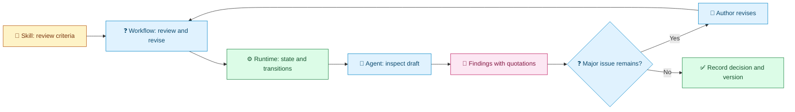

Legend: 📜 domain method; ❓ process decision; ⚙️ persisted progress; 🔎 delegated work; 🧾 evidence; 🔁 revision; ✅ recorded completion.

The Runtime does not decide whether the policy argument is persuasive unless that judgment is explicitly assigned to a checked step. Nor does the diagram make the Agent's review correct. It clarifies ownership and makes the evidence available for evaluation.

## State and evidence are not the same thing

A run may be waiting for an external review, have completed two review rounds, or be ready for a final decision. Those are execution state. The draft, issue list, reviewer rationale, and acceptance decision are business evidence. A useful system keeps both without mistaking an event log for the current business output.

For example, after a reviewer flags “the retention period is not stated,” the workflow should retain the quoted passage and finding, route the draft to revision, and then associate the next review with the revised version. A final “passed” status without that history is difficult to assess.

## What Loom means by an execution spine

Loom's execution spine is the workflow structure around work described by a Skill: which steps the Runtime owns, which are delegated to a model, tool, or person, where failures go, what counts as completion, and how state and evidence are retained.

The SO CLI or MCP entry carries execution; the host Agent performs delegated work. CLI offers a broad local-process integration surface. SO also provides local stdio MCP and generates versioned VS Code `mcp.json` and Claude `.mcp.json` configurations. This is integration capability, not unconditional host compatibility: permissions, tools, context, and model behavior still need validation.

# Part 6: Loom in Practice

## Fastest path: invoke the skill in your Agent

The shortest user-facing route is to make the target Skill's `SKILL.md` available to your Agent, then invoke the enhancement Skill with a direct request:

```text
[Attach or select the target SKILL.md]
/loom-skill-enhancement this skill
```

In a host that has `/loom-skill-enhancement` installed and can read the selected Skill, this asks Loom's Skill Enhancement workflow to work on that Skill. The host may present it as an attachment, a selected file, or an already-loaded Skill. The slash command is host-specific; it is not a universal Loom command available in every Agent.

After invocation:

1. Answer the workflow's questions about the requested change and intended deliverables.
2. Review the proposed workflow and the evidence it will require; provide approval where the process asks for it.
3. Continue through the actual workflow run and any required resume steps until the Skill deliverable is changed and final completion evidence is produced.

Do not treat the slash command, a clean compile, or a blocked handoff as completion. The model and host still perform delegated work; Loom supplies the governed route and persisted execution around that work.

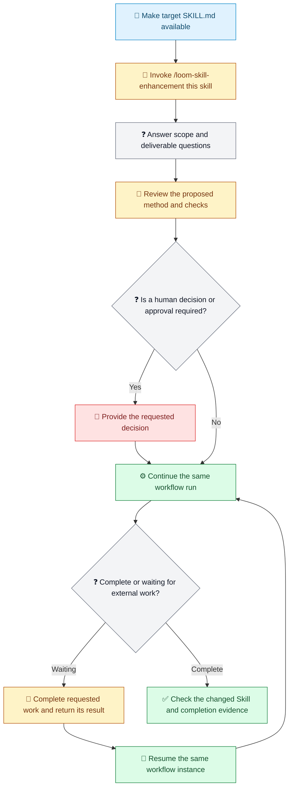

Legend: 📝 target Skill; 🔎 invocation or delegated work; ❓ question or state decision; 📜 method and checks; 💬 user decision; ⚙️ workflow execution; 🔁 resume; ✅ verified completion.

### Direct SO CLI route (optional)

The slash-command route is usually simpler for a Skill author. Use the CLI when integrating SO directly or inspecting its lower-level workflow contract. Start with the exact published SO Runtime bundle and its version-matched guide, not with a process illustration from this article.

The commands below outline the lifecycle; the file names are placeholders, so this is not a paste-and-run script. The schema/demo export supplies the runtime contract and demo, not a task-specific workflow instance. Follow the matching guide to author the template and prepare the external workflow instance, context, and any resume-result files before their respective commands:

```bash
dotnet so.dll --guide
dotnet so.dll --schema-demo-output outputs/schema-demo
dotnet so.dll compile --workflow-file so-template.json --audit-output outputs/compile-audit
dotnet so.dll run --workflow-file workflow-instance.json --context-file context.json --operation-id run-001 --audit-output outputs/run-audit
dotnet so.dll resume --workflow-file workflow-instance.json --result-file resume.json --operation-id resume-001 --audit-output outputs/run-audit
dotnet so.dll status --workflow-file workflow-instance.json
```

Read the `guide_path` returned by `--guide`; use the matching schema/demo to author a real template, then compile it. Run and resume the same external workflow instance. If execution pauses at an external seam, complete the requested work and provide its structured result file before resuming. All input files named by `*-file` options must be complete on disk before the command starts. Compile validates the contract; it does not prove domain quality or final completion.

## A reusable shape for a Loom-backed task

A practical design starts with a real deliverable, not with a diagram for its own sake. Name the input, the business output, the checks that can block delivery, the external work, and the evidence retained. Then decide which steps the Runtime owns and which steps need an Agent or person.

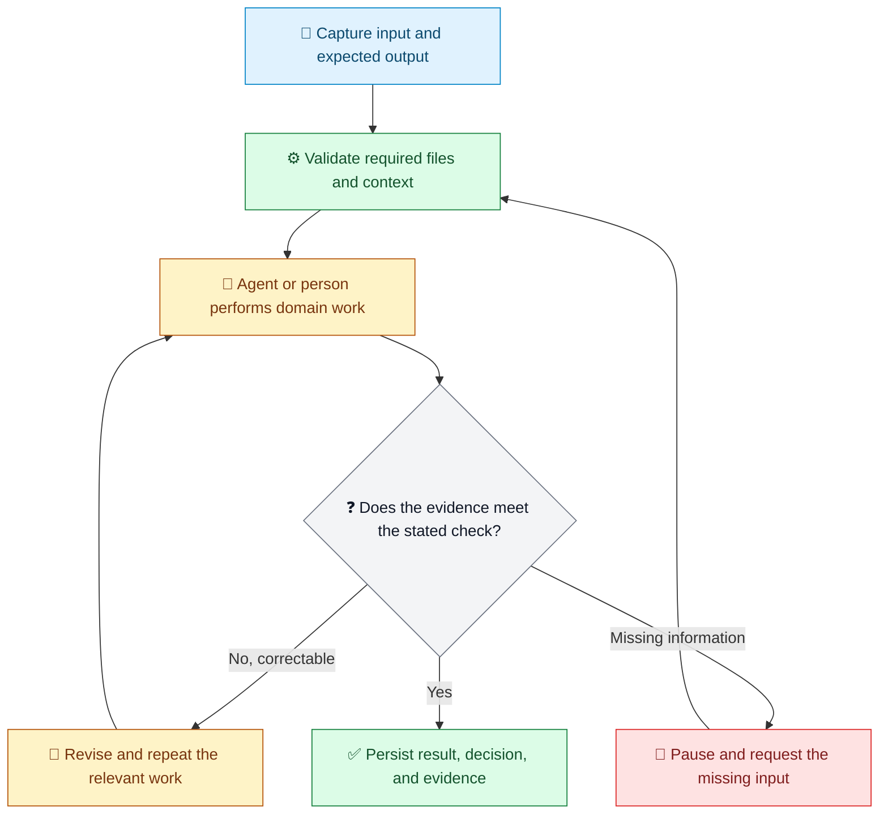

Legend: 📝 input; ⚙️ Runtime-owned work; 🔎 delegated work; ❓ check; 🔁 rework; 🚧 pause; ✅ completion.

This is a process illustration, not copy-paste SO workflow JSON. Validate real fields and templates against the selected runtime's `--guide`, schema/demo export, and `compile` command.

## Example: editorial review

- **Skill:** Find reasoning gaps, insufficient evidence, unclear scope, and counterexamples. Quote the relevant passage and explain its impact.
- **Workflow:** Load a versioned draft, request a review, route major issues to an author, review the changed version, and stop at a stated pass condition or iteration limit.
- **Runtime:** Preserve the current version, findings, external handoff, and completion decision. Resume the same instance after the review result arrives.

A useful pass condition could require no unresolved critical issue and a human decision for any exception. “Looks good” is not enough evidence by itself.

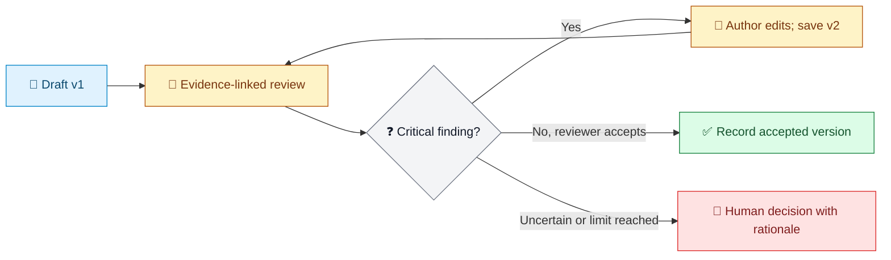

Legend: 📝 versioned input; 🔎 review; ❓ gate; 🔁 revision loop; ✅ accepted result; 🚧 human decision.

## Example: translation quality assurance

A translation Skill may require meaning preservation, term consistency, locale-appropriate register, and explicit treatment of ambiguity. The Workflow can translate, compare protected terms, request revision for concrete defects, then pause for human judgment if the source itself is ambiguous.

For example, if the English source says “may be available later this year,” the translation must not turn that into a definite launch date. The retained evidence should include the source phrase, the translated phrase, and any question sent to the product owner.

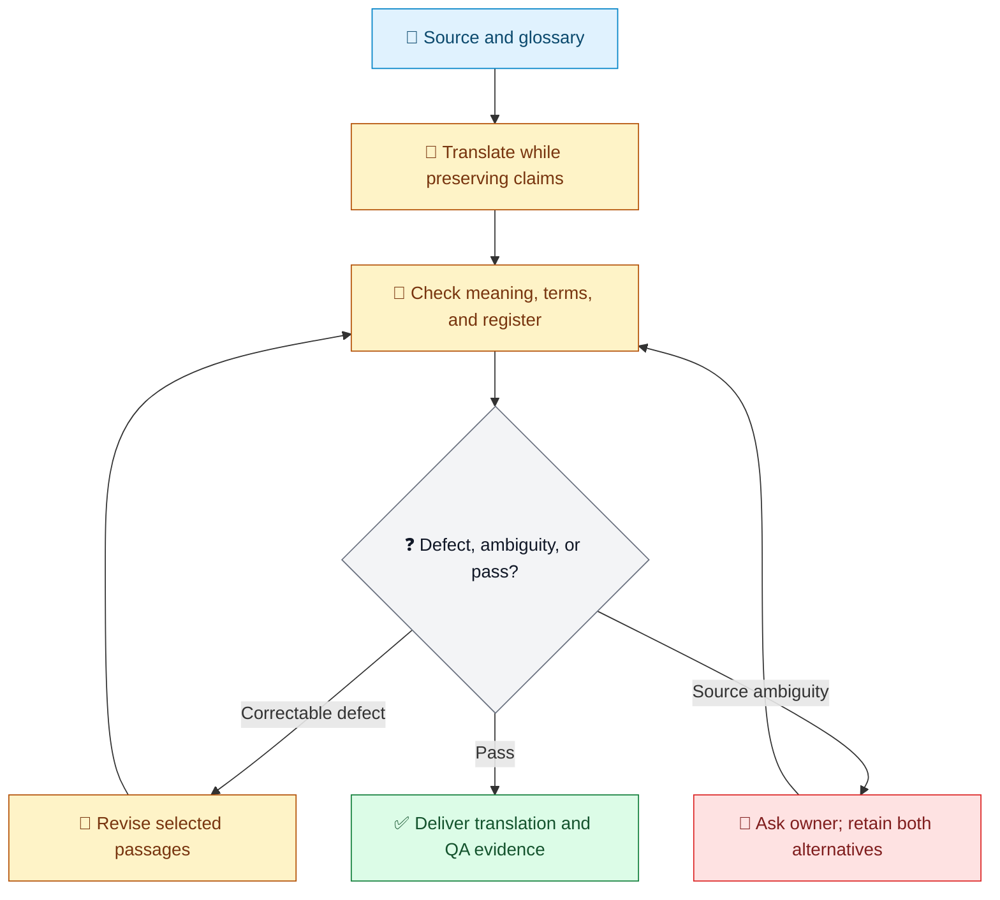

Legend: 📝 source; 🔎 translation and checks; ❓ outcome; 🔁 revision; 🚧 owner decision; ✅ delivery.

## Example: architecture review

A useful architecture review does not attempt to prove that a design is “safe.” It identifies high-impact failure modes, distinguishes verified facts from assumptions, and records what remains uncertain. If a key deployment constraint is missing, the workflow should ask for it instead of silently assuming a value.

The final output might include the risk, the affected boundary, supporting evidence, severity rationale, mitigation, owner, and unresolved question. The Runtime can preserve that package and the review state; the domain judgment still belongs to reviewers and evaluators.

## Integration and platform boundaries

- The SO CLI provides commands such as `compile`, `run`, and `resume`. It can be called by a host that can launch the matching executable, pass path-based inputs, and read or write the agreed files.
- SO offers local stdio MCP and configuration generation for VS Code and Claude. This does not mean every Agent has an MCP client.
- Runtime packages publish eight RIDs: `win-x64`, `win-arm64`, `linux-x64`, `linux-arm64`, `linux-musl-x64`, `linux-musl-arm64`, `osx-x64`, and `osx-arm64`. These describe CLI operating platforms, not supported models.
- Model calls and host tools are supplied by the integration caller. When changing Agent or model, validate the external-step contract, permissions, available context, tools, and returned results.

In short: CLI is the broad integration surface for compatible shell-capable hosts; the delivered MCP configuration formats are VS Code and Claude; and published Runtime packages cover those eight RIDs. None of these claims guarantees identical behavior across every host/model pair.

# Part 7: Loom Before / After

## Before: the process lives in the conversation

A team may have a careful editorial Skill, but still let each Agent decide how many reviews to run and whether a finding is serious. One run may make two passes; another may deliver after one. The method exists, but the route and evidence are scattered.

## After: the route and evidence are explicit

For the same editorial task, a workflow can preserve the draft version, require a review result, route major findings to revision, review again, and record why it stopped. The Agent still performs the review; Loom provides the declared execution structure and persisted state around it.

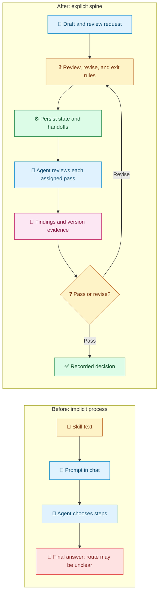

Legend: 📜 reusable method; 📝 task input; 🔎 delegated review; ❓ workflow or exit decision; ⚙️ persisted execution; 🧾 evidence; 🚧 unclear outcome; ✅ recorded completion.

| Concern | Implicit process | Explicit workflow spine |
| --- | --- | --- |
| Repeated review | Depends on reminders and Agent choice | Repeat route is represented and traceable |
| Failure handling | May stop after finding an issue | Finding routes to revision, more evidence, or a person |
| Long-running work | State is scattered across messages | Same workflow instance can be resumed |
| Evidence | Often only the final response remains | Versions, findings, state, and decision can be inspected |
| Quality | Can vary | Process is more observable; answer quality still needs evaluation |

The improvement is not “failure is impossible.” It is “the route, pauses, and evidence can be inspected, so omissions are easier to find.”

# Part 8: How Loom Differs from Other Approaches

## SkillOpt improves Skill text; Loom organizes execution

Microsoft SkillOpt treats one natural-language Skill document as the trainable state of a frozen target Agent: the target model and execution harness stay fixed; an optimizer proposes bounded text edits from scored trajectories; and a held-out validation split chooses among candidates. The paper reports best-or-tied results in all 52 test cells across six benchmarks, seven target models, and three execution modes. That is a result within the paper's scope, not a guarantee for arbitrary business tasks or hosts.

Example: a support Skill repeatedly gives incomplete troubleshooting advice. With scored trajectories and a fixed harness, SkillOpt may help improve the Skill wording. If the desired process also requires a diagnostic step, an escalation branch, and retained evidence, Loom addresses that workflow structure. They can complement each other; one does not automatically produce the other's artifact.

| Dimension | Microsoft SkillOpt | Techne Loom / SO |
| --- | --- | --- |
| Main object | Offline optimization of one Skill document | Workflow structure, Runtime state, and evidence |
| Process | Scored trajectories, bounded edits, held-out validation | Compile contract, run workflow, hand off and resume |
| Main artifact | Selected `best_skill.md` | Inspectable Workflow execution with state and audit evidence |
| Best fit | A fixed Agent setup with a score or verifier | A task needing explicit steps, handoffs, and persisted state |

## Python and LangGraph can also build durable workflows

Python is not inherently temporary or unreliable. With an appropriate checkpointer and application configuration, LangGraph supports graph nodes, conditional edges, loops, human interrupts, persistence, and resumption.

Imagine an existing Python service that already stores review state in a database and has model calls, authentication, and monitoring. Continuing in that codebase may be the simpler choice. A team that wants the workflow instance and its execution contract to be separate portable assets may prefer Loom's file-oriented SO Runtime contract.

| Dimension | Python / LangGraph style | Loom / SO |
| --- | --- | --- |
| Workflow asset | Application code, graph/state, and dependencies | Serializable WorkflowInstance, schema, template, and separate Runtime package |
| Resumption | Checkpointer and application configuration | SO runs and resumes the same external workflow instance |
| Integration | Application selects models and infrastructure | CLI surface plus generated VS Code/Claude MCP configurations |
| Trade-off | Flexible and close to Python ecosystem; application owns storage and operations | Portable workflow asset under the .NET SO Runtime contract |

There is also a similarly named Python project, [BambooGap/skills-orchestrator](https://github.com/BambooGap/skills-orchestrator). Its README positions it as a Skill governance and delivery layer for policy checks, evidence/SBOM, CI, and MCP integration; it says it does not replace an Agent Runtime or evaluate model reasoning. It is an adjacent SkillOps project, not the same product category as a general model-workflow Runtime.

## Choose by the problem you need to solve

A simple selection example:

- If the process is right but a reusable instruction is unclear, improve or evaluate the Skill; SkillOpt may be relevant when there are scored trajectories and a fixed target setup.
- If the work is already embedded in a Python service with durable state, compare the cost of extending that application with introducing a separate Runtime.
- If the workflow needs a serializable contract, explicit handoffs, and resumption independent of the chat, evaluate Loom/SO.
- If every host/model combination must behave equivalently, none of these labels proves that; define and run a compatibility test matrix.

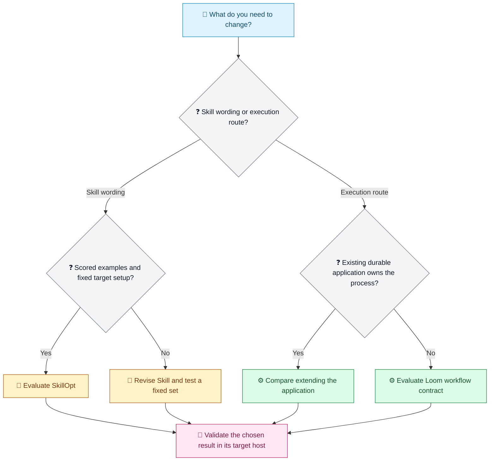

Legend: 📝 need; ❓ choice; 🔎 research/optimization; 📜 method; ⚙️ execution option; 🧾 target-host validation.

## Keep platform claims precise

“Multi-platform support” can refer to distinct things:

1. **Operating system and architecture coverage for packages:** the SO Runtime package index lists eight RIDs.
2. **Agent integration surfaces:** a compatible host can invoke the generic CLI; the generated local stdio MCP formats are VS Code and Claude.
3. **Equivalent Skill behavior across every host and model:** not promised. Discovery, context loading, permissions, tools, and model instruction-following remain host- and model-dependent.

Reuse means that a compatible host can use the same workflow contract while the integration validates its own capabilities. It does not mean every Agent is a one-click target.

# Part 9: FAQ

## What if I do not think I have a Workflow?

Compare three similar tasks. If they share actions, decisions, rework, or a stopping point, write those down. For example, if every incident review identifies impact, checks logs, tests a likely cause, and escalates when evidence is missing, you have a workflow outline. Keep case-specific branches instead of pretending every incident is identical.

## I already have many Skills. Where should I start?

Choose one frequently used Skill with an observable outcome. For a release-note Skill, the outcome could be whether all user-visible API changes and breaking changes appear in the draft. Trace one successful and one failed run, identify a skipped or weakly performed step, and improve that layer first.

## When should I optimize the Skill?

When the workflow and evaluation are stable enough to compare revisions on the same task set. If a terminology check was skipped, fix the process. If it ran but repeatedly mishandled a known term, improve the Skill, glossary, model context, or evaluator. Keep the example set fixed while comparing.

## Will Loom write my Skill for me?

No. Loom can organize a method into an execution process; domain experts still curate and own the method. For example, a Runtime can require a safety review before completion, but experts must define what risks that review should recognize.

## Can Loom improve quality?

It may help indirectly by making steps, loops, and evidence clearer. That can reduce omissions and make assessment easier. It does not guarantee a correct answer. A workflow that faithfully repeats a weak review method can still produce weak reviews.

## Can the same workflow run across different Agents and models?

The CLI and published RIDs provide broad integration foundations, and SO generates local stdio MCP configuration for VS Code and Claude. Each host must still be able to invoke the Runtime or load MCP. Validate tools, permissions, context, and external-step results after a change. Supported entry points are not equivalence testing.

## What is a sensible first experiment?

Pick a repeatable task, define one business output and one check, then record a small baseline. For example, take five past architecture reviews and see whether each includes evidence for its three highest risks. Add only the missing workflow step, run the same five cases again, and compare both completion evidence and review quality.

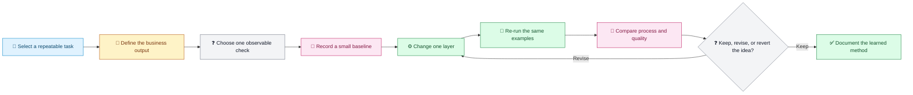

Legend: 📝 task; 📜 output contract; ❓ check or decision; 🧾 baseline; ⚙️ controlled change; 🔁 repeat; 🔎 comparison; ✅ learning recorded.

## Conclusion: the Skill execution spine

> Cases provide the source of experience.
>
> A Skill organizes that experience into a method.
>
> A Workflow organizes the method into steps, loops, and boundaries.
>
> Loom Runtime provides a persisted execution spine for that work; the Agent and model perform the external work assigned to them.

You may think you need more Skill text when what you need is a structure that lets an existing method be organized, advanced, resumed, and inspected through compatible Agent/model entry points. Build a small, testable spine first; then use evidence to decide whether the next improvement belongs in the Skill, tools, model, evaluator, or Workflow.

## References

- [Microsoft Research: SkillOpt: Agent skills as trainable parameters](https://www.microsoft.com/en-us/research/blog/skillopt-agent-skills-as-trainable-parameters/)
- [SkillOpt source repository](https://github.com/microsoft/SkillOpt) and [paper arXiv:2605.23904](https://arxiv.org/abs/2605.23904)
- [LangGraph: Workflows and agents](https://docs.langchain.com/oss/python/langgraph/workflows-agents), [Persistence](https://docs.langchain.com/oss/python/langgraph/durable-execution), and [Interrupts](https://docs.langchain.com/oss/python/langgraph/interrupts)
- [Microsoft Agent Framework: Workflow capabilities](https://learn.microsoft.com/en-us/agent-framework/workflows/)
- [BambooGap Skills Orchestrator](https://github.com/BambooGap/skills-orchestrator)
- Loom: [Skill Interoperability](../architecture/skill-interoperability.md), [SO Guide](../guides/so-guide.md), [CLI Reference](../reference/cli.md), and [Runtime Package Index](../../../packages.beta.md)

Research checked: 2026-09-23. Product features and package coverage refer to the linked public sources and this repository's published package documentation; re-check current versions before relying on a particular package or host integration.
