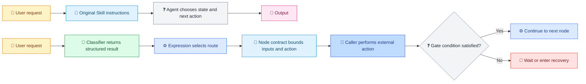
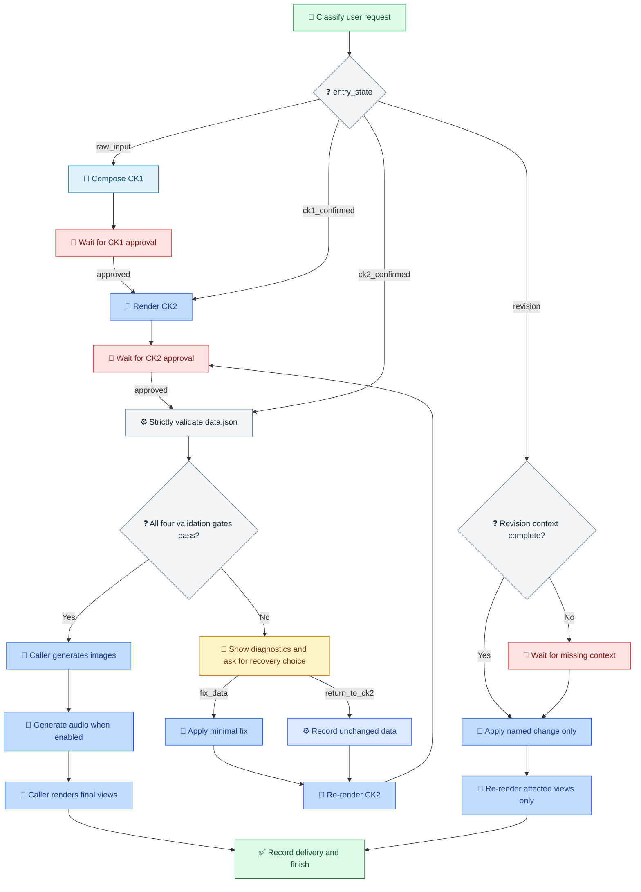

[中文](../../zh-cn/articles/skill-unchanged-rules-gated.md) | [Articles & Blogs](README.md)

# The Business Rules Stayed Intact; Execution Boundaries Gained Gates

> How Moodboard Alignment brings selected state, input, and completion conditions into a reviewable runtime workflow

**Follow-up article:** This piece follows [Why Doesn't AI Listen Even When You Already Have a Skill?](skill-execution-engineering.md) and applies its question, “Did the method become a complete, observable execution?”, to one concrete case.

## Project Background: More Than Image Generation

Moodboard Alignment is intended for clients, creative leads, and execution teams. It accepts materials such as briefs, meeting notes, scripts, brand documents, presentation outlines, and app or game concepts, then translates vague aesthetic words like “premium,” “warm,” or “cinematic” into six design dimensions: emotion, motion, color, composition, style, and sound.

According to the project's README, its purpose is not simply to generate an attractive image. Its designed flow moves from CK1 direction confirmation to a CK2 written direction and approval, then to a CK3 multi-view HTML moodboard and incremental revisions. The aim is to align stakeholders before carrying the confirmed direction into production, design, image generation, or other execution work. This article compares the governance repository's first and latest commits to examine which execution boundaries were added alongside that business method. [Project README](https://github.com/waynebaby/moodboard-alignment-loomed/blob/main/README.md)

## Contents

- [Project Background: More Than Image Generation](#project-background-more-than-image-generation)
- [Opening: What Changed Between the Endpoints](#opening-what-changed-between-the-endpoints)
- [1. The Original Skill Was a Full Business Specification](#1-the-original-skill-was-a-full-business-specification)
- [2. Classification and Routing Are Separate](#2-classification-and-routing-are-separate)
- [3. Each Node Has a Defined Boundary](#3-each-node-has-a-defined-boundary)
- [4. Gates and Recovery Paths](#4-gates-and-recovery-paths)
- [5. A Real Run Exposed a Validator Contract Gap](#5-a-real-run-exposed-a-validator-contract-gap)
- [What This Means for Skill Authors](#what-this-means-for-skill-authors)
- [Limits and Unverified Items](#limits-and-unverified-items)
- [References](#references)

## Opening: What Changed Between the Endpoints

Start with the full comparison between the governance repository's first and latest commits:

| Measure | Result |
|---|---|
| First commit | `4c2f727`, 2026-06-23, `Initial release of moodboard-alignment` |
| Latest commit | `c79c262`, 2026-09-28, `Enhance JSON validation output with detailed error and warning metrics` |
| Endpoint diff | 11 files, 1,475 insertions and 6 deletions |
| Cumulative per-commit churn | 8 commits after the root commit; 1,952 insertions and 483 deletions summed across those commits |

[View the full diff from `4c2f727` to `c79c262`](https://github.com/waynebaby/moodboard-alignment-loomed/compare/4c2f727e4e8426bdf016880c34b03cfc793b4e9c...c79c262b7d86ce627c5a677c25b847c783dc7345). The eight later commits exclude the root commit, so the range contains nine commits in total. Endpoint diff and cumulative churn are different measures: `skill-plan.md` was added and revised during the history, then removed, so its intermediate edits do not all appear in the endpoint file diff.

The latest commit, `c79c262`, changed only `scripts/validate_data.py` (+16/-4), adding structured validation-result fields. The preceding `d941cec` removed the planning artifact `assets/so-workflow/skill-plan.md` and two references; it is not the latest commit.

The image-generation, audio-generation, and rendering scripts, examples, and user-facing project docs did not change between the endpoints. The changed script is the validator:

```text
scripts/generate_images.py
scripts/generate_audio.py
scripts/render_ck2.py
scripts/render.py
examples/
docs/visual-pipelines/
README.md
USER_GUIDE.md
```

So the accurate conclusion is not “no code changed”: **the aesthetic method and generation/rendering paths stayed intact; a real governed run exposed a structured-output gap in the validator, and the latest commit repaired that execution interface.**

The 11 paths with endpoint differences are:

| File | Status | Purpose |
|---|---|---|
| `SKILL.md` | Modified | Adds SO execution, approval, and validation constraints |
| `references/workflow-commands.md` | Modified | Synchronizes workflow command guidance |
| `.gitignore` | Modified | Ignores the local `.agents/` directory |
| `scripts/validate_data.py` | Modified | Emits structured `passed`, `exit_code`, error, and warning metrics |
| `assets/so-workflow/so-template.json` | Added | Workflow template |
| `assets/so-workflow/contract.json` | Added | State, approval-boundary, invariant, and deliverable contract |
| `assets/so-workflow/node-to-file-map.md` | Added | Maps nodes to scripts, outputs, and references |
| `assets/so-workflow/so-package-lock.json` | Added | Exact SO version and package-validation rules |
| `assets/so-workflow/governance-notes.md` | Added | Runtime, compile, and probe evidence summary |
| `assets/agents/moodboard-alignment-ck-state-classifier.agent.md` | Added | CK-state classifier subagent contract |
| `skills-lock.json` | Added | Locks dependency source and hash |

## 1. The Original Skill Was a Full Business Specification

Let me give the original Skill its due: at just 183 lines, the initial Moodboard Alignment `SKILL.md` was not a loose collection of prompts. It was a compact business specification with unusually strong boundary discipline. It did not merely say what the Agent should do. It spelled out when to stop, which forms of approval could not be substituted for one another, and which assets must never be changed as a side effect. The author's grasp of the domain went well beyond turning aesthetic adjectives into prompts.

**First, the HARD ROUTER establishes precedence before prose.** It puts state classification first, permits only one state, and explicitly says the template outranks style. This is not just a tone preference; it is a decision order. Given an ambiguous brief, a direction approval, a direct-generation request, or a narrow revision, the Agent must select the business stage before producing the one output allowed at that stage.

**Second, every stage has a deliverable and a forbidden zone.** `raw_input` interprets the direction and asks no more than three questions; it does not write files, generate HTML, or jump ahead to a complete proposal. `ck1_confirmed` creates only the pending `data.json` and CK2 documents; it must not generate images, audio, or final views. CK3 comes only after CK2. The author even supplied stage-specific response templates. This answers both “What should happen now?” and “What must not happen yet?”

**Third, FAIL FAST is a list of counterexamples, not a vague request to “be careful.”** A list of directions, node table, storyboard, image prompt, HTML, or execution command in `raw_input` is explicitly a failure that requires a rewrite. Generating images, audio, or final views during CK2 is another failure. The risk of stage leakage becomes a concrete negative checklist the model can inspect.

**Fourth, approval is treated as scoped authorization.** CK1 approval permits CK2, not CK3. CK3 requires the user to have received or reviewed CK2 and then explicitly authorize the next step. A “yes” to CK1 cannot be silently upgraded into permission to generate. In a product designed to align clients, creatives, and execution teams incrementally, this is not process decoration; it protects the version and scope to which approval applied.

**Fifth, `data.json` is the source of truth, and revision is a bounded delta rather than a rewrite.** CK2, CK3, and revision revolve around the same data. The Skill says to change only the named node, image, or dimension; to ask for the project path, current data, or original node content when context is missing; and to preserve every unnamed field. “Change less rather than change the wrong thing” is translated into concrete context requirements and edit scope.

**Sixth, the author understands that aesthetics are neither one image nor one universal parameter set.** The six dimensions, `emotion / motion / color / composition / style / sound`, turn vague impressions into distinct execution vocabulary. Project types such as `film`, `poster`, `ppt`, `game`, `app`, `mv`, and `brand` have different data shapes, dimension visibility, and view rules. The `client`, `director`, and `execution` views serve different audiences. One business method can therefore preserve shared data while adapting its presentation to the project.

**Seventh, failure has a route forward.** When strict validation fails, the Skill does not say “try again” and leave the next move implicit: stop CK3, show the issue, and ask the user to repair the data or return to CK2. If image or audio generation fails, a placeholder can keep the workflow moving and be replaced later. The rules address not just the happy path, but bad input, missing context, and external-generation failures too.

That is what deserves real praise: the Skill already weaves business judgment, stage contracts, approval semantics, data protection, project variation, and failure handling into a remarkably complete domain method. It was not waiting for Loom to figure out its workflow. The governance layer had something substantial to carry forward because the original author had already thought the workflow through and written it down with precision.

So the gap discussed below is not “the author forgot the rules,” and it is not “the Skill was immature.” More precisely, these excellent rules initially lived mainly as natural-language instructions; by themselves, they do not become persistent state, deterministic routing, or auditable runtime evidence. Connecting them to a runtime that can retain state, check gates, and record results is a separate engineering layer. That distinction does not diminish the original Skill's design; it shows that governance is building on a business method with real substance.

## 2. Classification and Routing Are Separate

The original Skill's HARD ROUTER describes how to choose a state from the user's input. The governed template separates model classification from deterministic routing: the model still interprets intent, and after the classification is written into context, expressions choose the next branch based on `entry_state`.

**First: invoke the declared classifier.** [`moodboard-alignment-ck-state-classifier.agent.md`](https://github.com/waynebaby/moodboard-alignment-loomed/blob/main/assets/agents/moodboard-alignment-ck-state-classifier.agent.md) specifies the state, project type, keywords, items to keep or avoid, trigger evidence, and revision-context readiness. It must not generate CK1, CK2, or CK3 prose; it returns `unknown` when the project type is unclear; and for revision without context it still returns the revision state while setting `has_revision_context` to `false`.

The template also defines a classifier-authority resolution step: the caller first resolves the named file and returns its path, source, SHA-256, and status, then supplies the exact `subagentRelativePath` to classification. This identifies which contract should be used, but cannot prove that the model classified correctly. The real `.326` run proceeded through classification, CK1, CK2 approval, and validation recovery. It demonstrates that this execution chain reached completion in this case; it does not measure classification accuracy.

**Second: route with expressions.** The template uses deterministic branch conditions, for example:

```csharp
context.Get<string>("entry_state") == "raw_input"      // CK1
context.Get<string>("entry_state") == "ck1_confirmed"  // CK2
context.Get<string>("entry_state") == "ck2_confirmed"  // CK3 validation
context.Get<string>("entry_state") == "revision"       // revision
```

Runs and resumes use an external workflow copy, with runtime state and events retained in the workflow file and sidecar. The audit trail for this run remains in the local execution directory; the repository's governance notes have not yet been updated to summarize it. The Techne Loom [README](https://github.com/waynebaby/Techne-Loom/blob/main/README.md) describes the design as moving mutable execution state from chat and operator memory into a runtime workflow copy.

## 3. Each Node Has a Defined Boundary

The previous article explored the gap between method and execution. This case shows how node contracts can narrow what each handoff must do, which files it references, and which business inputs it receives.



Legend (color is supplementary): yellow=user input; light blue=instructions/contracts; light green=model work; light gray=decisions; blue=runtime/tools; light red=blocked seams; pink=output. Emoji and text labels also carry the meaning.

The [`so-template.json`](https://github.com/waynebaby/moodboard-alignment-loomed/blob/main/assets/so-workflow/so-template.json) declares a `skillHint`, parameter references, and business inputs for nodes that require external execution. The table lists representative nodes. “Business inputs” excludes the common external-result protocol field `result`; the classifier call also requires `subagent_resolution_record`.

| Node | Action | Key file parameters | Business inputs |
|---|---|---|---|
| Resolve classifier | Resolve the exact classifier and record source, path, and hash | `authorityRelativePath` | `user_message` |
| Classify request | Invoke the declared classifier and return a structured classification | `subagentRelativePath` | `user_message`, `subagent_resolution_record` |
| Compose CK1 | Apply the CK1 template in `SKILL.md` | `stateClassifierRelativePath` | `user_message`, `entry_state` |
| Render CK2 | Create the pending data and render CK2 views | `dataSchemaRef`, `workflowCommandsRef` | `project_root`, `project_type`, `entry_state` |
| Strict validation | Run `validate_data.py --strict` against the project's `data.json` | `scriptPath` | `project_root` |
| Generate audio | Check the project template and audio switch, then generate only when enabled | `projectTemplateRef`, `scriptPath` | `project_root`, `project_type` |
| Render final views | Follow CK3 validation and final-view rendering | `viewTemplateRef`, `layoutRef`, `scriptPath` | `project_root`, `project_type` |
| Apply revision | Change only the named scope and preserve other fields | `dataSchemaRef` | `project_root`, `revision_scope`, `revision_new_value` |

An important boundary: the template's `workflow.*` names are not registered SO tools. Business scripts and subagents remain external-action seams for the caller; the caller performs them and resumes the workflow with structured results. A node contract can narrow a handoff, but it cannot make an unconnected executor available.

For example, the strict-validation node's `skillHint` tells the Agent to run the script against the existing `data.json` without editing it, then return a report containing the checked path, `passed`, `exit_code`, `errors`, and `warnings`. The Agent need not re-plan the whole project, but the external caller still has to run the script and provide its result.

SO's boundary handoff includes `skill_hint`, `memory_for_next_step`, and `required_inputs`. The public execution model says that when no memory-oriented keys match, `memory_for_next_step` does not fall back to the entire context. Node contracts and handoff data make the attention boundary more specific; the idea that this may help weaker models or smaller context windows remains an inference, not a measured result in this case.

## 4. Gates and Recovery Paths

The following diagram shows the full control flow defined by the template. A real SO `0.3.326` run followed its validation-failure, recovery, retry, and completion path.



Legend (color is supplementary): yellow=user decision; light blue=business templates; light green=model classification/completion; light gray=decisions and checks; blue=workflow/tools; light red=waits/blocked states. Emoji and text labels also carry the meaning.

**Approval gates.** CK1 and CK2 wait steps proceed only when the structured resume has `checkpoint_resume_request.approval_decision` exactly equal to `approved`. CK1 approval only releases the workflow to CK2; it does not authorize CK3.

**Strict validation.** Under the template contract, the report must include correctly typed `passed`, `exit_code`, `errors`, and `warnings`, with values `true`, `0`, `0`, and `0`. A missing field, wrong type, nonzero exit code, error, or warning routes to recovery.

**The real recovery path.** On the first validation attempt, the Python process returned 0 and the old script reported `errors=0`, `warnings=0`, but omitted the required `passed` and `exit_code` fields. The gate failed closed and blocked image, audio, and final-view generation. After the user selected `fix_data`, the repair step correctly recognized this as a script-output-contract problem, not a data problem. It left `data.json` untouched, re-rendered CK2, and waited for fresh approval. The retry supplied all four gate fields and passed, allowing the run to reach final completion.

### A Shortcut with an Unverified Prerequisite

The original HARD ROUTER maps requests such as “generate directly” to `ck2_confirmed`. The corresponding template route enters strict CK3 validation directly; it has no preceding node that creates `data.json`. The shortcut therefore requires an existing, valid project `data.json`. The real run described here passed through CK2 checkpoints and does not by itself prove that the shortcut works when project data is missing.

## 5. A Real Run Exposed a Validator Contract Gap

This was a real run, not a fixture scenario. The SO `0.3.326` validation report showed a process exit code of zero, zero errors, and zero warnings, but the JSON omitted `passed` and `exit_code`. To a person, the result looked clean; to the workflow, it lacked the evidence required to authorize the next step. The gate failed closed and surfaced the issue.

The repair step did not change correct project data just to “fix” a report. It identified the problem as a missing field in the tool contract. After CK2 was rendered again and freshly approved, the validator was retried with the updated script. The report included all four gate fields and passed; generation and final rendering proceeded to `state.done`, delivering the client, director, and execution HTML views. Images remained placeholders because no image API key was configured; no audio files were created because no audio API key was configured.

The run separates two concerns: the script's business checks can report zero errors and warnings, while its machine-readable report can still be insufficient for a workflow gate. Governance does not just add an approval wall; it makes hidden assumptions between tools visible.

The latest commit, [`c79c262`](https://github.com/waynebaby/moodboard-alignment-loomed/commit/c79c262b7d86ce627c5a677c25b847c783dc7345), updates `scripts/validate_data.py`. Both normal validation and JSON-parse failures now emit `passed`, `exit_code`, `errors`, `warnings`, and the data path; the process return code is kept consistent with `exit_code`. This small change came from a gap found during governed execution. It did not rewrite the aesthetic rules or the image/audio generation and rendering implementations.

One field-name mapping remains explicit: the SO node hint uses `checked_path`, while the Python script emits `data_json`. The external caller mapped the script path to `checked_path`; that mapping must remain documented rather than treating the names as natively identical.

The validation-recovery evidence here uses the actual SO `0.3.326` run. That chain covered missing gate fields, fail-closed handling, unchanged-data disposition, CK2 re-render, fresh approval, successful retry, and final completion. It is not presented as an exhaustive test of every null, type-mismatch, and warning combination.

## What This Means for Skill Authors

Two things can be true at once: the original Skill's aesthetic method and business rules were exceptionally well designed, and an existing Python tool could still lack machine-readable output required by the governed workflow. The real run exposed the interface gap; the gate prevented it from being silently ignored; the finding then led to the script fix in `c79c262`.

“Business method unchanged” does not mean every surrounding line of code must remain untouched. In this endpoint range, the only business script changed was the validator's result contract; generation and rendering paths, examples, and user documentation stayed unchanged. One value of governance is making that small repair traceable to a specific failure and boundary.

## Conclusion

The preceding article argued that a well-written method does not guarantee complete execution. Moodboard Alignment gives us a real engineering chain: business rules define a boundary, the runtime checks it, execution exposes a tool-contract gap, and a code change reconnects the tool to that contract. The original Skill's method was not replaced; its precision is what let governance identify exactly what was missing.

This is not an experiment measuring success rates or speed. But it is no longer only a compile-ready design: an SO `0.3.326` run/resume chain stopped at strict validation, preserved project data, waited for renewed approval, passed on retry, and reached `state.done` with final HTML delivery.

## Limits and Remaining Checks

- **A real business workflow completed.** One SO `0.3.326` run/resume chain handled validation recovery, passed the retry, and reached `state.done`; images remained placeholders and no audio assets were generated.
- **Detailed run audit is local.** The workflow, event log, and resume payloads remain in the execution environment and were not committed with `c79c262`. The checked-in `governance-notes.md` still reflects the earlier pending snapshot and has not been updated with this run summary.
- **Validation recovery is described on the `0.3.326` basis.** This article describes the actual recovery chain for that runtime. It does not use a cross-version comparison or claim one run covers every invalid-value permutation.
- **The path field is mapped.** The workflow hint uses `checked_path`; the Python script emits `data_json`. The external caller performs the mapping.
- **Classification remains model work.** Expressions make routing after classification deterministic; they do not establish classification accuracy.
- **Approval still needs interpretation.** The runtime checks whether the structured resume value is exactly `approved`; an Agent still maps the user's natural language to that value.
- **External tools are not registered.** The template's `workflow.*` names are unresolved adapter names. The caller executes the corresponding script or subagent and returns a structured result.
- **The direct shortcut has a precondition.** `ck2_confirmed` routes directly to strict validation without a node that creates `data.json`; the real run followed CK2 checkpoints and does not prove the shortcut works without existing project data.
- **No reliability or performance uplift has been measured.** There are no speed, token, or success-rate measurements. This is a traceable defect-discovery and repair case, not a quantitative outcome study.
- **Diff accounting.** `+1,475/-6` is the net endpoint diff from `4c2f727` to `c79c262`; `+1,952/-483` is cumulative churn summed across commits after the root. The planning artifact was added and later removed, which is why the totals differ.

## References

- [Preceding article: Why Doesn't AI Listen Even When You Already Have a Skill?](skill-execution-engineering.md)
- [Governance repository endpoint comparison: `4c2f727` to `c79c262`](https://github.com/waynebaby/moodboard-alignment-loomed/compare/4c2f727e4e8426bdf016880c34b03cfc793b4e9c...c79c262b7d86ce627c5a677c25b847c783dc7345)
- [Fix commit: `c79c262`](https://github.com/waynebaby/moodboard-alignment-loomed/commit/c79c262b7d86ce627c5a677c25b847c783dc7345)
- [Moodboard validation script](https://github.com/waynebaby/moodboard-alignment-loomed/blob/main/scripts/validate_data.py)
- [Moodboard Alignment `SKILL.md`](https://github.com/waynebaby/moodboard-alignment-loomed/blob/main/SKILL.md)
- [Workflow template](https://github.com/waynebaby/moodboard-alignment-loomed/blob/main/assets/so-workflow/so-template.json)
- [Business contract](https://github.com/waynebaby/moodboard-alignment-loomed/blob/main/assets/so-workflow/contract.json)
- [Governance evidence summary](https://github.com/waynebaby/moodboard-alignment-loomed/blob/main/assets/so-workflow/governance-notes.md)
- [Node-to-file map](https://github.com/waynebaby/moodboard-alignment-loomed/blob/main/assets/so-workflow/node-to-file-map.md)
- [Techne Loom execution model](https://github.com/waynebaby/Techne-Loom/blob/main/docs/en/architecture/execution-model.md)
