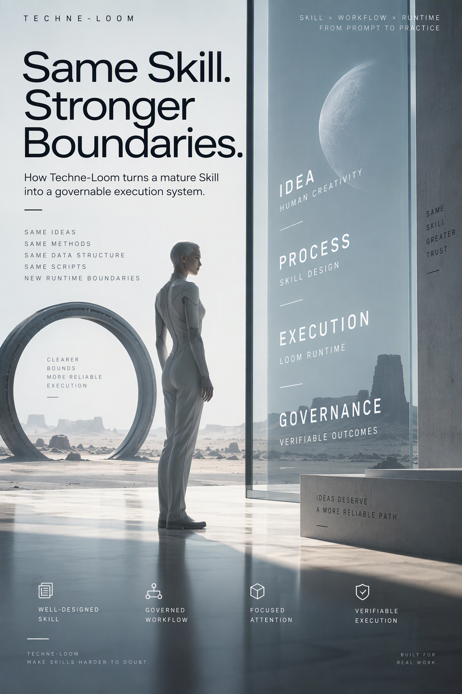
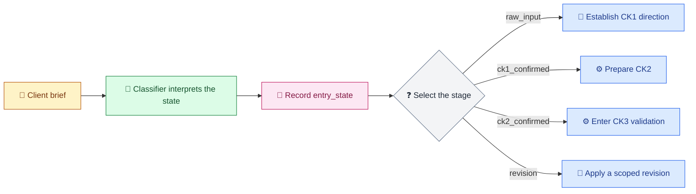
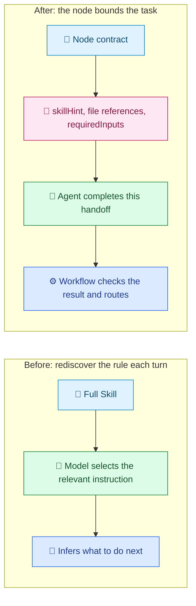
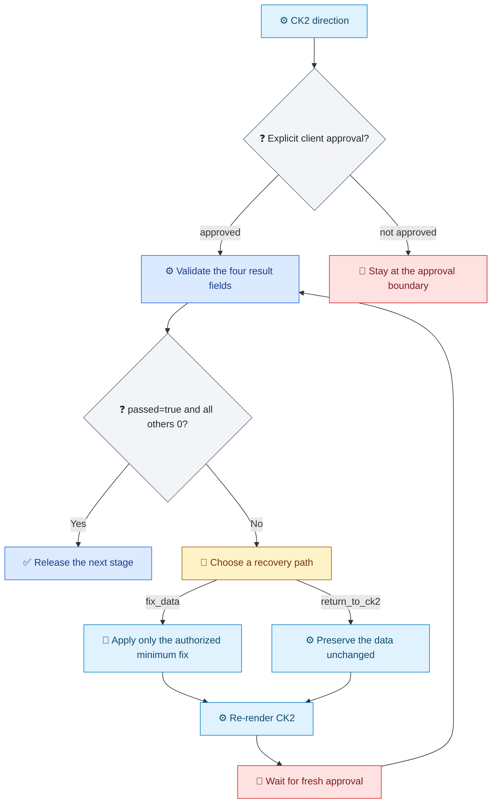

[中文](../../zh-cn/articles/skill-unchanged-rules-gated.md) | [Articles & Blogs](README.md)

# The Business Rules Stayed Intact; Execution Boundaries Gained Gates

> What changes when a mature Moodboard Skill connects to Techne Loom?

**Follow-up article:** This piece follows [Why Doesn't AI Listen Even When You Already Have a Skill?](skill-execution-engineering.md) and brings its question, “Did the method become a complete, observable execution?”, into one concrete case.



## Opening: Rules Are Written. What Happens Next?

A client gives the creative team three words: “premium, warm, cinematic.” Those words shape the direction the team will discuss and the work it will fund. Starting production before the direction is aligned can trigger a costly round of rework. Moodboard Alignment turns those abstract impressions into a direction the team can discuss, approve, and deliver.

Moodboard Alignment's Skill clearly defines its stage rules: identify the current state; move from CK1 approval to CK2; get explicit approval after CK2 before entering CK3; and limit revision to the scope the user named. The implementation question is how each handoff can apply the relevant rule, show where work pauses, and identify the evidence required to continue.

Across this endpoint range, `scripts/`, `examples/`, the README, and the user guide stayed unchanged. The governance commits focused on execution: some rules that had to be recalled from the Prompt each turn became workflow nodes and gates that can be compiled, reviewed, and traced.

This article's historical comparison covers `4c2f727` through `d941cec`; later commits are outside these figures. The selected endpoint ties the counts to the workflow configuration and verification record at that point.

| Measure | Result |
|---|---|
| First commit | `4c2f727`, 2026-06-23, `Initial release of moodboard-alignment` |
| Comparison endpoint | `d941cec`, 2026-09-28, `Remove planning-only skill plan` |
| Net endpoint diff | 10 files, 1,459 insertions and 2 deletions |
| Cumulative change volume | 7 commits after the root commit; 1,936 insertions and 479 deletions in total |
| Unchanged project files | No endpoint changes in `scripts/`, `examples/`, `README.md`, or `USER_GUIDE.md` |

[View the full comparison from `4c2f727` to `d941cec`](https://github.com/waynebaby/moodboard-alignment-loomed/compare/4c2f727e4e8426bdf016880c34b03cfc793b4e9c...d941cec467df82ffb8c5dadaa0080e5ae409f2b7). Cumulative change volume includes intermediate additions and edits to the planning file; the endpoint diff counts the files and lines present at the two selected commits.

## 1. The Original Author Had Already Written the Important Rules

The original Moodboard Alignment Skill was already a mature business specification, with explicit stages, approval scope, data ownership, and revision limits. Its author had translated product judgment into concrete operating guidance.

**The HARD ROUTER selects the business state before composing the response.** It requires exactly one state and gives the template precedence over presentation style. For an ambiguous brief, a direction approval, or a narrow revision, the Agent follows the requirements for the current stage.

**Every stage has its own job and boundary.** `raw_input` handles direction and a small number of questions. Later stages use their own templates and deliverables; CK3 follows CK2 approval. Detailed responses stay aligned with the current stage.

**Each approval has a defined scope.** CK1 approval advances the work to CK2. CK3 requires a fresh, explicit approval after the user has received or reviewed CK2. Each decision applies to a specific stage and deliverable.

**`data.json` is shared truth, and revision is a small delta.** Change only the node, image, or dimension the user named. Ask for the project path, current data, or original node content when it is missing. Preserve every field outside the authorized scope.

The concrete FAIL FAST examples, six aesthetic dimensions, and audience-specific `client`, `director`, and `execution` views form a mature product method: teams can organize aesthetic judgment, data, and deliverables around the project type.

This article follows those mature rules into execution: the workflow makes the current state, handoff inputs, and continuation conditions explicit for each step.

## 2. Move State from Conversation into the Workflow

The original HARD ROUTER asks the model to understand user intent. In the workflow, the model still classifies the request, but it no longer has to determine every later step on its own. The classification is written to `entry_state`; expressions select the route from that state.



Legend: 💬 client input; 🔎 model classification; 🧾 state evidence; ❓ deterministic decision; 📜 business stage; ⚙️ runtime step; 🔁 revision path.

State classification remains model work. Once the classification is recorded in `entry_state`, expressions select the next route from that value, reducing the need to infer the route again from Prompt text. The workflow instance stores current state, and `.events.jsonl` records transitions for reviewers to inspect.

## 3. Each Step Receives the Context It Needs

A Skill can be comprehensive, yet asking every node to re-read and filter the whole business specification adds avoidable attention work. Loom's change is to let each node declare the handoff: what it must do, which inputs it needs, and which files it should use.



Legend: 📜 method and node contract; 🔎 model work; 💬 inference left to conversation; 🧾 explicit inputs; ⚙️ runtime control.

| Example node | What it declares in advance | Ambiguity it reduces |
|---|---|---|
| Compose CK1 | Which Skill rules to use, what to produce, and which actions are forbidden | Avoids turning CK1 into a premature final proposal |
| Render CK2 | `dataSchemaRef`, `workflowCommandsRef`, and inputs such as `project_root` | Identifies which project references to read and where to create the pending direction |
| Strict validation | `scriptPath`, `project_root`, and the requirement not to edit `data.json` | Keeps validation from silently changing business data |
| Apply revision | The requested scope, target value, and current project data | Preserves nodes and fields the user did not name |

Matching memory keys supply the content for `memory_for_next_step`; the next node receives the handoff information relevant to its current task.

Node-scoped inputs could reduce the context and attention required for narrow tasks. That is a mechanism-based inference; this article includes no model-comparison experiment. Directly observable changes are the declared task scope, file references, and input responsibilities.

## 4. Turn Boundaries into Gates That Can Stop the Work

**Approval values directly control stage progression.** CK1 and CK2 WaitResume steps continue only when the structured `approval_decision` equals `approved`. CK1 approval advances to CK2; CK3 still waits for a new decision after CK2.

**Strict validation checks four result fields.** The contract requires `passed`, `exit_code`, `errors`, and `warnings` to be present with the right types and values `true`, `0`, `0`, and `0`. A missing field, wrong type, or disallowed value routes the work to recovery.



Legend: 💬 client choice; ❓ check; ⚙️ runtime action; 🔁 bounded repair; 🚧 approval wait; ✅ release after the condition is met.

The recovery routes preserve the user's authorization: `fix_data` permits only the smallest repair justified by diagnostics; `return_to_ck2` preserves the data unchanged. Both routes re-render CK2 and wait for fresh explicit approval before validation resumes.

In the `0.3.318` validation matrix, a single warning was enough to route validation back to CK2 recovery. That result came from the test fixture.

## 5. Completion Is Proven by Business Files and Audit Records

Compile shows that a template passes structural and contract checks. To explain how a run reaches completion, readers also need files that can be checked step by step. The `0.3.326` runtime lock requires eight package checks before launch: package ID, exact version, RID, SHA-512, nuspec, runtime manifest, archive safety, and the apphost plus English guide. Run audits answer three more questions: where the workflow paused, what recovery result it received, and which state it ultimately reached.

### Files Left by Each Business Stage

The table lists project outputs declared by the node map and script commands, along with resume inputs from the later local `.326` run. Paths are project-relative; audit snapshots are counted separately below.

| Step | Project files or handoff records | Purpose |
|---|---|---|
| State classification | `resume-classification.json`, `resume-classification-projected.json`; `entry_state` | Preserve the classification and the state projected into workflow context |
| CK1 / CK2 | `resume-ck2-render.json`, `resume-ck2-approved.json`; `data.json`, `ck2-client.html`, `ck2-execution.html` | Create the pending direction, render two approval views, and record approval |
| Strict validation and recovery | `resume-validation-report.json`, `resume-validation-recovery-prompt.json`, `resume-recovery-fix-data.json`, `resume-validation-repair-report.json`, `resume-ck2-recovery-render.json`, `resume-ck2-recovery-approved.json`, `resume-validation-passed.json` | Record the first report, recovery choice, recheck, rerender, and fresh approval |
| Image / audio | `images/`, `audio/` | Images in this delivery used placeholders; no audio file was generated |
| Final render | `index-client.html`, `index-director.html`, `index-execution.html`; `resume-final-render.json`, `resume-final-render-projected.json` | Deliver three audience views and preserve the final handoff result |

Classifier output-field excerpt:

```json
{
  "entry_state": "raw_input",
  "project_type": "film",
  "has_revision_context": false,
  "keywords": ["premium", "warm", "cinematic"]
}
```

A `data.json` node-field excerpt:

```json
{
  "meta": { "project_type": "film", "sound_enabled": false },
  "summary": { "one_sentence": "A warm, restrained opening direction" },
  "timeline": [
    {
      "id": "node-opening",
      "label": "Opening",
      "emotion": { "intensity": 4 },
      "image": { "url": "images/node-opening.png", "status": "placeholder" }
    }
  ]
}
```

### Counting the Audit Files

The later `.326` business run contains 34 workflow-history records and 34 events in `workflow.json.events.jsonl`; its final state is `state.done`. The run-audit directory contains 20 step snapshot folders. Each folder contains the same five files: `workflow.analysis.json`, `workflow.dataflow.json`, `workflow.html`, `workflow.json`, and `workflow.mermaid.md`.

| Snapshot type | Step sequence | Snapshots | Audit files per snapshot |
|---|---|---:|---:|
| blocked `SubagentCall` | `0002`, `0004`, `0007`, `0011`, `0014`, `0019`, `0021`, `0025`, `0028`, `0030`, `0032` | 11 | 5 |
| blocked `WaitResume` | `0009`, `0016`, `0023` | 3 | 5 |
| progress | `0006`, `0013`, `0018`, `0027`, `0034` | 5 | 5 |
| completed | `0034` | 1 | 5 |
| **Run-audit total** | **20 snapshot folders; sequence `0034` has both progress and completed snapshots** | **20** | **100** |

Compile has a separate `step-0001-compiled` snapshot containing six files: `workflow.analysis.json`, `workflow.compile-feedback.json`, `workflow.dataflow.json`, `workflow.html`, `workflow.json`, and `workflow.mermaid.md`. Compile plus run-audit produced **106 audit files**: 102 are in the ZIP; four selected snapshots are attached separately and excluded from it.

Attachments: [execution audit and results ZIP](../../assets/attachments/moodboard-alignment-0.3.326/moodboard-alignment-0.3.326-audit-results.zip); the CK2 approval-wait snapshot (step-0009) as a [Mermaid diagram](../../assets/attachments/moodboard-alignment-0.3.326/step-0009-blocked-WaitResume.mermaid.md) and [workflow status file](../../assets/attachments/moodboard-alignment-0.3.326/step-0009-blocked-WaitResume.workflow.json); the completed snapshot (step-0034) as a [Mermaid diagram](../../assets/attachments/moodboard-alignment-0.3.326/step-0034-completed.mermaid.md) and [workflow status file](../../assets/attachments/moodboard-alignment-0.3.326/step-0034-completed.workflow.json).

Two snapshots show how the gate leaves a reviewable trail. In `step-0009-blocked-WaitResume/workflow.json`, CK2 approval is still outstanding:

```json
{
  "status": "waitingExternal",
  "currentNodeId": "state.wait_ck2"
}
```

The `step-0034-completed/workflow.json` snapshot records the final state:

```json
{
  "status": "succeeded",
  "currentNodeId": "state.done"
}
```

The compile snapshot's `workflow.compile-feedback.json` records the runtime version and diagnostic counts:

```json
{
  "runtime_version": "0.3.326",
  "status": "succeeded",
  "counts": { "total": 0, "errors": 0, "warnings": 0 }
}
```

A `workflow.json` snapshot records the state at that point; `analysis`, `dataflow`, HTML, and Mermaid preserve validation, connectivity, and readable workflow views. Blocked snapshots show that approval had not arrived; later snapshots capture recovery and completion. Together, these files connect the gate's pause, recovery route, and final result in a trail that can be reviewed step by step.

The timeline matters: the `d941cec` governance notes still marked public run/resume as pending at that snapshot. This `.326` local business run happened later. Its audit directory remains in the execution environment and was not committed with `d941cec`.

## What This Means for Skill Authors

Loom adoption can start by reusing the existing business specification. Across this Moodboard comparison, project scripts, examples, README, and user guide stayed unchanged; the workflow adds explicit state, handoff inputs, and continuation conditions.

Integration requires engineering work: translating boundaries into nodes, input contracts, expressions, and validation evidence, then confirming the caller can perform external work and return the agreed result. The model continues to interpret the brief, and the creative team continues to judge the direction. Loom provides an inspectable execution route.

The Skill explains how the team should work; the workflow makes each step's inputs, handoff, and continuation conditions explicit. Those details give every run evidence that can be inspected.

## Conclusion: Make Existing Rules Harder to Challenge

A mature Skill's value grows when its business judgment is visible at every handoff: Who approved the direction? Which inputs does the next step need? What evidence supports continuing? Each question can point to a rule and a record.

Across the endpoint range in this article, Moodboard Alignment's project scripts, examples, and user documents stayed unchanged; the governance assets added workflow representations of selected execution conditions. Readers can inspect where a rule lives, what its gate requires, and how far the evidence reaches.

The [Moodboard Alignment README](https://github.com/waynebaby/moodboard-alignment-loomed/blob/d941cec467df82ffb8c5dadaa0080e5ae409f2b7/README.md) describes how the product turns creative direction into a collaborative deliverable. The workflow extends that method with inspectable handoffs while aesthetic decisions remain with the model and creative team.

## Boundaries: Facts, Inferences, and What Remains Unverified

- **Endpoint facts:** The range from `4c2f727` to `d941cec` changes 10 files, net `+1,459/-2`; the seven commits after the root total `+1,936/-479`. No endpoint changes appear in `scripts/`, `examples/`, the README, or the user guide.
- **Runtime evidence:** The later local `.326` run/resume reached `state.done`; per-step audit counts are listed above. The `.318` matrix remains test-fixture evidence.
- **Not measured:** There is no comparison of classification accuracy, completion rate, speed, or token cost. Images used placeholders, and no audio was generated.
- **Inference:** Node-scoped inputs and handoffs may reduce the attention burden per task, but this case includes no model-comparison experiment.
- **Scope:** The comparison ends at `d941cec`; commits after that endpoint are excluded from these counts.

## Appendix: Changed Files

| File in the endpoint diff | Status |
|---|---|
| `.gitignore` | Modified |
| `SKILL.md` | Modified |
| `assets/agents/moodboard-alignment-ck-state-classifier.agent.md` | Added |
| `assets/so-workflow/contract.json` | Added |
| `assets/so-workflow/governance-notes.md` | Added |
| `assets/so-workflow/node-to-file-map.md` | Added |
| `assets/so-workflow/so-package-lock.json` | Added |
| `assets/so-workflow/so-template.json` | Added |
| `references/workflow-commands.md` | Modified |
| `skills-lock.json` | Added |

**Related Techne Loom background:** [Execution model (English)](../architecture/execution-model.md) | [执行模型（中文）](../../zh-cn/architecture/execution-model.md).

## References

- [Preceding article: Why Doesn't AI Listen Even When You Already Have a Skill?](skill-execution-engineering.md)
- [Moodboard Alignment endpoint comparison: `4c2f727` to `d941cec`](https://github.com/waynebaby/moodboard-alignment-loomed/compare/4c2f727e4e8426bdf016880c34b03cfc793b4e9c...d941cec467df82ffb8c5dadaa0080e5ae409f2b7)
- [Moodboard Alignment README at the comparison endpoint](https://github.com/waynebaby/moodboard-alignment-loomed/blob/d941cec467df82ffb8c5dadaa0080e5ae409f2b7/README.md)
- [Moodboard Alignment `SKILL.md` at the comparison endpoint](https://github.com/waynebaby/moodboard-alignment-loomed/blob/d941cec467df82ffb8c5dadaa0080e5ae409f2b7/SKILL.md)
- [Loom execution model](https://github.com/waynebaby/Techne-Loom/blob/main/docs/en/architecture/execution-model.md)
