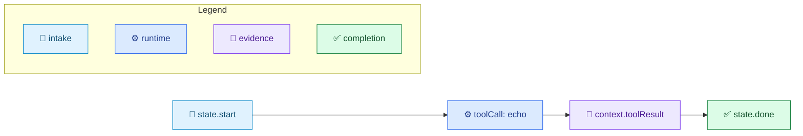
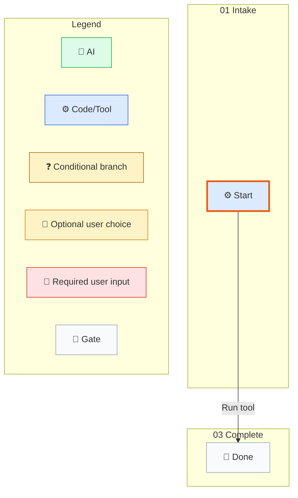

# Basic Task Tracking Example

[中文](../../zh-cn/examples/basic-task-tracking.md) | [Root](../README.md)

This example shows the smallest public workflow shape worth keeping.

## Flow

1. A workflow instance starts at a state node.
2. A deterministic transition updates context.
3. A history entry records the move.
4. Command output is captured into workflow context and the final result payload.

## Minimal Workflow File

```json
{
  "instanceId": "sample1",
  "nodes": {
    "state.start": {
      "$kind": "state",
      "id": "state.start",
      "name": "Start",
      "workflowPhase": "01 Intake",
      "groups": [
        {
          "id": "group.main",
          "strategy": "firstSuccess",
          "transitionIds": ["transition.run"]
        }
      ],
      "waitBehavior": "blockUntilComplete"
    },
    "state.done": {
      "$kind": "state",
      "id": "state.done",
      "name": "Done",
      "workflowPhase": "03 Complete",
      "groups": [],
      "waitBehavior": "blockUntilComplete"
    },
    "transition.run": {
      "$kind": "command",
      "id": "transition.run",
      "name": "Run tool",
      "targetNodeId": "state.done",
      "outputPath": "toolResult",
      "stepKind": "toolCall",
      "guardExpression": "true",
      "succeedExpression": "true",
      "command": {
        "kind": "tool",
        "name": "echo",
        "parameters": {
          "message": "hello"
        },
        "currentRetryCount": 0
      },
      "currentRetryCount": 0,
      "maxRetry": 10
    }
  },
  "startNodeId": "state.start",
  "currentNodeId": "state.start",
  "endNodeId": "state.done",
  "status": "readyToStart",
  "context": {},
  "history": [],
  "version": 0,
  "activeWaitGroups": []
}
```

## Run Command

```powershell
.\so.exe run --workflow-file .\workflow.json
```

## What To Expect

- SO runs the deterministic `toolCall` step.
- The workflow ends at `state.done`.
- The final `<so_property>` block carries a `result` payload.


## Execution Map



## Compile Evidence

The workflow JSON example is intended for the SO runtime. Run the same-version command below against a complete external workflow copy; keep the returned Mermaid and audit files under a temporary output root. The checked-in example remains explanatory source, while the runtime-generated Mermaid is the authority for the executed copy.

```powershell
.\so.exe compile --workflow-file <external-workflow.json> --audit-output <external-audit-root>
```


## Runtime-Generated Mermaid (SO 0.3.316-beta)

Source workflow: `basic-task-tracking.md` first JSON workflow block. Command: `so.exe compile --workflow-file <external-workflow.json> --audit-output <external-audit-root>`.


