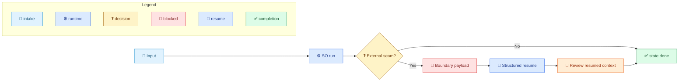
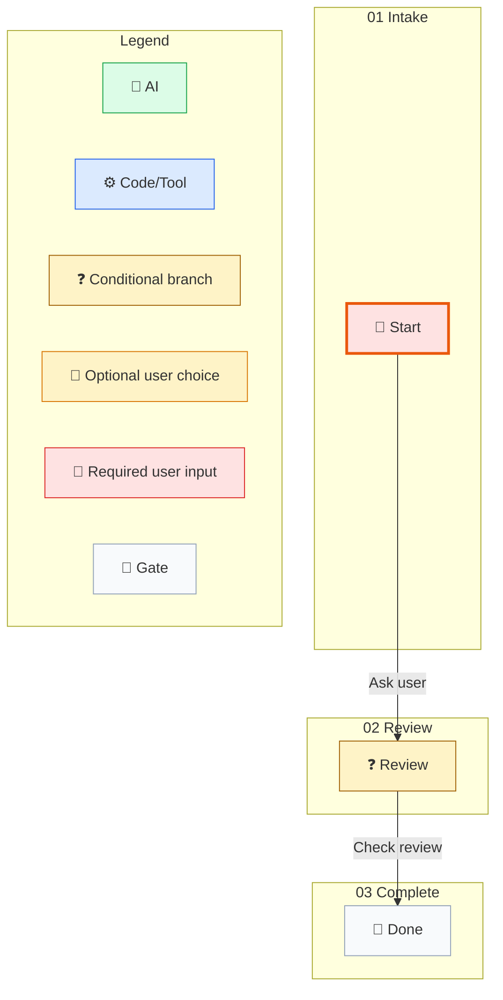

# Skill-Driven Workflow Example

[中文](../../zh-cn/examples/skill-driven-workflow.md) | [Root](../README.md)

This example shows how SO owns deterministic execution while the caller owns external seams surfaced through boundary payloads.

## Flow

1. The caller provides workflow input.
2. SO runs until it reaches an external seam.
3. SO returns a boundary payload that surfaces that seam with the current step kind and required inputs.
4. The caller performs the external action and sends back a structured resume envelope.
5. SO evaluates the resumed context and finishes at a deterministic done state.

## Resumable Workflow File

```json
{
  "instanceId": "ask1",
  "nodes": {
    "state.start": {
      "$kind": "state",
      "id": "state.start",
      "name": "Start",
      "workflowPhase": "01 Intake",
      "groups": [
        {
          "id": "group.ask",
          "strategy": "firstSuccess",
          "transitionIds": ["transition.ask"]
        }
      ],
      "waitBehavior": "blockUntilComplete"
    },
    "state.review": {
      "$kind": "state",
      "id": "state.review",
      "name": "Review",
      "workflowPhase": "02 Review",
      "groups": [
        {
          "id": "group.review",
          "strategy": "firstSuccess",
          "transitionIds": ["transition.check"]
        }
      ],
      "waitBehavior": "blockUntilComplete"
    },
    "state.done": {
      "$kind": "state",
      "id": "state.done",
      "name": "Done",
      "workflowPhase": "03 Complete",
      "groups": [],
      "waitBehavior": "blockUntilComplete"
    },
    "transition.ask": {
      "$kind": "command",
      "id": "transition.ask",
      "name": "Ask user",
      "description": "Need structured result",
      "targetNodeId": "state.review",
      "stepKind": "askUser",
      "command": {
        "kind": "tool",
        "name": "noop",
        "environmentKey": "",
        "parameters": {
          "requiredInputs": ["filePath", "content"]
        },
        "currentRetryCount": 0
      },
      "currentRetryCount": 0,
      "maxRetry": 10
    },
    "transition.check": {
      "$kind": "expr",
      "id": "transition.check",
      "name": "Check review",
      "targetNodeId": "state.done",
      "stepKind": "conditionBranch",
      "guardExpression": "true",
      "succeedExpression": "review.approved == true",
      "currentRetryCount": 0,
      "maxRetry": 10
    }
  },
  "startNodeId": "state.start",
  "currentNodeId": "state.start",
  "endNodeId": "state.done",
  "status": "readyToStart",
  "context": {},
  "history": [],
  "version": 0,
  "activeWaitGroups": []
}
```

## First Run

```powershell
dotnet so.dll run --workflow-file .\ask-workflow.json
```

Expected control payload excerpt:

```xml
<so_property>
{"type":"boundary","payload":{"status":"blocked","current_step_kind":"AskUser","required_inputs":["filePath","content"]}}
</so_property>
```

## Resume Envelope

```json
{
  "transition_id": "transition.ask",
  "correlation_key": null,
  "payload": {
    "review": {
      "approved": true
    }
  }
}
```

## Resume Command

```powershell
dotnet so.dll resume --workflow-file .\ask-workflow.json --result-file .\resume.json
```

Expected final control payload excerpt:

```xml
<so_property>
{"type":"result","payload":{"status":"completed","current_node_id":"state.done"}}
</so_property>
```

## Practical Reading Of The Result

- The caller owns the external action between `run` and `resume`.
- SO owns the persisted workflow state before and after the seam.
- The structured resume envelope is part of the public contract, not an implementation detail.

## Route Map



## Compile Evidence

This JSON is a public contract example. Compile an external copy with the exact SO runtime before treating its Mermaid as execution evidence:

```powershell
dotnet so.dll compile --workflow-file <external-workflow.json> --audit-output <external-audit-root>
```


## Runtime-Generated Mermaid (SO 0.3.316-beta)

Source workflow: `skill-driven-workflow.md` first JSON workflow block. Command: `so.exe compile --workflow-file <external-workflow.json> --audit-output <external-audit-root>`.


