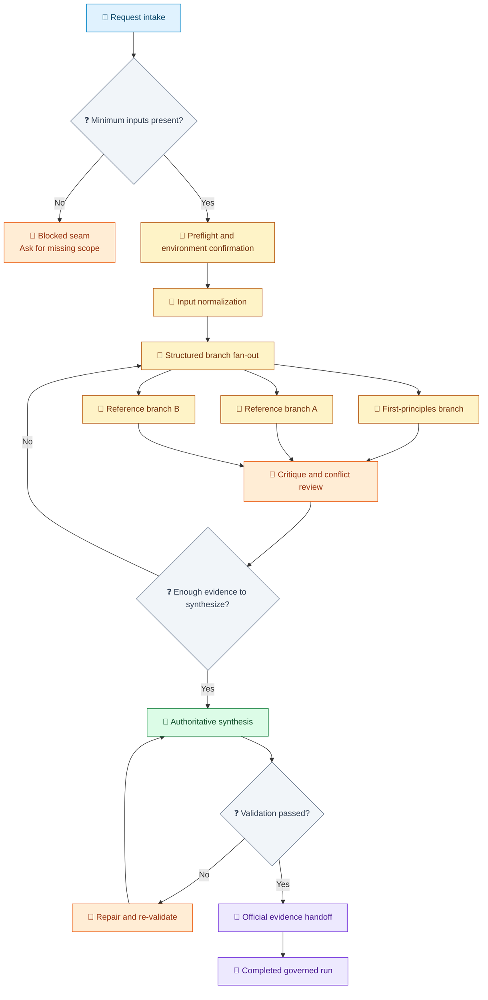
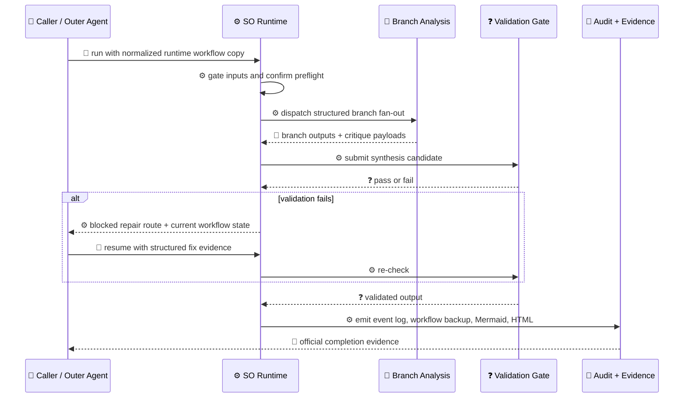

# Loom-Governanced Skill Run Example

[中文](../../zh-cn/examples/so-enhanced-skill-run.md) | [Root](../README.md)

This example shows a generalized Loom-governanced target-skill run where the value comes from route discipline, not from domain-specific implementation details.

> [!NOTE]
> This page intentionally hides product-domain details, vendor details, repository-specific anchors, and local file names. The point is to show how SO kept a large run structurally correct from intake to completion.

## Read With

- [SkillOrchestrator Guide](../guides/so-guide.md)
- [Skills Reference](../reference/skills.md)
- [Workflow Terminology](../architecture/workflow-terminology.md)
- [Skill-Driven Workflow Example](skill-driven-workflow.md)

## Scenario At A Glance

The run starts with a broad engineering request and must end with an implementation-ready output package that is traceable, reviewable, resumable, and auditable.

Without governance, this class of run usually drifts in one of four ways:

- scope is accepted too loosely
- branch exploration becomes uneven
- synthesis happens before enough evidence exists
- completion is declared without a real audit trail

Loom Skill Orchestrator governance prevents that drift by forcing the run through explicit gates.

## Route Map

Legend: `🧭` intake, `🚧` blocked or repair state, `🔎` branch analysis, `📝` synthesis, `🧾` evidence handoff, `❓` decision gate.

## Why The Route Stayed Correct

Legend: `👤` caller action, `⚙️` runtime action, `🔎` branch analysis, `❓` validation gate, `🧾` audit evidence.

## Stage Narrative

### 1. Input gating

SO stopped the run until the minimum inputs were confirmed. That did three jobs early:

- unclear scope became explicit
- missing assumptions became real defaults or decisions
- the run got a stable request context before heavier analysis began

### 2. Preflight and environment confirmation

SO required the environment and execution context to be confirmed before analysis moved forward. This was not only a tooling check. It protected the route from starting on an unverified foundation.

### 3. Input normalization

Raw upstream material was converted into normalized working artifacts before deeper analysis began. That kept later stages aligned on one canonical input set instead of a mixture of partial raw sources.

### 4. Structured branch fan-out

The run split into one first-principles branch, multiple reference-style branches, and critique passes. SO made those branches land in comparable shapes before synthesis could continue.

### 5. Critique before synthesis

SO did not let branch generation masquerade as final architecture. Each branch had to survive critique first, so weak assumptions and unresolved conflicts were surfaced before they hardened into the final route.

### 6. Authoritative synthesis

Synthesis only opened after branch evidence and critique already existed. That made the final output evidence-driven and conflict-aware instead of optimistic.

### 7. Validation gate

Validation was a real gate, not a courtesy step. The run could not close merely because a document existed. The authoritative output had to meet the structure and completeness bar first.

### 8. Official evidence handoff

Completion required more than prose saying “done”. The run had to end with an official evidence set so the route could be reconstructed later without depending on fragile chat memory.

## What SO Produced

| Surface | What it contributed | Why it mattered |
| --- | --- | --- |
| Workflow state | Durable stage-aware control path | Prevented silent drift |
| Event log | Step-by-step execution record | Made the run auditable |
| Mermaid + HTML renders | Point-in-time workflow visualization | Made progress and recovery explainable |
| Workflow analysis JSON | Inputs, outputs, branches, loops, seams, gates, and control-risk summary | Made the route reviewable before execution |
| Blocked seams | Structured pauses with resume requirements | Kept recovery deterministic |
| Completion evidence | Official done-state handoff | Distinguished real completion from apparent completion |

## Evidence Shape

A successful governed run ends with a small but meaningful evidence bundle:

- current workflow state or terminal workflow state
- append-only event log
- point-in-time Mermaid Markdown and HTML renders
- workflow JSON backup per audited step
- workflow analysis JSON per audited step
- validation pass signal tied to the authoritative output

That bundle is why the run is not only complete, but reviewable and resumable.

## Why This Pattern Repeats Well

This route is reusable for any skill that must:

- transform ambiguous inputs into a structured output package
- compare multiple design paths before choosing one
- preserve critique and conflict resolution
- validate a primary output before closure
- end with auditable completion evidence

The real reusable artifact is not the domain content. It is the governed execution shape.

## Positioning Guidance

Use this example as:

- a workflow-governance example
- a traceability example
- a structured synthesis example
- a completion-discipline example

Do not use it as a domain design reference, because the domain-specific details are intentionally abstracted away.

## Takeaways

- SO adds the most value by controlling route quality, not merely by accelerating content generation.
- The run stays correct because progress is earned stage by stage.
- Branching, critique, synthesis, validation, and evidence closure belong to one official path.
- A governed run is stronger precisely because it cannot bypass structure.

## Continue Reading

- Return to [Examples](README.md)
- Read the runtime contract in [SkillOrchestrator Guide](../guides/so-guide.md)
- Read the skill-layer rules in [Skills Reference](../reference/skills.md)
