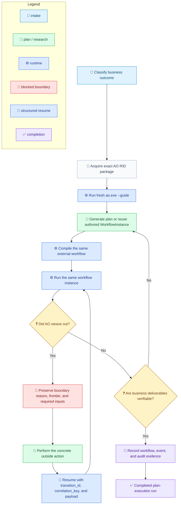

# Loom Agent Plan-Execution Orchestrator Flow

[中文](../../zh-cn/guides/ao-guide-flow.md) | [Hub](ao-guide.md) | [Reference](ao-guide-reference.md) | [Root](../README.md) |

<!-- guide-version:start -->
Version: 0.3.325-beta
Build: published package 0.3.325-beta
<!-- guide-version:end -->


## Purpose

Use this page for the shortest operational path through Loom Agent Plan-Execution Orchestrator. The fixed `ao-guide.md` page is the guide hub. Use [AO Guide Reference](ao-guide-reference.md) when a contract, example, or anti-pattern needs full detail.

## Flow

AO is the plan-execution route for uncertainty. It preserves one external workflow instance while the caller plans, probes, weaves out, and weaves back.

Legend: `🧭` intake, `📜` contract, `🔎` planning/research, `⚙️` runtime, `🚧` blocked boundary, `🔁` resume, `🧾` evidence, `✅` completion, `❓` decision.



## Runtime Checklist

- Detect one supported RID from OS, architecture, and Linux libc; acquire only the exact published AO package for that RID.
- Verify package identity, version, SHA-512, nuspec, manifest, ZIP safety, apphost, and English guide files before extraction.
- Run `ao.exe --guide` on Windows or `ao --guide` on Unix as the first runtime operation. Verify the returned version and readable contained guide paths.
- Use the same extracted apphost for schema/demo, compile, prompt-plan, prompt-replan, run, and resume.
- Keep the external WorkflowInstance, runtime state, event log, and audit output outside skill folders.
- No installed .NET host, DLL mode, resolver descriptor, or cross-mode fallback is required.
- Workflow-owned schema and control metadata use English; user/business payloads may keep their source language.

## CLI Quick Reference

```powershell
.\ao.exe --guide
.\ao.exe compile --workflow-file <external-workflow.json> --audit-output <external-audit-root>
.\ao.exe run --workflow-file <external-workflow.json> --context-file <context.json> --audit-output <external-audit-root>
.\ao.exe resume --workflow-file <external-workflow.json> --result-file <result.json>
```

On Unix, invoke `./ao` with the same arguments. `--guide`, `compile`, `prompt-plan`, and `prompt-replan` prepare or validate; only `run` and `resume` are official AO skill runs.
## Blocked Return

Read the structured blocked payload. Preserve `session_id`, `workflow_file`, `workflow_instance_file`, `event_log_file`, `current_node_id`, and the latest transition data. Use `prompt-plan` for the first authored graph and `prompt-replan` only when a later frontier or `tbr` path must be redesigned. Resume with `transition_id`, optional `correlation_key`, and a structured `payload`.

## Continue

- [AO Guide Hub](ao-guide.md)
- [AO Complete Reference](ao-guide-reference.md)
- [Workflow Schema](../reference/workflow-schema.md)
- [Workflow Terminology](../architecture/workflow-terminology.md)
