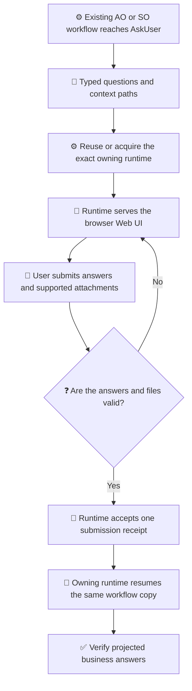

# Structured AskUser Guide

[简体中文](../../zh-cn/guides/ask-user-guide.md) | [Guides](README.md) | [Design](../architecture/ask-user-design.md)

<!-- guide-version:start -->
Version: 0.3.333-beta
Build: published package 0.3.333-beta
<!-- guide-version:end -->

## Choose The Right Route

- **Default across agents:** For workflow-owned requirements, decisions, constraints, or other user inputs, prefer `/loom-ask-user` before an agent-native AskUser/question interface, even when the user did not explicitly ask for a browser form.
- **One submission:** Put all currently knowable independent questions in one ordered form and collect one submission. Keep later prompts for information that genuinely depends on those answers.
- Use the existing AO or SO workflow's `AskUser` wait; if that business workflow is being designed or updated, put the wait there. Do not create a separate ask-only workflow.
- Use an agent-native conversational interface only for immediate clarifications outside a workflow, when no suitable business workflow can own an `AskUser` wait, when the user explicitly prefers it, or when the exact published runtime lacks the required form capability. Native tools are a fallback, not an agent-specific default.
- There is no standalone `so ask` or `ao ask` command.

`/loom-ask-user` is a lightweight Agent Skill whose purpose is to use the Loom runtime's Web UI. It has no workflow template, SO governance run, or package lock of its own. Its skill folder lives at `.agents/skills/loom-ask-user/`, separate from the NuGet runtime `.nupkg`. The Web UI requires the exact ask-capable AO or SO runtime that owns the existing workflow; the skill reuses it from the standard cache or acquires that exact dependency. See [runtime dependency rules](../../../.agents/skills/loom-ask-user/reference/runtime-dependency.md).

## Runtime-Served Web UI

The diagram is explanatory. The existing business workflow owns `AskUser` and `WaitResume`; its runtime generates and serves the form. The skill does not create or govern another workflow.

Legend: ⚙️ runtime/workflow owner (blue); 📜 question contract (indigo); 💬 browser interaction (amber); 🧾 submitted data (violet); ❓ validation decision (red); 🔁 continuation (teal); ✅ verified result (green). Labels and symbols carry meaning independently of color.

## Design Questions by Meaning

Use ordered groups and stable question IDs. Each typed question needs clear context, intent, prompt, a context-path binding, required state, and applicable constraints. Keep `requiredInputs` as context paths. For SO workflows, every user-owned answer path must also appear in `validation.declaredUserOwnedFields`.

| Type | Free-text meaning |
| --- | --- |
| Text | Use its existing text field; do not duplicate it with another fallback. |
| Single choice | `Other` is one mutually exclusive option and replaces a declared option. |
| Multiple choice | `Other` counts as one selection and obeys the selection bounds. |
| Number or boolean | Text supplements a native value; without one, nonblank text is the answer. |
| File or audio | Text may accompany an attachment; without one, nonblank text is the answer. |

A default prefills a control but does not satisfy a required answer. Required questions cannot be skipped. The Common server validator is authoritative for browser submissions.

## Run The Existing Workflow

Use this route for an AO/SO business workflow that owns the AskUser wait. If the workflow is being designed or updated, add intake to that same workflow; do not create a separate ask-only workflow. The skill does not execute a separate workflow.

1. Reuse the exact ask-capable package from the standard cache when it is available and verified; otherwise acquire that exact published package for the detected RID. Read its fresh `--guide` result.
2. Run the same external workflow copy through its owner. At the `AskUser` wait, the runtime serves the form and the initiating agent presents only a host-approved route in its embedded browser.
3. Keep pairing credentials out of ordinary logs and progress text. Do not guess a public route or create a tunnel.
4. After a valid receipt exists, let the owning runtime validate it and perform the existing resume on that workflow copy. The worker must not lock, mutate, or resume a `WorkflowInstance`.
5. Confirm the final workflow context contains the projected answers. A saved draft is not a submitted answer.

Files and audio use the supported attachment pipeline and configured limits. Do not fetch arbitrary URLs. JSON answer mode can be used to inspect or download current answers when the page exposes it; it does not replace server validation.

## Related Pages

- [AskUser design](../architecture/ask-user-design.md)
- [AskUser implementation plan](../architecture/ask-user-implementation-plan.md)
- [Using Techne Loom Skills](skill-usage.md)
- [SkillOrchestrator guide](so-guide.md)
- [Loom Agent Plan-Execution Orchestrator guide](ao-guide.md)
