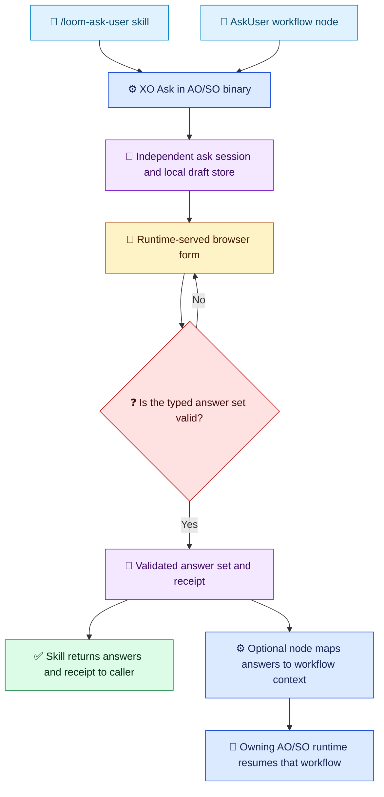

# XO Ask and AskUser Consumers

[简体中文](../../zh-cn/guides/ask-user-guide.md) | [Guides](README.md) | [Design](../architecture/ask-user-design.md)

<!-- guide-version:start -->
Version: 0.3.335-beta
Build: published package 0.3.335-beta
<!-- guide-version:end -->

## Three Layers

`XO Ask` is shorthand for the shared ask capability exposed by either existing AO or SO runtime binary. It is not a third product or package family.

| Layer | Responsibility | Workflow required? |
| --- | --- | --- |
| XO Ask in an AO/SO binary | Shared question contract, browser session, validation, local drafts, and receipt | No |
| `/loom-ask-user` skill | Agent-facing peer consumer: shapes the caller's questions, starts an ask session, and returns typed answers plus receipt | No |
| `AskUser` workflow node | Workflow-facing peer consumer: declares questions, maps the receipt into workflow context, and lets the owning runtime resume | Yes, only for this adapter |

The skill and node are independent consumers of XO Ask. Neither calls or depends on the other. A standalone ask has its own ask-session identity and local state; it does not create or require a `WorkflowInstance`. Workflow-specific `contextPath`, `requiredInputs`, SO `validation.declaredUserOwnedFields`, projection, and resume belong only to the node adapter.

## Current Release Status

The published `0.3.334-beta` package set does **not** yet expose a standalone `ask` command. The verified SO apphost help has no such entry; the AO apphost checked from the same runtime source line also has no standalone entry. The release can serve the workflow-owned AskUser Web UI, but that does not make the skill workflow-dependent by design or prove standalone support. Do not claim `/loom-ask-user` is workflow-free-capable until a published AO or SO apphost exposes the standalone command. Do not silently make a workflow node or an agent-native question tool the substitute.

## Intended Standalone Route

1. Put the caller's independent questions into one ordered, typed form contract. Preserve prompt, context, intent, required state, options, freeform behavior, and relevant constraints.
2. Resolve the exact AO/SO release version from the skill version block and detect the host RID. Reuse a verified same-version package from the standard cache; if neither AO nor SO is cached, prefer acquiring the exact AO package.
3. Verify package identity, version, RID, hash, manifest, archive paths, apphost, and a fresh guide. Confirm the selected apphost actually exposes its standalone ask entry.
4. Write the complete contract to a path-only file, then run `ao ask start --contract-file <path>` or `so ask start --contract-file <path>`. Present only the returned host-approved browser route; never infer a public URL or create a tunnel.
5. After one submission, query the matching `ao ask result --ask-id <id>` or `so ask result --ask-id <id>`. Return the typed answers and receipt; do not resume a workflow from the skill.

The steps describe the target contract. They are not currently executable on the published `.334-beta` package because its verified CLI has no standalone `ask` entry.

## Shared Browser Flow

The branches below are independent consumers of the same binary capability. A caller chooses one branch; the skill does not route through the node.

Legend: 🧭 consumer (blue); ⚙️ binary or workflow-node action (blue); 💬 user interaction (amber); 🧾 ask state/result (violet); ❓ validation decision (red); 🔁 optional workflow continuation (teal); ✅ direct result (green). Labels and symbols carry meaning independently of color.

## Question and Answer Semantics

Use stable question IDs and ordered groups. Supported types are `singleChoice`, `multipleChoice`, `text`, `number`, `boolean`, `file`, and `audio`. A default only prefills a control; it does not satisfy a required answer. Choice questions provide `Other` as a free-text alternative, so a clarification round can preserve choice suggestions while allowing a user-authored answer. See [answer semantics](../../../.agents/skills/loom-ask-user/reference/answer-semantics.md).

Standalone answers are returned by question ID and do not need workflow context paths. When an `AskUser` node is the consumer, its adapter supplies `contextPath` bindings, checks `requiredInputs` and SO ownership declarations, then maps the receipt and invokes the owning runtime's existing resume. That node-specific contract does not constrain the skill consumer.

## Runtime and Safety

AO and SO remain independent products but publish one exact-version runtime closure. `XO Ask` is only shorthand for the shared capability present in one of those binaries. The skill version block tracks the shared release-set version; it is not a claim that a specific version implements standalone `ask`.

Pairing URLs are secrets. Pass them only through the approved browser handoff; do not repeat them in ordinary progress, logs, or audit summaries. Use only host-approved routes. Do not fetch arbitrary remote attachment URLs.

## Related Pages

- [AskUser design](../architecture/ask-user-design.md)
- [AskUser implementation plan](../architecture/ask-user-implementation-plan.md)
- [Using Techne Loom Skills](skill-usage.md)
- [SkillOrchestrator guide](so-guide.md)
- [Loom Agent Plan-Execution Orchestrator guide](ao-guide.md)
