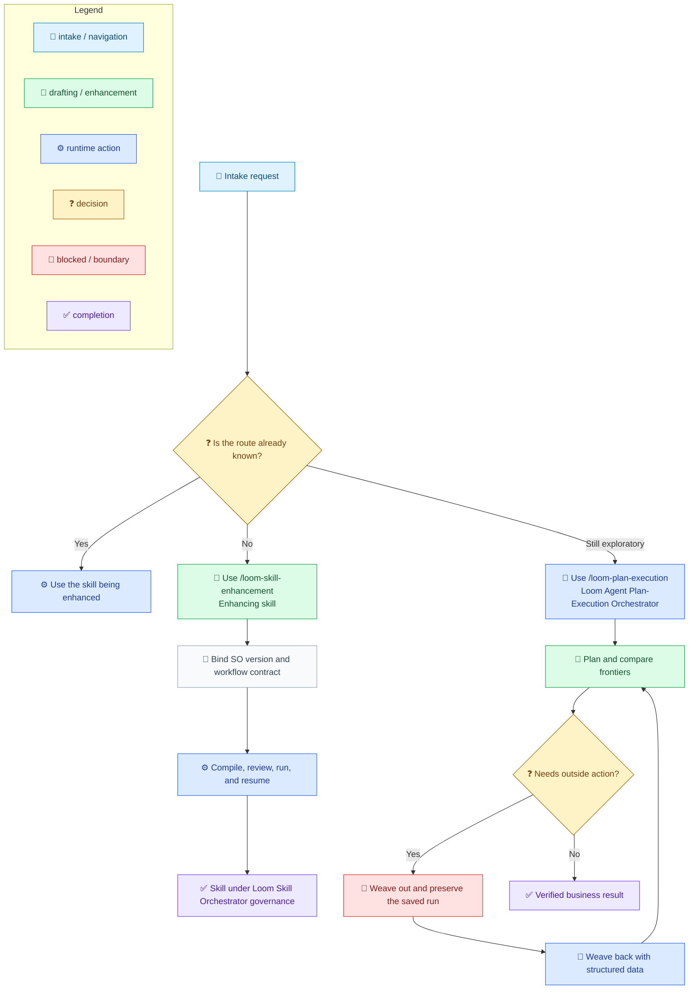
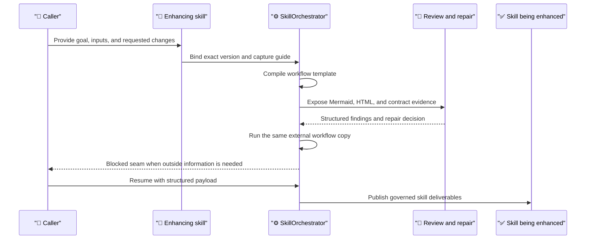

# Using Techne Loom Skills

[中文](../../zh-cn/guides/skill-usage.md) | [Root](../README.md)

This guide is the operator-facing entry for using Techne Loom skills in practice.

## Start With The Right Skill

Choose the entry by uncertainty and risk. The `/loom-skill-enhancement` **enhancing skill** turns a deterministic request into a skill under Loom Skill Orchestrator governance. `/loom-plan-execution` uses the **Loom Agent Plan-Execution Orchestrator** while the route is still exploratory.

| Need | Start with |
| --- | --- |
| Share concise instructions with an existing host | Agent Skills: `SKILL.md`, `AGENTS.md`, or the host's native plugin surface |
| Create or upgrade a deterministic skill | `/loom-skill-enhancement` (enhancing skill) |
| Use a skill that already has a governed workflow | The skill being enhanced, now under Loom Skill Orchestrator governance |
| Explore an uncertain route before it becomes deterministic | `/loom-plan-execution` and Loom Agent Plan-Execution Orchestrator |



The diagram uses emoji and labels as the meaning channel. Colors reinforce the categories but are never the only signal.

## Choose The Right Entry

| Situation | Use this | Read first | Official run surface |
| --- | --- | --- | --- |
| The route is still unclear | `/loom-plan-execution` | `packages.released.md` or `packages.beta.md`, then the guide from the exact AO package | `ao.exe run` / `ao.exe resume` on Windows; `ao run` / `ao resume` on Unix |
| You want to create or upgrade a deterministic skill | `/loom-skill-enhancement` | the matching SO package index, then the guide from the exact SO package | after enhancement, `so.exe run` / `so.exe resume` on Windows; `so run` / `so resume` on Unix; `compile` is validation only |
| The skill already has a governed workflow | the skill being enhanced | its `SKILL.md` and `assets/so-workflow/so-package-lock.json` | `so.exe run` / `so.exe resume` on Windows or `so run` / `so resume` on Unix, against an external workflow copy |

## Shared Setup Rules

1. Run [Platform Detection Steps](../reference/runtime/platform-detection.md) before runtime acquisition.
2. Bind one exact product/RID package from the lock. Verify its package hash and use that same apphost for `--guide`, `compile`, `run`, and `resume`.
3. Use a fresh `--guide` result before planning or editing skill deliverables.
4. Keep runtime copies, audit output, event sidecars, and compile artifacts outside skill directories.
5. Treat `compile` as preparation or validation. Only `run` and `resume` are official workflow execution.

## `/loom-plan-execution`

Use this entry when the route needs exploration, clarification, frontier comparison, or a structured handoff before deterministic work begins.

### Inputs

- a rich plan with at least 10 non-empty lines, or a detailed plan file path
- the requested language
- an optional audit output root

### Official Run

```powershell
.\ao.exe --guide
.\ao.exe compile --workflow-file <external-workflow.json> --audit-output <external-audit-root>
.\ao.exe run --workflow-file <external-workflow.json>
.\ao.exe resume --workflow-file <external-workflow.json> --result-file <result.json>
# On Unix, use the `ao` apphost instead.
```

`--guide`, `compile`, `prompt-plan`, and `prompt-replan` support preparation or recovery. Only `run` and `resume` count as official AO runs.

## `/loom-skill-enhancement`

Use this **enhancing skill** to create or upgrade the **skill being enhanced**.

### Inputs

- the skill being enhanced path or repository path
- a deterministic goal or upgrade request
- requested skill changes
- the exact SO version from its lock and version block
- an optional context file and audit output root

### Governed Route



The official success path must continue through direct `so.exe run` and `so.exe resume` on Windows, or `so run` and `so resume` on Unix, until final completion evidence exists.

### If a Named Agent Is Unavailable

Follow the [Named Agent Resolution rule](../../../.agents/skills/loom-skill-enhancement/SKILL.md#named-agent-resolution) and [Subagent Authority Rules](../../../.github/instructions/loom-skill-governance.instructions.md#subagent-authority-rules). `agent not found` means the host cannot dispatch that exact registered name; it does not replace or invalidate the named `.agent.md` contract. Resolve the exact file from that skill's `assets/agents/` folder. An available registered generic subagent may act only as the driver: give it the file path, full file contents, required reference manifest and runtime inputs, and expected output contract. Do not substitute a similar agent or pass only a path or summary. If the file is missing or ambiguous, or no driver can perform the required design, review, repair, or validation work, stop there and report the blocker; do not claim the handoff succeeded or advance dependent work. A direct/manual fallback requires explicit user approval.

### Enhancing Skill Agent Contracts

Each link opens the full checked-in `.agent.md` contract. Use the listed `assets/agents/` path relative to the active `/loom-skill-enhancement` skill root when dispatching; pass the complete file contents and required inputs to the agent or generic driver.

| Agent contract | Skill-relative call path | Responsibility |
| --- | --- | --- |
| [loom-skill-enhancement-workflow-designer.agent.md](../../../.agents/skills/loom-skill-enhancement/assets/agents/loom-skill-enhancement-workflow-designer.agent.md) | `assets/agents/loom-skill-enhancement-workflow-designer.agent.md` | Design or revise the governed workflow graph. |
| [loom-skill-enhancement-mcp-startup.agent.md](../../../.agents/skills/loom-skill-enhancement/assets/agents/loom-skill-enhancement-mcp-startup.agent.md) | `assets/agents/loom-skill-enhancement-mcp-startup.agent.md` | Configure optional MCP only after guide capture. |
| [loom-skill-enhancement-scope-input-output-analysis.agent.md](../../../.agents/skills/loom-skill-enhancement/assets/agents/loom-skill-enhancement-scope-input-output-analysis.agent.md) | `assets/agents/loom-skill-enhancement-scope-input-output-analysis.agent.md` | Analyze scope, inputs, outputs, and business deliverables. |
| [loom-skill-enhancement-route-gate-analysis.agent.md](../../../.agents/skills/loom-skill-enhancement/assets/agents/loom-skill-enhancement-route-gate-analysis.agent.md) | `assets/agents/loom-skill-enhancement-route-gate-analysis.agent.md` | Analyze branches, loops, ownership joins, and required checks. |
| [loom-skill-enhancement-evidence-node-map-analysis.agent.md](../../../.agents/skills/loom-skill-enhancement/assets/agents/loom-skill-enhancement-evidence-node-map-analysis.agent.md) | `assets/agents/loom-skill-enhancement-evidence-node-map-analysis.agent.md` | Map workflow nodes to deliverables and evidence. |
| [loom-skill-enhancement-reenhancement-conflict-judgment.agent.md](../../../.agents/skills/loom-skill-enhancement/assets/agents/loom-skill-enhancement-reenhancement-conflict-judgment.agent.md) | `assets/agents/loom-skill-enhancement-reenhancement-conflict-judgment.agent.md` | Choose patch, refactor, or template regeneration for re-enhancement. |
| [loom-skill-enhancement-skill-markdown-gap-review.agent.md](../../../.agents/skills/loom-skill-enhancement/assets/agents/loom-skill-enhancement-skill-markdown-gap-review.agent.md) | `assets/agents/loom-skill-enhancement-skill-markdown-gap-review.agent.md` | Review SKILL.md governance wording against the current guide. |
| [loom-skill-enhancement-package-lock-gap-review.agent.md](../../../.agents/skills/loom-skill-enhancement/assets/agents/loom-skill-enhancement-package-lock-gap-review.agent.md) | `assets/agents/loom-skill-enhancement-package-lock-gap-review.agent.md` | Review the exact SO package lock against the guide and bound version. |
| [loom-skill-enhancement-workflow-governance-gap-review.agent.md](../../../.agents/skills/loom-skill-enhancement/assets/agents/loom-skill-enhancement-workflow-governance-gap-review.agent.md) | `assets/agents/loom-skill-enhancement-workflow-governance-gap-review.agent.md` | Review workflow governance assets against the current guide. |
| [loom-skill-enhancement-weave-out-subagent-fit-review.agent.md](../../../.agents/skills/loom-skill-enhancement/assets/agents/loom-skill-enhancement-weave-out-subagent-fit-review.agent.md) | `assets/agents/loom-skill-enhancement-weave-out-subagent-fit-review.agent.md` | Decide whether a handoff needs its own local agent contract. |
| [loom-skill-enhancement-review-findings-aggregator.agent.md](../../../.agents/skills/loom-skill-enhancement/assets/agents/loom-skill-enhancement-review-findings-aggregator.agent.md) | `assets/agents/loom-skill-enhancement-review-findings-aggregator.agent.md` | Aggregate parallel findings without performing repairs. |
| [loom-skill-enhancement-review-fix-loop.agent.md](../../../.agents/skills/loom-skill-enhancement/assets/agents/loom-skill-enhancement-review-fix-loop.agent.md) | `assets/agents/loom-skill-enhancement-review-fix-loop.agent.md` | Coordinate accepted repairs and post-fix readiness evidence. |

### Example

```text
/loom-skill-enhancement
Language: en
Skill being enhanced: {agentskillfolder}/my-skill
Goal: upgrade this deterministic skill under Loom Skill Orchestrator governance
Requested skill changes:
- refresh SKILL.md governance wording
- create the runtime-owned plan under <execution-output-root>/plan/skill-plan.md
- create or refresh assets/so-workflow/so-template.json
- align assets/so-workflow/so-package-lock.json
```

## Continue Reading

- [Loom Agent Plan-Execution Orchestrator Guide](ao-guide.md)
- [SkillOrchestrator Guide](so-guide.md)
- [Loom Skill Enhancement Call Examples](../examples/skill-enhancement-calls.md)
- [Workflow Terminology](../architecture/workflow-terminology.md)
- [Skill Under Loom Skill Orchestrator Governance Run Example](../examples/so-enhanced-skill-run.md)
