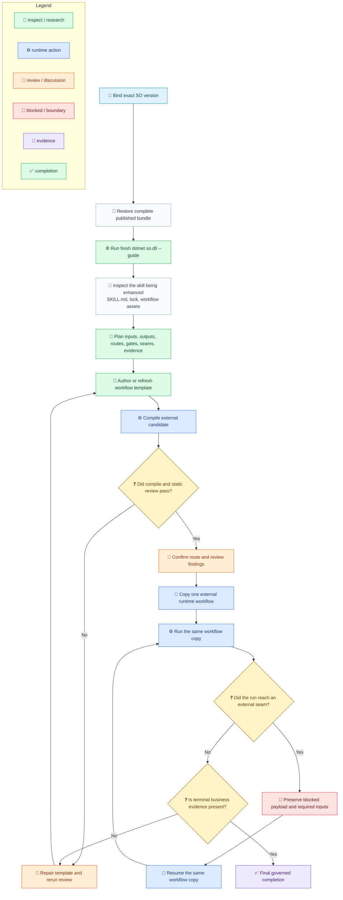

# SkillOrchestrator Flow

[中文](../../zh-cn/guides/so-guide-flow.md) | [Hub](so-guide.md) | [Reference](so-guide-reference.md) | [Root](../README.md) |

<!-- guide-version:start -->
Version: 0.3.320-beta
Build: published package 0.3.320-beta
<!-- guide-version:end -->


## Purpose

Use this page for the shortest governed execution path through SkillOrchestrator. The fixed `so-guide.md` page is the guide hub. Use [SO Guide Reference](so-guide-reference.md) for complete contracts, governance rules, examples, and anti-patterns.

## Flow

The route below separates the **enhancing skill** from the **skill being enhanced**. `compile` proves structure; the same external workflow copy must continue through `run` and every required `resume`.

Legend: `🧭` intake/navigation, `📜` contract, `🔎` inspection, `📝` drafting, `⚙️` runtime execution, `💬` review, `🚧` blocked/boundary, `🔁` continuation, `🧾` evidence, `✅` completion, `❓` decision.



## Runtime Checklist

- Framework-dependent mode uses only a resolver-generated bundle containing `so.dll`, generated `so.deps.json`, `so.runtimeconfig.json`, flattened dependency assets, and the exact package closure; a raw product `.nupkg` or `lib/net9.0` extraction is not runnable, and launch must use `dotnet exec --depsfile ... --runtimeconfig ... so.dll`.
- Self-contained mode uses only the exact RID runtime package and its native entry point.
- The fresh `--guide` result is readable before planning or skill-being-enhanced edits.
- The checked-in template remains immutable during official execution.
- Runtime copies and audit artifacts stay outside skill folders.
- `compile` is validation only; `run` and `resume` are the official execution path.
- Workflow-owned schema and control metadata use English.
- User and business payload values may keep their source language.

## CLI Quick Reference

```powershell
dotnet so.dll --guide
dotnet so.dll compile --workflow-file <external-workflow.json> --audit-output <external-audit-root>
dotnet so.dll run --workflow-file <external-workflow.json> --context-file <context.json> --audit-output <external-audit-root>
dotnet so.dll resume --workflow-file <external-workflow.json> --result-file <result.json>
```

`--guide` and `compile` prepare or validate the route. Only public `run` and `resume` count as official SO workflow execution.

## Blocked Return

Read `current_step_kind`, `skill_hint`, `required_inputs`, `workflow_file`, `event_log_file`, and verified audit links. For user-owned input, ask only for the declared decision or value. For runtime-owned facts, return structured data through the matching resume path. Preserve the same external workflow copy.

## Skill-Belonging Completion

A run for a skill under Loom Skill Orchestrator governance is not complete at guide refresh, template authoring, compile, or a blocked return. It needs skill deliverable changes, review-fix evidence, route and gate evidence, and the same-copy public run/resume chain through final completion.

## Continue

- [SO Guide Hub](so-guide.md)
- [SO Complete Reference](so-guide-reference.md)
- [Workflow Schema](../reference/workflow-schema.md)
- [Workflow Terminology](../architecture/workflow-terminology.md)
