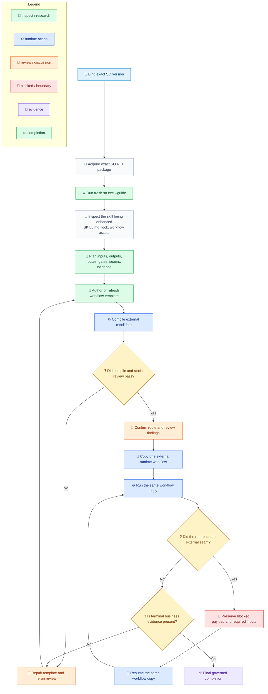

# SkillOrchestrator Flow

[中文](../../zh-cn/guides/so-guide-flow.md) | [Hub](so-guide.md) | [Reference](so-guide-reference.md) | [Root](../README.md) |

<!-- guide-version:start -->
Version: 0.3.323-beta
Build: published package 0.3.323-beta
<!-- guide-version:end -->


## Purpose

Use this page for the shortest governed execution path through SkillOrchestrator. The fixed `so-guide.md` page is the guide hub. Use [SO Guide Reference](so-guide-reference.md) for complete contracts, governance rules, examples, and anti-patterns.

## Flow

The route below separates the **enhancing skill** from the **skill being enhanced**. `compile` proves structure; the same external workflow copy must continue through `run` and every required `resume`.

Legend: `🧭` intake/navigation, `📜` contract, `🔎` inspection, `📝` drafting, `⚙️` runtime execution, `💬` review, `🚧` blocked/boundary, `🔁` continuation, `🧾` evidence, `✅` completion, `❓` decision.



## Runtime Checklist

- Detect one supported RID from OS, architecture, and Linux libc; acquire only the exact published SO package for that RID.
- Verify package identity, version, SHA-512, nuspec, manifest, ZIP safety, apphost, and English guide files before extraction.
- Run `so.exe --guide` on Windows or `so --guide` on Unix as the first runtime operation. Verify the returned version and readable contained guide paths.
- Use the same extracted apphost for schema/demo, compile, run, and resume on one external workflow copy.
- MCP is optional for later steps only; it is not a package, guide, compile, run, or resume prerequisite.
- Keep the checked-in template immutable and keep runtime copies, event logs, and audit artifacts outside skill folders.
- Workflow-owned schema and control metadata use English; user/business payloads may keep their source language.

## CLI Quick Reference

```powershell
.\so.exe --guide
.\so.exe compile --workflow-file <external-workflow.json> --audit-output <external-audit-root>
.\so.exe run --workflow-file <external-workflow.json> --context-file <context.json> --audit-output <external-audit-root>
.\so.exe resume --workflow-file <external-workflow.json> --result-file <result.json>
```

On Unix, invoke `./so` with the same arguments. `--guide` and `compile` prepare or validate; only public `run` and `resume` count as official SO workflow execution.
## Blocked Return

Read `current_step_kind`, `skill_hint`, `required_inputs`, `workflow_file`, `event_log_file`, and verified audit links. For user-owned input, ask only for the declared decision or value. For runtime-owned facts, return structured data through the matching resume path. Preserve the same external workflow copy.

## Skill-Belonging Completion

A run for a skill under Loom Skill Orchestrator governance is not complete at guide refresh, template authoring, compile, or a blocked return. It needs skill deliverable changes, review-fix evidence, route and gate evidence, and the same-copy public run/resume chain through final completion.

## Continue

- [SO Guide Hub](so-guide.md)
- [SO Complete Reference](so-guide-reference.md)
- [Workflow Schema](../reference/workflow-schema.md)
- [Workflow Terminology](../architecture/workflow-terminology.md)
