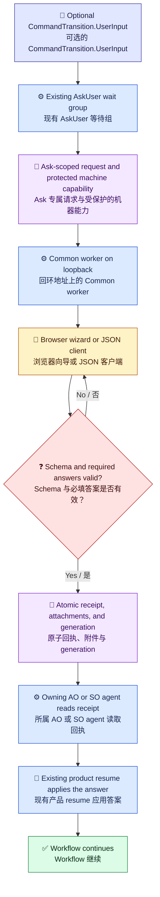

# 结构化 AskUser 设计

[English](../../en/architecture/ask-user-design.md) | [架构索引](README.md)

## 决策

在 Loom Agent Plan-Execution Orchestrator（AO）和 SkillOrchestrator（SO）现有的 `AskUser` workflow step 上增加结构化表单。此路径继续使用 `AskUser` 和 `WaitResume`，不增加新的 workflow step kind。`CommandTransition.UserInput` 是可选且带版本的表单契约；`requiredInputs` 仍是 workflow context 路径列表。旧的无类型 ask 保持现有行为。

将框架无关的共享能力放入 `Techne.Loom.Common`。AgentOrchestrator 和 SkillOrchestrator 保持独立 host，各自拥有 CLI、执行状态、package 身份和 resume 路径。不增加新的产品或 package 家族。

## Workflow 所有权

worker 接收 ask 请求、提供用户界面、校验答案并持久化草稿和提交回执。它不会获取 workflow 锁、修改 `WorkflowInstance`、追加 workflow history 或恢复 workflow。所属 agent 读取回执，并调用现有 AO 或 SO resume 路径。带类型的提交必须在修改 workflow context/history 前完成校验；重试保持同一个固定 `operation_id`，并遵循现有 operation ledger 的冲突和重放语义。

下图是解释性流程文档，不是作者化的 `WorkflowInstance`。

图例：📜 契约（靛蓝）；⚙️ 运行时（蓝）；💬 用户交互（琥珀）；🧾 持久化证据（紫）；❓ 校验决策（红）；✅ 继续执行（绿）。emoji 和标签也承载语义，不依赖颜色。

## 表单契约

使用有序的 `questionGroups` 和有序的 `questions`；向导一次显示一个 group，并提供线性的前进/返回导航，不设置问题分支。每个 group 和 question 都有稳定且唯一的 ID。question 携带面向用户的 `context`、`intent` 和 `prompt`、`contextPath` 绑定、答案类型、必填状态、适用时的选项、`multiple`、`defaultValue`、帮助文本和类型约束。

带版本的表单 schema 支持 `singleChoice`、`multipleChoice`、`text`、`number`、`boolean`、`file` 和 `audio`。选项值稳定。`multiple` 只适用于选择题。约束使用有界声明值，例如字符串长度、数值最小/最大值、选择数量、允许的媒体类型和附件最大字节数；不执行用户编写的正则表达式。默认值会预填控件，但不能满足必填答案。可跳过可选问题，不能跳过必填问题，并且仅在向导末尾提交一次。

`requiredInputs` 保持字符串路径列表，不替换成 question 对象。带类型的 question 将答案绑定到已声明路径。Skill Orchestrator ownership 校验仍要求每个 user-owned 路径都出现在 `validation.declaredUserOwnedFields` 中；runtime-owned 路径和生成的 artifact 路径仍属于 `WaitResume` 等 runtime-owned seam。

## 共享提交核心

canonical schema 和 Common validator 为静态向导及 JSON/curl 客户端定义相同的答案与附件形状。联网客户端使用同一个 draft store 和 submit core；UI 不会维护另一套服务端解释。离线 `file://` 导出使用相同版本的答案形状和经过 parity 测试的客户端 validator，然后下载 JSON 供所属 agent 审阅并恢复 workflow。

答案按稳定 question ID 索引，并显式记录可选问题的跳过状态。服务端在生成回执前校验完整答案集和所有 binding。无效输入、过期 generation、重复 question ID 和冲突提交均失败，且不修改 workflow context/history。

## Worker、草稿与附件

每个 ask 使用隔离目录、随机 ask ID、generation 编号、跨进程独占目录锁，以及原子草稿/回执写入。浏览器刷新、重启以及 worker 重启后草稿仍保留，但状态仍是 draft。提交采用原子单赢家语义。重复使用同一个幂等 key 会返回原回执；同 key 携带不同内容则冲突。多个 controller 使用 compare-and-swap 检查 generation，旧 generation 不得覆盖较新内容。

worker 默认仅绑定回环地址，并使用 BCL `HttpListener`；same-RID 实测中 Kestrel 压缩后自包含 package 超过批准的体积上限，因此不采用 Kestrel。host 通过 AO 或 SO 自己的 apphost 启动独立 Common worker。短轮询在超时后返回 `pending`；当前选定默认值为一秒。worker 不拥有 workflow 锁或 resume 操作。

文件、图片和音频字节以流式方式写入 ask 目录。服务端重新计算 SHA-256、字节长度和媒体类型，执行可配置配额，并且绝不获取用户提供的远程 URL。机器端本地路径导入会先读取字节，再经过同一校验。仅在配置的小尺寸上限内接受 `data:` URI。浏览器录音需要用户主动启动 `MediaRecorder`，并进入相同附件处理链路；不支持录音时仍可上传文件。

## 访问控制与威胁模型

- 默认使用仅回环地址的 HTTP。只绑定 `127.0.0.1` 或对应 IPv6 回环地址；即使回环访问也校验 Host 和 Origin。
- 远程访问必须由 host owner 显式启用，并由明确受信任的 proxy 终止 HTTPS；严格校验公开 Host/Origin，仅接受来自配置 proxy 地址的转发头。
- 单次 pairing code 可放在 URL fragment 中。客户端将其兑换为 ask 专属 session credential 后，立即从浏览器历史中移除 fragment。session credential 不放入 query string。
- 机器访问使用独立 capability，存放于具有严格当前用户权限/ACL 的文件中。它不得出现在 URL、命令行参数或日志中；它不能防御拥有相同 OS 权限的其他进程。
- 执行 CSRF 防护、请求体上限、上传/存储/并发/活动 worker 配额以及安全的静态资源响应头。`human_required` 是 workflow 策略，不是人类身份凭证。全局 agent-answer opt-in 由 owner 配置；workflow 策略只能进一步收紧。

## 保留期限与清理

未提交内容的默认过期时间可配置，从 ask 首次进入 READY 后 24 小时开始计算。已提交但尚未应用的答案和附件最多保留 30 天；应用后保留 7 天。详细日志保留 24 小时；关键生命周期事件随答案保留。过期和配额清理会删除 ask 数据和 worker 进程，但不会触碰 workflow 状态。

## 验收证据

测试覆盖旧版无类型 workflow、schema/版本兼容、有序性和 required/default 语义、重复 ID、所有答案类型、JSON/browser parity、草稿重启持久性、generation/CAS 冲突、单赢家提交、operation-ledger 重放/冲突、附件字节及元数据、录音/上传、远程认证/Host/Origin/CSRF、文件导出、过期、配额和进程清理。同一行为测试套件在 Windows 和原生 WSL Linux 上运行。已取消的跨 Agent answer-bundle transport 不在范围内。
