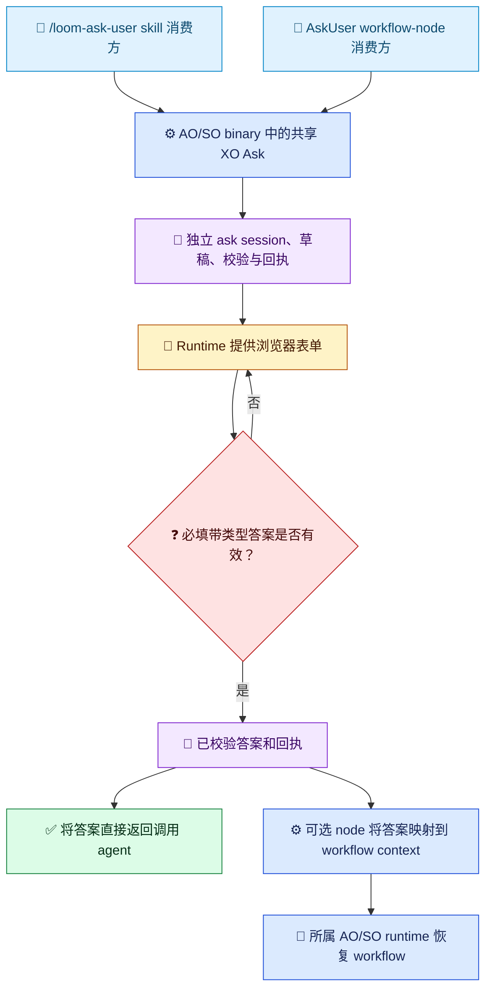

# XO Ask 架构

[English](../../en/architecture/ask-user-design.md) | [架构索引](README.md)

## 决策

XO Ask 是由现有 AgentOrchestrator（AO）和 SkillOrchestrator（SO）runtime binary 共同提供、独立于 workflow 的问答能力。`XO` 是对现有产品 `AO` 或 `SO` 中 `O` 的简称，不是第三个产品、package 家族或可执行文件。共享实现放在 `Techne.Loom.Common`，随同版本 AO/SO 自包含 runtime package 闭包分发。

XO Ask 有两个并列消费者：

1. `/loom-ask-user` 是面向 agent 的消费者。它把调用方的问题部分整理成一份有序、带类型的 ask 契约，启动独立 ask session，并返回已校验答案和回执。它没有 workflow template、`WorkflowInstance`、`AskUser` node、`WaitResume` 或 workflow context 前置条件。
2. 现有 `AskUser` workflow node 是面向 workflow 的消费者。它声明 node 自己的问题、提供 workflow 映射、消费相同类型的 ask 结果、校验投影，再由所属 runtime 恢复 canonical workflow 副本。

两种消费者互不依赖。Node 路径是可选适配器，不定义也不限制 standalone skill 路径。无需新增产品或 package 家族。

## XO Ask 与消费者所有权

共享 binary 能力拥有 ask-session 身份、版本化问题契约、答案校验、浏览器会话、本机草稿/回执存储和 standalone 结果交接。它不创建、锁定、修改或恢复 `WorkflowInstance`。

Standalone skill 不传入 workflow 路径，收到按稳定问题 ID 索引的答案和 ask 回执。Workflow node 可额外提供 `contextPath` 映射；仅对该消费者，`requiredInputs` 仍是路径列表，SO 仍要求每个 user-owned 路径出现在 `validation.declaredUserOwnedFields` 中。只有 node 所属产品 runtime 可以把有效回执应用到 workflow 状态并执行 resume。

图例：🧭 并列消费者（蓝）；⚙️ 共享 binary 或可选 node 适配器（蓝）；💬 用户交互（琥珀）；🧾 ask 状态/结果（紫）；❓ 校验决策（红）；🔁 可选 workflow 继续执行（青绿）；✅ standalone 结果（绿）。标签和符号都表达含义，不只依赖颜色。

## 当前发布缺口

已核验的 SO `0.3.334-beta` apphost `--help` 没有 standalone `ask` 命令；同一 runtime 源代码版本线检查过的 AO apphost 也没有该入口。Workflow-owned AskUser UI 已存在，但这不满足 skill 独立于 workflow 的契约。只有精确发布的 AO/SO binary 暴露独立 ask 入口后，才能把目标路径描述为已交付。二进制依赖是真实的，workflow 依赖不是目标架构的一部分。

## 问题契约

共享契约包含有序的 `questionGroups` 和有序问题；问题带稳定 ID、面向用户的 context/intent/prompt、答案类型、必填状态、适用时的选项、默认值、帮助文本和类型约束。支持 `singleChoice`、`multipleChoice`、`text`、`number`、`boolean`、`file` 和 `audio`。

Standalone 问题不要求 `contextPath`。Workflow-node 适配器可以附加 `contextPath` 映射；这是消费者元数据，不是基础设施前置条件。Node 路径的 `requiredInputs` 仍为路径列表，不与 standalone 问题 schema 混用。默认值只预填，不满足必填；可选题可跳过，必填题不可跳过。

选择题使用稳定选项值。`Other` 在 `singleChoice` 中是互斥的自由文本答案；在 `multipleChoice` 中计作一个选择。所有消费者共用 Common server validator 和规范化答案语义。

## Session、结果与持久化

每个 ask 都有独立于 workflow 标识的 ask-session ID。草稿和提交回执保存在 user-scoped 本机 ask store，并具有可配置 TTL 和资源配额。Standalone 结果把带类型答案和回执一同返回调用方；调用方可以保存回执供审计/查询，不必创建 `WorkflowInstance`。

Workflow-node 消费者可以附加可选的 workflow 关联和映射信息。该适配器在写入 workflow context/history 前校验完整回执，使用现有 operation ledger 处理重放/冲突语义，并把恢复操作交给所属 AO/SO runtime。共享 worker 不持有 workflow 文件锁，也不修改 workflow 状态。

服务端在接受回执前校验完整答案集和绑定。无效答案不会消耗 ask session。一个有效提交以原子方式获胜；完全相同的幂等重试返回原回执，内容冲突则 fail closed。

## Runtime 与 Package 选择

`XO Ask` 随现有 AO/SO 自包含 runtime package 闭包分发，不增加 XO package。Skill 绑定已发布的 AO/SO release-set 精确版本和当前 host RID。`/loom-ask-user` 先复用标准 NuGet cache 中任一经过验证的同版本 package；AO/SO 都没有缓存时，优先获取精确版本 AO package。不得使用浮动 `latest`、跨 OS/RID/libc 或回退到本地测试 runtime。

使用前校验精确 package 身份/版本/RID、NuGet registration SHA-512、nuspec、runtime manifest、安全 archive 路径和 apphost。直接启动 apphost、获取 fresh `--guide`，并确认 standalone 命令确实存在。版本块记录共享 release-set 版本，不代表某项功能能力已交付。

## 浏览器安全

Binary 默认在 loopback 提供浏览器表单。只使用 host 批准的路由，严格校验 Host/Origin，使用一次性 pairing 和 ask-scoped session credential。Pairing URL 是秘密，不得出现在普通输出、日志或审计产物中。不要推断公网地址、自动创建 tunnel 或获取任意远程附件。若 host 支持远程访问，必须由 owner 显式配置并经受信任 HTTPS proxy。

## 可选 Workflow Node 适配器

Node 路径保留现有 workflow 模型：不新增 workflow step kind；`AskUser`/`WaitResume` 仍是 workflow-facing contract。`CommandTransition.UserInput` 是给该 node 使用的可选、带版本问题适配器。缺省契约时旧 node 行为保持兼容。Workflow schema export 包含 node 契约；standalone skill 请求则直接使用共享 ask 契约。
