# 结构化 AskUser 实施计划

[English](../../en/architecture/ask-user-implementation-plan.md) | [架构索引](README.md) | [设计](ask-user-design.md)

## 范围与不变量

在 Loom Agent Plan-Execution Orchestrator（AO）和 SkillOrchestrator（SO）的现有 `AskUser`/`WaitResume` 路径上交付结构化表单。保留旧的无类型 workflow 和产品边界。共享契约、校验、存储和 worker 行为放入框架无关的 Common 代码；每个产品仍通过自己当前的 execution 和 resume owner 集成。

worker 只拥有 ask 专属草稿、校验、附件字节和提交回执。它不会锁定、修改或恢复 workflow。所属 AO 或 SO 路径读取一份已接受的回执，并在现有 resume mutation 之前执行带类型校验。不在范围内的内容包括新的 workflow step kind、产品、package 家族、可变 workflow-state 副本以及跨 Agent answer-bundle transport。

每个阶段都在下一阶段开始前审查并验证。每个可审查切片尽量少于 50 个变更文件，只提交已审查的工作。

## 交付阶段

下图是解释性实施阶段路线，不是 workflow JSON 或 `WorkflowInstance`。

```mermaid
flowchart LR
    BASE["✅ Runtime 基线<br/>已完成"] --> CONTRACT["📜 契约与校验器"]
    CONTRACT --> STORE["🧾 Ask 存储与提交核心"]
    STORE --> CLIENT["💬 Worker、向导与客户端"]
    CLIENT --> HOSTS["⚙️ AO 与 SO 集成"]
    HOSTS --> CROSS["🔍 跨平台与安全门禁"]
    CROSS --> REVIEW["🚀 审查、提交与 fast-forward"]

    classDef complete fill:#dcfce7,stroke:#15803d,color:#052e16;
    classDef contract fill:#e0e7ff,stroke:#3730a3,color:#1e1b4b;
    classDef evidence fill:#f3e8ff,stroke:#7e22ce,color:#3b0764;
    classDef user fill:#fef3c7,stroke:#b45309,color:#451a03;
    classDef runtime fill:#dbeafe,stroke:#1d4ed8,color:#172554;
    classDef validation fill:#fee2e2,stroke:#b91c1c,color:#450a0a;
    classDef delivery fill:#ccfbf1,stroke:#0f766e,color:#042f2e;
    class BASE complete;
    class CONTRACT contract;
    class STORE evidence;
    class CLIENT user;
    class HOSTS runtime;
    class CROSS validation;
    class REVIEW delivery;
```

图例：✅ 已完成基线（绿）；📜 契约（靛蓝）；🧾 持久化（紫）；💬 用户界面（琥珀）；⚙️ 产品运行时集成（蓝）；🔍 验证（红）；🚀 交付（青绿）。

### 1. 契约与校验器

- 增加可选且带版本的 `CommandTransition.UserInput` 契约，包含稳定有序的问题组/问题，以及选择、文本、数字、布尔、文件和音频类型。
- `requiredInputs` 保持 context 路径。校验唯一 ID、引用、类型约束、绑定、答案值、必填答案和显式的可选跳过。
- 保留契约缺省时的旧行为，并确保旧 workflow JSON 仍可反序列化。不能静默解释未知契约版本。
- 增加契约和 Common validator 测试，包括无效输入必须在修改 workflow context/history 前被拒绝。

门禁：契约/校验器聚焦测试通过；旧的无类型 workflow fixture 可反序列化且保留当前行为。

### 2. Ask 专属存储与提交核心

- 实现隔离的 ask 状态、可跨重启恢复的草稿、generation compare-and-swap、跨进程排他、原子持久化和单赢家提交。
- 回执存放 schema 版本、ask/workflow 身份、generation、operation ID、规范化答案、附件元数据、时间戳和完整性哈希。worker 状态与 canonical `WorkflowInstance` 分离。
- 定义重试语义：相同 operation ID 和相同 payload 重放原回执；相同 ID 携带不同内容时冲突；过期 generation 和其他竞争提交均冲突，不得替换赢家。
- 执行有界过期和配额清理，不能触碰 workflow 状态。

门禁：并发 controller 下的重启恢复、原子性、generation 竞态、operation 重放/冲突和清理测试通过。

### 3. Worker 与客户端界面

- 使用已选的 BCL `HttpListener` 托管独立 Common worker；默认只监听回环地址，执行有界的一秒轮询并返回 pending，安全清理进程，不依赖 Kestrel。
- 提供静态线性浏览器向导，使用与 Common 完全一致的 schema/answer 契约和共享联网 submit core。支持刷新/重启后恢复草稿、必填/默认/跳过语义、前进/返回，以及最后一次性提交。
- 提供基于同一草稿和提交核心的 JSON/curl 接口。无法使用联网 worker 时，提供离线 `file://` 导出与 JSON 下载，并对其校验 parity 做测试。
- 上传和用户主动启动的浏览器录音共用一条附件处理链路。流式校验字节、SHA-256、长度、媒体类型、单文件及总量限制和配额；不获取任意远程 URL。

门禁：浏览器、JSON、离线导出、文件上传和录音/不支持录音的测试对 payload 与校验结果保持一致；worker 在 host 命令返回后仍存活，并在 ask 过期时清理。

### 4. AO 与 SO 集成

- 使用各产品当前的 runtime/package/apphost 所有权，将 AO file execution/MCP 与 SO CLI execution 接入共享 AskUser worker。
- 仅在现有 `AskUser` active wait group 存在时创建请求；workflow 锁和 canonical state 仍由现有执行服务负责。
- 通过各自现有产品 resume 路径消费回执。在 resume 修改 context 或 history 前校验完整带类型答案；保留 event log、operation ledger、run identity 和 wait-group 不变量。
- 保留 SO 的 `requiredInputs` 与 `validation.declaredUserOwnedFields` ownership 规则。Runtime-owned 值和生成的 artifact 路径仍通过 `WaitResume` 等 runtime-owned seam 处理。
- 只有显式 owner 配置、可信 proxy 上的 HTTPS、严格 Host/Origin allowlist 及可信 proxy 校验全部满足时，才启用可选远程访问。默认保持回环访问。

门禁：AO 与 SO 各自通过 AskUser 端到端 run/resume 测试、错误/过期/重复回执测试和兼容测试，且不共享 runtime 所有权。

### 5. 跨平台与安全验证

- 完成聚焦功能测试后，并行执行 Windows 和原生 WSL Linux restore、build、test；隔离 intermediate/output 目录并分别保存结果。
- 如果 WSL 缺少 .NET SDK，先在该 distro 安装/配置受支持 SDK，再执行必需的 Linux 门禁；如遇真实环境阻碍，准确记录，不能把缺少工具视为通过。
- 在两种平台上验证权限、URL/凭证泄漏、CSRF、Host/Origin 拒绝、上传边界、配额、竞态、重启恢复、保留期限和进程清理。
- 使用各自匹配的自包含 RID apphost 生成最终 AO 和 SO schema/demo 证据；使用完全相同 runtime 版本编译每个导出的 demo。生成产物放在 source 目录之外，除非用户明确要求交付。

门禁：Windows/WSL 必需门禁和 AO/SO schema/demo compile 证据全部通过，或精确记录仍存的环境阻碍。

### 6. 审查与交付

- 全量 review diff，检查兼容性、AO/SO 独立所有权、安全性、原子性、测试缺口和意外生成产物。修复发现并重新验证后再交付。
- 在隔离实现分支提交已审查结果。不 push、不 publish。
- 确认原始 `development` worktree 仍位于起始 commit 且没有用户变更，然后 fast-forward 到已审查 commit。如果原分支移动或出现未提交变更，则停止集成并保留其状态。
- 重新检查两个 worktree，并报告 commit、验证证据和仍存的注意事项。

## 证据与报告

下载的 runtime、生成的 workflow instance、compile/run audit 材料、构建输出和分平台测试结果都放在隔离 execution output 根目录。为 schema/demo 的导出与编译保留精确 AO/SO runtime 版本和 RID 来源。除非实际生成了 Analysis 或 Dataflow 报告，否则不能把 compile HTML 当作它们的证据。

流程图属于解释性材料。后续添加的任何 workflow JSON 或 `WorkflowInstance` 示例都必须按仓库规则包含同版本 direct-apphost `ao compile` 或 `so compile` Mermaid 证据产物。
