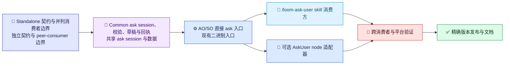

# XO Ask 实施计划

[English](../../en/architecture/ask-user-implementation-plan.md) | [架构索引](README.md) | [设计](ask-user-design.md)

## 范围与当前状态

在共享 `Techne.Loom.Common` 层实现独立于 workflow 的 XO Ask，并通过现有 AO 与 SO 自包含 runtime binary 暴露能力。`XO` 是 AO 或 SO 的简称，不是第三个产品或 package 家族。Workflow-free `/loom-ask-user` skill 与 `AskUser` workflow node 是并列消费者，彼此不依赖。

当前已发布的 `0.3.334-beta` package set 可以提供 workflow-owned AskUser 浏览器路径，但已核验的 CLI help 没有 standalone `ask` 命令。本计划不把当前路径当作目标契约；必须先让二进制具备该能力，skill 才能如实宣称 standalone 可用。

保留 workflow node 作为可选适配器。它可以继续使用 `CommandTransition.UserInput`、`requiredInputs`、SO `validation.declaredUserOwnedFields`、context 投影和所属产品的 resume。这些内容都不是 standalone ask session 的前置条件。AO 与 SO 仍是独立产品，分别保留 CLI/package 身份，并使用同一精确版本的 release-set 闭包。

## 交付顺序

图例：📜 契约（靛蓝）；🧾 ask 持久化数据（紫）；⚙️ runtime binary/node 适配器（蓝）；🧭 skill 消费方（浅蓝）；🔎 验证（红）；✅ 发布（绿）。Skill 与 node 是共享二进制能力分出的两条并列路线。

### 1. Standalone 契约与身份

- 定义带版本的 `questionGroups` 契约，不要求 `WorkflowInstance`、node ID、transition ID、`contextPath` 或 `requiredInputs`。
- 保留稳定问题 ID、有序问题组、context/intent/prompt、必填状态、答案类型、选项/默认值、类型约束。支持现有七种答案类型与 `Other` 自由文本语义。
- 定义 ask-session ID、答案返回结构、回执、幂等性、本机存储所有权、过期策略，以及向调用方直接返回结果的规则。
- 允许消费者附加可选关联信息，但不把 workflow 身份设为必需字段。

门禁：Standalone contract fixture 在不包含 workflow 字段时也能 compile/validate；旧 node `UserInput` fixture 继续兼容。

### 2. Common Session 与提交核心

- 重构共享 ask session/store，使 ask 可以在没有 workflow instance 或 transition 标识时独立存在。
- 由 ask session 管理草稿、附件、最终答案、回执完整性、TTL、配额、单次提交和精确重试/冲突语义。
- 共享 worker 只校验并持久化 ask 数据，不修改或锁定 workflow，也不执行 resume。
- 保留 pairing 保密、默认 loopback、host 批准路由、CSRF/Host/Origin 防护和安全附件处理。

门禁：Standalone store 测试覆盖可恢复草稿、合法回执、重复/冲突提交、过期、配额，以及不触碰 workflow state。

### 3. AO/SO 二进制入口

- 两个现有 apphost 通过同一个 Common 实现暴露 `ao ask start --contract-file <path>`、`so ask start --contract-file <path>`，以及对应的 `ao ask result --ask-id <id>`、`so ask result --ask-id <id>` 操作。
- 返回机器可读的 endpoint/result descriptor，包含 ask ID、批准的 URL、过期时间和回执/结果查询元数据。Pairing URL 不得进入普通日志。
- 解析 AO/SO release-set 精确版本和 RID。复用 standard cache 中经过验证的同版本 AO 或 SO package；两者都没有时优先获取精确版本 AO。不得使用浮动版本或创建第三个 XO package。
- 保持直接启动自包含 apphost，并验证 fresh `--guide`。

门禁：AO、SO 都能在不提供 workflow file 的情况下，独立启动相同 standalone 契约、提供 ask session，并返回带类型答案与回执。

### 4. 并列消费者

- Skill 消费方：把调用方问题整理为共享契约，调用精确 AO/SO binary，提供获批表单路由，并返回带类型答案与回执。不得创建、要求或恢复 workflow。
- Workflow-node 消费方：保留 `AskUser`/`WaitResume`；将 `CommandTransition.UserInput` 转成共享契约，提供 node 自己的 context 映射，校验 `requiredInputs` 和 SO user-owned-field 声明，再由所属产品 runtime 把答案投影/恢复到同一 canonical workflow。
- 不得通过调用 node 来实现 skill，也不得通过调用 skill 来实现 node。两者只依赖共享 XO Ask 基础设施。

门禁：测试分别证明两个消费者可独立运行；移除任一消费者都不影响另一消费者。

### 5. 发布、文档与验证

- 更新双语架构、指南、skill/reference、导航、根规则、版本 marker 自动刷新和 memory，区分基础设施、skill 与 node。
- 已发布版本 marker 只记录 AO/SO 共享 release-set 的精确版本，不代表某项能力已具备。具体 package 是否支持 standalone ask，必须由该精确 apphost 的 fresh help/guide 证据确认。
- 在 standalone 命令进入已发布二进制之前，明确保留 `.334-beta` 当前限制。
- 发布前跑聚焦测试、Windows/原生 WSL 并行 restore/build/test（输出隔离），并用精确发布 apphost 生成 AO/SO schema/demo 证据。

门禁：所有文档声明与发布 CLI 行为一致；release closure 仍只有现有 16 个 AO/SO RID runtime package；standalone 与可选 node-consumer 测试通过。

## 非目标

- 不新增第三个 `XO` 产品、二进制、package 家族或发布通道。
- Standalone `/loom-ask-user` 不要求 workflow、workflow template、governance run，也不隐式 resume。
- 不移除现有 `AskUser` workflow node 或其由所属 owner 控制的 resume 语义。
- Standalone 二进制能力缺失时，不得静默回退到 agent 原生提问工具。
