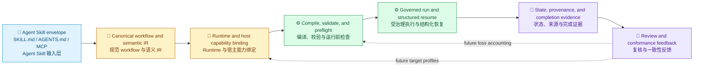

# Skill 互操作层

[English](../../en/architecture/skill-interoperability.md) | [架构](README.md) | [根目录](../README.md)

> 状态说明：本页记录截至 2026-09-21 审查过的产品边界与公开证据。外部 issue 说明了真实宿主行为，但不表示每个安装环境都会以完全相同的方式失败。

Techne Loom 是**构建在 Agent Skills 之上的可验证语义与执行互操作层**。

它不替换 Agent Skills envelope，而是消费已经存在的 `SKILL.md`、`AGENTS.md`、MCP、scripts 和宿主配置。Loom 增加一个位置，把 workflow 语义、runtime identity、状态转换、交接和完成证据变成显式契约。

## 产品真正要回答的问题

共享一份 `SKILL.md` 只是起点。真正的运行问题是：当宿主改变后，同一份意图能否被发现、准备、执行、暂停、恢复、复核和解释。

社区报告显示，脆弱点通常不在模型 prompt 本身：

1. loader 可能跳过文件 symlink、采用不同的 precedence 规则，或返回过期 cache；
2. specification、validator 和已发布 runtime 可能对 metadata 或编码有不同解释；
3. local、cloud、IDE、CLI 与不同设备上的副本可能没有一个 canonical source；
4. tools、MCP server、permissions、credentials 和 runtime dependencies 可能随 session 改变；
5. 长流程交接可能没有 durable state、completion proof 或可观察的 resume 点。

Loom 把这些视为合同与证据问题，但不声称能够解决宿主无法观察或执行的模型行为。

## 五类失败面

| 失败面 | 用户实际遇到的情况 | Loom 的工程化回应 | 当前边界 |
| --- | --- | --- | --- |
| 发现、优先级和缓存 | 合法 Skill 不见了、被错误覆盖，或加载了旧副本 | canonical workflow identity、checked-in template、精确 runtime binding、外部 workflow copy 与 preflight evidence | 宿主特定的 materialization 与 adapter 仍在形成 |
| Schema 与 loader 漂移 | 同一份 frontmatter 被一层接受、另一层拒绝 | parse/compile diagnostic、结构化 compile feedback、显式 contract field，以及未来由 adapter 负责的 target validation | Loom 不会重写厂商 loader |
| source 与 surface 漂移 | local、cloud、IDE 和 CLI 看到不同文件或版本 | locked package/runtime evidence、hash、provenance，以及不依赖 chat history 的 workflow copy | 账号级同步仍是宿主职责 |
| tools、MCP 与权限 | Skill 已被展示，但必需工具、凭据或权限不存在 | runtime preflight、精确 package closure、descriptor-owned 本地 stdio MCP、有界 inspection 与显式 gates | 当前没有统一所有宿主的权限或 sandbox 模型 |
| state、交接与完成 | 后台任务看起来像 idle，交接丢失上下文，或无法证明“已完成” | 磁盘上的状态、wait/resume、operation identity、结构化 boundary payload、event log、audit artifact 与 terminal output gate | 厂商 transcript 仍是视图，不是可移植状态标准 |

## 分层模型

这个模型把开放生态输入与 Loom Skill Orchestrator 治理分开：

canonical source 仍然是 skill package。生成出来的宿主 materialization 不能反过来成为第二个事实源。

## Loom 当前基础

当前公开 runtime 已经具备让受治理执行成立的基础：

| 基础能力 | 公开合同中的证据 |
| --- | --- |
| Workflow IR | `WorkflowInstance`、states、transitions、transition groups、routes、seams、ownership、output bindings 与 workflow identity |
| 确定性校验 | compile feedback、expression capability checks、route/gate validation、semantic probes 与显式 no-progress 处理 |
| Runtime identity | 精确 package lock、runtime mode/RID binding、launch descriptor、dependency closure 与 fresh guide metadata |
| 可恢复执行 | 磁盘上的 workflow copy、wait state、operation identity、结构化 result envelope，以及 `run`/`resume` 入口 |
| 受治理 MCP 入口 | 本地 stdio MCP、`initialize`/`initialized`、descriptor identity、有界 fragment inspection 与已记录的 CLI fallback reason |
| 证据与 provenance | Mermaid、HTML、workflow JSON、event sidecar、package/document hash、audit summary 与 terminal output evidence |

所以 Loom 不只是 Markdown workflow helper。但同样因为如此，当前产品声明也必须保持在“还不是完整 Claude-to-Codex-to-Gemini compiler”的范围内。

## 社区一手证据

下面的报告之所以有价值，是因为它们暴露了工程边界，而不只是说模型做出了错误选择。状态标签按 2026-09-21 审查到的链接状态书写。

| 来源 | 报告的问题 | Loom 的回应 | 状态与诚实边界 |
| --- | --- | --- | --- |
| [OpenAI Codex #15756](https://github.com/openai/codex/issues/15756) | 文件级 `SKILL.md` symlink 被跳过，而目录 symlink 被跟随；后续评论还包含 `0.147.0` 的复现。 | 从一个 canonical source materialize 出 target-safe package，再用宿主特定 discovery probe 证明 ready。 | 链接中的 issue 已 Closed as not planned。这是 conformance fixture 的证据，不是 Loom 已修复 Codex 的声明。 |
| [Anthropic Claude Code #21428](https://github.com/anthropics/claude-code/issues/21428) | 有用户报告 user Skill 无法发现，metadata 改变后，cached execution content 仍然是旧版本。 | 在生成 artifact 中绑定 content/version identity，并在未来 host probe 中比较 discovered metadata 与 execution payload。 | 链接中的 issue 已按工作流关闭/锁定。这份报告仍可作为 stale-copy 与 cache 检查的证据。 |
| [Google Gemini CLI #29150](https://github.com/google-gemini/gemini-cli/issues/29150) | 大小写变体可能绕过 precedence 与 active-state lookup，即使宿主其他地方按大小写不敏感比较。 | 规范化 canonical identity、检测 collision，并为每个 target profile 生成 precedence/activation fixture。 | 链接中 issue 仍为 open、待 triage，并引用了相关修复 PR。 |
| [Agent Skills #514](https://github.com/agentskills/agentskills/issues/514) | issue 描述 metadata prose、参考 validator 与已发布 runtime 接受的形状并不一致。 | 将 portable core field 与 host extension 分开；对字段执行 flatten、preserve、warn 或 reject，并输出 loss diagnostic。 | 仍是 open 的规范讨论。Loom 应报告 loss，而不是默默承诺等价。 |
| [Agent Skills #485](https://github.com/agentskills/agentskills/issues/485) | Skill 可能在必需工具缺失、或 session 级 MCP entitlement 不同时仍被展示。 | 在受治理 workflow 激活前使用 capability manifest 与 MCP preflight gate。 | 仍是 open proposal。机器可判定的 dependency mapping 属于计划中的互操作面。 |
| [OpenCode #48400](https://github.com/anomalyco/opencode/issues/48400) | 只按 Skill ID 授权，无法区分可信的 global Skill 与 project-local replacement。 | 在未来 policy IR 中携带 source、scope 与 provenance；宿主无法表达时 fail closed 或请求 approval。 | 仍是 open feature request。Loom 当前不声称已提供 OpenCode permission integration。 |

这些报告足以证明需要验证工作，但不足以证明每个宿主都有同一个缺陷、一个 adapter 就能保证语义等价，或 Loom 能强迫模型调用 Skill。

## 当前可以产品化的部分

当团队面对的是确定性执行与可辩护证据问题时，今天就可以采用 Loom：

- 把 prompt 形态的意图变成 checked-in workflow 合同；
- 编译并校验 transitions、expressions、routes、gates、ownership 与 output families；
- 将执行绑定到精确 runtime bundle 与 launch descriptor；
- 对 checked-in source template 之外的 workflow copy 执行；
- 在明确的外部 seam 上停止，并返回结构化 continuation data；
- 从磁盘上的 workflow state 恢复，而不是依赖 chat memory；
- 产出让 reviewer 能够重建运行过程的 artifacts。

已有 skill being enhanced 可以从[使用 Techne Loom Skills](../guides/skill-usage.md)和 `/loom-skill-enhancement` 开始。

## Loom 不承诺什么

- 不替换 `SKILL.md`、`AGENTS.md`、MCP 或厂商 plugin packaging。
- 不保证模型激活 Skill、遵循指令，或产生完全相同的输出。
- 不统一厂商的 sandbox、filesystem、network、credential、consent 或 background-agent policy。
- 目前还不是 Claude、Codex、Gemini CLI、Copilot、Cursor、OpenCode 或未来任意宿主的完整双向 transpiler。
- compile-clean 不等于跨宿主行为等价的证明。
- 不把 chat transcript 当成可移植的 execution database。

## 基于当前基础的路线图

| 阶段 | 交付物 | 必须提供的证明 |
| --- | --- | --- |
| 当前 | Workflow IR、compile/validation、精确 runtime binding、受治理 run/resume、本地 MCP、provenance 与 audit evidence | 仓库合同、测试、package lock 与生成产物 |
| 下一步 | `loom-target-profile`、只读 host adapter、activation/script/MCP/permission/resume probes 与机器可读 semantic loss report | 在真实宿主版本上使用固定 fixture，报告 preserved/approximated/dropped/unsafe 字段 |
| 后续 | dependency/environment contract、policy IR、host matrix conformance、signed package/SBOM/trust metadata | 可复现跨宿主 corpus 与 fail-closed 安全检查 |

投资判断应当是可执行的：用 3-5 个真实 Skill、固定 task corpus 和 5 个宿主，对比手工 materialization 与 Loom 输出，同时公开成功与损失。

## 相关合同

- [Workflow Model](workflow-model.md)
- [Execution Model](execution-model.md)
- [CLI 与 Hosts](cli-and-hosts.md)
- [CLI 参考](../reference/cli.md)
- [MCP 参考](../reference/mcp.md)
- [Skills 输入输出参考](../reference/skills.md)
- [实现路线图](implementation-roadmap.md)
