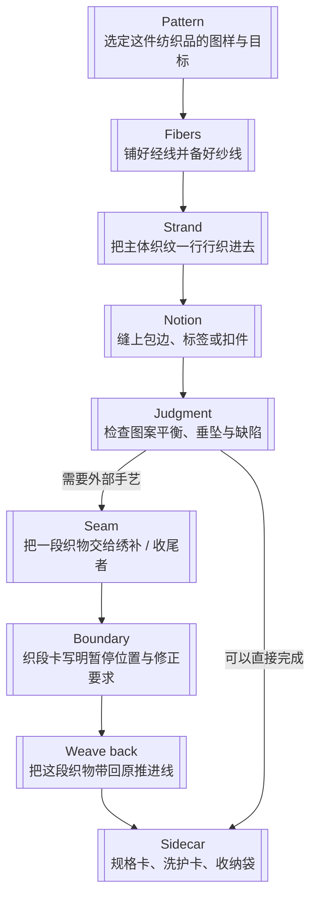
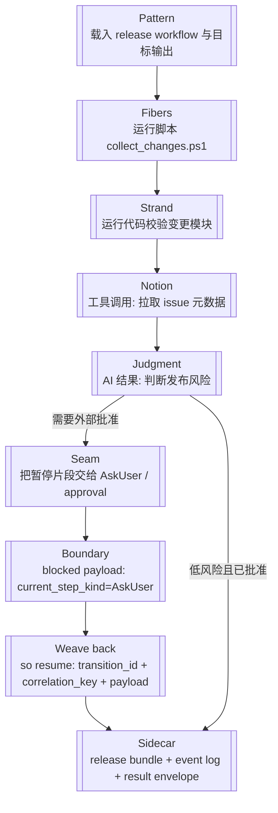

# Workflow 术语

[English](../../en/architecture/workflow-terminology.md)

这页是整个 repo 解释 AO / SO workflow 行为时的术语根文档。

Techne Loom 会用编织隐喻来解释所有权切换、等待与结构化恢复，但不会掩盖当前真实存在的 wire / code 契约名。

## 解读规则

- AO / SO 文档里的解释性 prose 应统一使用这份术语表。
- 只要某个 wire 字段、enum 值或 step kind 已经是当前实现契约，就必须显式保留它。
- 当隐喻术语与当前 wire 名不同，第一次出现时要把两者都写出来。
- AO 与 SO 只是在 workflow 解释层共享这套词汇，不会因此变成同一个 runtime。

## 相关文档

- [执行模型](execution-model.md)
- [CLI 与宿主](cli-and-hosts.md)
- [Skill 驱动 Workflow 示例](../examples/skill-driven-workflow.md)
- [AgentOrchestrator Guide](../reference/products/ao-guide.md)
- [SkillOrchestrator Guide](../reference/products/so-guide.md)

## 核心术语

| 术语 | 含义 | 当前技术锚点 |
| --- | --- | --- |
| Pattern | 作者写下的路线或预期 workflow 设计。 | Workflow definition、workflow file、workflow schema |
| Strand | 一个 workflow instance 里的当前推进线。repo 文档里用它代替 `thread`。 | 当前 node、当前焦点、当前执行线 |
| Seam | 控制权跨所有者转移时的概念接缝。 | 后续会通过 `boundary_reason`、`weave_out_request` 或 `current_step_kind` 这类协议字段显式暴露 |
| Weave out | runtime 把工作或控制权向外交出，并等待结构化延续。 | AO 控制 seam，并通过 `boundary_reason`、`weave_out_request` 这类 blocked payload 字段表达；SO 外部参与 seam，并通过 `current_step_kind` 这类 blocked step kind 表达 |
| Weave back | 外部参与方带着结构化结果回到同一条 strand，使流程得以 resume。 | `ao resume`、`so resume`、result envelope |
| Boundary | machine-readable 的阻塞/返回控制态这一正式协议术语。 | `boundary_reason`、`type: "boundary"` 的 `<so_property>` |
| Sidecar | 附在 workflow file 旁边的伴生产物。 | Event log、result envelope、导出文件 |

## AO 与 SO 如何使用这套词汇

- **AO** 是 decision-first 的。它会在控制 seam 上 weave out，然后等待调用方、outer agent 或 host 决定下一步。
- **SO** 是 execution-first 的。它只会在 `ModelThink`、`McpCall`、`SubagentCall`、`AskUser`、`WaitResume` 这类外部拥有的步骤上 weave out。
- 不管是 AO 还是 SO，weave back 都必须是结构化的；仅靠 prose 不是合法的继续面。

## 当前 Wire / Code 映射

| 当前术语 | 在这份术语表里的解读方式 |
| --- | --- |
| `boundary_reason` | AO 在当前 seam 上为什么 weave out |
| `weave_out_required` | AO wire 中表示“需要外界做比较、规划或类似分析”的 weave-out 情况 enum 值 |
| `weave_out_request` | AO wire 中承载这类 weave-out 情况结构化数据的字段名 |
| 阻塞 SO payload 里的 `current_step_kind` | 这次 SO 的 weave out 是被哪一种 seam 触发的 |
| `transition_id`、`correlation_key`、`payload` | AO / SO 共用的 weave-back envelope 字段 |
| `WaitResume` | 一个显式的模型 step kind，会一直停在那里，直到未来某次 weave back 到来 |

## 纺织品隐喻

编织隐喻不是装饰。一个 workflow 可以直接想成“织成一件完整纺织品”。没有任何一个脚本、代码步骤、工具调用或模型判断单独等于那条围巾、那幅挂毯或那件织物。真正的成品来自纱线被备好、织纹被一行行织进去、特殊配件被缝上，以及某一段暂停的织物可以离开又重新回到同一条推进线。

按这套读法：

- **pattern** 是作者写下的图样，也就是最终纺织品的 workflow 设计
- **strand** 是当前这一次执行正在走的那条推进线，一行行把同一件纺织品织出来
- **seam** 是纺织品某一段必须交给另一位所有者处理时形成的概念接缝
- **boundary** 是显式的交接卡或 machine-readable 的停点记录，例如 `boundary_reason`、`weave_out_request` 与 `type: "boundary"`
- **sidecar** 是随纺织品同行的规格单、洗护卡或收纳袋，本身不是成品主体，但持续保留上下文

## 把 Workflow 元素看成纤维 / 布片 / 配件

| Workflow 元素 | 纺织隐喻 | 为什么成立 |
| --- | --- | --- |
| 运行脚本 | 先备好的经线与纱线 | 脚本先收集并整理输入材料，为主织法准备原料 |
| 运行代码 | 一行行稳定织进去的主体织纹 | 确定性代码路径会给最终纺织品增加稳定结构 |
| 工具调用 | 缝上的包边、标签、扣具、流苏等特殊配件 | 外部工具给成品增加一个聚焦但关键的部件 |
| AI 结果 | 织者对图案平衡、风险或下一步修正的判断 | 模型结果会改变下一步路线，但必须写回显式字段或产物，不能只停留在 prose |
| Resume envelope | 从外部工位带回来的织段交接卡 | 结构化回传能让同一条 strand 接着走，而不是重织 |
| 事件日志 / 结果 sidecar | 规格卡、洗护卡、收纳袋 | 上下文伴随成品保存，但不等于成品主体 |

## Textile Flow

下面两张图故意使用同一组标签，让隐喻步骤和 skill 流程步骤可以逐点对照，而不是只在段落里口头类比。

## Skill / Workflow 运行流程图

下面用一个不复杂但像样的 SO skill 例子来对应说明：它负责生成一个 release packet，要先收集改动、验证模块、查 issue、做 AI 风险判断，必要时再等待外部批准，最后产出说明包。

## 两张图如何一一对应

| 纺织步骤 | Workflow 步骤 | 解释了哪些术语 |
| --- | --- | --- |
| 先定这件纺织品的图样 | 先载入 workflow 定义 | `pattern` |
| 铺线并把主体织纹织进去 | 脚本与代码按确定性 transition 产出核心结构 | `strand` |
| 缝上特殊配件或附料 | 工具结果与外部能力把更多部件织进同一件成品 | 输出组合 |
| 把暂停片段交给别的所有者 | 执行走到需要外部参与的所有权交接点 | `seam` |
| 织段卡写明停点与修正要求 | 发出 blocked payload，包含 `boundary_reason`、`weave_out_request` 或 `current_step_kind` | `weave out`、`boundary` |
| 交接卡带着修正信息回来 | 用 `transition_id`、`correlation_key`、`payload` 恢复执行 | `weave back` |
| 收纳袋与规格卡随件保存 | `.jsonl` event log 和 result envelope 陪在 workflow 旁边 | `sidecar` |

隐喻的作用，是帮助读者理解“组装、交接、继续推进”这三件事；它不能替代真实的 contract 名。

## 后续写作文档规则

- 解释控制权转移时，优先使用 **weave out** 与 **weave back**。
- repo 文档里优先使用 **strand**，不要再用 **thread**。
- 用 **seam** 讲概念层的交接点，用 **boundary** 指代显式 wire / protocol surface。
- 不要写成 AO 与 SO 共享同一个 runtime hierarchy。
