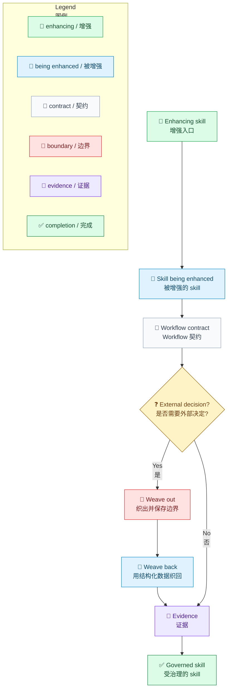
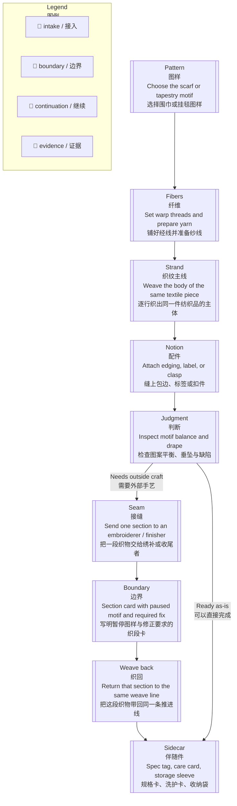
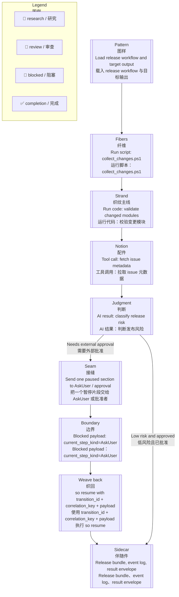

# Workflow Terminology / Workflow 术语

[English](../../en/architecture/workflow-terminology.md) | [Root](../README.md)

本页是 Techne Loom 解释 AO 与 SO workflow 行为时的仓库级术语根文档。解释层可以使用编织隐喻，但不能隐藏当前 wire、schema 或 code 契约。

Techne Loom 使用编织隐喻解释所有权转移、等待和结构化延续，同时保留实际的协议和代码契约。

## 解读规则

- AO 与 SO 文档中的解释性 prose 统一使用这份术语表。
- wire 字段、enum 值和 step kind 如果属于实现契约，必须保留其精确写法。
- 当隐喻术语与当前 wire 名称不同时，第一次出现时同时写出两者。
- AO 与 SO 只在 workflow 解释层共享这套词汇，并不会因此变成同一个 runtime。

## Skill 角色

- **Enhancing skill / 执行增强的 skill**：`/loom-skill-enhancement`，负责创建、升级或治理另一个 skill。
- **Skill being enhanced / 被增强的 skill**：本次由 enhancing skill 创建或修改的 skill；`target` 不是它的产品名组成部分。
- **Skill under Loom Skill Orchestrator governance / 受 Loom Skill Orchestrator 治理的 skill**：已经拥有受治理 workflow 的 skill。无歧义时可以简称 `skill under Loom Skill Orchestrator governance`。
- **Loom Agent Plan-Execution Orchestrator**：AO 的用户侧产品名。实现身份仍然是 `Techne.Loom.AgentOrchestrator`、`dotnet ao.dll`、`ao-guide.md` 和 `/loom-plan-execution`。
- `target_skill_enhancement`、`target_skill_business`、`targetNodeId`、`TargetFramework` 等精确 wire、schema、CLI、build 或 path 字面值保持不变。
- 只有当 `target` 是一般技术词，或是精确的 wire、schema、CLI、build、path 字面值时，才在解释中保留它；不要把它作为 enhancing skill 的产品名组成部分。

## Mermaid 规则

- Workflow 或 process 示例必须展示完整路线，不能只画装饰性的两节点图。
- Emoji 是稳定的第二语义通道：`🧭` 接入、`🔎` 研究、`💬` 审查、`📝` 编写、`✅` 完成、`⚙️` 运行时、`📜` 契约、`🧾` 证据、`❓` 决策、`🚧` 阻塞、`🔁` 继续。
- 颜色只能辅助 emoji 和文字，图旁必须有图例，不能让颜色成为唯一含义通道。
- 中文图先写 English，再在下一行写中文；双语标签和 HTML 换行使用引号包裹。
- 展示 workflow JSON 或 `WorkflowInstance` 的示例，还必须附同版本 `so` 或 `ao compile` 实际生成的 Mermaid，并说明对应的 audit evidence。手写图只能作为解释层，不能冒充 compile 证据。

## 面向人的状态表达

这张表是 AO skill、SO skill、`so-*` skill 以及受 Loom Skill Orchestrator 治理的 skill 的用户可见表达唯一真理源。精确的内部字面值只能保留在机器可读契约、源代码、日志、审计证据和其他实现侧表面。

| 内部 workflow 字面值 | 英文面向人表达 | 中文面向人表达 | 使用规则 |
| --- | --- | --- | --- |
| `Done` | The requested work is complete. | 请求的工作已完成。 | 不要把 `Done` 作为默认的用户可见状态。 |
| `noop` | No action is needed. | 不需要采取任何操作。 | 必要时说明为什么不需要采取操作。 |
| `WaitResume` | Waiting for your information or confirmation before continuing. | 正在等待你的信息或确认后再继续。 | 询问具体缺少的信息或需要作出的决定。 |
| `SubagentCall` | A specialist analysis step is running. | 专项分析步骤正在运行。 | 在有助于理解进度时说明专项任务内容。 |
| `gate` | A required check or approval check. | 必需检查或批准检查。 | 说明必须检查或批准的具体内容。 |
| `transition` | The next step, or move to the next stage. | 下一步，或进入下一阶段。 | 描述具体动作或目标阶段，不要只说内部 transition。 |
| `seam` / `handoff` | A point where the task is passed to another person or system. | 把任务交给另一个人或程序处理的交接点。 | 说明下一步由谁处理。 |
| `boundary` | The task is waiting for information before it can continue. | 任务正在等待信息，暂时无法继续。 | 说明缺少什么信息。 |
| `frontier` | The possible next actions. | 可以选择的下一步。 | 列出具体动作，不要只说内部词。 |
| `runtime` | The program currently doing the work. | 当前正在执行任务的程序。 | 必要时说明它正在执行的动作。 |
| `workflow copy` | The same saved run. | 同一次保存的执行。 | 继续时保持同一次保存的执行。 |
| `audit root` | The output folder that holds the records. | 存放记录的输出目录。 | 说明这个目录用于存放记录。 |
| `render unchanged` | The earlier diagram is still valid; no new diagram was needed. | 之前的图仍然有效，不需要新图。 | 不要让用户从标记自行推断。 |

用户问题必须请求具体的人类操作或决定。例如使用 “Please choose whether to continue” 或 “Please provide the remote branch name”；中文使用“请你选择是否继续”或“请提供远程分支”。不要要求用户提供内部状态、节点 ID、transition 数据、gate 结果或 runtime-owned 产物路径。

## 普通语言反馈

这份术语表用于产品维护，不是让用户先学习 workflow 才能得到反馈。AO、SO 和所有受 Loom Skill Orchestrator 治理的 skill 的用户可见更新，都必须使用用户指定的语言和日常词汇；英文也不天然等于简单语言。

反馈要让不了解 workflow 的高中生看懂，使用短句和直接的动词，并按顺序说明：发生了什么、用户的工作或数据是否仍然安全、为什么会这样、下一步做什么。

第一层说明不能依赖状态值、步骤类型、节点 ID、检查名称、交接术语、运行时细节或审计术语。必须使用技术词时，先用普通语言解释，再给出精确字面值。命令、路径、ID 和 evidence 字段只有在帮助用户操作或核对结果时，才放到单独的技术细节小节。

### 输出目录已经有记录

技术记录：`step-0008-compiled` 已经存在；`render unchanged`。

面向人的中文表达：任务本身没有问题。输出目录里已经有之前的记录，所以这次没有覆盖它。之前的图和报告仍然有效。我会换一个新的输出目录，继续同一次保存的执行。

### 审查发现还有问题

技术记录：审查返回 4 个问题，但在分类和修复前就宣称审查干净。

面向人的中文表达：审查发现了 4 个问题。流程过早停住了，因为它把收到审查结果当成问题已经修好，没有先确认问题是否解决。我会先把这 4 个问题分类并修复，然后再检查一次。

### 任务需要一个决定

面向人的中文表达：我需要你先做一个决定才能继续：[用一句短话说清楚需要决定什么]。

## 核心术语

| 术语 | 含义 | 当前技术锚点 |
| --- | --- | --- |
| Pattern / 图样 | 作者写下的路线或预期的 workflow 设计。 | Workflow definition、workflow file、workflow schema |
| Strand / 推进线 | 一条 workflow instance 中当前正在推进的执行线。仓库文档中用它替代 `thread`。 | 当前 node、当前焦点、当前执行线 |
| Seam / 接缝 | 控制权跨越所有者时形成的概念接缝。 | `boundary_reason`、`weave_out_request` 或 `current_step_kind` 等协议字段 |
| Weave out / 织出 | runtime 把工作或控制权交给外部，并等待结构化延续。 | AO 使用 `boundary_reason`、`weave_out_request` 等 blocked payload 字段；SO 使用 `current_step_kind` 等 blocked step kind |
| Weave back / 织回 | 外部参与方返回结构化数据，重新进入同一条推进线并允许恢复。 | `dotnet ao.dll resume`、`dotnet so.dll resume`、result envelope |
| Boundary / 边界 | 机器可读的阻塞或返回控制状态的正式协议术语。 | `boundary_reason`、`type: "boundary"` 的 `<so_property>` |
| Boundary check / 边界检查 | 在精确的外部 runtime workflow copy 上，对当前 node 或 transition 执行的强制前置校验。 | gate predicate（`passExpression` / `succeedExpression`）、route coverage、seam ownership 与 business-output gate |
| Approval gate / 批准检查 | 边界检查通过后，下一步推进前必须获得的明确批准或结构化延续指令。 | 针对 user-owned 字段的 `AskUser` seam，以及面向 `WaitResume` 等机器延续 seam 的结构化 payload |
| Sidecar / 伴随件 | 附在 workflow file 旁边、保存上下文的伴生产物。 | Event log、result envelope、导出文件 |

## AO 与 SO 的解读方式

- **AO** 以 plan-execution 为中心，在控制 seam 上 weave out，然后等待调用方、外部 agent 或 host 决定下一步。
- **SO** 以确定性执行为中心，只有到达 `ModelThink`、`McpCall`、`SubagentCall`、`AskUser` 或 `WaitResume` 等外部拥有的 step kind 时才 weave out。
- weave back 始终必须是结构化的。单独的 prose 对任何一个产品都不是有效的延续面。
- AO 与 SO 共享解释词汇，但不共享产品 runtime hierarchy。

## 当前 Wire 与 Code 映射

| 当前术语 | 英文解读 | 中文解读 |
| --- | --- | --- |
| `boundary_reason` | Why AO wove out at the current seam | AO 在当前 seam 上为什么 weave out |
| `weave_out_required` | AO wire value for the case that asks the outside world to perform analysis | AO wire 中表示需要外界执行分析的情况值 |
| `weave_out_request` | AO wire field carrying the structured data for that case | AO wire 中承载该情况结构化数据的字段 |
| `current_step_kind` on a blocked SO payload | Which SO seam caused the weave out | 这次 SO weave out 是由哪一种 seam 触发的 |
| `transition_id`, `correlation_key`, `payload` | The weave-back envelope fields used by both AO and SO resumes | AO 与 SO resume 共用的 weave-back envelope 字段 |
| `WaitResume` | An explicit model step kind that stays parked until a future weave back arrives | 会停在那里、直到未来某次 weave back 到来的显式模型 step kind |

## 纺织品隐喻

编织隐喻不是装饰。一个 workflow 可以理解为织成一件完整的纺织品。没有任何一个脚本、代码路径、工具调用或模型判断单独等于成品。成品只有在纱线备好、织纹织入同一件作品、特殊配件装上，并且暂停的一段可以离开后重新回到同一条推进线时才真正形成。

按这种理解：

- **pattern** 是最终纺织品的作者设计图样。
- **strand** 是当前逐行织出同一件成品的执行推进线。
- **seam** 是作品的一段必须离开当前所有者并交给另一位所有者时形成的概念接缝。
- **boundary** 是显式的交接卡或机器可读停点记录，例如 `boundary_reason`、`weave_out_request` 或 `type: "boundary"`。
- **sidecar** 是伴随成品保存上下文的规格单、洗护标签或收纳袋。

## Workflow 元素与纺织部件

| Workflow 元素 | 纺织隐喻 | 为什么成立 |
| --- | --- | --- |
| Run script / 运行脚本 | 备好的经线与整理好的纱线 | 脚本在主织法继续前收集并整理输入材料。 |
| Run code / 运行代码 | 反复织入、构成主体的织纹 | 确定性代码路径为成品增加稳定结构。 |
| Tool call / 工具调用 | 扣具、包边、标签、流苏或其他附加配件 | 外部能力补充主体织法单独无法产出的聚焦部件。 |
| AI result / AI 结果 | 织者对图案平衡、风险或下一步修补的判断 | 模型输出选择前进路线，但必须写回显式字段或产物。 |
| Resume envelope / 恢复信封 | 暂停织段返回时携带的织段卡 | 结构化交接数据让同一条 strand 继续，而不是重新开始。 |
| Event log / result sidecar / 事件日志 / 结果伴随件 | 规格卡、洗护卡和收纳袋 | 上下文伴随成品保存，但本身不等于成品主体。 |

## 纺织流程

下面的图使用同一组带标签的站点，让隐喻步骤保持可比较，而不只是装饰。

## Skill Workflow 示例

下面使用一个小而真实的 SO 示例：一个 release-packet skill 收集变更证据、校验 package、获取 issue 元数据、在需要时请求批准，并最终产出 release bundle。

## 对照说明

| 纺织步骤 | Workflow 步骤 | 解释的术语 |
| --- | --- | --- |
| 选择最终图样 | 载入 workflow definition | `pattern` |
| 铺线并织出主体 | 脚本与代码通过确定性 transition 产出核心结构 | `strand` |
| 给纺织品缝上一个特殊部件 | 把聚焦的工具输出加入同一件成品 | composition / attached notions |
| 把暂停片段交给另一位所有者 | 到达外部参与前的所有权交接点 | `seam` |
| 附上写明停点数据的织段卡 | 发出包含 `boundary_reason`、`weave_out_request` 或 `current_step_kind` 的 blocked payload | `weave out`、`boundary` |
| 携带结构化修正数据返回织段卡 | 使用 `transition_id`、`correlation_key` 和 `payload` 恢复执行 | `weave back` |
| 让洗护卡和收纳袋伴随成品保存 | 在 workflow 旁保存 `.jsonl` event log 和 result envelope | `sidecar` |

隐喻应帮助读者想象组装、交接和继续推进，但不能替代真实的契约名称。

## 后续文档写作规则

- 解释控制权转移时，优先使用 **weave out** 和 **weave back**。
- 仓库文档中优先使用 **strand**，不要使用 **thread**。
- 使用 **seam** 表示概念层的所有权接缝，并保留 **boundary** 表示显式 wire 或协议表面。
- 不要暗示 AO 与 SO 共享同一个 runtime hierarchy。
